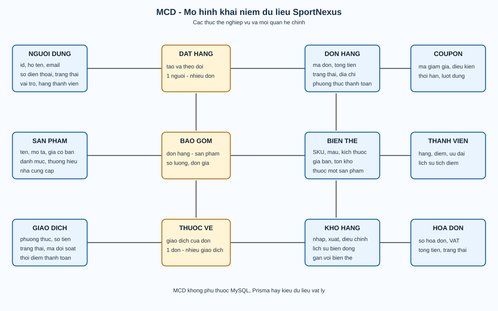
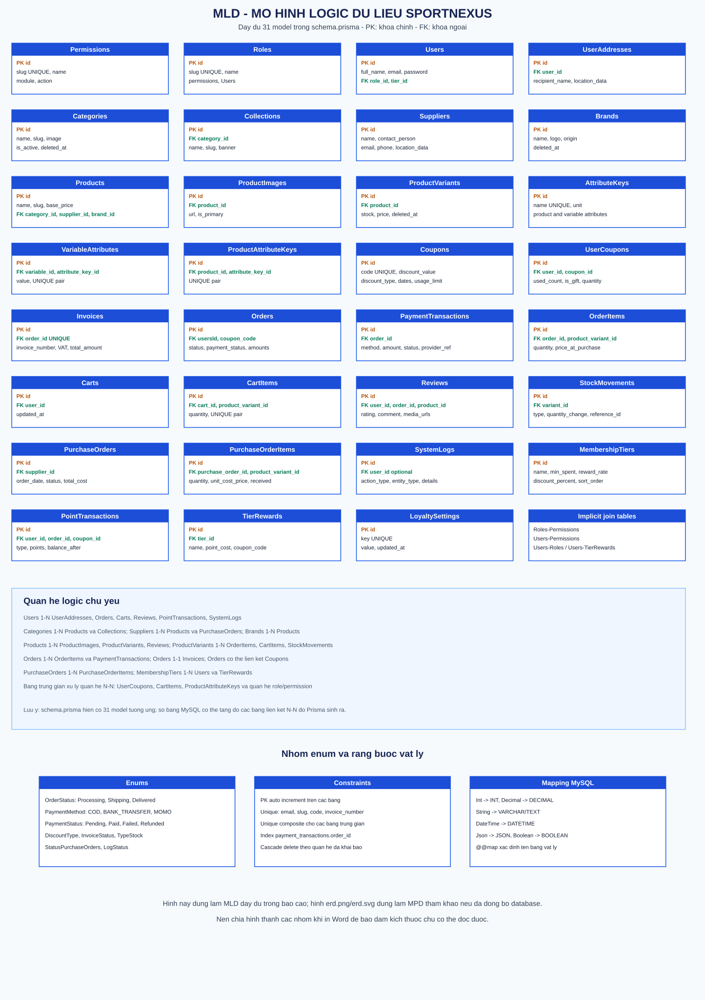

# CHƯƠNG I. MỞ ĐẦU

## 1.1 Đặt vấn đề

Hiện nay, mua sắm trực tuyến đã trở thành thói quen tiêu dùng phổ biến. Với ngành hàng đồ thể thao, nhu cầu rèn luyện sức khỏe ngày càng tăng khiến lượng cầu về giày dép, trang phục và thiết bị tập luyện liên tục tăng lên. Trong khi đó, phần lớn cửa hàng đồ thể thao nhỏ vẫn bán hàng thủ công: ghi đơn bằng sổ tay, quản lý tồn kho bằng bảng tính — dẫn đến nhiều hạn chế:

- Tồn kho phức tạp do sản phẩm có nhiều **biến thể** (màu sắc, kích cỡ), dễ sai lệch khi theo dõi thủ công.
- Đơn hàng rải rác giữa tin nhắn, sổ ghi chép; tra cứu và đối soát chậm, dễ nhầm lẫn.
- Thiếu số liệu thống kê về doanh thu, hàng bán chạy, tồn kho để ra quyết định kinh doanh.
- Khó tiếp cận khách hàng ngoài phạm vi địa lý của cửa hàng.

Từ thực tế đó, chúng tôi xây dựng **SportNexus** — hệ thống thương mại điện tử chuyên về đồ thể thao, gồm website bán hàng cho khách hàng và hệ thống quản trị cho chủ cửa hàng, với các giải pháp chính:

- Quản lý sản phẩm **đa biến thể**, tồn kho theo dõi riêng từng biến thể, mọi thay đổi được ghi lịch sử truy vết.
- Đặt hàng chạy trong một **transaction**: tạo đơn, trừ tồn kho, phát hành hóa đơn, tạo vận đơn đồng bộ hoặc không xảy ra gì.
- Hỗ trợ thanh toán **COD / chuyển khoản** (PayOS, mã QR + webhook ngân hàng) và **tra cứu vận đơn**.
- Hệ thống quản trị có **dashboard thống kê**, **phân quyền RBAC**, **nhật ký hoạt động**; giao diện khách hỗ trợ **đa ngôn ngữ** (Việt/Anh).

Trên cơ sở đó, nhóm chọn đề tài **"Xây dựng hệ thống website thương mại điện tử SportNexus chuyên về đồ thể thao"**, vừa mang giá trị sử dụng thực tiễn, vừa là cơ hội vận dụng kiến thức phát triển ứng dụng web full-stack vào bài toán nghiệp vụ cụ thể.

## 1.2 Mục tiêu cần đạt được

Xây dựng hoàn chỉnh hệ thống thương mại điện tử SportNexus gồm **website bán hàng cho khách hàng** và **hệ thống quản trị** đồng bộ qua một bộ API chung, cụ thể:

- Xây dựng website khách hàng cho phép duyệt, tìm kiếm, lọc sản phẩm theo danh mục/thương hiệu/giá; chọn biến thể (màu, kích cỡ) dựa trên tồn kho thực; quản lý giỏ hàng và đặt hàng trực tuyến.
- Triển khai nghiệp vụ đặt hàng trong một transaction: tạo đơn, trừ tồn kho, phát hành hóa đơn, tạo vận đơn đồng bộ; hỗ trợ thanh toán COD và chuyển khoản.
- Xây dựng hệ thống quản trị đầy đủ: sản phẩm đa biến thể, tồn kho – phiếu nhập có lịch sử truy vết, đơn hàng, coupon, vận đơn, đánh giá; hóa đơn sinh tự động khi đặt hàng.
- Xây dựng dashboard thống kê phục vụ ra quyết định kinh doanh (doanh thu, đơn hàng, khách hàng, tồn kho…).
- Phân quyền người dùng theo vai trò (RBAC), bảo mật bằng JWT, bcrypt và kiểm tra dữ liệu đầu vào.
- Giao diện tiếng Việt/tiếng Anh, hiển thị tốt trên máy tính lẫn thiết bị di động.

Kết quả mong đợi là một sản phẩm chạy được end-to-end, giải quyết được các vấn đề nêu tại mục 1.1 trong vận hành bán hàng thực tế của cửa hàng đồ thể thao.

## 1.3 Phạm vi nghiên cứu

### 1.3.1 Nghiên cứu đối tượng sử dụng

Hệ thống phục vụ ba nhóm đối tượng:

- **Khách vãng lai (chưa đăng nhập):** duyệt sản phẩm, dùng giỏ hàng lưu trên trình duyệt, đặt hàng bằng thông tin liên hệ và tra cứu vận đơn theo mã.
- **Khách hàng (đã đăng nhập):** đầy đủ chức năng của khách vãng lai, cộng với quản lý hồ sơ, sổ địa chỉ, xem đơn hàng – hóa đơn, đánh giá sản phẩm, lưu coupon và lịch sử tìm kiếm.
- **Quản trị viên / nhân viên:** thao tác trên hệ thống quản trị, quyền hạn được giới hạn theo vai trò và quyền được gán (RBAC).

### 1.3.2 Chức năng chính cho các đối tượng

- **Khách hàng:** duyệt – tìm kiếm – lọc sản phẩm; chọn biến thể theo tồn kho; giỏ hàng (đồng bộ khi đăng nhập); áp mã giảm giá; đặt hàng trong transaction; thanh toán COD/chuyển khoản; theo dõi vận đơn; đánh giá sau khi nhận hàng; quản lý hồ sơ, địa chỉ, hóa đơn, yêu thích, coupon đã lưu; gửi yêu cầu hỗ trợ qua email.
- **Quản trị viên:** dashboard thống kê 9 khối (doanh thu, đơn hàng, khách hàng, tồn kho…); quản lý người dùng – phân quyền; quản lý sản phẩm/biến thể/hình ảnh/thuộc tính; danh mục, thương hiệu, nhà cung cấp; coupon; đơn hàng; phiếu nhập; tồn kho có lịch sử biến động; hóa đơn; vận đơn (mô phỏng GHN); duyệt/ẩn đánh giá; nhật ký hệ thống; nhập/xuất Excel.

### 1.3.3 Phạm vi công nghệ

- **Frontend:** React 19 + Vite, React Router, TanStack Query (caching), i18next đa ngôn ngữ, lazy loading.
- **Backend:** Node.js + Express 5, Prisma ORM với cơ sở dữ liệu MySQL, xác thực JWT (access + refresh token), mã hóa bcrypt, kiểm tra dữ liệu đầu vào bằng Joi, gửi email Nodemailer.
- **Dịch vụ ngoài:** Supabase Storage (lưu ảnh), PayOS / webhook Casso (thanh toán chuyển khoản), mô phỏng giao hàng theo mẫu GHN.

### 1.3.4 Phạm vi triển khai

- Sản phẩm là website chạy trên trình duyệt, thiết kế responsive cho máy tính, tablet và điện thoại; chưa phát triển ứng dụng di động riêng.
- Kiến trúc tách biệt frontend và backend, giao tiếp qua REST API; backend đóng gói nghiệp vụ thành các service độc lập.
- Hệ thống vận hành với dữ liệu thật của cửa hàng: danh mục sản phẩm, tồn kho, đơn hàng, khách hàng; thanh toán trực tuyến phụ thuộc việc cấu hình PayOS/webhook ngân hàng.

## 1.4 Phương pháp nghiên cứu

### 1.4.1 Nghiên cứu tài liệu và cơ sở lý thuyết

Tìm hiểu qua tài liệu chính thức của các công nghệ sử dụng (React, Express, Prisma, JWT) cùng các bài viết về kiến trúc ứng dụng web phân lớp, mô hình phân quyền RBAC và nghiệp vụ thương mại điện tử (quản lý tồn kho đa biến thể, vận đơn, thanh toán trực tuyến). Kết quả nghiên cứu là cơ sở để lựa chọn công nghệ và thiết kế nghiệp vụ phù hợp với quy mô cửa hàng vừa và nhỏ.

### 1.4.2 Phân tích yêu cầu và thiết kế hệ thống

Khảo sát quy trình bán hàng thực tế của cửa hàng đồ thể thao để liệt kê yêu cầu chức năng theo từng nhóm đối tượng (khách hàng, quản trị viên) và yêu cầu phi chức năng (bảo mật, hiệu năng, đa ngôn ngữ). Trên cơ sở đó tiến hành thiết kế: sơ đồ use case, sơ đồ tuần tự cho các luồng phức tạp (đặt hàng), sơ đồ hoạt động, sơ đồ thực thể – quan hệ (ERD) cho cơ sở dữ liệu MySQL, và kiến trúc tổng thể tách frontend/backend giao tiếp qua REST API. Sau đó triển khai mã nguồn theo đúng thiết kế đã duyệt.

### 1.4.3 Kiểm thử và đánh giá

Kiểm thử chức năng thủ công theo kịch bản bám sát use case: đăng ký/đăng nhập, đặt hàng với nhiều phương thức thanh toán, áp coupon, cập nhật trạng thái đơn, phân quyền truy cập API. Kiểm thử API trên từng endpoint kết hợp chạy end-to-end toàn bộ luồng mua hàng từ website khách hàng đến hệ thống quản trị với dữ liệu mẫu. Đánh giá mức độ đáp ứng yêu cầu đề ra và ghi nhận các hạn chế cần cải thiện ở giai đoạn tiếp theo.

## 1.5 Hướng giải quyết

Để giải quyết các vấn đề nêu tại mục 1.1, hệ thống được thiết kế theo hướng:

- **Kiến trúc client–server tách biệt:** frontend là ứng dụng SPA (React), backend là REST API (Express) chia thành các tầng rõ ràng — route nhận yêu cầu, controller xử lý HTTP, service chứa nghiệp vụ, Prisma thao tác dữ liệu — giúp dễ bảo trì và mở rộng.
- **Nghiệp vụ trọng yếu đảm bảo toàn vẹn:** luồng đặt hàng gom toàn bộ thao tác ghi (tạo đơn, trừ tồn kho từng biến thể, phát hành hóa đơn, tạo vận đơn) vào một transaction của cơ sở dữ liệu, loại trừ tình trạng dữ liệu lệch khi lỗi xảy ra giữa chừng.
- **Quản lý tồn kho theo biến thể và truy vết:** tồn kho tính riêng theo tổ hợp màu/kích cỡ; mọi nhập – xuất – điều chỉnh đều ghi bản ghi biến động kho kèm tham chiếu nguồn gốc.
- **Bảo mật nhiều lớp:** xác thực bằng cặp access/refresh token (JWT), mã hóa mật khẩu bcrypt, kiểm tra đầu vào bằng Joi, phân quyền RBAC theo vai trò và quyền trên từng module.
- **Tái sử dụng dịch vụ sẵn có thay vì tự xây:** lưu ảnh trên Supabase Storage, thanh toán chuyển khoản qua PayOS hoặc webhook Casso, gửi email qua Nodemailer, mô phỏng giao hàng theo mẫu GHN — giúp rút ngắn thời gian phát triển và giảm rủi ro.
- **Trải nghiệm người dùng:** giao diện SPA với lazy loading và caching (TanStack Query), đa ngôn ngữ Việt/Anh bằng i18next, hiển thị responsive trên mọi thiết bị.

## 1.6 Kế hoạch thực hiện

Đề tài được thực hiện trong **12 tuần**, chia theo các giai đoạn sau:

| Tuần | Nội dung công việc                                                                                          | Kết quả đạt được                                                       |
| ---- | ----------------------------------------------------------------------------------------------------------- | ---------------------------------------------------------------------- |
| 1    | Khảo sát nghiệp vụ bán đồ thể thao; nghiên cứu công nghệ (React, Express, Prisma)                           | Hiểu bài toán, chốt công nghệ sử dụng                                  |
| 2    | Xác định yêu cầu chức năng và phi chức năng theo từng đối tượng                                             | Danh sách use case khách hàng (UC-A/B/C) và quản trị (UC-M)            |
| 3    | Thiết kế hệ thống                                                                                           | Sơ đồ use case, tuần tự, hoạt động; ERD MySQL; kiến trúc client–server |
| 4    | Xây dựng backend: schema Prisma, API xác thực (đăng ký/đăng nhập/JWT), quản lý người dùng                   | API tài khoản hoàn chỉnh, mã hóa bcrypt, Joi validation                |
| 5    | Xây dựng backend: API sản phẩm, biến thể, hình ảnh, danh mục, thương hiệu, nhà cung cấp                     | Module dữ liệu bán hàng hoạt động                                      |
| 6    | Xây dựng backend: giỏ hàng, đặt hàng (transaction), coupon, tồn kho – phiếu nhập, hóa đơn, vận đơn          | Nghiệp vụ trọng yếu chạy đúng toàn vẹn dữ liệu                         |
| 7    | Xây dựng website khách hàng: trang chủ, danh sách/chi tiết sản phẩm, lọc – tìm kiếm, chọn biến thể          | Giao diện mua sắm hiển thị đầy đủ                                      |
| 8    | Xây dựng website khách hàng: giỏ hàng, checkout, thanh toán COD/chuyển khoản, theo dõi đơn, hồ sơ – địa chỉ | Luồng mua hàng end-to-end cho khách                                    |
| 9    | Xây dựng hệ thống quản trị: quản lý sản phẩm/tồn kho/đơn hàng/coupon, người dùng – phân quyền RBAC          | Quản trị viên thao tác được toàn bộ dữ liệu                            |
| 10   | Dashboard thống kê; tích hợp dịch vụ ngoài: Supabase Storage, Nodemailer, PayOS/Casso, mô phỏng GHN         | Các tính năng phụ trợ hoạt động thực tế                                |
| 11   | Kiểm thử thủ công theo kịch bản use case, chạy end-to-end, sửa lỗi, tối ưu                                  | Sản phẩm ổn định trước khi bàn giao                                    |
| 12   | Hoàn thiện tính năng, viết báo cáo, chuẩn bị demo                                                           | Báo cáo và sản phẩm hoàn chỉnh                                         |

Các giai đoạn xây dựng backend và frontend (tuần 4–9) có thể đan xen nhau vì hai phần phát triển song song theo từng nhóm API; tiến độ được rà soát hằng tuần để điều chỉnh kịp thời.

## 1.7 Qui trình phát triển

### 1.7.1 Phân công nhóm

Nhóm thực hiện đề tài gồm hai thành viên, mỗi người phụ trách một phần chính nhưng luôn hỗ trợ nhau khi cần:

| Thành viên   | Vai trò chính      | Nhiệm vụ cụ thể                                                                                                                                |
| ------------ | ------------------ | ---------------------------------------------------------------------------------------------------------------------------------------------- |
| Thành viên 1 | Backend developer  | Thiết kế Prisma schema, xây dựng toàn bộ API (auth, product, order, stock, coupon, loyalty), tích hợp PayOS/Casso webhook, cấu hình Nodemailer |
| Thành viên 2 | Frontend developer | Xây dựng giao diện khách hàng (React + Tailwind), giao diện quản trị, tích hợp TanStack Query, i18n Việt–Anh, react-hook-form + Zod            |

Cả hai thành viên cùng tham gia: khảo sát nghiệp vụ, thiết kế sơ đồ use case và ERD, kiểm thử thủ công, và viết báo cáo. Khi backend hoàn thiện một nhóm API, frontend sẽ tích hợp ngay — hai bên làm việc song song thay vì chờ đợi lẫn nhau.

### 1.7.2 Git workflow

Nhóm sử dụng **Git** với chiến lược nhánh đơn giản, phù hợp quy mô dự án hai người:

**Cấu trúc nhánh:**

- `main` — nhánh chính, luôn ở trạng thái có thể build và chạy được; chỉ merge khi tính năng đã kiểm thử xong.
- `feature/*` — nhánh tính năng, mỗi nhánh phụ trách một module (ví dụ `feature/checkout-flow`, `feature/admin-dashboard`); khi hoàn tất thì tạo Pull Request (PR) về `main`.

**Quy trình làm việc:**

1. Tạo nhánh `feature/xyz` từ `main` trước khi bắt đầu tính năng mới.
2. Code trong nhánh feature, commit thường xuyên với message rõ ràng (ví dụ `feat: add checkout transaction`, `fix: resolve stock calculation bug`).
3. Khi hoàn tất, tạo PR trên GitHub, tự kiểm tra build (`npm run build`) và lint (`npm run lint`) trước khi request review.
4. Thành viên còn lại review PR — kiểm tra logic, code style, và chạy thử trên máy cá nhân.
5. Sau khi approve, merge vào `main` bằng chiến lược "Squash and Merge" để giữ lịch sử commit gọn gàng.
6. Xóa nhánh feature đã merge.

**Quy tắc cam kết:**

- Commit message viết theo format: `type: mô tả ngắn` — trong đó type là `feat` (tính năng mới), `fix` (sửa lỗi), `refactor` (tái cấu trúc), `docs` (tài liệu), `style` (định dạng code).
- Không commit file `.env` (chứa secret); chỉ commit `.env.example` với biến môi trường mẫu.
- Không force-push lên `main` trừ trường hợp khẩn cấp có sự đồng ý của cả nhóm.

### 1.7.3 Quy trình kiểm thử

Vì đề tài chưa xây dựng bộ test tự động (unit test, integration test), việc kiểm thử chủ yếu thực hiện theo ba cách:

**Kiểm thử thủ công theo kịch bản (manual scenario testing):** Nhóm liệt kê các luồng nghiệp vụ chính (đăng nhập → tìm sản phẩm → thêm giỏ hàng → đặt hàng → thanh toán), chạy từng bước trên trình duyệt và xác nhận kết quả đúng ở mỗi bước. Kịch bản kiểm thử được viết trong file Markdown riêng, bao gồm: dữ liệu đầu vào, thao tác người dùng, kết quả mong đợi, và kết quả thực tế.

**Kiểm thử API bằng Postman:** Trước khi tích hợp frontend, mỗi endpoint được kiểm tra riêng lẻ bằng Postman — gửi request với dữ liệu hợp lệ và không hợp lệ, kiểm tra status code, cấu trúc JSON trả về, và xác nhận dữ liệu đã lưu đúng trong database (kiểm tra bằng Prisma Studio hoặc MySQL client).

**Kiểm thử regression sau mỗi thay đổi lớn:** Sau khi hoàn thiện một nhóm tính năng mới, nhóm chạy lại toàn bộ luồng chính từ đầu để đảm bảo tính năng mới không phá vỡ tính năng cũ — đặc biệt quan trọng với checkout flow vì bất kỳ thay đổi nào trong service layer cũng có thể ảnh hưởng đến transaction.

### 1.7.4 Công cụ hỗ trợ phát triển

| Công cụ      | Vai trò                                                                  |
| ------------ | ------------------------------------------------------------------------ |
| VSCode       | Trình soạn thảo chính, tích hợp terminal, IntelliSense, Prettier, ESLint |
| Laragon      | MySQL cục bộ cho development                                             |
| Postman      | Kiểm thử API REST trước khi tích hợp frontend                            |
| draw.io      | Vẽ sơ đồ use case, ERD, flowchart, architecture                          |
| GitHub       | Lưu trữ mã nguồn, quản lý nhánh, code review qua PR                      |
| npm          | Quản lý dependencies riêng cho client/ và server/                        |
| Concurrently | Chạy song song cả hai dev server trong một terminal                      |

# CHƯƠNG II. CƠ SỞ LÝ THUYẾT

## 2.1 Mô hình kinh doanh B2C

Trong thương mại điện tử, mô hình **B2C (Business-to-Consumer)** là mô hình trong đó doanh nghiệp/cửa hàng bán sản phẩm trực tiếp cho người tiêu dùng cuối cùng thông qua kênh trực tuyến. Khác với **C2C (Consumer-to-Consumer)** — nơi các cá nhân mua bán lại với nhau và nền tảng chỉ đóng vai trò trung gian hoa hồng — trong mô hình B2C, bên bán là một đầu mối duy nhất, chịu trách nhiệm toàn bộ từ khâu nhập hàng, quản lý tồn kho, định giá, giao hàng đến chăm sóc sau bán.

SportNexus được xây dựng bám sát đặc điểm của mô hình B2C cho ngành hàng đồ thể thao:

- **Một đầu bán duy nhất:** toàn bộ sản phẩm trên website do cửa hàng quản lý và niêm yết; khách hàng chỉ mua – không đăng bán hàng như sàn thương mại C2C.
- **Chủ động nguồn hàng:** cửa hàng nhập hàng từ các **nhà cung cấp** qua phiếu nhập, theo dõi tồn kho và lịch sử biến động kho để quyết định nhập thêm.
- **Kiểm soát trọn vòng lệnh bán:** từ khi khách đặt hàng, thanh toán đến khi tạo vận đơn giao đi và phát hành hóa đơn, mọi bước đều do hệ thống quản trị của cửa hàng xử lý và giám sát.
- **Quan hệ lâu dài với khách hàng:** khách hàng có tài khoản, lịch sử đơn hàng, điểm đánh giá, coupon được tặng — giúp cửa hàng chăm sóc và giữ chân khách, điều mà mô hình C2C khó thực hiện hiệu quả.

Việc lựa chọn mô hình B2C phù hợp với bài toán đặt ra tại Chương I: cửa hàng đồ thể thao cần một kênh bán hàng trực tuyến thuộc quyền sở hữu để chuyên nghiệp hóa quy trình bán và quản lý, thay vì phụ thuộc vào các nền tảng trung gian.

## 2.2 Mô hình hoá dữ liệu

### 2.2.1 Thực thể và thuộc tính

- Thực thể là một đối tượng hoặc khái niệm cụ thể trong thế giới thực mà chúng ta cần lưu trữ thông tin. Mỗi thực thể thường đại diện cho một bảng (table) trong cơ sở dữ liệu, ví dụ như NGUOIDUNG, GIAODICH, NHANVIEN hay SANPHAM. Thực thể bao gồm nhiều thuộc tính, là các đặc điểm hoặc thông tin cụ thể mô tả thực thể đó. Thuộc tính chính là các cột (column) trong bảng, chẳng hạn như tên, ngày sinh, địa chỉ, số điện thoại, mã số định danh, v.v. Mỗi thực thể có thể có một hoặc nhiều thuộc tính, và các thuộc tính này mang dữ liệu cụ thể về các đối tượng trong thực tế.
- Một yếu tố cốt lõi trong việc thiết kế cơ sở dữ liệu là xác định khóa chính (Primary Key) và khóa phụ (Foreign Key). Khóa chính là một thuộc tính, hoặc tập hợp các thuộc tính, dùng để định danh duy nhất mỗi bản ghi (record) trong một bảng. Không có hai bản ghi nào được phép có cùng giá trị ở khóa chính, và giá trị của khóa chính không được để trống (NOT NULL). Ví dụ, trong bảng SinhVien, mã sinh viên (MaSV) có thể được chọn làm khóa chính vì mỗi sinh viên có một mã duy nhất. Việc xác định đúng khóa chính là rất quan trọng để đảm bảo tính toàn vẹn dữ liệu và giúp truy vấn dữ liệu hiệu quả hơn.
- Ngược lại, khóa phụ là một thuộc tính trong bảng này nhưng tham chiếu tới khóa chính của một bảng khác. Mục đích của khóa phụ là để thể hiện mối quan hệ giữa các bảng với nhau. Ví dụ, trong bảng GiaoDich có thể có thuộc tính MaKH là khóa phụ, liên kết tới bảng KhachHang để chỉ ra rằng giao dịch đó thuộc về khách hàng nào. Khóa phụ giúp duy trì mối liên kết logic giữa các thực thể, hỗ trợ việc xây dựng các hệ thống dữ liệu có tính liên kết chặt chẽ và chính xác.
- Mỗi thuộc tính đều phải có một kiểu dữ liệu, đây là định dạng mà giá trị của thuộc tính đó được lưu trữ trong cơ sở dữ liệu. Việc xác định đúng kiểu dữ liệu không chỉ giúp tối ưu hóa việc lưu trữ mà còn đảm bảo độ chính xác và hiệu quả khi truy vấn dữ liệu. Một số kiểu dữ liệu phổ biến gồm có: INT hoặc INTEGER cho số nguyên, VARCHAR(n) cho chuỗi ký tự có độ dài tối đa n ký tự, TEXT cho chuỗi dài, DATE cho ngày tháng, TIMESTAMP cho ngày giờ đầy đủ, BOOLEAN cho giá trị đúng/sai. Ngoài ra, có thể sử dụng FLOAT hoặc DECIMAL cho các giá trị số thực, đặc biệt khi cần lưu trữ số có phần thập phân như giá tiền hoặc các đơn vị đo lường chính xác.

### 2.2.2 MCD (Mô hình dữ liệu khái niệm)



**Hình 2.1. Mô hình dữ liệu khái niệm MCD của hệ thống SportNexus**

- Mô hình dữ liệu khái niệm (Conceptual Data Model) là một mô hình trừu tượng và tổng quan về dữ liệu trong một hệ thống thông tin. Nó tập trung vào việc mô tả các khái niệm, mối quan hệ và luồng thông tin chính trong một hệ thống, đồng thời không đi sâu vào chi tiết cách dữ liệu được lưu trữ hoặc triển khai.
- Mô hình này không phụ thuộc vào bất kỳ hệ quản trị cơ sở dữ liệu cụ thể nào và không liên quan đến cấu trúc vật lý hay các đặc thù kỹ thuật, mà tạo ra một cấu trúc dữ liệu trừu tượng được sử dụng để diễn giải và trình bày các khái niệm và mối quan hệ giữa chúng trong hệ thống.
- Các yếu tố có trong mô hình dữ liệu khái niệm này như thực thể (entities), thuộc tính (attributes), mối quan hệ (relationships) và các ràng buộc (constraints) để mô tả dữ liệu và các mối quan hệ chính trong hệ thống. Được biểu diễn bằng cách sử dụng các biểu đồ Entity-Relationship (ER) hoặc các biểu đồ tương tự.
- Ví dụ, trong một mô hình dữ liệu khái niệm cho hệ thống quản lý bán hàng, sẽ có các thực thể như "Khách hàng" (Customers), "Sản phẩm" (Products), "Đơn hàng" (Orders) và các mối quan hệ như "Một khách hàng có thể đặt nhiều đơn hàng" hoặc "Một đơn hàng có chứa nhiều sản phẩm".
- Mô hình dữ liệu khái niệm giúp thiết kế ban đầu của hệ thống thông tin, làm rõ các khái niệm quan trọng và mối quan hệ giữa chúng. Nó cung cấp một cơ sở chung để hiểu và trao đổi thông tin với các bên liên quan trong quá trình phát triển hệ thống. Mô hình dữ liệu khái niệm sau đó có thể được dùng như một cơ sở để phát triển các mô hình dữ liệu logic (Logical Data Model) và mô hình dữ liệu vật lý (Physical Data Model).

### 2.2.3 MLD (Mô hình dữ liệu logic)



**Hình 2.2. Mô hình dữ liệu logic MLD của hệ thống SportNexus**

- Mô hình dữ liệu logic (Logical Data Model) là một biểu đồ hoặc mô tả trừu tượng về cấu trúc dữ liệu và quan hệ giữa chúng mà không phụ thuộc vào hệ quản trị cơ sở dữ liệu (DBMS) cụ thể. Mô hình này tập trung vào cách dữ liệu được tổ chức, mô tả các thực thể (entities), các thuộc tính (attributes) và mối quan hệ (relationships) giữa các thực thể đó.
- Các thành phần có trong mô hình dữ liệu logic như: các thực thể (entities), thuộc tính (attributes), khóa (keys), và mối quan hệ (relationships) để mô tả dữ liệu và mối quan hệ giữa các thực thể đó.
- Ví dụ, một mô hình dữ liệu logic cho một hệ thống quản lý thư viện có thể có các thực thể như "Sách" (Books), "Tác giả" (Authors), "Thể loại" (Genres), và các mối quan hệ như "Một sách có thể có nhiều tác giả" hoặc "Một sách thuộc một thể loại duy nhất".

### 2.2.4 MPD (Mô hình dữ liệu vật lý)

- Mô hình dữ liệu vật lý (Physical Data Model) là mô hình tập trung vào các khía cạnh về cấu trúc lưu trữ dữ liệu trong cơ sở dữ liệu. Định nghĩa các đối tượng vật lý như bảng, cột, chỉ mục và quan hệ giữa chúng. Cung cấp chi tiết về cách dữ liệu được lưu trữ trên ổ đĩa hoặc hệ thống lưu trữ.
- Mô hình này là một phần của quá trình thiết kế cơ sở dữ liệu trong hệ thống thông tin, cách dữ liệu được tổ chức, lưu trữ và truy cập trong một hệ thống cụ thể.
- Một mô hình dữ liệu vật lý có thể chỉ định kiểu dữ liệu và kích thước của mỗi cột, chỉ mục để truy vấn dễ dàng, tính ràng buộc để đảm bảo tính toàn vẹn dữ liệu, các thông số về việc lưu trữ dữ liệu như dung lượng ổ đĩa, phân vùng, v.v.
- Ví dụ, trong mô hình dữ liệu vật lý, một bảng "Nhân viên" có thể được định nghĩa với các cột như "ID nhân viên" (kiểu số nguyên), "Họ" (kiểu chuỗi), "Tên" (kiểu chuỗi), và chỉ mục trên cột "ID nhân viên" để tìm kiếm nhanh hơn.

## 2.3 Định nghĩa ứng dụng

- Ứng dụng (application) là một chương trình phần mềm được thiết kế để giúp người dùng thực hiện các công việc cụ thể, có thể chạy trên nhiều nền tảng khác nhau như máy tính cá nhân, điện thoại di động hay trình duyệt web. Trong phạm vi đề tài, ứng dụng được hiểu là **ứng dụng web** — phần mềm chạy trên máy chủ và người dùng tương tác thông qua trình duyệt mà không cần cài đặt.
- Ứng dụng web gồm hai thành phần chính: phía máy khách (client) hiển thị giao diện và thu nhận thao tác của người dùng, và phía máy chủ (server) tiếp nhận yêu cầu, xử lý nghiệp vụ, quản lý dữ liệu rồi trả kết quả về cho máy khách. Sự tách biệt này giúp hệ thống dễ bảo trì, dễ mở rộng và cho phép nhiều loại thiết bị cùng sử dụng chung một dịch vụ.
- Ứng dụng thương mại điện tử là dạng ứng dụng web hỗ trợ việc mua bán hàng hóa trực tuyến: hiển thị danh mục sản phẩm, cho phép tìm kiếm và so sánh, quản lý giỏ hàng, đặt hàng, thanh toán và theo dõi đơn hàng. Đi kèm đó thường là một hệ thống quản trị dành cho chủ cửa hàng để quản lý sản phẩm, tồn kho, đơn hàng và thống kê kinh doanh.

### 2.3.1 React 19 và Vite 7

React là thư viện JavaScript phổ biến nhất cho việc xây dựng giao diện người dùng, hoạt động theo mô hình component — mỗi phần của giao diện được đóng gói thành một component độc lập, quản lý state riêng và render lại (re-render) khi state thay đổi. React 19 giới thiệu nhiều cải tiến về hiệu suất như automatic batching (gom nhiều cập nhật state thành một lần render duy nhất), Server Components (cho phép component chạy phía server để giảm tải cho client) và improved Suspense (quản lý trạng thái tải dữ liệu tốt hơn).

Vite 7 đóng vai trò là công cụ build và dev server, thay thế cho Create React App đã lỗi thời. Vite sử dụng native ES modules trong development, giúp thời gian khởi động dev server gần như tức thời bất kể kích thước dự án; khi build production, Vite dùng Rollup để tối ưu bundle, tree-shaking (loại bỏ code không sử dụng) và code splitting (chia code thành các chunk tải theo nhu cầu). Sự kết hợp React 19 + Vite 7 mang lại trải nghiệm phát triển nhanh và bundle nhỏ cho người dùng cuối.

### 2.3.2 Express 5 và Prisma ORM

Express là framework web lightweight cho Node.js, giúp định nghĩa route (đường dẫn API) và middleware (lớp xử lý trung gian) một cách简洁直观. Express 5 — phiên bản hiện tại — cải thiện hỗ trợ async/await (bắt lỗi tự động trong hàm async mà không cần try-catch wrapper), router param validation và error handling thống nhất hơn so với Express 4.

Prisma là ORM (Object-Relational Mapping) thế hệ mới, sử dụng file `schema.prisma` để định nghĩa toàn bộ mô hình dữ liệu (model, relation, enum, index) bằng một ngôn ngữ declarative riêng. Khi developer chạy `prisma generate`, Prisma tự động tạo Prisma Client — thư viện TypeScript/JavaScript có typed API để thực hiện CRUD, transaction và complex query mà không cần viết SQL thủ công. Prisma còn hỗ trợ `prisma migrate` để tự động phát sinh migration file từ schema, giúp đồng bộ cấu trúc database trong团队development.

### 2.3.3 Tailwind CSS 3 và React Hook Form

Tailwind CSS là utility-first CSS framework — thay vì viết class có sẵn như Bootstrap, developer trực tiếp ghép các utility class (ví dụ `flex`, `items-center`, `bg-blue-500`, `rounded-lg`) để xây dựng giao diện. Phương pháp này giúp CSS nhẹ hơn đáng kể (chỉ chứa các class thực sự được sử dụng qua cơ chế purge) và linh hoạt hơn trong việc thiết kế giao diện tùy chỉnh mà không cần viết CSS tùy ý.

React Hook Form là thư viện quản lý form hiệu suất cao, sử dụng useRef thay vì useState để theo dõi giá trị field — nhờ đó mỗi lần người dùng nhập liệu chỉ cập nhật state của field đó chứ không re-render toàn bộ form. Kết hợp với Zod (schema validation library), developer định nghĩa schema kiểm tra dữ liệu một lần và dùng chung cho cả validation phía client và phía server, đảm bảo consistency trong kiểm tra đầu vào.

### 2.3.4 Hệ thống phân quyền RBAC

RBAC (Role-Based Access Control) là mô hình phân quyền dựa trên vai trò: mỗi người dùng được gán một hoặc nhiều vai trò (role), mỗi vai trò chứa tập hợp các quyền (permission) cụ thể. Trong hệ thống SportNexus, quyền được định nghĩa theo cấu trúc module + action (ví dụ module "products", action "create"), mỗi cặp là một bản ghi riêng trong bảng `permissions`. Vai trò gom nhiều quyền thành nhóm (ví dụ "Nhân viên kho" có quyền xem sản phẩm, xuất/nhập kho, nhưng không có quyền sửa đơn hàng).

Khi người dùng truy cập một route quản trị, middleware `checkPermission` kiểm tra xem user có mang quyền tương ứng hay không — nếu không đủ quyền thì trả về lỗi 403 Forbidden. Cơ chế này giúp quản trị viên linh hoạt tạo vai trò mới và gán quyền chi tiết mà không cần sửa code, đồng thời mỗi route chỉ cần khai báo đúng permission slug cần kiểm tra.

### 2.3.5 Supabase Storage và Nodemailer

Supabase Storage là dịch vụ lưu trữ file đám mây đi kèm hệ sinh thái Supabase, được sử dụng trong dự án để lưu trữ hình ảnh sản phẩm, ảnh đánh giá và avatar người dùng. Khi quản trị viên tải ảnh lên, server nhận file qua Multer, tải lên Supabase Storage rồi nhận về đường dẫn URL public; URL này được lưu vào database và dùng để hiển thị trên giao diện khách hàng. Supabase Storage tự động xử lý CDN (Content Delivery Network) giúp ảnh tải nhanh từ mọi vị trí địa lý.

Nodemailer là thư viện Node.js gửi email, hỗ trợ nhiều transport method (SMTP, Gmail, SendGrid...). Trong hệ thống, Nodemailer phục vụ ba chức năng chính: gửi email xác minh tài khoản sau khi đăng ký (chứa link với token xác thực), gửi email đặt lại mật khẩu khi khách quên password, và gửi thông báo đơn hàng mới cho quản trị viên. Email template được thiết kế HTML sẵn, Nodemailer chỉ việc truyền biến (tên khách, mã đơn, link xác nhận) vào template rồi gửi đi.

### 2.3.6 PayOS và Casso — Thanh toán trực tuyến

PayOS là cổng thanh toán điện tử phổ biến tại Việt Nam, hỗ trợ đa phương thức: QR code ngân hàng, ví MoMo, thẻ tín dụng. Khi khách chọn thanh toán online, backend tạo payment link qua PayOS API, trả về URL redirect cho frontend; khách hàng hoàn tất thanh toán trên cổng PayOS rồi được redirect về trang kết quả. PayOS gửi webhook (callback)通知 backend khi giao dịch thành công hoặc thất bại, backend cập nhật trạng thái `payment_status` tương ứng.

Casso là dịch vụ đối soát tự động, theo dõi giao dịch ngân hàng và thông báo qua webhook khi có tiền về tài khoản. Trong trường hợp PayOS chưa được cấu hình hoàn chỉnh, hệ thống sử dụng Casso làm phương thức thanh toán bổ sung: hiển thị số tài khoản + mã QR cho khách chuyển khoản, rồi đối soát tự động qua webhook Casso để xác nhận thanh toán. Cả hai cổng đều được tích hợp qua cơ chế webhook, đảm bảo trạng thái đơn hàng được cập nhật tức thì mà không cần khách phải tải lại trang.

## 2.4 API (Application Programming Interface)

### 2.4.1 Khái niệm API

- API (Application Programming Interface — giao diện lập trình ứng dụng) là tập hợp các quy tắc và cơ chế cho phép hai thành phần phần mềm giao tiếp với nhau thông qua các yêu cầu và phản hồi được định nghĩa sẵn. Có thể hình dung API như một "người trung gian": nó nhận yêu cầu từ phía gọi, chuyển đến hệ thống xử lý, rồi trả kết quả về theo đúng định dạng đã thỏa thuận.
- Với ứng dụng web, API cho phép frontend (giao diện) và backend (nghiệp vụ – dữ liệu) tách biệt hoàn toàn: frontend không cần biết dữ liệu được lưu trữ và xử lý ra sao, chỉ cần gọi đúng điểm cuối (endpoint) với tham số phù hợp. Nhờ đó, cùng một bộ backend có thể phục vụ website, ứng dụng di động hoặc các hệ thống khác.

### 2.4.2 Cách hoạt động của API

- API hoạt động theo mô hình yêu cầu – phản hồi (request – response): ứng dụng khách gửi một yêu cầu đến máy chủ tại một địa chỉ cụ thể (URL của endpoint), kèm phương thức, dữ liệu đầu vào và thông tin xác thực nếu cần; máy chủ xử lý yêu cầu và trả về phản hồi chứa mã trạng thái cùng dữ liệu (thường ở định dạng JSON).
- Chuỗi hoạt động điển hình: (1) client tạo request; (2) request đi qua mạng đến server; (3) server kiểm tra tính hợp lệ (xác thực, phân quyền, validate dữ liệu); (4) server thực thi nghiệp vụ và truy vấn cơ sở dữ liệu; (5) server đóng gói kết quả thành response và trả về; (6) client nhận và hiển thị dữ liệu. Nếu có lỗi xảy ra ở bất kỳ bước nào, server trả về mã lỗi tương ứng để client xử lý.

### 2.4.3 Các dạng Web API

- **REST API** (Representational State Transfer): phong cách phổ biến nhất, dựa trên tài nguyên được định danh bằng URL và thao tác bằng các phương thức HTTP. REST nhẹ, dễ hiểu, không lưu trạng thái (stateless), phù hợp với hầu hết ứng dụng web hiện đại.
- **SOAP API** (Simple Object Access Protocol): giao thức trao đổi dữ liệu dựa trên XML với cấu trúc chặt chẽ, thường gặp trong các hệ thống doanh nghiệp cũ hoặc dịch vụ yêu cầu bảo mật và giao tác phức tạp.
- **GraphQL**: ngôn ngữ truy vấn do Meta phát triển, cho phép client chỉ định chính xác trường dữ liệu cần lấy trong một yêu cầu duy nhất, giảm tình trạng dư thừa dữ liệu so với REST.
- **Webhook**: dạng "API ngược" trong đó máy chủ chủ động gửi yêu cầu đến URL của client khi sự kiện xảy ra (ví dụ: ngân hàng thông báo giao dịch chuyển khoản thành công).

Trong đề tài, hệ thống sử dụng REST API làm xương sống giao tiếp giữa frontend React và backend Express, kết hợp webhook ngân hàng (Casso) để nhận thông báo thanh toán chuyển khoản.

### 2.4.4 Giao thức API

- Web API truyền thống chủ yếu vận hành trên giao thức **HTTP/HTTPS**. HTTPS là phiên bản HTTP có mã hóa TLS, đảm bảo dữ liệu trao đổi giữa client và server không bị nghe lén hay giả mạo trên đường truyền — đây là yêu cầu bắt buộc với ứng dụng thương mại điện tử.
- Các **phương thức HTTP** thể hiện hành động lên tài nguyên: `GET` (lấy dữ liệu), `POST` (tạo mới), `PUT` (cập nhật toàn bộ), `PATCH` (cập nhật một phần), `DELETE` (xóa). Thiết kế REST chuẩn sẽ ánh xạ mỗi phương thức vào đúng ý nghĩa nghiệp vụ.
- **Mã trạng thái (status code)** mô tả kết quả xử lý: nhóm 2xx thành công (200 OK, 201 Created), nhóm 4xx lỗi từ phía client (400 Bad Request, 401 Unauthorized, 403 Forbidden, 404 Not Found), nhóm 5xx lỗi từ phía server (500 Internal Server Error). Việc dùng đúng mã trạng thái giúp client xử lý phản hồi nhất quán.
- Dữ liệu trao đổi thường được đóng gói ở định dạng **JSON** (JavaScript Object Notation) nhờ kích thước nhỏ, dễ đọc và được hỗ trợ sẵn trong JavaScript.

## 2.5 JSON Web Token (JWT)

### 2.5.1 Định nghĩa

- JSON Web Token (JWT) là chuẩn mở (RFC 7519) định nghĩa cách truyền thông tin an toàn giữa các bên dưới dạng đối tượng JSON được ký số. Thông tin trong token có thể được tin cậy vì nó đi kèm chữ ký do máy chủ tạo bằng khóa bí mật (HMAC) hoặc cặp khóa công khai/riêng tư (RSA, ECDSA).
- Trong xác thực ứng dụng web, khi người dùng đăng nhập thành công, máy server phát hành một JWT và trả về cho client. Từ đó về sau, mỗi lần gọi API, client đính kèm token này vào header `Authorization: Bearer <token>`; server kiểm tra chữ ký và đọc thông tin người dùng trực tiếp từ token mà không cần tra cứu phiên đăng nhập lưu trên máy chủ.

### 2.5.2 Lợi ích mang lại

- **Không lưu trạng thái (stateless):** server không phải duy trì session cho từng người dùng, giảm tải bộ nhớ và thuận tiện khi mở rộng theo chiều ngang nhiều máy chủ.
- **Tự chứa thông tin:** payload mang sẵn các claim như id, email, vai trò của người dùng nên server ít phải truy vấn cơ sở dữ liệu cho mỗi yêu cầu.
- **Toàn vẹn dữ liệu:** mọi thay đổi nội dung token đều làm chữ ký không còn hợp lệ, do đó client không thể tự ý sửa quyền hạn của mình.
- **Phù hợp kiến trúc hiện đại:** hoạt động tốt với SPA, ứng dụng di động và kiến trúc microservices nơi các dịch vụ chia sẻ chung một khóa xác thực.
- **Hỗ trợ hết hạn và gia hạn:** token có thời hạn (exp), kết hợp cơ chế refresh token giúp cân bằng giữa bảo mật và trải nghiệm — người dùng không phải đăng nhập lại quá thường xuyên.

### 2.5.3 Cấu trúc của một JWT

- Một JWT gồm **ba phần** nối nhau bởi dấu chấm, dạng `xxxxx.yyyyy.zzzzz`:
- **Header:** khai báo loại token (`typ: JWT`) và thuật toán ký (`alg`, ví dụ HS256), sau đó được mã hóa Base64Url.
- **Payload:** chứa các **claims** — thông tin về thực thể và thuộc tính bổ sung như `sub` (định danh), `name`, `role`, `iat` (thời điểm phát hành), `exp` (hạn dùng). Payload cũng được mã hóa Base64Url nhưng chỉ là mã hóa chứ không mã hóa bí mật, vì vậy không nên đặt thông tin nhạy cảm vào đây.
- **Signature:** tạo từ header và payload đã mã hóa, ký bằng thuật toán trong header với khóa bí mật của server: `HMACSHA256(base64Url(header) + "." + base64Url(payload), secret)`. Chữ ký giúp server phát hiện token bị giả mạo hoặc chỉnh sửa.
- Ví dụ minh họa một token sau khi giải mã: header `{"alg": "HS256", "typ": "JWT"}`, payload `{"sub": "42", "email": "khach@example.com", "role": "customer", "exp": 1756000000}`, kèm chữ ký do server sinh ra.
- Áp dụng vào SportNexus: hệ thống dùng cặp **access token** (hạn ngắn, đính kèm mỗi request) và **refresh token** (hạn dài, lưu trong database để thu hồi khi cần) — người dùng đăng xuất là refresh token bị xóa, khiến phiên không thể gia hạn thêm.

### 2.5.4 Bảo mật JWT kết hợp phân quyền RBAC

Trong hệ thống thực tế, xác thực (authentication) và phân quyền (authorization) là hai cơ chế bảo mật tách biệt nhưng luôn đi kèm nhau. Xác thực giải quyết câu hỏi "bạn là ai" — thường bằng tên đăng nhập và mật khẩu; phân quyền giải quyết câu hỏi "bạn được làm gì" — dựa trên vai trò hoặc danh sách quyền đã gán.

**JWT và lifecycle token:** Khi người dùng đăng nhập thành công, server phát hành hai loại token. Access token có hạn dùng ngắn (ví dụ 15 phút) chứa thông tin định danh và vai trò, được gửi kèm header `Authorization: Bearer <token>` trong mỗi request cần xác thực. Server kiểm tra chữ ký bằng secret key lưu trong biến môi trường; chữ ký sai hoặc token hết hạn sẽ bị từ chối. Refresh token có hạn dùng dài hơn (ví dụ 7 ngày), lưu trong database để server có thể thu hồi khi cần — ví dụ người dùng đổi mật khẩu thì tất cả refresh token cũ bị xóa vô hiệu hóa phiên trên mọi thiết bị.

Khi access token hết hạn, frontend tự động gửi refresh token đến endpoint `/auth/refresh` để nhận cặp token mới mà không yêu cầu người dùng đăng nhập lại; nếu refresh token cũng hết hạn hoặc không tồn tại trong database thì hệ thống redirect về trang đăng nhập.

**RBAC trong code:** Mỗi route quản trị khai báo quyền cần thiết bằng middleware:

```javascript
router.get(
  "/products",
  verifyToken,
  checkPermission("products", "read"),
  controller.getAll,
);
router.post(
  "/products",
  verifyToken,
  checkPermission("products", "create"),
  controller.create,
);
router.delete(
  "/products/:id",
  verifyToken,
  checkPermission("products", "delete"),
  controller.remove,
);
```

Middleware `checkPermission` nhận hai tham số (module, action), truy vấn bảng `role_permissions` qua `user.role_id` để kiểm tra xem vai trò của người dùng có chứa quyền tương ứng hay không. Nếu không đủ quyền, server trả về HTTP 403 Forbidden. Cơ chế này giúp quản trị viên tạo vai trò mới và gán quyền chi tiết qua giao diện mà không cần sửa code; mỗi route chỉ cần khai báo đúng cặp module-action cần kiểm tra.

**Mã hóa mật khẩu:** Mật khẩu người dùng không bao giờ được lưu dạng văn bản rõ mà được băm bằng bcrypt với salt rounds = 12 trước khi lưu vào database. Quá trình xác thực, server lấy mật khẩu người dùng nhập, băm lại với cùng salt và so sánh với giá trị lưu trong bảng `users`. bcrypt sử dụng thuật toán Blowfish với cơ chế adaptive cost — tăng số rounds làm chậm quá trình băm, giúp tấn công brute-force trở nên không thực tế ngay cả khi database bị rò rỉ.

### 2.5.5 Thiết kế cơ sở dữ liệu quan hệ

Thiết kế CSDL là một trong những khâu quan trọng nhất của quá trình phát triển ứng dụng, ảnh hưởng trực tiếp đến hiệu năng, tính toàn vẹn và khả năng mở rộng của toàn hệ thống.

**Nguyên tắc chuẩn hóa:** CSDL quan hệ đòi hỏi dữ liệu phải được tổ chức theo các cấp chuẩn hóa để giảm thiểu trùng lặp và bất thường. **Chuẩn hóa dạng đầu tiên (1NF)** yêu cầu mỗi ô trong bảng chỉ chứa giá trị nguyên tử (không chứa danh sách hay mảng); trong SportNexus, thay vì lưu nhiều size trong một cột `sizes` của bảng sản phẩm, hệ thống tạo bảng riêng `product_variants` với mỗi dòng là một tổ hợp size-màu cụ thể. **Chuẩn hóa dạng thứ hai (2NF)** yêu cầu mọi cột không thuộc khóa chính phải phụ thuộc hoàn toàn vào toàn bộ khóa chính; điều này được tuân thủ bằng cách tách thông tin biến thể (giá, stock) ra bảng `product_variants` thay vì để trong bảng sản phẩm, vì giá bán phụ thuộc vào biến thể cụ thể chứ không phải vào sản phẩm cha. **Chuẩn hóa dạng thứ ba (3NF)** yêu cầu không có phụ thuộc hàm gián tiếp — không có cột nào phụ thuộc vào cột không phải khóa.

**Thiết kế khóa:** Hệ thống sử dụng khóa chính kiểu `Int` tự tăng (`@default(autoincrement())`) cho mọi bảng nội bộ, giúp index hoạt động hiệu quả và liên kết giữa các bảng gọn nhẹ. Khóa ngoại (`@relation`) được Prisma tự động kiểm tra toàn vẹn ở tầng ORM; ở tầng database, MySQL enforced FOREIGN KEY constraint ngăn không cho bản ghi con trỏ đến bản ghi cha đã bị xóa. Quy ước đặt tên khóa ngoại thống nhất: tên bảng gốc + `_id` (ví dụ `category_id` trong bảng `products` tham chiếu `categories.id`).

**Soft delete và index:** Hệ thống áp dụng xóa mềm thống nhất qua cột `deleted_at` kiểu `DateTime?` ở mọi bảng quan trọng. Khi xóa, giá trị `deleted_at` được gán thời điểm hiện tại thay vì xóa dòng vật lý; mọi truy vấn mặc định lọc `WHERE deleted_at IS NULL` để ẩn bản ghi đã xóa. Quy tắc này được xử lý tập trung trong service layer, tránh bỏ sót ở từng query. Ngoài ra, các chỉ mục (index) được thiết kế phục vụ truy vấn thường xuyên: index kết hợp trên `(product_id, deleted_at)` cho bảng `product_variants`, index trên `email` và `phone` cho bảng `users` (duy nhất kết hợp soft delete), và index trên `slug` cho bảng `products` phục vụ tìm kiếm theo URL.

**Trade-off giữa chuẩn hóa và hiệu năng:** Trong thực tế, chuẩn hóa tuyệt đối có thể tạo ra nhiều bảng liên kết, mỗi query phức tạp hơn do phải JOIN nhiều bảng. Một số trường hợp chấp nhận dữ liệu trùng lặp nhẹ để tăng tốc truy vấn — ví dụ bảng `products` lưu sẵn `avg_rating` và `review_count` (được tính toán từ bảng `reviews`) thay vì mỗi lần hiển thị phải JOIN và tính lại. SportNexus duy trì nguyên tắc: ưu tiên chuẩn hóa ở tầng dữ liệu, chấp nhận denormalization chiến lược ở các cột tổng hợp được cập nhật qua service layer khi có thay đổi thực thể liên quan.

### 2.5.6 Các phần mềm hỗ trợ

Quá trình phát triển dự án sử dụng kết hợp nhiều công cụ hỗ trợ thuộc các nhóm khác nhau:

**Postman** là ứng dụng dùng để kiểm thử API REST. Với giao diện trực quan, developer có thể gửi request đến các endpoint của server (GET, POST, PUT, DELETE), kiểm tra phản hồi (status code, JSON body), lưu lại các bộ request dưới dạng collection để chạy lại khi cần. Trong dự án này, Postman được dùng chủ yếu để kiểm tra từng API của backend trước khi tích hợp với frontend, giúp phát hiện lỗi nghiệp vụ hoặc sai cấu trúc dữ liệu ở giai đoạn sớm mà không cần chờ giao diện hoàn chỉnh.

**Laragon** là môi trường phát triển cục bộ (local development environment) trên Windows, tích hợp sẵn máy chủ web (Apache hoặc Nginx) và hệ quản trị cơ sở dữ liệu MySQL. Laragon giúp khởi chạy MySQL nhanh chóng qua vài cú click, đồng thời hỗ trợ quản lý nhiều project riêng biệt qua cơ chế Virtual Host. Trong dự án, Laragon đóng vai trò cung cấp MySQL cục bộ để Prisma có thể chạy migration và truy xuất dữ liệu trong quá trình phát triển, thay vì phải cài đặt từng phần mềm riêng lẻ.

**Visual Studio Code (VSCode)** là trình soạn thảo mã nguồn được sử dụng chính trong dự án. VSCode hỗ trợ nhiều tính năng phục vụ phát triển JavaScript/Node.js và React: gợi ý code thông minh (IntelliSense), tích hợp terminal, hỗ trợ extension như Prettier (tự động định dạng code), ESLint (kiểm tra lỗi code theo quy tắc), và Prisma (đọc file schema với màu sắc cú pháp). Giao diện phân chia panel đa cửa sổ giúp developer vừa xem code vừa chạy lệnh terminal mà không cần chuyển ứng dụng.

**draw.io** (hiện có tên là diagrams.net) là công cụ vẽ sơ đồ miễn phí hoạt động trực tiếp trên trình duyệt, hỗ trợ nhiều loại sơ đồ: use case, ERD, sequence, flowchart, architecture... Sơ đồ được lưu dưới dạng tệp SVG hoặc PNG có thể nhúng trực tiếp vào tài liệu Word/Markdown. Trong đề tài, draw.io được dùng để vẽ toàn bộ sơ đồ trong báo cáo (sơ đồ use case, sơ đồ ERD, lưu đồ luồng xử lý...) với giao diện kéo thả dễ chỉnh sửa.

**Looping** là phần mềm miễn phí do Đại học Toulouse (Pháp) phát triển, dùng chuyên biệt cho mô hình hóa dữ liệu theo phương pháp Merise. Looping hỗ trợ vẽ sơ đồ **MCD** (Modèle Conceptuel de Données) với entité và association kèm hệ số lớp, sau đó tự chuyển đổi sang **MLD** (Modèle Logique de Données) rồi **MPD** (Modèle Physique Code SQL) — rút ngắn đáng kể quy trình thiết kế cơ sở dữ liệu so với khi làm thủ công. Ngoài ra, Looping còn vẽ được sơ đồ UML class diagram và sơ đồ tổ chức luồng (MOF), xuất ra hình PNG để nhúng vào tài liệu. Trong dự án này, Looping được dùng để vẽ MCD khái niệm cho toàn bộ 31 thực thể trước khi triển khai trên Prisma, giúp hình dung rõ quan hệ một–nhiều, nhiều–nhiều và ràng buộc duy nhất trước khi code.

**Nodemon** là tiện ích chạy song song với Node.js server, tự động khởi động lại server mỗi khi phát hiện thay đổi trong tệp mã nguồn. Cơ chế hoạt động là quét liên tục thư mục dự án, khi nhận thấy file `.js` được lưu thì ngay lập tức dừng tiến trình cũ và chạy lại `node index.js` — giúp developer không cần tắt – mở server thủ công mỗi lần sửa code. Trong dự án, nodemon được cấu hình trong file `package.json` với script `npm run dev` ở cả phía server lẫn client.

**Trình duyệt web** (Chrome, Firefox...) là công cụ cuối cùng để chạy và kiểm tra giao diện người dùng. Trình duyệt cung cấp bộ Developer Tools tích hợp sẵn (F12) với nhiều tính năng: Console debug, Network tab theo dõi request/response, LocalStorage/SessionStorage xem dữ liệu client, và Lighthouse audit đánh giá hiệu năng. Trong quá trình phát triển, trình duyệt đóng vai trò "người dùng cuối" — mọi giao diện từ trang chủ, giỏ hàng đến trang quản trị đều được kiểm tra trực tiếp trên trình duyệt để đảm bảo hiển thị đúng trên cả máy tính lẫn điện thoại.

Ngoài ra, dự án còn sử dụng **npm** (Node Package Manager) để quản lý thư viện phía client và server riêng biệt, **Concurrently** để chạy đồng thời cả hai tiến trình dev trong một terminal duy nhất, và **Tailwind CSS** kèm plugin của nó để xây dựng giao diện-responsive bằng utility class mà không cần viết CSS thủ công.

## 2.6 Mô hình bảo mật tổng thể

Bảo mật là yêu cầu xuyên suốt trong thiết kế hệ thống, không phải là một tính năng riêng lẻ được bổ sung sau cùng. SportNexus áp dụng chiến lược **bảo mật đa lớp** (defense in depth): mỗi lớp ngăn chặn một loại tấn công cụ thể, và việc một lớp bị vượt qua không đồng nghĩa với việc toàn bộ hệ thống bị xâm nhập. Bảng dưới mô tả bảy lớp bảo mật từ ngoài vào trong, lớp nào ngăn chặn loại tấn công gì, và được hiện thực hóa bằng công nghệ nào trong dự án.

| Lớp                     | Loại tấn công ngăn chặn                                             | Công nghệ hiện thực                                           |
| ----------------------- | ------------------------------------------------------------------- | ------------------------------------------------------------- |
| 1. HTTPS / TLS          | Man-in-the-middle, nghe trộm dữ liệu đường truyền                   | Nên bật khi triển khai production (Let's Encrypt, Cloudflare) |
| 2. CORS                 | Cross-site scripting từ domain lạ, request từ nguồn không tin cậy   | Express CORS middleware, whitelist domain cụ thể              |
| 3. Authentication (JWT) | Truy cập trái phép khi chưa đăng nhập                               | verifyToken middleware, access + refresh token pair           |
| 4. Authorization (RBAC) | Người dùng thường truy cập API quản trị, nhân viên kho sửa đơn hàng | checkPermission middleware, bảng roles + permissions          |
| 5. Input Validation     | SQL injection, NoSQL injection, XSS qua form input                  | Joi validation ở server, Zod validation ở client              |
| 6. Password Hashing     | Brute-force, dictionary attack, rò rỉ database                      | bcrypt rounds = 12, không bao giờ lưu mật khẩu rõ             |
| 7. Data Isolation       | Xóa nhầm dữ liệu quan trọng, mất toàn vẹn transaction               | Soft delete (deleted_at), Prisma $transaction                 |

**Chi tiết từng lớp:**

**Lớp 1 — HTTPS/TLS:** Khi triển khai môi trường sản xuất, toàn bộ traffic giữa trình duyệt và server được mã hóa bằng TLS 1.2+, ngăn không cho bên thứ ba đọc được nội dung request/response — đặc biệt quan trọng đối với header `Authorization` chứa JWT và dữ liệu thanh toán. Trong môi trường phát triển, hệ thống chạy trên HTTP localhost vì không cần mã hóa loopback.

**Lớp 2 — CORS:** Express middleware `cors` được cấu hình chỉ chấp nhận request từ domain frontend cụ thể (ví dụ `http://localhost:5173` trong dev, hoặc domain Vercel trong production). Nếu một trang web khác cố gọi API SportNexus, trình duyệt sẽ chặn response do chính sách same-origin của CORS — ngăn tấn công CSRF cơ bản.

**Lớp 3 — Xác thực JWT:** Mọi request cần dữ liệu người dùng phải đính kèm header `Authorization: Bearer <token>`. Middleware `verifyToken`解码 token, kiểm tra chữ ký bằng secret key, kiểm tra hạn dùng (`exp`), rồi gắn thông tin user (`req.user`) vào request. Token hết hạn → server trả 401 Unauthorized → frontend tự động gọi endpoint `/auth/refresh` với refresh token để nhận cặp mới; nếu refresh token cũng hết hạn → redirect về trang đăng nhập.

**Lớp 4 — Phân quyền RBAC:** Sau khi xác thực thành công, middleware `checkPermission(module, action)` kiểm tra xem vai trò của user có chứa quyền tương ứng trong bảng `role_permissions` hay không. Quyền được định nghĩa chi tiết đến mức module + action (ví dụ `products.read`, `orders.update`, `reviews.delete`); mỗi route quản trị chỉ cần khai báo đúng cặp quyền cần thiết. Nếu không đủ quyền → server trả 403 Forbidden. Cơ chế này giúp quản trị viên tạo vai trò mới và gán quyền qua giao diện mà không cần sửa code.

**Lớp 5 — Kiểm tra dữ liệu đầu vào:** Joi validation được chạy ở server trước khi dữ liệu chạm vào service layer; Zod validation chạy ở client để phản hồi nhanh cho người dùng. Mỗi schema kiểm tra kiểu dữ liệu (string, number, boolean), định dạng (email regex, phone regex), giới hạn độ dài (tên ≤ 200 ký tự, mật khẩu ≥ 8 ký tự) và giá trị hợp lệ (status ∈ ["Pending","Processing","Shipped","Delivered","Cancelled"]). Dữ liệu không hợp lệ bị từ chối ở tầng controller với thông báo lỗi rõ ràng, không bao giờ được truyền xuống Prisma hay MySQL — ngăn chặn SQL injection ngay cả khi developer quên escape thủ công.

**Lớp 6 — Mã hóa mật khẩu:** Mật khẩu được băm bằng bcrypt với cost factor = 12 (tương đương 2^12 = 4096 vòng lặp Blowfish) trước khi lưu vào cột `password_hash` trong bảng `users`. Quá trình xác thực, server gọi `bcrypt.compare(plaintext, hash)` — nếu hash khớp thì đúng mật khẩu. bcrypt sử dụng salt ngẫu nhiên cho mỗi mật khẩu, đảm bảo hai người dùng cùng mật khẩu sẽ có hai hash khác nhau — tấn công rainbow table trở nên vô nghĩa. Cost factor cao cũng làm chậm quá trình brute-force: với 12 rounds, mỗi lần thử mật khẩu mất khoảng 250ms trên máy trung bình — thử 1 triệu mật khẩu mất gần 7 ngày thay vì vài phút như MD5/SHA-256 không salt.

**Lớp 7 — toàn vẹn dữ liệu:** Mọi thao tác ghi quan trọng (đặt hàng, nhập kho, trừ điểm) chạy trong `prisma.$transaction` — nếu bất kỳ bước nào thất bại, toàn bộ rollback, không có dữ liệu半成品 tồn tại. Soft delete (`deleted_at`) đảm bảo không có bản ghi nào bị xóa vật lý; mọi query mặc định lọc `WHERE deleted_at IS NULL` giúp khôi phục dữ liệu khi cần. Cơ chế này đặc biệt quan trọng với dữ liệu đơn hàng và tài chính — không bao giờ có tình trạng "mất đơn" hay "âm kho" do thao tác không đồng bộ.

# CHƯƠNG III. KẾT QUẢ THỰC HIỆN

## 3.0 Kiến trúc tổng quan hệ thống

### 3.0.1 Sơ đồ kiến trúc

Hệ thống SportNexus được thiết kế theo mô hình **client–server tách biệt** với ba tầng chính: Presentation (giao diện), Application (nghiệp vụ) và Data (dữ liệu). Sơ đồ tổng quan mô tả cách các thành phần kết nối và giao tiếp với nhau:

```
┌─────────────────────────────────────────────────────────────────┐
│                     TRÌNH DUYỆT WEB                             │
│   React 19 + Vite 7 + React Router 7 + TanStack Query          │
│   ┌──────────┐ ┌──────────┐ ┌──────────┐ ┌──────────────────┐  │
│   │Trang chủ │ │Sản phẩm  │ │Giỏ hàng  │ │Quản trị Dashboard│  │
│   │homeLoader│ │prodLoader│ │CartContext│ │management routes │  │
│   └────┬─────┘ └────┬─────┘ └────┬─────┘ └────────┬─────────┘  │
│        │             │            │                 │            │
│        └─────────────┴────────────┴─────────────────┘            │
│                              │ Axios (Authorization: Bearer)     │
└──────────────────────────────┼───────────────────────────────────┘
                               │ HTTP/HTTPS
┌──────────────────────────────┼───────────────────────────────────┐
│                    EXPRESS 5 SERVER (Node.js)                    │
│                              │                                    │
│   ┌──────────────────────────▼──────────────────────────────┐    │
│   │              MIDDLEWARE CHAIN                            │    │
│   │  CORS → Body Parser → verifyToken → checkPermission     │    │
│   └──────────────────────────┬──────────────────────────────┘    │
│                              │                                    │
│   ┌──────────────────────────▼──────────────────────────────┐    │
│   │              CONTROLLERS                                │    │
│   │  authController  productController  orderController     │    │
│   │  homeController  cartController     adminController     │    │
│   └──────────────────────────┬──────────────────────────────┘    │
│                              │                                    │
│   ┌──────────────────────────▼──────────────────────────────┐    │
│   │              SERVICES (Business Logic)                   │    │
│   │  authService   productService   orderService            │    │
│   │  homeService   cartService      stockService            │    │
│   │  couponService loyaltyService   reviewService            │    │
│   └──────────────────────────┬──────────────────────────────┘    │
│                              │                                    │
│   ┌──────────────────────────▼──────────────────────────────┐    │
│   │              VALIDATORS (Joi Schema)                     │    │
│   │  authValidation  productValidation  orderValidation      │    │
│   └──────────────────────────┬──────────────────────────────┘    │
│                              │                                    │
│   ┌──────────────────────────▼──────────────────────────────┐    │
│   │              PRISMA ORM (Prisma Client)                  │    │
│   │  Type-safe query · Transaction API · Migration           │    │
│   └──────────────────────────┬──────────────────────────────┘    │
│                              │                                    │
│   ┌──────────────────────────▼──────────────────────────────┐    │
│   │              MYSQL 8.4 DATABASE                         │    │
│   │  31 tables · Foreign keys · Soft delete · Index          │    │
│   └─────────────────────────────────────────────────────────┘    │
│                                                                  │
│   ┌─────────────────────── DỊCH VỤ NGOÀI ──────────────────┐    │
│   │  Supabase Storage (ảnh) · Nodemailer (email)            │    │
│   │  PayOS (QR pay) · Casso (đối soát) · Multer (upload)    │    │
│   └─────────────────────────────────────────────────────────┘    │
└──────────────────────────────────────────────────────────────────┘
```

### 3.0.2 Luồng dữ liệu khi người dùng đặt hàng

Toàn bộ quy trình đặt hàng — từ thao tác nhấp "Mua hàng" trên giao diện đến khi database ghi nhận xong — diễn ra qua bốn giai đoạn chính. Mỗi giai đoạn tương ứng với một lớp trong kiến trúc, đảm bảo trách nhiệm rõ ràng và dễ gỡ lỗi khi phát sinh vấn đề.

**Giai đoạn 1 — Frontend thu thập và gửi request:** Khi khách nhấp nút "Đặt hàng", react-hook-form kiểm tra lại dữ liệu form (địa chỉ, số điện thoại) bằng Zod schema; nếu hợp lệ thì axios gửi POST `/orders` kèm access token trong header `Authorization`. TanStack Query.invalidateQueries(`orders`) được gọi để khi quay lại trang lịch sử đơn sẽ tự động tải lại dữ liệu mới nhất.

**Giai đoạn 2 — Backend kiểm tra và xác thực:** Request đi qua middleware chain: CORS kiểm tra origin, body parser chuyển JSON, verifyToken giải mã JWT và gắn `req.user`, checkPermission kiểm tra quyền `orders.create`. Nếu bất kỳ bước nào thất bại, server trả về lỗi tương ứng (401, 403, 400) mà không chạm vào database.

**Giai đoạn 3 — Service xử lý trong transaction:** orderService chạy một `prisma.$transaction` chứa năm thao tác tuần tự: (a) kiểm tra tồn kho từng biến thể trong đơn, (b) tạo Orders + OrderItems, (c) trừ stock của từng ProductVariant, (d) ghi StockMovements type = "OUT", (e) xóa giỏ hàng. Nếu bất kỳ bước nào throw lỗi, toàn bộ transaction rollback — không có đơn hàng半成品 tồn tại trong database.

**Giai đoạn 4 — Trả kết quả và cập nhật giao diện:** Server trả về JSON `{ success: true, data: { order, invoice } }` kèm HTTP 201. Frontend nhận response, hiển thị toast "Đặt hàng thành công", redirect sang trang chi tiết đơn; TanStack Query lưu cache để lần truy cập sau không cần gọi lại API.

### 3.0.3 Nguyên tắc phân tách trách nhiệm

| Tầng               | Nhiệm vụ                                               | Không được phép                                         |
| ------------------ | ------------------------------------------------------ | ------------------------------------------------------- |
| Controller         | Nhận HTTP request, gọi service, trả JSON response      | Không chứa logic nghiệp vụ (tính giá, kiểm tra tồn kho) |
| Service            | Xử lý logic nghiệp vụ, gọi Prisma, quản lý transaction | Không biết HTTP method, status code, hoặc header        |
| Validator          | Kiểm tra dữ liệu đầu vào theo Joi schema               | Không gọi Prisma hay trả response                       |
| Prisma Client      | Tạo câu truy vấn SQL type-safe, chạy migration         | Không chứa business logic hay HTTP concerns             |
| Frontend Loader    | Gửi request trước render, trả data cho component       | Không chứa UI rendering logic                           |
| Frontend Component | Render giao diện, gọi mutation, hiển thị kết quả       | Không tự ý gọi fetch axios ngoài loader/mutation        |

Nguyên tắc trên giúp mỗi phần có thể được thay đổi, test và bảo trì độc lập: muốn thay đổi cách tính giá chỉ cần sửa orderService mà không cần đụng vào controller; muốn thay đổi form validation chỉ cần sửa Joi schema trong validator mà không cần sửa service.

## 3.1 Cơ sở dữ liệu

Mối quan hệ giữa sản phẩm và các danh mục phân loại trong hệ thống được thiết kế theo kiểu "một-nhiều". Cụ thể, mỗi sản phẩm chỉ thuộc về một danh mục (Categories), một thương hiệu (Brands) và một nhà cung cấp (Suppliers) duy nhất, được xác định thông qua các khóa ngoại category_id, brand_id và supplier_id trong thực thể Products. Ngược lại, mỗi danh mục, thương hiệu hay nhà cung cấp có thể sở hữu nhiều sản phẩm khác nhau theo quan hệ "1,n". Điểm đặc biệt của hệ thống nằm ở thực thể ProductVariants: một sản phẩm cha có thể có nhiều biến thể, trong đó mỗi biến thể mang riêng số lượng tồn kho (stock) và giá bán (price) — đây chính là cơ chế cho phép quản lý chi tiết từng tổ hợp màu sắc, kích cỡ của cùng một mẫu giày hay trang phục thể thao, điều mà mô hình "một sản phẩm một giá" thông thường không đáp ứng được.

Để mô tả biến thể một cách linh hoạt, hệ thống xây dựng bộ ba thực thể AttributeKeys – VariableAttributes – ProductAttributeKeys. AttributeKeys định nghĩa các loại thuộc tính (ví dụ "Màu sắc", "Kích cỡ") còn VariableAttributes gán giá trị cụ thể cho từng biến thể, kèm ràng buộc duy nhất trên cặp (variable_id, attribute_key_id) để một biến thể không bị khai báo trùng hai lần cùng một thuộc tính. Nhờ cấu trúc này, phía website có thể tính toán tập giá trị khả dụng dựa trên tồn kho thực tế và tự động khớp biến thể khi khách chọn đầy đủ các thuộc tính, đồng thời khóa chính id của từng biến thể trở thành mốc tham chiếu chung cho toàn bộ nghiệp vụ mua bán.

Quy trình mua sắm được phản ánh qua chuỗi thực thể Carts – CartItems – Orders – OrderItems. Mỗi người dùng đã đăng nhập sở hữu một giỏ hàng (Carts) chứa nhiều dòng hàng (CartItems); ràng buộc duy nhất trên cặp (cart_id, product_variant_id) đảm bảo cùng một biến thể không xuất hiện thành hai dòng riêng biệt. Khi khách tiến hành đặt hàng, hệ thống tạo bản ghi Orders kèm các dòng OrderItems tham chiếu đến biến thể tương ứng với giá chốt tại thời điểm mua (price_at_purchase). Đơn hàng không bắt buộc phải có tài khoản (usersId cho phép rỗng) nhằm hỗ trợ khách vãng lai, nhưng vẫn ghi lại user_email để liên lạc. Mỗi đơn luôn đi kèm một hóa đơn Invoices theo quan hệ "1-1" (order_id là duy nhất) chứa đầy đủ thông tin thuế VAT và tổng tiền, cùng bảng PaymentTransactions ghi nhận mọi lần thanh toán — bao gồm cả những lần thất bại — kèm mã giao dịch từ cổng PayOS hay ảnh chứng minh thư chuyển khoản.

Tính toàn vẹn của nghiệp vụ kho được đảm bảo bằng thực thể StockMovements: mỗi lần đặt hàng thành công, hệ thống vừa giảm stock của các biến thể liên quan, vừa ghi một bản ghi biến động với type = "OUT" và quantity_change âm; ngược lại khi nhận hàng nhập từ nhà cung cấp qua chuỗi PurchaseOrders – PurchaseOrderItems (có theo dõi quantity_received để chấp nhận nhận từng phần), kho được tăng lên bằng bản ghi type = "IN". Bên cạnh đó, chức năng đánh giá Reviews được gắn đồng thời với người dùng, đơn hàng và sản phẩm, kết hợp trạng thái của đơn hàng để chỉ cho phép đánh giá sau khi hàng đã giao thành công — tạo nên độ tin cậy cho phần phản hồi trên website. Các mã giảm giá Coupons được chia sẻ cho nhiều người dùng thông qua bảng trung gian UserCoupons (lưu số lượt đã dùng và cờ is_gift cho mã được tặng), trong khi chương trình khách hàng thân thiết gồm MembershipTiers xếp hạng theo tổng chi tiêu và PointTransactions ghi nhật ký cộng/trừ điểm kèm số dư sau mỗi giao dịch. Cuối cùng, SystemLogs ghi nhận toàn bộ thao tác quan trọng (action_type, entity_type, status, ip_address) giúp quản trị viên truy vết lịch sử hệ thống minh bạch và đáng tin cậy.

Dưới đây là chi tiết một số thực thể trọng yếu gắn liền với các chức năng chính của hệ thống.

**users (Người dùng):** Thực thể trung tâm của hệ thống, lưu trữ thông tin tài khoản của cả khách hàng lẫn quản trị viên, phục vụ các nghiệp vụ đăng ký – đăng nhập, phân quyền và chương trình khách hàng thân thiết.

| THUỘC TÍNH         | KIỂU DỮ LIỆU  | NULL | DỮ LIỆU MẶC ĐỊNH         | KHOÁ CHÍNH |
| ------------------ | ------------- | ---- | ------------------------ | ---------- |
| id                 | int           | none | auto_increment           | true       |
| full_name          | varchar(191)  | none |                          |            |
| email              | varchar(191)  | none | unique theo deleted_at   |            |
| password           | varchar(191)  | none | bcrypt                   |            |
| phone_number       | varchar(191)  | none | unique theo deleted_at   |            |
| avatar             | text          | true |                          |            |
| status             | tinyint(1)    | none | true                     |            |
| is_verified        | tinyint(1)    | none | false                    |            |
| verification_token | varchar(191)  | true |                          |            |
| refresh_token      | varchar(191)  | true |                          |            |
| role_id            | int           | none | FK → roles.id            |            |
| points_balance     | int           | none | 0                        |            |
| total_spent        | decimal(10,2) | none | 0                        |            |
| tier_id            | int           | true | FK → membership_tiers.id |            |
| created_at         | datetime(3)   | none | now()                    |            |
| updated_at         | datetime(3)   | none | tự cập nhật              |            |
| deleted_at         | datetime(3)   | none | '1000-01-01'             |            |

Bảng 3.1 Chi tiết thực thể users

Trong đó có:

- id: Mã định danh duy nhất cho mỗi người dùng.
- full_name: Họ tên đầy đủ của người dùng.
- email: Địa chỉ email dùng đăng nhập và liên hệ.
- password: Mật khẩu đã được mã hóa bằng bcrypt.
- phone_number: Số điện thoại liên lạc.
- avatar: Đường dẫn ảnh đại diện lưu trên Supabase Storage.
- status: Trạng thái hoạt động (false nghĩa là tài khoản bị khóa, không được đăng nhập).
- is_verified: Cờ đã xác minh email hay chưa.
- verification_token: Token dùng cho link xác minh email / đặt lại mật khẩu.
- refresh_token: Refresh token hiện hành của phiên đăng nhập.
- role_id: Khóa ngoại tới vai trò, quyết định quyền hạn trong hệ thống.
- points_balance, total_spent, tier_id: Điểm thưởng, tổng chi tiêu và hạng thành viên phục vụ chương trình khách hàng thân thiết.

**products (Sản phẩm):** Thực thể lưu thông tin gốc của mỗi mặt hàng đồ thể thao, làm nền cho toàn bộ trang bán hàng và trang quản trị sản phẩm.

| THUỘC TÍNH  | KIỂU DỮ LIỆU  | NULL | DỮ LIỆU MẶC ĐỊNH       | KHOÁ CHÍNH |
| ----------- | ------------- | ---- | ---------------------- | ---------- |
| id          | int           | none | auto_increment         | true       |
| name        | varchar(191)  | none |                        |            |
| slug        | varchar(191)  | none | unique theo deleted_at |            |
| base_price  | decimal(10,2) | none |                        |            |
| description | text          | none |                        |            |
| thumbnail   | text          | true |                        |            |
| is_active   | tinyint(1)    | none | true                   |            |
| category_id | int           | none | FK → categories.id     |            |
| brand_id    | int           | none | FK → brands.id         |            |
| supplier_id | int           | none | FK → suppliers.id      |            |
| created_at  | datetime(3)   | none | now()                  |            |
| updated_at  | datetime(3)   | none | tự cập nhật            |            |
| deleted_at  | datetime(3)   | none | '1000-01-01'           |            |

Bảng 3.2 Chi tiết thực thể products

Trong đó có:

- id: Mã định danh duy nhất cho mỗi sản phẩm.
- name: Tên hiển thị của sản phẩm.
- slug: Chuỗi định danh trên URL, hỗ trợ SEO.
- base_price: Giá cơ bản khi biến thể chưa khai báo giá riêng.
- description: Mô tả chi tiết sản phẩm.
- thumbnail: Ảnh đại diện của sản phẩm.
- is_active: Cờ cho phép sản phẩm hiển thị lên website.
- category_id / brand_id / supplier_id: Phân loại sản phẩm theo danh mục, thương hiệu và nguồn nhập hàng.
- deleted_at: Cột xóa mềm, giữ lịch sử mà không phá vỡ ràng buộc slug.

**productvariants (Biến thể sản phẩm):** Thực thể cốt lõi tạo nên điểm khác biệt của hệ thống — mỗi biến thể tương ứng một tổ hợp thuộc tính (màu × kích cỡ) với tồn kho và giá bán độc lập.

| THUỘC TÍNH | KIỂU DỮ LIỆU  | NULL | DỮ LIỆU MẶC ĐỊNH | KHOÁ CHÍNH |
| ---------- | ------------- | ---- | ---------------- | ---------- |
| id         | int           | none | auto_increment   | true       |
| stock      | int           | none |                  |            |
| price      | decimal(10,2) | none |                  |            |
| product_id | int           | none | FK → products.id |            |
| deleted_at | datetime(3)   | none | '1000-01-01'     |            |

Bảng 3.3 Chi tiết thực thể productvariants

Trong đó có:

- id: Mã định danh duy nhất cho mỗi biến thể, được tham chiếu bởi giỏ hàng, đơn hàng và kho.
- stock: Số lượng tồn kho hiện có của đúng tổ hợp này.
- price: Giá bán riêng của biến thể (có thể khác giá gốc của sản phẩm).
- product_id: Khóa ngoại tới sản phẩm cha.
- deleted_at: Xóa mềm biến thể khi ngừng kinh doanh size/màu.

**orders (Đơn hàng):** Thực thể ghi nhận kết quả của nghiệp vụ đặt hàng — luồng xử lý trọng yếu chạy trong transaction của hệ thống.

| THUỘC TÍNH       | KIỂU DỮ LIỆU                                               | NULL | DỮ LIỆU MẶC ĐỊNH  | KHOÁ CHÍNH |
| ---------------- | ---------------------------------------------------------- | ---- | ----------------- | ---------- |
| id               | int                                                        | none | auto_increment    | true       |
| total_amount     | decimal(10,2)                                              | none |                   |            |
| status           | enum(Processing, Shipping, Delivered, Cancelled, Refunded) | none | Processing        |            |
| shipping_address | varchar(191)                                               | none |                   |            |
| payment_method   | enum(COD, BANK_TRANSFER, MOMO, VNPAY, CREDIT_CARD)         | none | COD               |            |
| payment_status   | enum(Pending, Paid, Failed, Refunded)                      | none | Pending           |            |
| discount_amount  | decimal(10,2)                                              | none |                   |            |
| final_amount     | decimal(10,2)                                              | none |                   |            |
| coupon_code      | varchar(191)                                               | true | FK → coupons.code |            |
| user_email       | varchar(191)                                               | true |                   |            |
| usersId          | int                                                        | true | FK → users.id     |            |
| refund_status    | varchar(191)                                               | true | 'pending'         |            |
| refunded_at      | datetime(3)                                                | true |                   |            |
| created_at       | datetime(3)                                                | none | now()             |            |

Bảng 3.4 Chi tiết thực thể orders

Trong đó có:

- id: Mã định danh duy nhất của đơn hàng.
- total_amount: Tổng tiền hàng trước giảm giá.
- status: Trạng thái xử lý đơn từ lúc tiếp nhận đến giao thành công/hủy/hoàn.
- shipping_address: Địa chỉ giao hàng chốt tại thời điểm đặt.
- payment_method / payment_status: Phương thức và tiến độ thanh toán.
- discount_amount / final_amount: Số tiền giảm và số tiền khách phải trả.
- coupon_code: Mã giảm giá áp dụng (nếu có).
- user_email / usersId: Thông tin khách; usersId rỗng tương ứng khách vãng lai.
- refund_status / refunded_at: Theo dõi hoàn tiền khi đơn bị hủy sau thanh toán.

**stockmovements (Biến động tồn kho):** Thực thể phục vụ tính năng truy vết kho — mọi thay đổi số lượng đều được ghi lại một dòng lịch sử.

| THUỘC TÍNH      | KIỂU DỮ LIỆU              | NULL | DỮ LIỆU MẶC ĐỊNH        | KHOÁ CHÍNH |
| --------------- | ------------------------- | ---- | ----------------------- | ---------- |
| id              | int                       | none | auto_increment          | true       |
| variant_id      | int                       | none | FK → productvariants.id |            |
| type            | enum(IN, OUT, ADJUSTMENT) | none |                         |            |
| quantity_change | int                       | none |                         |            |
| reference_id    | int                       | true |                         |            |
| reason          | varchar(255)              | true |                         |            |
| created_at      | datetime(3)               | none | now()                   |            |

Bảng 3.5 Chi tiết thực thể stockmovements

Trong đó có:

- id: Mã định danh duy nhất của bản ghi biến động.
- variant_id: Biến thể bị tác động.
- type: Loại biến động — IN khi nhập hàng, OUT khi bán, ADJUSTMENT khi kiểm kê điều chỉnh.
- quantity_change: Lượng thay đổi (âm khi xuất, dương khi nhập).
- reference_id: Tham chiếu nguồn gốc phát sinh (ví dụ mã đơn hàng, mã phiếu nhập).
- reason: Ghi chú lý do điều chỉnh.

**Các thực thể còn lại ngoài năm bảng trọng yếu trên:**

---

### Nhóm phân quyền

**permissions (Quyền hạn):** Mỗi bản ghi đại diện cho đúng một quyền cụ thể (ví dụ "products:read", "orders:update"), được tổ chức theo mô-đun và hành động, phục vụ mô hình phân quyền RBAC ở cấp độ fine-grained.

| THUỘC TÍNH | KIỂU DỮ LIỆU | NULL | DỮ LIỆU MẶC ĐỊNH | KHOÁ CHÍNH |
| ---------- | ------------ | ---- | ---------------- | ---------- |
| id         | int          | none | auto_increment   | true       |
| slug       | varchar(191) | none | unique           |            |
| name       | varchar(191) | none |                  |            |
| module     | varchar(191) | none |                  |            |
| action     | varchar(191) | none |                  |            |

Bảng 3.6 Chi tiết thực thể permissions

- id: Mã định danh duy nhất, được dùng làm khóa ngoại từ bảng liên kết người dùng – vai trò.
- slug: Mã định danh dạng chữ viết liền (ví dụ `products:create`), được route middleware đối chiếu khi kiểm tra quyền truy cập endpoint.
- name: Tên hiển thị thân thiện trên giao diện quản trị (ví dụ "Thêm sản phẩm"), giúp quản trị viên hiểu quyền mà không cần nhớ slug.
- module: Nhóm chức năng mà quyền thuộc về (Products, Orders, Users...), dùng để hiển thị ma trận quyền theo cột trên giao diện.
- action: Hành động cụ thể (read, create, update, delete), cho phép tách biệt quyền xem và quyền sửa trong cùng một module.

**roles (Vai trò):** Gom nhiều quyền thành một nhóm có ý nghĩa nghiệp vụ (ví dụ "Quản trị viên", "Nhân viên kho"), giúp gán quyền hàng loạt thay vì chọn từng cái cho mỗi người dùng.

| THUỘC TÍNH | KIỂU DỮ LIỆU | NULL | DỮ LIỆU MẶC ĐỊNH | KHOÁ CHÍNH |
| ---------- | ------------ | ---- | ---------------- | ---------- |
| id         | int          | none | auto_increment   | true       |
| slug       | varchar(191) | none | unique           |            |
| name       | varchar(191) | none |                  |            |

Bảng 3.7 Chi tiết thực thể roles

- id: Mã vai trò, được tham chiếu bởi `users.role_id`.
- slug: Mã dạng chữ viết liền, dùng trong cấu hình middleware kiểm tra vai trò phía server.
- name: Tên hiển thị trên giao diện phân quyền.

---

### Nhóm tài khoản và địa chỉ

**useraddresses (Sổ địa chỉ):** Lưu nhiều địa chỉ giao hàng của một người dùng, cho phép chọn nhanh khi checkout thay vì nhập lại mỗi lần.

| THUỘC TÍNH      | KIỂU DỮ LIỆU | NULL | DỮ LIỆU MẶC ĐỊNH | KHOÁ CHÍNH |
| --------------- | ------------ | ---- | ---------------- | ---------- |
| id              | int          | none | auto_increment   | true       |
| recipient_name  | varchar(191) | none |                  |            |
| recipient_phone | varchar(191) | none |                  |            |
| location_data   | json         | none |                  |            |
| detail_address  | varchar(191) | none |                  |            |
| is_default      | tinyint(1)   | none | false            |            |
| type            | varchar(191) | none | home             |            |
| user_id         | int          | none | FK → users.id    |            |

Bảng 3.8 Chi tiết thực thể useraddresses

- recipient_name / recipient_phone: Thông tin người nhận tại địa chỉ này, có thể khác chủ tài khoản (đặt hàng tặng).
- location_data: Đối tượng JSON chứa mã tỉnh, huyện, xã — phục vụ tính phí vận chuyển theo bảng giá theo vùng.
- detail_address: Địa chỉ chi tiết (số nhà, đường), bổ sung cho location_data để hình thành địa chỉ hoàn chỉnh.
- is_default: Đánh dấu địa chỉ được tự động chọn khi mở trang thanh toán, tránh thao tác chọn lại mỗi lần.
- type: Phân loại mục đích sử dụng (home, office, company), giúp người dùng nhận biết nhanh khi chọn.

---

### Nhóm phân loại sản phẩm

**categories (Danh mục sản phẩm):** Nhóm hàng hóa theo loại lớn (giày, quần áo, phụ kiện...), là bộ lọc cơ bản nhất cho khách hàng trên website và là khóa ngoại bắt buộc khi tạo sản phẩm.

| THUỘC TÍNH | KIỂU DỮ LIỆU | NULL | DỮ LIỆU MẶC ĐỊNH       | KHOÁ CHÍNH |
| ---------- | ------------ | ---- | ---------------------- | ---------- |
| id         | int          | none | auto_increment         | true       |
| name       | varchar(191) | none |                        |            |
| slug       | varchar(191) | none | unique theo deleted_at |            |
| image      | text         | true |                        |            |
| is_active  | tinyint(1)   | none | true                   |            |
| deleted_at | datetime(3)  | none | '1000-01-01'           |            |

Bảng 3.9 Chi tiết thực thể categories

- slug: Mã hóa đường dẫn URL cho trang danh mục (ví dụ `/danh-muc/giay`), hỗ trợ SEO và bookmark.
- image: Ảnh minh họa danh mục dùng làm banner danh mục trên trang chủ.
- is_active: Cho phép ẩn một danh mục mà không cần xóa, useful khi ngừng phân loại tạm thời.
- deleted_at: Xóa mềm — sản phẩm vẫn giữ `category_id` tham chiếu mà không phá vỡ ràng buộc.

**collections (Bộ sưu tập):** Nhóm sản phẩm theo chủ đề marketing (ví dụ "Bộ sưu tập mùa hè 2025"), có banner riêng và gắn với một danh mục cha, khác với categories ở chỗ集合 chủ động và thời gian, phục vụ chiến dịch truyền thông.

| THUỘC TÍNH  | KIỂU DỮ LIỆU | NULL | DỮ LIỆU MẶC ĐỊNH       | KHOÁ CHÍNH |
| ----------- | ------------ | ---- | ---------------------- | ---------- |
| id          | int          | none | auto_increment         | true       |
| name        | varchar(191) | none |                        |            |
| slug        | varchar(191) | none | unique theo deleted_at |            |
| banner      | text         | true |                        |            |
| description | text         | true |                        |            |
| is_active   | tinyint(1)   | none | true                   |            |
| deleted_at  | datetime(3)  | none | '1000-01-01'           |            |
| created_at  | datetime(3)  | none | now()                  |            |
| updated_at  | datetime(3)  | none | tự cập nhật            |            |
| category_id | int          | none | FK → categories.id     |            |

Bảng 3.10 Chi tiết thực thể collections

- banner: Ảnh bìa bộ sưu tập, hiển thị riêng trên trang bộ sưu tập khách hàng.
- description: Mô tả chủ đề, dùng render phần giới thiệu đầu trang bộ sưu tập.
- category_id: Bộ sưu tập chỉ kéo dài trong một danh mục — giúp hệ thống tự động lọc sản phẩm thuộc cả danh mục cha và bộ sưu tập con.

**brands (Thương hiệu):** Lưu thông tin thương hiệu thể thao (Nike, Adidas...), tham chiếu bởi `products.brand_id`, phục vụ lọc sản phẩm và hiển thị logo trên trang danh sách.

| THUỘC TÍNH | KIỂU DỮ LIỆU | NULL | DỮ LIỆU MẶC ĐỊNH | KHOÁ CHÍNH |
| ---------- | ------------ | ---- | ---------------- | ---------- |
| id         | int          | none | auto_increment   | true       |
| name       | varchar(191) | none |                  |            |
| logo       | varchar(191) | true |                  |            |
| origin     | text         | true |                  |            |
| deleted_at | datetime(3)  | none | '1000-01-01'     |            |

Bảng 3.11 Chi tiết thực thể brands

- logo: Đường dẫn ảnh logo thương hiệu, hiển thị trên web và trang quản trị.
- origin: Xuất xứ thương hiệu, có thể dùng làm thông tin bổ sung cho khách quan tâm nguồn gốc.

**suppliers (Nhà cung cấp):** Lưu thông tin đối tác nhập hàng, bắt buộc khi tạo sản phẩm, phục vụ both đơn nhập hàng và báo cáo nguồn hàng.

| THUỘC TÍNH     | KIỂU DỮ LIỆU | NULL | DỮ LIỆU MẶC ĐỊNH       | KHOÁ CHÍNH |
| -------------- | ------------ | ---- | ---------------------- | ---------- |
| id             | int          | none | auto_increment         | true       |
| contact_person | varchar(191) | none |                        |            |
| email          | varchar(191) | true |                        |            |
| phone          | varchar(191) | true |                        |            |
| name           | varchar(191) | none | unique theo deleted_at |            |
| location_data  | json         | none |                        |            |
| logo_url       | text         | true |                        |            |
| deleted_at     | datetime(3)  | none | '1000-01-01'           |            |

Bảng 3.12 Chi tiết thực thể suppliers

- contact_person: Tên người liên hệ phụ trách đơn hàng tại nhà cung cấp.
- location_data: JSON chứa thông tin tỉnh/huyện, dùng khi cần hiển thị hoặc lọc nhà cung cấp theo vùng.
- logo: Ảnh logo dùng trên danh sách quản trị.

---

### Nhóm hình ảnh và thuộc tính sản phẩm

**productimages (Hình ảnh sản phẩm):** Mỗi sản phẩm có thể có nhiều ảnh; ảnh chính (`is_primary`) dùng làm thumbnail khi hiển thị danh sách, các ảnh phụ hiển thị phần gallery trong trang chi tiết.

| THUỘC TÍNH | KIỂU DỮ LIỆU | NULL | DỮ LIỆU MẶC ĐỊNH | KHOÁ CHÍNH |
| ---------- | ------------ | ---- | ---------------- | ---------- |
| id         | int          | none | auto_increment   | true       |
| url        | text         | none |                  |            |
| is_primary | tinyint(1)   | none | false            |            |
| product_id | int          | none | FK → products.id |            |

Bảng 3.13 Chi tiết thực thể productimages

- url: Đường dẫn ảnh trên Supabase Storage, được render trực tiếp trong thẻ ``.
- is_primary: Cờ đánh dấu ảnh chính, chỉ được một ảnh mỗi sản phẩm; dùng khi hệ thống cần trả về một ảnh duy nhất (trang chủ, danh sách, hóa đơn).
- product_id: Khóa ngoại gắn ảnh với sản phẩm cha.

**attributekeys (Khóa thuộc tính):** Định nghĩa tên loại thuộc tính dùng chung cho toàn hệ thống (kích cỡ, màu sắc, chất liệu...), đóng vai trò làm "metadata" cho hệ thống lọc phía khách hàng.

| THUỘC TÍNH | KIỂU DỮ LIỆU | NULL | DỮ LIỆU MẶC ĐỊNH | KHOÁ CHÍNH |
| ---------- | ------------ | ---- | ---------------- | ---------- |
| id         | int          | none | auto_increment   | true       |
| name       | varchar(191) | none | unique           |            |
| unit       | varchar(50)  | true |                  |            |

Bảng 3.14 Chi tiết thực thể attributekeys

- name: Tên duy nhất hiển thị trên giao diện lọc (ví dụ "Kích cỡ", "Màu sắc") và trên form thêm biến thể.
- unit: Đơn vị đo (cm, mm...) dùng cho thuộc tính số — hiện tại hệ thống chủ yếu dùng chuỗi, nhưng giữ trường này để mở rộng sau.

**variableattributes (Giá trị thuộc tính biến thể):** Gán giá trị cụ thể cho từng biến thể theo từng khóa thuộc tính, ràng buộc `UNIQUE(variable_id, attribute_key_id)` đảm bảo một biến thể không bị khai báo trùng hai lần cùng loại thuộc tính.

| THUỘC TÍNH       | KIỂU DỮ LIỆU | NULL | DỮ LIỆU MẶC ĐỊNH        | KHOÁ CHÍNH |
| ---------------- | ------------ | ---- | ----------------------- | ---------- |
| id               | int          | none | auto_increment          | true       |
| variable_id      | int          | none | FK → productvariants.id |            |
| attribute_key_id | int          | none | FK → attributekeys.id   |            |
| value            | varchar(191) | none |                         |            |

Bảng 3.15 Chi tiết thực thể variableattributes

- variable_id / attribute_key_id: Cặp khóa ngoại xác định biến thể nào mang thuộc tính nào — chính cặp này bị ràng buộc UNIQUENESS.
- value: Giá trị cụ thể (ví dụ "42" cho kích cỡ, "Đen" cho màu sắc), được hiển thị trên bộ lọc và trong phần chọn biến thể.

**productattributekeys (Thuộc tính hiển thị của sản phẩm):** Liệt kê những loại thuộc tính mà một sản phẩm sử dụng (chỉ danh mục, không chứa giá trị), phục vụ giao diện quản trị hiển thị đúng form nhập biến thể cho từng loại sản phẩm.

| THUỘC TÍNH       | KIỂU DỮ LIỆU | NULL | DỮ LIỆU MẶC ĐỊNH      | KHOÁ CHÍNH |
| ---------------- | ------------ | ---- | --------------------- | ---------- |
| id               | int          | none | auto_increment        | true       |
| product_id       | int          | none | FK → products.id      |            |
| attribute_key_id | int          | none | FK → attributekeys.id |            |

Bảng 3.16 Chi tiết thực thể productattributekeys

- product_id / attribute_key_id: Ràng buộc UNIQUENESS — một sản phẩm chỉ liệt kê mỗi khóa thuộc tính một lần, tránh nhập trùng khi tạo biến thể.
- Bảng này không chứa dữ liệu giá trị mà chỉ đóng vai "danh sách cho phép": biến thể của sản phẩm chỉ được phép gán thuộc tính có trong danh sách này.

---

### Nhóm mã giảm giá

**coupons (Mã giảm giá):** Lưu thông tin mã giảm giá và toàn bộ điều kiện áp dụng, được cả khách hàng lẫn hệ thống kiểm tra khi đặt hàng.

| THUỘC TÍNH        | KIỂU DỮ LIỆU           | NULL | DỮ LIỆU MẶC ĐỊNH | KHOÁ CHÍNH |
| ----------------- | ---------------------- | ---- | ---------------- | ---------- |
| id                | int                    | none | auto_increment   | true       |
| code              | varchar(191)           | none | unique           |            |
| discount_value    | int                    | none |                  |            |
| discount_type     | enum(CASH, PERCENTAGE) | none | CASH             |            |
| max_discount      | int                    | none |                  |            |
| min_order_value   | int                    | none |                  |            |
| start_date        | datetime(3)            | none |                  |            |
| end_date          | datetime(3)            | none |                  |            |
| usage_limit       | int                    | none |                  |            |
| usage_count       | int                    | none | 0                |            |
| is_active         | tinyint(1)             | none | true             |            |
| is_public         | tinyint(1)             | none | true             |            |
| max_uses_per_user | int                    | none | 1                |            |
| deleted_at        | datetime(3)            | none | '1000-01-01'     |            |
| created_at        | datetime(3)            | none | now()            |            |
| updated_at        | datetime(3)            | none | tự cập nhật      |            |

Bảng 3.17 Chi tiết thực thể coupons

- code: Mã khách nhập khi thanh toán (ví dụ "SALE10"), unique toàn cục, được kiểm tra chính xác chữ hoa/thường.
- discount_value: Giá trị giảm (số tiền hoặc phần trăm tùy `discount_type`).
- discount_type: Phân biệt giảm cố định (CASH – ví dụ giảm 50.000đ) hay giảm theo tỷ lệ (PERCENTAGE – giảm 10%).
- max_discount: Trần giảm tối đa khi dùng mã phần trăm (ví dụ giảm 10% nhưng tối đa 200.000đ).
- min_order_value: Giá trị đơn hàng tối thiểu để mã được chấp nhận.
- start_date / end_date: Khung thời gian mã có hiệu lực — mã hết hạn bị hệ thống tự động loại khỏi danh sách hiển thị.
- usage_limit: Tổng số lần mã có thể được sử dụng trên toàn hệ thống.
- usage_count: Số lần đã dùng — khi `usage_count ≥ usage_limit`, mã bị chặn.
- is_public: Mã hiển thị trang coupon công khai hay chỉ dùng nội bộ (tặng khách VIP).
- max_uses_per_user: Số lần tối đa một người dùng được dùng mã này, được kiểm tra qua bảng `user_coupons`.

**user_coupons (Mã giảm giá đã lưu):** Bảng trung gian giữa người dùng và mã giảm giá, ghi nhận mã nào đã được lưu và đã dùng bao nhiêu lần — cần thiết để áp dụng giới hạn `max_uses_per_user`.

| THUỘC TÍNH | KIỂU DỮ LIỆU | NULL | DỮ LIỆU MẶC ĐỊNH | KHOÁ CHÍNH |
| ---------- | ------------ | ---- | ---------------- | ---------- |
| id         | int          | none | auto_increment   | true       |
| user_id    | int          | none | FK → users.id    |            |
| coupon_id  | int          | none | FK → coupons.id  |            |
| used_count | int          | none | 0                |            |
| is_gift    | tinyint(1)   | none | false            |            |
| quantity   | int          | none | 1                |            |
| created_at | datetime(3)  | none | now()            |            |
| updated_at | datetime(3)  | none | tự cập nhật      |            |

Bảng 3.18 Chi tiết thực thể user_coupons

- used_count: Số lần người dùng này đã dùng mã — khi bằng `max_uses_per_user` trong bảng coupons thì bị chặn dùng thêm.
- is_gift: Phân biệt mã tự lưu (false) và mã được hệ thống tặng (true), phục vụ hiển thị và quản lý ở phía khách hàng.
- quantity: Số lượng phiếu mã được cấp (hỗ trợ scenario tặng nhiều phiếu cùng lúc).

---

### Nhóm đơn hàng và thanh toán

**invoices (Hóa đơn):** Tạo tự động theo quan hệ 1–1 với đơn hàng, chứa đầy đủ thông tin thuế VAT phục vụ xuất hóa đơn cho khách hàng; trạng thái luôn đồng bộ với đơn hàng gốc.

| THUỘC TÍNH       | KIỂU DỮ LIỆU                      | NULL | DỮ LIỆU MẶC ĐỊNH       | KHOÁ CHÍNH |
| ---------------- | --------------------------------- | ---- | ---------------------- | ---------- |
| id               | int                               | none | auto_increment         | true       |
| invoice_number   | varchar(191)                      | none | unique                 |            |
| order_id         | int                               | none | unique, FK → orders.id |            |
| customer_name    | varchar(191)                      | none |                        |            |
| customer_email   | varchar(191)                      | true |                        |            |
| customer_phone   | varchar(191)                      | true |                        |            |
| shipping_address | varchar(191)                      | none |                        |            |
| subtotal         | decimal(10,2)                     | none |                        |            |
| discount_amount  | decimal(10,2)                     | none |                        |            |
| vat_rate         | decimal(5,2)                      | none | 0.08                   |            |
| vat_amount       | decimal(10,2)                     | none |                        |            |
| total_amount     | decimal(10,2)                     | none |                        |            |
| status           | enum(Pending,Completed,Cancelled) | none | Pending                |            |
| issued_at        | datetime(3)                       | none | now()                  |            |
| note             | text                              | true |                        |            |
| created_at       | datetime(3)                       | none | now()                  |            |
| updated_at       | datetime(3)                       | none | tự cập nhật            |            |

Bảng 3.19 Chi tiết thực thể invoices

- invoice_number: Số hóa đơn duy nhất, hiển thị khi khách in hoặc xem chi tiết hóa đơn.
- order_id: Ràng buộc UNIQUENESS — mỗi đơn chỉ có đúng một hóa đơn, tránh tạo trùng.
- subtotal / discount_amount / vat_rate / vat_amount / total_amount: Phân tách rõ các thành phần tiền: hàng chưa giảm giá, giảm giá, tỷ lệ VAT 8%, số tiền VAT và tổng cộng — phục vụ khách in hóa đơn đúng chuẩn tài chính.
- status: Đồng bộ với orders — Completed khi đơn giao thành công và đã thanh toán; Cancelled khi đơn bị hủy.

**payment_transactions (Lịch sử thanh toán):** Ghi nhận mọi lần giao dịch thanh toán liên quan đến một đơn — bao gồm cả thành công và thất bại — giúp truy vết nguồn tiền và đối chiếu khi có tranh chấp.

| THUỘC TÍNH        | KIỂU DỮ LIỆU                                   | NULL | DỮ LIỆU MẶC ĐỊNH | KHOÁ CHÍNH |
| ----------------- | ---------------------------------------------- | ---- | ---------------- | ---------- |
| id                | int                                            | none | auto_increment   | true       |
| order_id          | int                                            | none | FK → orders.id   |            |
| method            | enum(COD,BANK_TRANSFER,MOMO,VNPAY,CREDIT_CARD) | none |                  |            |
| amount            | decimal(10,2)                                  | none |                  |            |
| status            | enum(Pending,Paid,Failed,Refunded)             | none | Pending          |            |
| provider_ref      | varchar(191)                                   | true |                  |            |
| transaction_code  | varchar(191)                                   | true |                  |            |
| receipt_image_url | text                                           | true |                  |            |
| note              | text                                           | true |                  |            |
| paid_at           | datetime(3)                                    | true |                  |            |
| created_at        | datetime(3)                                    | none | now()            |            |
| updated_at        | datetime(3)                                    | none | tự cập nhật      |            |

Bảng 3.20 Chi tiết thực thể payment_transactions

- order_id: Gắn giao dịch với đơn hàng gốc.
- method: Phương thức thanh toán — mỗi lần trả tiền có thể khác nhau (lần 1 COD, lần 2 PayOS khi đổi mind).
- provider_ref / transaction_code: Mã tham chiếu từ cổng thanh toán (PayOS) hoặc mã giao dịch Casso, dùng đối chiếu khi cần tra cứu。
- receipt_image_url: Ảnh chứng minh chuyển khoản thủ công (khách tải lên khi chọn BANK_TRANSFER).
- paid_at: Thời điểm xác nhận tiền thành công, dùng tính toán hạn thanh toán và báo cáo doanh thu theo ngày.

**orderitems (Dòng chi tiết đơn hàng):** Lưu lại chính xác biến thể nào, số lượng bao nhiêu và giá bao nhiêu tại thời điểm mua — giá snapshot(`price_at_purchase`) không thay đổi khi biến thể cập nhật giá sau này.

| THUỘC TÍNH         | KIỂU DỮ LIỆU  | NULL | DỮ LIỆU MẶC ĐỊNH        | KHOÁ CHÍNH |
| ------------------ | ------------- | ---- | ----------------------- | ---------- |
| id                 | int           | none | auto_increment          | true       |
| quantity           | int           | none |                         |            |
| price_at_purchase  | decimal(10,2) | none |                         |            |
| order_id           | int           | none | FK → orders.id          |            |
| product_variant_id | int           | none | FK → productvariants.id |            |

Bảng 3.21 Chi tiết thực thể orderitems

- price_at_purchase: Giá bán snapshot tại thời điểm khách đặt — bảo đảm lịch sử đơn hàng không bị sai lệch khi管理员 sau đó sửa giá biến thể.
- quantity: Số lượng biến thể này trong đơn, dùng cả khi tính tổng tiền lẫn khi hoàn tồn kho khi hủy đơn.
- order_id / product_variant_id: Khóa ngoại hai chiều — phục vụ cả khi tra cứu đơn lẫn khi tổng hợp báo cáo doanh số theo biến thể.

---

### Nhóm giỏ hàng

**carts (Giỏ hàng):** Mỗi người dùng đã đăng nhập có một giỏ hàng duy nhất (1–1), lưu giây phút cuối cùng giỏ được cập nhật.

| THUỘC TÍNH | KIỂU DỮ LIỆU | NULL | DỮ LIỆU MẶC ĐỊNH | KHOÁ CHÍNH |
| ---------- | ------------ | ---- | ---------------- | ---------- |
| id         | int          | none | auto_increment   | true       |
| updated_at | datetime(3)  | none | tự cập nhật      |            |
| user_id    | int          | none | FK → users.id    |            |

Bảng 3.22 Chi tiết thực thể carts

- updated_at: Ghi nhận lần cuối giỏ hàng thay đổi, phục vụ cleanup các giỏ hàng quá lâu không cập nhật (nếu cần).

**cartitems (Dòng giỏ hàng):** Mỗi dòng ghi một biến thể và số lượng khách muốn mua; ràng buộc `UNIQUE(cart_id, product_variant_id)` đảm bảo cùng một biến thể không xuất hiện hai dòng — thay vào đó hệ thống sẽ cộng dồn số lượng.

| THUỘC TÍNH         | KIỂU DỮ LIỆU | NULL | DỮ LIỆU MẶC ĐỊNH        | KHOÁ CHÍNH |
| ------------------ | ------------ | ---- | ----------------------- | ---------- |
| id                 | int          | none | auto_increment          | true       |
| quantity           | int          | none |                         |            |
| product_variant_id | int          | none | FK → productvariants.id |            |
| cart_id            | int          | none | FK → carts.id           |            |

Bảng 3.23 Chi tiết thực thể cartitems

- quantity: Số lượng biến thể khách muốn mua, bị chặn không cho vượt tồn kho thực tế của biến thể.
- cart_id / product_variant_id: Cặp khóa ngoài tạo thành ràng buộc UNIQUENESS ở tầng database.

---

### Nhóm đánh giá

**reviews (Đánh giá sản phẩm):** Lưu đánh giá kèm ảnh minh chứng từ khách mua thực tế, chỉ cho phép tạo khi đơn hàng đã giao thành công, gắn đồng thời với người dùng, sản phẩm và đơn hàng.

| THUỘC TÍNH    | KIỂU DỮ LIỆU | NULL | DỮ LIỆU MẶC ĐỊNH | KHOÁ CHÍNH |
| ------------- | ------------ | ---- | ---------------- | ---------- |
| id            | int          | none | auto_increment   | true       |
| rating        | int          | none |                  |            |
| comment       | text         | true |                  |            |
| media_urls    | json         | none |                  |            |
| reply_comment | text         | true |                  |            |
| is_hidden     | tinyint(1)   | none | true             |            |
| created_at    | datetime(3)  | none | now()            |            |
| updated_at    | datetime(3)  | none | tự cập nhật      |            |
| user_id       | int          | none | FK → users.id    |            |
| order_id      | int          | none | FK → orders.id   |            |
| product_id    | int          | none | FK → products.id |            |

Bảng 3.24 Chi tiết thực thể reviews

- rating: Số điểm (1–5), được sử dụng để tính điểm trung bình hiển thị trên thẻ sản phẩm.
- media_urls: Mảng JSON chứa đường dẫn ảnh/video minh chứng từ khách, hiển thị trong phần review chi tiết.
- reply_comment: Phản hồi của cửa hàng dưới đánh giá — trường văn bản riêng, không ghi đè lên `comment` của khách.
- is_hidden: Đánh giá mặc định bị ẩn (true) cho đến khi quản trị viên duyệt hiện lên website — cơ chế kiểm duyệt.
- order_id: Tham chiếu đơn hàng, phục vụ kiểm tra "đánh giá này có gắn với đơn đã giao thành công không" khi hiển thị.

---

### Nhóm kho và nhập hàng

**purchaseorders (Đơn nhập hàng):** Ghi nhận quyết định nhập hàng từ nhà cung cấp, theo dõi trạng thái từ lúc đặt đến khi nhận đủ hoặc hủy.

| THUỘC TÍNH             | KIỂU DỮ LIỆU                                        | NULL | DỮ LIỆU MẶC ĐỊNH  | KHOÁ CHÍNH |
| ---------------------- | --------------------------------------------------- | ---- | ----------------- | ---------- |
| id                     | int                                                 | none | auto_increment    | true       |
| supplier_id            | int                                                 | none | FK → suppliers.id |            |
| order_date             | datetime(3)                                         | none | now()             |            |
| expected_delivery_date | datetime(3)                                         | none |                   |            |
| status                 | enum(PENDING,RECEIVED,PARTIALLY_RECEIVED,CANCELLED) | none | PENDING           |            |
| total_cost             | decimal(10,2)                                       | none |                   |            |

Bảng 3.25 Chi tiết thực thể purchaseorders

- supplier_id: Nhà cung cấp chịu trách nhiệm giao hàng cho đơn này.
- expected_delivery_date: Ngày dự kiến nhận hàng, phục vụ cảnh báo trễ hạn và lập kế hoạch kinh doanh.
- total_cost: Tổng chi phí nhập hàng theo đơn, dùng trong báo cáo tài chính và thống kê dashboard.
- status: Theo dõi tiến độ — PENDING (chờ giao), RECEIVED (đã nhận đủ), PARTIALLY_RECEIVED (nhận một phần), CANCELLED (hủy).

**purchaseorderitems (Chi tiết đơn nhập):** Lưu từng dòng hàng nhập: biến thể nào, số lượng bao nhiêu, giá vốn bao nhiêu và đã nhận thực tế bao nhiêu.

| THUỘC TÍNH         | KIỂU DỮ LIỆU  | NULL | DỮ LIỆU MẶC ĐỊNH        | KHOÁ CHÍNH |
| ------------------ | ------------- | ---- | ----------------------- | ---------- |
| id                 | int           | none | auto_increment          | true       |
| purchase_order_id  | int           | none | FK → purchaseorders.id  |            |
| product_variant_id | int           | none | FK → productvariants.id |            |
| quantity           | int           | none |                         |            |
| unit_cost_price    | decimal(10,2) | none |                         |            |
| quantity_received  | int           | none | 0                       |            |

Bảng 3.26 Chi tiết thực thể purchaseorderitems

- unit_cost_price: Giá vốn nhập (giá mua từ NCC), khác với giá bán `productvariants.price` — hai giá này tạo nên biên lợi nhuận.
- quantity_received: Số lượng đã nhận thực tế — cho phép NCC giao hàng nhiều lần (PARTIALLY_RECEIVED), quản trị viên cập nhật theo từng lô.

---

### Nhóm chương trình thành viên và tích điểm

**membership_tiers (Hạng thành viên):** Định nghĩa các bậc khách hàng thân thiết theo tổng chi tiêu, seed cố định nhưng ngưỡng `min_spent` có thể điều chỉnh.

| THUỘC TÍNH       | KIỂU DỮ LIỆU  | NULL | DỮ LIỆU MẶC ĐỊNH | KHOÁ CHÍNH |
| ---------------- | ------------- | ---- | ---------------- | ---------- |
| id               | int           | none | auto_increment   | true       |
| name             | varchar(191)  | none |                  |            |
| min_spent        | decimal(10,2) | none |                  |            |
| reward_rate      | decimal(5,2)  | none | 0                |            |
| discount_percent | int           | none | 0                |            |
| sort_order       | int           | none | 0                |            |
| is_active        | tinyint(1)    | none | true             |            |
| deleted_at       | datetime(3)   | none | '1000-01-01'     |            |
| created_at       | datetime(3)   | none | now()            |            |
| updated_at       | datetime(3)   | none | tự cập nhật      |            |

Bảng 3.27 Chi tiết thực thể membership_tiers

- min_spent: Tổng chi tiêu tối thiểu để đạt hạng — khi `users.total_spent ≥ min_spent`, hệ thống nâng hạng tự động.
- reward_rate: Tỷ lệ hoàn điểm (ví dụ 0.05 = cứ 1000đ nhận 0.05 điểm), áp dụng cho giao dịch mua hàng.
- discount_percent: Phần trăm giảm giá độc quyền cho hạng này, được áp dụng tự động khi thanh toán.
- sort_order: Thứ tự hiển thị trên giao diện quản trị và trang chương trình thành viên.

**tier_rewards (Phần thưởng đổi điểm):** Mỗi hạng có bộ phần thưởng riêng (voucher, quà tặng...), khách dùng điểm để đổi lấy.

| THUỘC TÍNH  | KIỂU DỮ LIỆU | NULL | DỮ LIỆU MẶC ĐỊNH         | KHOÁ CHÍNH |
| ----------- | ------------ | ---- | ------------------------ | ---------- |
| id          | int          | none | auto_increment           | true       |
| tier_id     | int          | none | FK → membership_tiers.id |            |
| name        | varchar(191) | none |                          |            |
| point_cost  | int          | none |                          |            |
| coupon_code | varchar(191) | true |                          |            |
| is_active   | tinyint(1)   | none | true                     |            |
| deleted_at  | datetime(3)  | none | '1000-01-01'             |            |
| created_at  | datetime(3)  | none | now()                    |            |
| updated_at  | datetime(3)  | none | tự cập nhật              |            |

Bảng 3.28 Chi tiết thực thể tier_rewards

- tier_id: Phần thưởng chỉ dành cho đúng hạng thành viên — khách hạng thấp không thấy phần thưởng hạng cao.
- point_cost: Số điểm cần bỏ ra để đổi lấy phần thưởng này.
- coupon_code: Nếu phần thưởng là mã giảm giá thì lưu mã tương ứng, khi đổi thành công tự động ghi vào `user_coupons`.

**point_transactions (Nhật ký tích điểm):** Ghi lại cộng/trừ điểm, cung cấp số dư sau mỗi giao dịch để phục vụ truy vết và hiển thị lịch sử điểm.

| THUỘC TÍNH    | KIỂU DỮ LIỆU | NULL | DỮ LIỆU MẶC ĐỊNH | KHOÁ CHÍNH |
| ------------- | ------------ | ---- | ---------------- | ---------- |
| id            | int          | none | auto_increment   | true       |
| user_id       | int          | none | FK → users.id    |            |
| type          | varchar(191) | none |                  |            |
| points        | int          | none |                  |            |
| balance_after | int          | none |                  |            |
| order_id      | int          | true | FK → orders.id   |            |
| coupon_id     | int          | true | FK → coupons.id  |            |
| note          | text         | true |                  |            |
| created_at    | datetime(3)  | none | now()            |            |

Bảng 3.29 Chi tiết thực thể point_transactions

- type: Phân loại giao dịch điểm (ví dụ "PURCHASE", "REDEEM", "REFUND", "ADJUSTMENT"), giúp lọc lịch sử.
- points: Số điểm thay đổi (dương khi cộng, âm khi trừ).
- balance_after: Số dư điểm sau giao dịch này — giúp hiển thị lịch sử mà không cần cộng dồn lại từ đầu.
- order_id / coupon_id: Tham chiếu nguồn phát sinh (đơn hàng mua, mã giảm giá dùng điểm, hoặc admin điều chỉnh thủ công).

**loyalty_settings (Cấu hình chương trình thành viên):** Lưu các thiết trị dạng key–value (ví dụ "points_per_1000" = "5"), cho phép admin thay đổi quy tắc tích điểm mà không cần sửa code.

| THUỘC TÍNH | KIỂU DỮ LIỆU | NULL | DỮ LIỆU MẶC ĐỊNH | KHOÁ CHÍNH |
| ---------- | ------------ | ---- | ---------------- | ---------- |
| id         | int          | none | auto_increment   | true       |
| key        | varchar(191) | none | unique           |            |
| value      | varchar(191) | none |                  |            |
| updated_at | datetime(3)  | none | tự cập nhật      |            |

Bảng 3.30 Chi tiết thực thể loyalty_settings

- key: Tên thiết trị, unique toàn cục, ví dụ `points_per_1000`, `min_points_redeem`.
- value: Giá trị dạng chuỗi, phía server parse sang số khi sử dụng — linh hoạt vì không cần migration khi thay đổi cấu hình.

---

### Nhóm nhật ký hệ thống

**systemlogs (Nhật ký hoạt động):** Ghi lại mọi thao tác quan trọng của người dùng nội bộ (tạo, sửa, xóa, điều chỉnh kho), phục vụ truy vết bảo mật và giải quyết tranh chấp nội bộ.

| THUỘC TÍNH  | KIỂU DỮ LIỆU         | NULL | DỮ LIỆU MẶC ĐỊNH | KHOÁ CHÍNH |
| ----------- | -------------------- | ---- | ---------------- | ---------- |
| id          | int                  | none | auto_increment   | true       |
| timestamp   | datetime(3)          | none | now()            |            |
| user_id     | int                  | true | FK → users.id    |            |
| action_type | varchar(50)          | none |                  |            |
| entity_type | varchar(50)          | none |                  |            |
| entity_id   | int                  | true |                  |            |
| status      | enum(SUCCESS,FAILED) | true |                  |            |
| ip_address  | varchar(45)          | true |                  |            |
| details     | json                 | true |                  |            |

Bảng 3.31 Chi tiết thực thể systemlogs

- action_type: Loại thao tác (CREATE, UPDATE, DELETE, STOCK_ADJUSTMENT...), cho phép lọc nhanh theo loại hành động.
- entity_type: Loại đối tượng bị tác động (Products, Orders, StockMovements...), phục vụ lọc theo phạm vi.
- entity_id: ID bản ghi bị ảnh hưởng — khi phát hiện bất thường, nhảy thẳng đến bản ghi đó để kiểm tra.
- status: SUCCESS hoặc FAILED, cho phép admin xem nhanh thao tác nào đã thất bại cần kiểm tra lại.
- ip_address: Địa chỉ IP của client thực thi thao tác, phục vụ xác minh nguồn gốc khi có nghi ngờ truy cập trái phép.
- details: JSON chứa dữ liệu thay đổi (ví dụ `{oldPrice: 100, newPrice: 120}`), cung cấp thông tin chi tiết để so sánh trước – sau.

### 3.1.2 Mối quan hệ thực thể chi tiết

Hệ thống SportNexus gồm 31 thực thể được chia thành 10 nhóm chức năng. Toàn bộ quan hệ giữa các thực thể được thiết kế theo ba kiểu cơ bản: **một-một (1-1)**, **một-nhiều (1-N)** và **nhiều-nhiều (M-N)**. Mỗi kiểu quan hệ phản ánh đúng nghiệp vụ kinh doanh thực tế và được thực thi bằng khóa ngoại (foreign key) trên MySQL thông qua Prisma ORM.

#### a) Quan hệ một-một (1-1)

Quan hệ một-một xuất hiện ở hai cặp thực thể trong hệ thống:

- **Users – Carts:** Mỗi người dùng đăng nhập chỉ sở hữu duy nhất một giỏ hàng. Trường `user_id` trong bảng `carts` được khai báo `@unique`, đảm bảo không thể tạo hai giỏ cho cùng một tài khoản. Khi khách hàng lần đầu thêm sản phẩm vào giỏ, hệ thống tự động tạo bản ghi `Carts` nếu chưa có; từ đó trở đi mọi thao tác đều thao tác trên cùng một giỏ. Mối quan hệ này giúp mãỏ hàng luôn gắn liền với phiên đăng nhập và không bị trùng lặp.

- **Orders – Invoices:** Mỗi đơn hàng chỉ phát sinh đúng một hóa đơn. Trường `order_id` trong bảng `invoices` mang ràng buộc `@unique`, ngăn chặn việc tạo nhiều hóa đơn cho cùng một đơn hàng. Hóa đơn được hệ thống tạo tự động ngay khi đơn hàng được xác nhận, chứa đầy đủ thông tin thuế VAT, tổng tiền và địa chỉ giao hàng — đóng vai trò như chứng từ tài chính chính thức cho giao dịch.

#### b) Quan hệ một-nhiều (1-N)

Đây là kiểu quan hệ phổ biến nhất trong hệ thống, phản ánh thực tế rằng một thực thể cha có thể liên kết với nhiều thực thể con:

**Nhóm phân quyền:**

- **Roles → Users:** Một vai trò (ví dụ "Quản trị viên", "Nhân viên kho") có thể được gán cho nhiều người dùng, nhưng mỗi người dùng chỉ thuộc một vai trò duy nhất. Trường `role_id` trong `users` là khóa ngoại tham chiếu đến `roles.id`, với `onDelete: Cascade` — khi vai trò bị xóa, toàn bộ người dùng mang vai trò đó cũng bị xóa theo (soft delete).

**Nhóm tài khoản:**

- **Users → UserAddresses:** Một người dùng có thể lưu nhiều địa chỉ giao hàng (nhà riêng, văn phòng...). Mỗi địa chỉ mang cờ `is_default` để đánh dấu địa chỉ mặc định khi đặt hàng.
- **Users → Orders:** Một người dùng có thể tạo nhiều đơn hàng theo thời gian. Đơn hàng cũ không bị ảnh hưởng khi người dùng tạo đơn mới.
- **Users → SystemLogs:** Mọi thao tác quan trọng của người dùng đều được ghi lại trong nhật ký hệ thống, phục vụ truy vết và kiểm toán.

**Nhóm sản phẩm:**

- **Categories → Products:** Mỗi danh mục (ví dụ "Giày chạy bộ", "Áo thun") chứa nhiều sản phẩm. Sản phẩm chỉ thuộc một danh mục duy nhất, xác định bằng khóa ngoại `category_id`.
- **Brands → Products:** Một thương hiệu (Nike, Adidas...) sở hữu nhiều sản phẩm. Tương tự, `brand_id` là khóa ngoại duy nhất trên `products`.
- **Suppliers → Products:** Một nhà cung cấp cung cấp nhiều sản phẩm khác nhau.
- **Products → ProductVariants:** Đây là quan hệ cốt lõi — một sản phẩm có nhiều biến thể (mỗi biến thể là một tổ hợp màu sắc + kích cỡ riêng biệt). Mỗi biến thể mang riêng giá bán (`price`) và tồn kho (`stock`), cho phép quản lý chi tiết từng SKU.

**Nhóm hình ảnh và thuộc tính:**

- **Products → ProductImages:** Một sản phẩm có nhiều hình ảnh, trong đó một ảnh được đánh dấu `is_primary` làm ảnh đại diện trên danh sách.
- **Products → ProductAttributeKeys:** Một sản phẩm có thể áp dụng nhiều loại thuộc tính khác nhau (màu sắc, kích cỡ...), thông qua bảng trung gian `productattributekeys`.
- **AttributeKeys → VariableAttributes:** Mỗi loại thuộc tính (ví dụ "Màu sắc") có nhiều giá trị cụ thể được gán cho các biến thể khác nhau (Đỏ, Xanh, Trắng...).
- **ProductVariants → VariableAttributes:** Mỗi biến thể có nhiều thuộc tính cụ thể, ràng buộc `@@unique([variable_id, attribute_key_id])` đảm bảo một biến thể không bị khai báo trùng hai lần cùng một thuộc tính.

**Nhóm đơn hàng:**

- **Orders → OrderItems:** Mỗi đơn hàng chứa nhiều dòng hàng, mỗi dòng tham chiếu đến một biến thể sản phẩm với số lượng và giá chốt tại thời điểm mua.
- **Orders → PaymentTransactions:** Một đơn hàng có thể có nhiều giao dịch thanh toán (ví dụ: khách thanh toán lần 1 bằng chuyển khoản, lần 2 bằng ví MoMo nếu lần đầu thất bại). Bảng `payment_transactions` ghi nhận đầy đủ lịch sử, kể cả giao dịch thất bại.
- **Orders → Reviews:** Một đơn hàng có thể chứa nhiều đánh giá (khách đánh giá từng sản phẩm trong đơn).
- **Orders → PointTransactions:** Khi đơn hàng hoàn tất, hệ thống tạo bản ghi điểm thưởng trong `point_transactions`.

**Nhóm kho và nhập hàng:**

- **ProductVariants → StockMovements:** Mỗi biến thể có nhiều biến động tồn kho — mỗi lần nhập hàng (type = "IN"), xuất bán (type = "OUT") hay điều chỉnh kiểm kê (type = "ADJUSTMENT") đều tạo một bản ghi trong `stockmovements`.
- **ProductVariants → PurchaseOrderItems:** Một biến thể có thể xuất hiện trong nhiều đơn nhập hàng khác nhau từ nhiều nhà cung cấp.
- **Suppliers → PurchaseOrders:** Một nhà cung cấp có thể có nhiều đơn nhập hàng theo thời gian.
- **PurchaseOrders → PurchaseOrderItems:** Mỗi đơn nhập hàng chứa nhiều dòng hàng, theo dõi cả số lượng đặt và số lượng thực nhận (`quantity_received`).

**Nhóm mã giảm giá:**

- **Coupons → Orders:** Một mã giảm giá có thể được sử dụng trong nhiều đơn hàng khác nhau (theo `usage_limit`), mỗi đơn chỉ dùng một mã.
- **Coupons → UserCoupons:** Một mã giảm giá có thể được lưu vào ví của nhiều người dùng.

**Nhóm thành viên:**

- **MembershipTiers → Users:** Mỗi hạng thành viên (Đồng, Bạc, Vàng, Kim cương) có thể chứa nhiều người dùng. Người dùng tự động được nâng hạng khi tổng chi tiêu đạt ngưỡng.
- **MembershipTiers → TierRewards:** Mỗi hạng có nhiều phần thưởng đổi điểm riêng biệt.

#### c) Quan hệ nhiều-nhiều (M-N)

Hệ thống có hai quan hệ nhiều-nhiều đáng chú ý:

- **Users ↔ Permissions (qua Prisma implicit M-N):** Mỗi người dùng có thể có nhiều quyền, mỗi quyền có thể được gán cho nhiều người dùng. Prisma tự động tạo bảng junction ẩn `_PermissionsToUsers` để quản lý. Cơ chế này cho phép phân quyền chi tiết theo từng thao tác cụ thể (ví dụ: "xem sản phẩm", "sửa đơn hàng", "quản lý kho").

- **Users ↔ Coupons (qua UserCoupons junction table):** Mỗi người dùng có thể lưu nhiều mã giảm giá về ví, mỗi mã giảm giá có thể được lưu bởi nhiều người dùng. Bảng trung gian `user_coupons` không chỉ là bảng nối mà còn mang theo dữ liệu nghiệp vụ: `used_count` (số lần đã dùng), `is_gift` (cờ đánh dấu mã được tặng bởi quản trị viên hay khách tự lưu), `quantity` (số lượng mã sở hữu). Ràng buộc `@@unique([user_id, coupon_id])` đảm bảo cùng một người dùng không thể lưu cùng một mã giảm giá hai lần.

#### d) Tổng hợp quan hệ theo bảng

Bảng dưới đây liệt kê đầy đủ các cặp quan hệ chính trong hệ thống, giúp người đọc tra cứu nhanh khi cần đối chiếu giữa mã nguồn và mô hình dữ liệu:

| Thực thể cha    | Thực thể con         | Kiểu | Khóa ngoại         | onDelete |
| --------------- | -------------------- | ---- | ------------------ | -------- |
| Roles           | Users                | 1-N  | role_id            | Cascade  |
| Users           | UserAddresses        | 1-N  | user_id            | Cascade  |
| Users           | Orders               | 1-N  | usersId            | -        |
| Users           | Reviews              | 1-N  | user_id            | Cascade  |
| Users           | UserCoupons          | 1-N  | user_id            | Cascade  |
| Users           | SystemLogs           | 1-N  | user_id            | -        |
| Users           | PointTransactions    | 1-N  | user_id            | Cascade  |
| Users           | Carts                | 1-1  | user_id            | Cascade  |
| Categories      | Products             | 1-N  | category_id        | Cascade  |
| Categories      | Collections          | 1-N  | category_id        | Cascade  |
| Brands          | Products             | 1-N  | brand_id           | Cascade  |
| Suppliers       | Products             | 1-N  | supplier_id        | Cascade  |
| Suppliers       | PurchaseOrders       | 1-N  | supplier_id        | Cascade  |
| Products        | ProductImages        | 1-N  | product_id         | Cascade  |
| Products        | ProductVariants      | 1-N  | product_id         | Cascade  |
| Products        | ProductAttributeKeys | 1-N  | product_id         | Cascade  |
| Products        | Reviews              | 1-N  | product_id         | Cascade  |
| ProductVariants | VariableAttributes   | 1-N  | variable_id        | Cascade  |
| ProductVariants | OrderItems           | 1-N  | product_variant_id | Cascade  |
| ProductVariants | CartItems            | 1-N  | product_variant_id | Cascade  |
| ProductVariants | StockMovements       | 1-N  | variant_id         | Cascade  |
| ProductVariants | PurchaseOrderItems   | 1-N  | product_variant_id | Cascade  |
| AttributeKeys   | VariableAttributes   | 1-N  | attribute_key_id   | Cascade  |
| AttributeKeys   | ProductAttributeKeys | 1-N  | attribute_key_id   | Cascade  |
| Coupons         | Orders               | 1-N  | coupon_code        | Cascade  |
| Coupons         | UserCoupons          | 1-N  | coupon_id          | Cascade  |
| Coupons         | PointTransactions    | 1-N  | coupon_id          | -        |
| Orders          | OrderItems           | 1-N  | order_id           | Cascade  |
| Orders          | PaymentTransactions  | 1-N  | order_id           | Cascade  |
| Orders          | Reviews              | 1-N  | order_id           | Cascade  |
| Orders          | Invoices             | 1-1  | order_id (UNIQUE)  | Cascade  |
| Orders          | PointTransactions    | 1-N  | order_id           | -        |
| Carts           | CartItems            | 1-N  | cart_id            | Cascade  |
| PurchaseOrders  | PurchaseOrderItems   | 1-N  | purchase_order_id  | Cascade  |
| MembershipTiers | Users                | 1-N  | tier_id            | -        |
| MembershipTiers | TierRewards          | 1-N  | tier_id            | Cascade  |
| Users           | Permissions          | M-N  | (implicit)         | -        |
| Users           | Coupons              | M-N  | (qua UserCoupons)  | -        |

Bảng trên cho thấy toàn bộ 37 cặp quan hệ trong hệ thống, trong đó có 35 quan hệ 1-N và 2 quan hệ M-N (Users–Permissions và Users–Coupons). Không có quan hệ 1-1 nào được khai báo trực tiếp bằng Prisma — thay vào đó, cả hai trường hợp 1-1 (Users–Carts và Orders–Invoices) đều được đảm bảo bằng ràng buộc `@unique` trên khóa ngoại phía con.

### 3.1.3 Nguyên tắc toàn vẹn dữ liệu và khóa

Toàn bộ quan hệ trong hệ thống đều được thực thi bằng **khóa ngoại (foreign key)** trên MySQL, đảm bảo nguyên tắc toàn vẹn tham chiếu — không thể tồn tại bản ghi con tham chiếu đến bản ghi cha đã bị xóa.

**Soft delete nhất quán:** Hệ thống sử dụng cơ chế soft delete bằng trường `deleted_at` trên hầu hết các thực thể chính (Users, Products, Categories, Brands, Suppliers, Coupons, MembershipTiers...). Giá trị mặc định `'1000-01-01 00:00:00'` biểu thị bản ghi đang hoạt động; khi xóa, trường này được cập nhật thành thời gian hiện tại. Mọi truy vấn danh sách đều kèm điều kiện `deleted_at = '1000-01-01 00:00:00'` để chỉ hiển thị bản ghi đang hoạt động.

**Unique constraint kết hợp soft delete:** Nhiều bảng sử dụng `@@unique([field, deleted_at])` (ví dụ `@@unique([email, deleted_at])` trên Users, `@@unique([slug, deleted_at])` trên Products) để cho phép cùng một giá trị tồn tại sau khi bản ghi cũ bị soft delete — tức là sau khi xóa một danh mục "Giày", vẫn có thể tạo lại danh mục "Giày" mới mà không vi phạm ràng buộc duy nhất.

**Ràng buộc nghiệp vụ qua code:** Một số quy tắc toàn vẹn không thể thể hiện bằng schema mà được kiểm soát ở tầng service:

- Một biến thể không thể có hai giá trị cùng loại thuộc tính (đảm bảo bởi `@@unique([variable_id, attribute_key_id])` trên VariableAttributes).
- Cùng một người dùng không thể lưu cùng một mã giảm giá hai lần (đảm bảo bởi `@@unique([user_id, coupon_id])` trên UserCoupons).
- Số dư điểm của người dùng không bao giờ bị âm — toàn bộ giao dịch cộng/trừ điểm chạy trong `$transaction`, kiểm tra số dư trước khi thực thi.
- Mã giảm giá chỉ có thể sử dụng khi còn trong thời hạn (`start_date <= now() <= end_date`) và lượt dùng còn lại (`usage_count < usage_limit`).
- Đánh giá chỉ có thể tạo khi đơn hàng ở trạng thái `Delivered` — kiểm soát ở tầng controller trước khi gọi Prisma create.

## 3.2 Giao diện và chức năng

### 3.2.1 Trang chủ

Trang chủ là giao diện đầu tiên người dùng nhìn thấy khi truy cập website SportNexus. Giao diện được thiết kế responsive, thích ứng cả máy tính lẫn điện thoại, chia thành các khu vực rõ ràng theo bố cục dọc. Phần đầu trang là banner chính (hero banner) quảng bá chương trình khuyến mãi nổi bật, tiếp nối là dãy banner danh mục giúp khách nhanh chóng đi tới nhóm hàng quan tâm (giày, quần áo, phụ kiện…).

Ngay bên dưới là khu vực hiển thị các mã giảm giá đang chạy (coupons section) cho phép khách xem điều kiện và sao chép mã để dùng khi thanh toán. Phần giữa trang gồm các khối sản phẩm: **hàng mới về** (sắp xếp theo thời gian tạo gần nhất), **khuyến mãi đặc biệt** (sản phẩm đang giảm giá) và các section sản phẩm theo nhóm — mỗi thẻ sản phẩm hiển thị ảnh đại diện, tên, giá (kể cả giá gốc bị gạch ngang khi có giảm giá) để khách nhấn vào xem chi tiết. Toàn bộ nội dung hỗ trợ song ngữ Việt/Anh thông qua bộ i18next.

_(Hình 3.1 – Chèn ảnh trang chủ SportNexus)_

### 3.2.2 Danh sách sản phẩm – tìm kiếm và lọc

Trang tìm kiếm/danh sách sản phẩm cho phép khách duyệt toàn bộ hàng hóa theo nhu cầu cá nhân. Thanh tìm kiếm phía trên cho phép nhập từ khóa theo tên sản phẩm; từ khóa tìm gần đây được ghi nhớ vào **lịch sử tìm kiếm** để khách truy cập lại hoặc xóa bỏ khi cần.

Bộ lọc (filter sidebar) hỗ trợ các tiêu chí chính:

- **Danh mục / Bộ sưu tập / Thương hiệu:** giới hạn phạm vi sản phẩm theo nhóm hàng.
- **Khoảng giá:** lọc theo mức giá thấp nhất – cao nhất mong muốn.
- **Kích cỡ / thuộc tính:** chỉ hiển thị sản phẩm còn biến thể đúng kích cỡ đã chọn.
- **Sắp xếp:** mới nhất, bán chạy, giá tăng dần/giảm dần, theo điểm đánh giá.

Kết quả được hiển thị dạng lưới thẻ sản phẩm kèm **phân trang** phía backend để giảm lượng dữ liệu tải về. Khi người dùng bấm vào một sản phẩm bất kỳ, hệ thống chuyển sang trang chi tiết tương ứng.

_(Hình 3.2 – Chèn ảnh trang tìm kiếm và bộ lọc)_

### 3.2.3 Chi tiết sản phẩm và chọn biến thể

Đây là màn hình trọng tâm của trải nghiệm mua sắm. Trang chi tiết hiển thị thư viện ảnh, tên, giá, mô tả, thông tin thương hiệu và phần đánh giá của khách hàng. Điểm đặc biệt là cơ chế **chọn biến thể**: hệ thống gom toàn bộ thuộc tính của sản phẩm (màu sắc, kích cỡ…) rồi tính toán tập giá trị khả dụng dựa trên tồn kho thực tế — những tổ hợp hết hàng sẽ bị vô hiệu hóa thay vì cho phép chọn xong mới báo lỗi.

Khi người dùng chọn đủ các thuộc tính, frontend tự động khớp về đúng biến thể tương ứng và cập nhật giá theo biến thể đó. Từ đây khách có thể thêm vào giỏ hàng hoặc mua ngay; nếu sản phẩm chưa được đánh giá thì hiển thị trạng thái chưa có đánh giá thay vì để trống.

_(Hình 3.3 – Chèn ảnh chi tiết sản phẩm và chọn biến thể)_

### 3.2.4 Giỏ hàng

Giỏ hàng hỗ trợ đồng thời hai loại khách: **khách vãng lai** lưu dữ liệu tại localStorage của trình duyệt, và **khách đã đăng nhập** có giỏ lưu trên máy chủ. Ngay sau khi đăng nhập, hệ thống tự động **đồng bộ giỏ**: các mặt hàng trong local và trên server được gộp lại, item trùng biến thể được cộng dồn số lượng.

Tại trang giỏ hàng, người dùng có thể tăng/giảm số lượng, xóa từng món hoặc làm trống giỏ; số lượng không được vượt quá tồn kho hiện có của biến thể. Tổng tiền được tính lại tức thời theo giá của từng biến thể.

_(Hình 3.4 – Chèn ảnh trang giỏ hàng)_

### 3.2.5 Đặt hàng và thanh toán (Checkout)

Trang checkout tập trung toàn bộ thao tác chốt đơn gồm các khu vực:

- **Thông tin liên hệ:** email, họ tên, số điện thoại nhận đơn.
- **Địa chỉ giao hàng:** chọn nhanh từ sổ địa chỉ đã lưu (tỉnh/thành phố → quận/huyện → phường/xã theo dữ liệu hành chính) hoặc nhập địa chỉ mới; hệ thống **tính phí vận chuyển động** dựa trên tỉnh thành và cân nặng của đơn.
- **Phương thức thanh toán:** COD (tiền mặt khi nhận hàng) hoặc chuyển khoản qua cổng **PayOS**; khi chưa cấu hình cổng, hệ thống hiển thị **mã QR** và đối soát tự động qua webhook ngân hàng Casso.
- **Điểm thưởng:** khách hạng thành viên có thể nhập số điểm muốn sử dụng để trừ vào tổng tiền.
- **Tóm tắt đơn:** liệt kê sản phẩm, phí ship, giảm giá từ coupon và tổng cộng.

Khi khách nhấn đặt hàng, backend thực hiện toàn bộ nghiệp vụ trong **một transaction** — tạo đơn, trừ tồn kho từng biến thể, phát hành hóa đơn, tạo vận đơn — thành công thì chuyển hướng: COD về trang **OrderSuccess** chờ xác nhận, thanh toán online chuyển tới cổng PayOS và quay về sau khi hoàn tất. Mã coupon áp dụng cũng được kiểm tra hợp lệ (thời hạn, giá trị tối thiểu, lượt dùng) trước khi chốt đơn.

_(Hình 3.5 – Chèn ảnh trang checkout và trang đặt hàng thành công)_

### 3.2.6 Theo dõi đơn hàng và vận đơn

Khách đã đăng nhập xem toàn bộ đơn hàng của mình tại mục tài khoản, mỗi đơn hiển thị trạng thái (Processing → Shipping → Delivered, hoặc Cancelled/Refunded) và chi tiết các dòng hàng, số tiền, phương thức thanh toán. Riêng chức năng **tra cứu vận đơn** cho phép nhập mã vận đơn mà **không cần đăng nhập** — hệ thống mô phỏng tiến trình giao hàng theo mẫu GHN với các mốc cập nhật thời gian, thuận tiện cho cả khách vãng lai.

_(Hình 3.6 – Chèn ảnh danh sách đơn hàng và tra cứu vận đơn)_

### 3.2.7 Đăng ký và đăng nhập

Hệ thống cung cấp hai chức năng xác thực cơ bản, xây dựng trên nền tảng JWT với cặp access/refresh token như trình bày ở Chương II.

**Đăng ký** yêu cầu người dùng khai báo họ tên, email, mật khẩu (có thể bổ sung số điện thoại). Trong quá trình xử lý, hệ thống kiểm tra **tính duy nhất** của email và số điện thoại — nếu trùng với tài khoản đã tồn tại sẽ báo lỗi và yêu cầu nhập lại. Sau khi tạo tài khoản, hệ thống gửi email chứa **link xác minh** (sinh token ngẫu nhiên lưu vào cơ sở dữ liệu); việc xác minh email là bắt buộc để hạn chế tài khoản ảo. Mật khẩu được mã hóa bằng **bcrypt** trước khi lưu.

**Đăng nhập** chấp nhận **email hoặc số điện thoại** làm tên tài khoản cùng mật khẩu; tài khoản bị khóa (status = false) sẽ bị từ chối. Xác thực thành công, server trả về cặp token: access token đính kèm header `Authorization` của mọi request cần xác thực, refresh token dùng để gia hạn phiên mà không bắt người dùng đăng nhập lại; đăng xuất sẽ hủy refresh token phía máy chủ. Ngoài ra, hệ thống tích hợp **đăng nhập xã hội** bằng Google/Facebook — tài khoản mới qua OAuth được tự động khởi tạo với vai trò khách hàng — và chức năng **quên mật khẩu** gửi email chứa link đặt lại.

_(Hình 3.7 – Chèn ảnh form đăng ký và đăng nhập)_

### 3.2.8 Lưu đồ các chức năng chính

Ký hiệu dùng trong lưu đồ: **( )** oval — điểm bắt đầu/kết thúc; **[ ]** chữ nhật — thao tác/xử lý; **\< \>** thoi — quyết định rẽ nhánh (Có/Không); **/ /** bình hành — nhập/xuất dữ liệu; mũi tên ↓ → — hướng dòng chảy.

**a) Lưu đồ lấy dữ liệu trang chủ**

```
( Người dùng mở trang chủ )
             │
             ▼
[ React Router khớp route "/" ]
             │
             ▼
[ homeLoader chạy TRƯỚC khi render,
  gửi MỘT request: GET /home ]
             │
             ▼
[ Backend homeController → homeService.getHomePageData() ]
             │
             ▼
[ Promise.all — 8 truy vấn chạy SONG SONG ]
   ├─ getNewestProducts        (sản phẩm mới nhất, take 6)
   ├─ getCategories            (danh mục đang hoạt động)
   ├─ getBrands                (thương hiệu)
   ├─ getBestSellersThisMonth  (bán chạy tháng này,
   │                            groupBy OrderItems)
   ├─ getBestSellersAllTime    (bán chạy mọi thời điểm)
   ├─ getTopRated              (điểm đánh giá cao nhất)
   ├─ getProductsByCategory    (sản phẩm theo danh mục)
   └─ getActiveCoupons         (coupon đang hiệu lực)
             │
             ▼
[ Prisma dịch điều kiện thành SQL,
  MySQL trả về các dòng dữ liệu ]
             │
             ▼
[ Gộp thành MỘT object JSON: { newestProducts, categories,
  brands, bestSellersThisMonth, bestSellersAllTime,
  topRated, productsByCategory, coupons } ]
             │
             ▼
[ Loader trả dữ liệu → React render từng section ]
             │
             ▼
( Hiển thị trang chủ )
```

Hình 3.8 – Lưu đồ lấy dữ liệu trang chủ

Trang chủ chỉ phát sinh **một request duy nhất** (`GET /home`) do React Router loader gửi trước khi component render — người dùng không thấy màn hình trắng thiếu dữ liệu. Phía backend, `homeService.getHomePageData()` dùng `Promise.all` để chạy **song song 8 truy vấn**: sản phẩm mới (lọc `is_active`, còn tồn kho biến thể), danh mục, thương hiệu, hai bảng xếp hạng bán chạy (theo tháng và toàn thời gian, tổng hợp từ `OrderItems.groupBy`), sản phẩm đánh giá cao, sản phẩm theo danh mục và coupon đang hiệu lực. Vì 8 truy vấn độc lập nên thời gian chờ bằng truy vấn chậm nhất thay vì cộng dồn cả tám. Kết quả được gộp vào một object JSON duy nhất trả về để frontend render toàn bộ section của trang.

**b) Lưu đồ lọc và tìm kiếm sản phẩm**

```
( Người dùng nhập từ khóa / chọn bộ lọc )
             │
             ▼
[ Cập nhật tham số trên URL: search, category_id,
  brand_id, price_min, price_max, attr_filter,
  sort, page ]
             │
             ▼
   < Có từ khóa tìm kiếm? >
     │ Có                       │ Không
     ▼                          │
[ Lưu từ khóa vào lịch sử        │
  tìm kiếm (localStorage) ]     │
     │                          │
     └───────────┬──────────────┘
                 ▼
[ productsLoader đọc tham số URL →
  gửi MỘT request GET /home/product/products?... ]
                 │
                 ▼
[ Backend dựng điều kiện WHERE qua Prisma:
  is_active, name chứa từ khóa,
  category/brand (IN hoặc =),
  base_price giữa min–max ]
                 │
                 ▼
[ Có attr_filter? → tra biến thể khớp thuộc tính
  (VariableAttributes) để lấy danh sách product_id ]
                 │
                 ▼
[ findMany (take/skip theo trang) + count
  chạy song song bằng Promise.all ]
                 │
                 ▼
       < Có kết quả? >
         │ Có                    │ Không
         ▼                       ▼
   / Hiển thị lưới sản phẩm  / Hiển thị thông báo
     kèm thanh phân trang /    "Không tìm thấy sản phẩm" /
         │                       │
         ▼                       ▼
   ( Kết thúc )            ( Kết thúc )
```

Hình 3.9 – Lưu đồ lọc và tìm kiếm sản phẩm

Toàn bộ tiêu chí lọc được ghi lên **URL**, nhờ vậy người dùng có thể chia sẻ hoặc quay lại bằng nút Back mà trạng thái lọc vẫn giữ nguyên. React Router loader đọc tham số từ URL rồi gửi đúng một request đến `/home/product/products`. Backend lần lượt ghép các điều kiện vào mệnh đề WHERE của Prisma (chỉ nhận sản phẩm đang hoạt động, chưa xóa mềm); riêng bộ lọc theo thuộc tính (`attr_filter=Kích cỡ:42,...`) hệ thống truy vấn trước vào bảng biến thể để rút ra danh sách sản phẩm tương ứng, sau đó mới lọc tiếp trên bảng sản phẩm. Truy vấn lấy trang dữ liệu và truy vấn đếm tổng số bản ghi chạy song song để tính phân trang; cuối cùng hệ thống bổ sung số lượng đã bán cho từng sản phẩm trước khi trả về. Từ khóa tìm gần đây được lưu vào lịch sử tìm kiếm ngay trên trình duyệt (localStorage) để hiển thị gợi ý khi người dùng gõ tiếp.

**c) Lưu đồ thêm vào giỏ hàng**

```
( Bấm "Thêm vào giỏ hàng" )
            │
            ▼
[ Kiểm tra JWT đăng nhập ]
            │
            ▼
   < Đã đăng nhập? >
     │ Có                      │ Không
     ▼                         ▼
[ POST /cart lên server    [ Lưu vào
  (gộp item trùng            localStorage ]
  biến thể) ]                 │
     │                        │
     └───────────┬────────────┘
                 ▼
 < Số lượng ≤ tồn kho biến thể? >
   │ Không                    │ Có
   ▼                          ▼
[ Chặn, báo "Vượt        [ Cập nhật giỏ, tính lại
  tồn kho" ]               tổng tiền theo giá biến thể ]
   │                          │
   ▼                          ▼
( Kết thúc )             ( Kết thúc )
```

Hình 3.10 – Lưu đồ thêm vào giỏ hàng

Tùy trạng thái đăng nhập (JWT), item được đẩy lên server hoặc lưu localStorage; số lượng luôn bị chặn nếu vượt tồn kho biến thể, hợp lệ thì cập nhật giỏ và tính lại tổng tiền theo giá từng biến thể.

**d) Lưu đồ đặt hàng và thanh toán**

```
( Nhấn "Đặt hàng" tại Checkout )
               │
               ▼
[ Validate liên hệ + địa chỉ; tính phí ship
  động (tỉnh × cân nặng) ]
               │
               ▼
     < Coupon hợp lệ? >
       │ Có                  │ Không
       ▼                     │
[ Áp giảm giá                │
  discount_amount ]          │
       │                     │
       └──────────┬──────────┘
                  ▼
[ Trừ điểm thưởng (nếu có), tính final_amount ]
                  │
                  ▼
[ BEGIN TRANSACTION: tạo Orders + OrderItems ]
                  │
                  ▼
[ Trừ stock từng biến thể
  + ghi StockMovements (OUT) ]
                  │
                  ▼
[ Phát hành Invoices + tạo vận đơn ]
                  │
                  ▼
    < Mọi bước thành công? >
      │ Không                 │ Có
      ▼                       ▼
[ ROLLBACK toàn bộ ]       [ COMMIT ]
      │                       │
      ▼                       ▼
( Báo lỗi đặt hàng )  < Phương thức thanh toán? >
                              │ COD           │ Online
                              ▼               ▼
                  ( OrderSuccess —     [ Chuyển hướng
                    chờ xác nhận đơn ]   cổng PayOS ]
                                              │
                                              ▼
                                   [ Webhook cập nhật
                                     payment_status = Paid ]
                                              │
                                              ▼
                                        ( Hoàn tất )
```

Hình 3.11 – Lưu đồ đặt hàng và thanh toán

Sau khi validate thông tin và tính phí ship động, hệ thống áp coupon/điểm thưởng rồi mở transaction: tạo đơn + chi tiết, trừ tồn kho kèm ghi biến động OUT, phát hành hóa đơn và tạo vận đơn. Bất kỳ bước nào lỗi là ROLLBACK toàn bộ; thành công thì COMMIT và rẽ nhánh theo phương thức — COD về OrderSuccess, online chuyển hướng cổng PayOS và chờ webhook cập nhật payment_status.

**e) Lưu đồ đăng ký tài khoản**

```
( Mở form đăng ký )
         │
         ▼
[ Nhập họ tên, email, mật khẩu (± SĐT) ]
         │
         ▼
[ Joi validate đầu vào ]
         │
         ▼
< Email/SĐT đã tồn tại? >
  │ Có                    │ Không
  ▼                       ▼
( Báo lỗi, yêu cầu   [ bcrypt mã hóa mật khẩu,
  nhập lại ]           tạo Users (is_verified = false) ]
                            │
                            ▼
                      [ Sinh verification_token,
                        gửi email link xác minh ]
                            │
                            ▼
                     < Token hợp lệ? >
                       │ Không            │ Có
                       ▼                  ▼
                 ( Link hết hạn,    [ is_verified = true ]
                   gửi lại email )        │
                                          ▼
                                  ( Kích hoạt tài khoản )
```

Hình 3.12 – Lưu đồ đăng ký tài khoản

Đăng ký yêu cầu email/SĐT duy nhất; mật khẩu mã hóa bcrypt; tài khoản chỉ được kích hoạt sau khi bấm link xác minh hợp lệ từ email.

**f) Lưu đồ đăng nhập**

```
( Mở form đăng nhập )
          │
          ▼
[ Nhập email/SĐT + mật khẩu ]
          │
          ▼
[ Tìm user theo email/SĐT ]
          │
          ▼
< Tài khoản bị khóa (status = false)? >
  │ Có                        │ Không
  ▼                           ▼
( Từ chối đăng nhập )   [ bcrypt.compare(mật khẩu) ]
                             │
                             ▼
                      < Mật khẩu đúng? >
                        │ Không              │ Có
                        ▼                    ▼
                  ( Báo sai thông tin ) [ Phát hành access token
                                           và refresh token ]
                                                  │
                                                  ▼
                                        [ Lưu token client;
                                          gắn header Authorization ]
                                                  │
                                                  ▼
                                         ( Đăng nhập thành công )
```

Hình 3.13 – Lưu đồ đăng nhập

Đăng nhập chấp nhận email hoặc số điện thoại; từ chối tài khoản bị khóa; so khớp mật khẩu bằng bcrypt, thành công thì phát hành cặp access/refresh token gắn vào các request tiếp theo.

### 3.2.9 Tổng hợp thành phần giao diện và nguyên tắc thiết kế

Mọi trang phía khách hàng đều dùng chung một khung layout gồm thanh điều hướng trên cùng (header) với logo, thanh tìm kiếm, biểu tượng giỏ hàng và menu tài khoản; phần thân nội dung (main) tự co giãn theo trang; và chân trang (footer) hiển thị thông tin liên hệ, chính sách và liên kết nhanh. Bố cục responsive sử dụng hệ thống grid của Tailwind CSS, tự động chuyển từ bố cục nhiều cột trên desktop sang cột đơn trên mobile; menu điều hướng trên điện thoại được thay bằng hamburger menu trượt từ bên trái.

**Xử lý biểu mẫu:** Toàn bộ form đăng ký, đăng nhập, cập nhật thông tin cá nhân và nhập địa chỉ sử dụng `react-hook-form` kết hợp schema validation bằng Zod. react-hook-form quản lý state của từng field, tránh re-render không cần thiết mỗi khi người dùng gõ; Zod schema định nghĩa rõ ràng quy tắc kiểm tra (email hợp lệ, mật khẩu tối thiểu 8 ký tự, số điện thoại đúng định dạng) và hiển thị thông báo lỗi ngay bên dưới field sai. Form checkout áp dụng schema phức tạp hơn: bắt buộc chọn địa chỉ, kiểm tra số điện thoại, xác nhận tồn kho trước khi submit.

**Trạng thái tải và phản hồi:** Khi dữ liệu đang tải, các section trên trang chủ hiển thị skeleton placeholder (ô xám nhấp nháy) thay vì màn hình trắng; trang danh sách sản phẩm hiển thị skeleton dạng lưới thẻ. Sau mỗi hành động quan trọng (thêm giỏ hàng, đặt hàng, đánh giá), hệ thống hiển thị toast notification ngắn gọn xác nhận thành công hoặc cảnh báo lỗi, giúp người dùng biết thao tác đã được xử lý mà không cần tải lại trang.

**Xử lý lỗi:** Khi API trả về lỗi, frontend hiển thị thông báo thân thiện thay vì chi tiết kỹ thuật; lỗi xác thực (token hết hạn) tự động redirect về trang đăng nhập; lỗi server (500) hiển thị trang lỗi chung với gợi ý quay lại sau. Form submission防止 double-click bằng cách disable nút submit trong khi request đang xử lý.

**Đa ngôn ngữ:** Toàn bộ nội dung giao diện (tiêu đề, nút bấm, thông báo, mô tả) được quản lý qua bộ i18next với hai ngôn ngữ Việt và Anh; mỗi bản dịch là một key-value trong file JSON, frontend gọi `t('key')` để render văn bản theo ngôn ngữ hiện tại. Người dùng chuyển đổi ngôn ngữ bằng nút toggle trên header, lựa chọn được lưu vào localStorage để giữ nguyên ở các lần truy cập sau.

## 3.3 Giao diện và chức năng (Quản trị viên)

Phần quản trị được đặt tại đường dẫn `/management`, bảo vệ bởi lớp kiểm tra đăng nhập và phân quyền trước khi vào bất kỳ trang nào. Giao diện dùng chung khung layout riêng (sidebar danh mục chức năng, thanh trên hiển thị thông tin người dùng), mỗi nhóm nghiệp vụ là một trang độc lập được tải lười (lazy loading) kèm loader nạp dữ liệu trước khi render.

### 3.3.1 Dashboard thống kê

Trang đầu tiên sau khi đăng nhập, tổng hợp số liệu kinh doanh theo thời gian thực: doanh thu, số đơn hàng theo trạng thái (đang xử lý, đang giao, đã giao, đã hủy), tình trạng thanh toán, tổng giá trị tồn kho và xu hướng biến động kho nhập/xuất/điều chỉnh theo tháng; kèm biểu đồ trực quan và bộ chỉ số nhanh phục vụ ra quyết định.

_(Hình 3.14 – Chèn ảnh dashboard thống kê)_

### 3.3.2 Quản lý sản phẩm, biến thể và thuộc tính

Cho phép thêm mới, sửa, xóa mềm sản phẩm; mỗi sản phẩm khai báo nhiều biến thể (màu, kích cỡ) với giá và tồn kho riêng, gắn thuộc tính theo cặp khóa – giá trị và tải hình ảnh lên lưu trữ đám mây. Danh sách hỗ trợ tìm kiếm, lọc theo danh mục/thương hiệu/nhà cung cấp/khoảng giá và xuất Excel. Trang thuộc tính cho phép định nghĩa các khóa thuộc tính (kích cỡ, màu sắc...) dùng chung cho toàn hệ thống lọc phía khách hàng.

_(Hình 3.15 – Chèn ảnh danh sách sản phẩm và form thêm biến thể)_

### 3.3.3 Quản lý danh mục, thương hiệu, bộ sưu tập và nhà cung cấp

Bốn danh mục dữ liệu nền có quy trình thống nhất: danh sách phân trang, tạo mới, chỉnh sửa, xóa mềm. Bộ sưu tập (collection) cho phép nhóm sản phẩm theo chủ đề để hiển thị banner riêng trên website khách hàng; nhà cung cấp lưu thông tin liên hệ và địa chỉ phục vụ đơn nhập hàng.

_(Hình 3.16 – Chèn ảnh quản lý danh mục / thương hiệu)_

### 3.3.4 Đơn nhập hàng và quản lý kho

Đơn nhập hàng (purchase order) ghi nhận việc mua hàng từ nhà cung cấp: chọn nhà cung cấp, ngày dự kiến nhận, danh sách biến thể – số lượng – giá vốn; trạng thái lần lượt là PENDING → RECEIVED (hoặc CANCELLED). Khi nhận hàng, quản trị viên lập phiếu nhập kho: hệ thống tăng tồn kho từng biến thể, ghi lịch sử biến động IN và chuyển đơn nhập sang RECEIVED trong cùng một transaction. Trang kho hiển thị tồn hiện tại của mọi biến thể và lịch sử biến động IN/OUT/ADJUSTMENT; phiếu xuất kho phục vụ giao hàng sẽ trình bày ở lưu đồ bên dưới.

_(Hình 3.17 – Chèn ảnh đơn nhập hàng và trang kho)_

### 3.3.5 Xử lý đơn hàng

Quản trị viên duyệt toàn bộ đơn hàng của khách tại một màn hình thống nhất: xem chi tiết từng đơn, lọc theo trạng thái – thời gian, cập nhật trạng thái xử lý – giao hàng và hủy đơn khi có yêu cầu. Hóa đơn không do quản trị viên lập tay mà được hệ thống sinh tự động ngay trong giao dịch đặt hàng; trạng thái hóa đơn luôn đồng bộ với đơn hàng (đơn bị hủy thì hóa đơn chuyển sang đã hủy), còn việc tra cứu và in hóa đơn thuộc về khách hàng tại trang cá nhân của họ.

_(Hình 3.18 – Chèn ảnh quản lý đơn hàng)_

### 3.3.6 Quản lý tài khoản, vai trò và phân quyền

Trang người dùng cho phép tra cứu, khóa/mở tài khoản, thêm mới và gán vai trò kèm quyền chi tiết cho từng nhân sự. Hệ thống vận hành theo mô hình RBAC: mỗi quyền là một bản ghi riêng, vai trò gom nhiều quyền, người dùng có thể mang nhiều vai trò; mọi route nhạy cảm đều kiểm tra quyền tương ứng trước khi thực thi. Trang nhật ký hệ thống (logs) lưu vết thao tác của người dùng nội bộ phục vụ truy cứu.

_(Hình 3.19 – Chèn ảnh quản lý người dùng và phân quyền)_

### 3.3.7 Khuyến mãi, chương trình thành viên và đánh giá

**Mã giảm giá:** Trang quản lý coupon cho phép tạo, chỉnh sửa và ẩn mã; mỗi mã khai báo loại giảm (giảm cố định hoặc phần trăm), giá trị giảm, trần giảm tối đa, giá trị đơn tối thiểu, thời hạn hiệu lực và tổng lượt dùng. Quản trị viên có thể tặng trực tiếp mã cho một người dùng cụ thể (hệ thống ghi vào bảng `user_coupons` với cờ `is_gift`); khi khách lưu mã về ví, lượt dùng còn lại được kiểm tra theo cả `usage_limit` toàn cục lẫn `max_uses_per_user` trên từng tài khoản. Danh sách coupon hỗ trợ lọc theo trạng thái hoạt động/không, loại giảm giá và khoảng thời gian tạo.

**Chương trình thành viên:** Quản trị quản lý bốn khía cạnh của chương trình khách hàng thân thiết tại các trang riêng biệt. _Thứ nhất,_ CRUD hạng thành viên (`membership_tiers`): khai báo tên hạng, tổng chi tiêu tối thiểu để đạt hạng, tỷ lệ hoàn điểm trên mỗi giao dịch, phần trăm giảm giá độc quyền và thứ tự hiển thị; hạng không hoạt động có thể ẩn thay vì xóa để bảo toàn dữ liệu người dùng đang gắn. _Thứ hai,_ phần thưởng đổi điểm (`tier_rewards`): mỗi hạng có bộ phần thưởng riêng gồm tên quà, số điểm cần đổi và mã giảm giá đi kèm (nếu phần thưởng là voucher); phần thưởng được gắn với đúng hạng nên khách hạng thấp không thấy phần thưởng hạng cao. _Thứ ba,_ trang quản lý hội viên (`loyalty/users`): hiển thị danh sách khách kèm hạng hiện tại, điểm tích lũy và tổng chi tiêu, cho phép tìm kiếm theo tên/email và lọc theo hạng; quản trị viên có thể nhấn vào một hội viên để xem lịch sử giao dịch điểm chi tiết. _Thứ tư,_ điều chỉnh điểm thủ công: nhập số điểm cộng hoặc trừ kèm lý do, hệ thống kiểm tra số dư không âm trước khi thực thi — toàn bộ thao tác chạy trong transaction, ghi một bản ghi `point_transactions` với số dư sau giao dịch (`balance_after`), đảm bảo truy vết minh bạch từng bước.

**Đánh giá:** Trang đánh giá (`/management/reviews`) hiển thị toàn bộ đánh giá từ khách trên mọi sản phẩm, hỗ trợ bộ lọc theo từ khóa tên sản phẩm, số sao, trạng thái ẩn/hiện và đã phản hồi hay chưa. Mỗi dòng hiển thị tên người đánh giá, số sao, nội dung, ảnh minh chứng (nếu có) và trạng thái hiện tại; đánh giá mới từ khách mặc định ở trạng thái ẩn (`is_hidden = true`) cho đến khi quản trị viên duyệt hiện lên website, cơ chế này giúp kiểm duyệt nội dung trước khi công khai. Quản trị viên có hai hành động chính: _ẩn/hiện_ đánh giá bằng cách toggle trường `is_hidden` — thay đổi có hiệu lực tức thì trên website khách hàng; và _phản hồi_ dưới tên cửa hàng bằng cách nhập nội dung vào trường `reply_comment`, giúp khách khác thấy sự phản hồi chuyên nghiệp từ shop. Nếu phản hồi cần chỉnh sửa hoặc xóa, quản trị viên có thể cập nhật lại nội dung hoặc để trống để gỡ phản hồi.

_(Hình 3.20 – Chèn ảnh quản lý coupon / loyalty / đánh giá)_

### 3.3.8 Lưu đồ các chức năng chính (quản trị)

**a) Lưu đồ nhận hàng nhập kho theo đơn nhà cung cấp**

```
( Tạo đơn nhập hàng )
        │
        ▼
[ Chọn nhà cung cấp, ngày dự kiến nhận,
  danh sách biến thể + số lượng + giá vốn ]
        │
        ▼
[ Lưu đơn nhập PENDING kèm chi tiết items ]
        │
        ▼
< Nhà cung cấp giao đủ hàng? >
   │ Chưa                       │ Rồi
   ▼                            ▼
( Theo dõi, cập nhật       [ Lập phiếu nhập kho (IN) ]
  PARTIALLY_RECEIVED )          │
                                ▼
                    [ Transaction: tăng stock từng
                      biến thể + ghi StockMovements
                      (type IN, +số lượng) ]
                                │
                                ▼
                    [ Đơn nhập chuyển RECEIVED ]
                                │
                                ▼
                     ( Hoàn tất nhập kho )
```

Hình 3.21 – Lưu đồ nhận hàng nhập kho

Toàn bộ bước tăng tồn kho và ghi lịch sử biến động diễn ra trong một transaction: nếu một dòng hàng lỗi thì cả phiếu nhập bị quay lui, tồn kho không bị tăng dở dang. Khi có kèm mã đơn nhập, trạng thái đơn tự động chuyển sang RECEIVED ngay sau khi phiếu được ghi nhận.

**b) Lưu đồ xuất kho – giao hàng và xử lý hủy đơn**

```
( Đơn hàng mới ở trạng thái Processing )
                 │
                 ▼
[ Duyệt đơn, chuẩn bị hàng ]
                 │
                 ▼
      < Xác nhận giao hàng? >
   │ Không (hủy đơn)         │ Có
   ▼                         ▼
[ Transaction hủy đơn:    [ Lập phiếu xuất kho (OUT) ]
  hoàn tồn kho từng            │
  item + ghi biến động         ▼
  IN "Hoàn hàng" ]        < Tồn kho đủ số lượng? >
   │                        │ Không           │ Có
   ▼                        ▼                 ▼
[ Hóa đơn chuyển       ( Báo lỗi thiếu     [ Transaction: trừ stock +
  Cancelled; hoàn        hàng, giữ            ghi StockMovements
  lượt dùng coupon ]     nguyên đơn )         (type OUT, −số lượng) ]
   │                                        │
   ▼                                        ▼
( Đơn chuyển                          [ Đơn hàng chuyển
  Cancelled )                           Shipping ]
                                             │
                                             ▼
                                  < Khách đã nhận hàng? >
                                    │ Chưa        │ Rồi
                                    ▼             ▼
                              ( Theo dõi     [ Cập nhật Delivered –
                                vận đơn )      hoàn tất đơn hàng ]
```

Hình 3.22 – Lưu đồ xuất kho, giao hàng và hủy đơn

Nhánh giao hàng: phiếu xuất kho chạy transaction kiểm tra tồn kho trước khi trừ — thiếu hàng là báo lỗi và không làm thay đổi dữ liệu; đủ hàng thì tồn kho giảm, lịch sử biến động OUT được ghi và đơn hàng tự chuyển sang Shipping. Nhánh hủy chỉ áp dụng cho đơn còn ở Processing: hệ thống hoàn tồn kho, ghi biến động IN hoàn hàng, hủy hóa đơn và hoàn lại lượt sử dụng mã giảm giá; nếu đơn đã thanh toán online thì trạng thái thanh toán chuyển sang hoàn tiền.

**c) Lưu đồ gán vai trò và quyền cho người dùng**

```
( Chọn một người dùng trong danh sách )
              │
              ▼
[ Mở trang "Gán vai trò & quyền"
  của người dùng đó ]
              │
              ▼
[ Loader tải song song: thông tin user
  (quyền riêng + quyền của vai trò)
  và toàn bộ quyền của hệ thống ]
              │
              ▼
[ Hiển thị ma trận quyền chia theo mô-đun,
  phân biệt quyền kế thừa từ vai trò
  và quyền được gán riêng ]
              │
              ▼
( Quản trị viên tick / bỏ tick các ô quyền )
              │
              ▼
[ Bấm "Lưu" → gửi danh sách permissionIds
  lên server ]
              │
              ▼
< Danh sách hợp lệ? >
   │ Không                    │ Có
   ▼                         ▼
( Báo lỗi, giữ nguyên    [ Cập nhật: GHI ĐÈ toàn bộ
  trạng thái cũ ]          danh sách quyền riêng của
                            user bằng danh sách mới ]
                             │
                             ▼
                       < Lưu thành công? >
                         │ Có               │ Không
                         ▼                  ▼
                   ( Thông báo thành   ( Thông báo lỗi,
                     công – quyền có     quyền cũ vẫn giữ
                     hiệu lực ở mọi      nguyên )
                     request sau )
```

Hình 3.23 – Lưu đồ gán vai trò và quyền cho người dùng

Trang phân quyền nạp sẵn hai nguồn dữ liệu song song trước khi render: hồ sơ người dùng (gồm quyền riêng và quyền đi kèm vai trò) cùng danh mục toàn bộ quyền của hệ thống, nhờ vậy ma trận hiển thị tức thì. Khi lưu, backend thay thế trọn vẹn danh sách quyền riêng của người dùng bằng danh sách vừa chọn — thao tác là một câu cập nhật duy nhất nên không xảy ra trạng thái "nửa cũ nửa mới"; quyền kế thừa từ vai trò không bị ảnh hưởng.

**d) Lưu đồ thêm sản phẩm mới**

```
( Bấm "Thêm sản phẩm" )
        │
        ▼
[ Nhập form: tên, giá gốc, mô tả,
  danh mục, thương hiệu, nhà cung cấp,
  bật/tắt hiển thị, chọn ảnh đại diện ]
        │
        ▼
[ Gửi dữ liệu lên server ]
        │
        ▼
[ Server tự sinh slug từ tên sản phẩm
  (bảo đảm không trùng) ]
        │
        ▼
[ Tạo bản ghi sản phẩm, nối khóa ngoại
  tới danh mục – thương hiệu – nhà cung cấp ]
        │
        ▼
   < Có tải ảnh lên? >
     │ Không                │ Có
     ▼                      ▼
( Dùng ảnh mặc định )  [ Upload ảnh lên lưu trữ đám mây,
     │                   lấy đường dẫn ]
     │                      │
     │                      ▼
     │                [ Cập nhật ảnh đại diện cho sản phẩm
     │                  + ghi bản ghi hình ảnh (đánh dấu
     │                  là ảnh chính) ]
     │                      │
     └─────────┬────────────┘
               ▼
[ Tạo lần lượt các biến thể: giá bán,
  tồn kho, thuộc tính (màu, kích cỡ...) ]
               │
               ▼
( Hoàn tất – sản phẩm sẵn sàng hiển thị
  nếu đang bật )
```

Hình 3.24 – Lưu đồ thêm sản phẩm mới

Mã định danh đường dẫn (slug) do server tự phát sinh từ tên sản phẩm và bảo đảm duy nhất, quản trị viên không cần tự nhập. Nếu có tệp ảnh đính kèm, hệ thống tải ảnh lên bộ lưu trữ đám mây rồi mới cập nhật đường dẫn và đánh dấu đó là ảnh chính. Sản phẩm tạo xong chưa có hàng bán được ngay — phải tiếp tục tạo ít nhất một biến thể kèm giá và tồn kho; số lượng biến thể không giới hạn, mỗi biến thể mang tổ hợp thuộc tính riêng để phía khách hàng chọn mua.

**e) Lưu đồ tạo và tặng mã giảm giá**

```
( Mở trang quản lý mã giảm giá )
              │
              ▼
     < Thao tác cần thực hiện? >
  ┌────────────┼─────────────┐
  │ Tạo mới    │ Tặng mã     │
  ▼            ▼             ▼
[ Nhập form:  [ Chọn mã cần [ Sửa thông tin
  mã code,      tặng,        hoặc toggles
  loại giảm,    chọn user ]  is_active ]
  giá trị,        │             │
  thời hạn,       ▼             ▼
  lượt... ]  [ Tạo UserCoupons  ( Cập nhật tức thì
  │            is_gift=true ]    trên database )
  │            │             │
  │            ▼             │
  │      ( Mã xuất hiện trong│
  │        ví mã của user )  │
  ▼                           │
< Kiểm tra hợp lệ? >          │
  │ Code trùng /_dates sai    │
  ▼                           │
( Báo lỗi chi tiết )          │
  │                           │
  ▼                           ▼
[ Lưu coupons trên database ]
              │
              ▼
( Mã sẵn sàng sử dụng — hiển thị
  trang coupon nếu is_public )
```

Hình 3.25 – Lưu đồ tạo và tặng mã giảm giá

Khi tạo mới, server kiểm tra mã code chưa tồn tại và ngày bắt đầu phải trước ngày kết thúc; khi tặng cho user, hệ thống tự ghi `user_coupons` với cờ `is_gift` để phân biệt với mã khách tự lưu.

**f) Lưu đồ duyệt và phản hồi đánh giá**

```
( Mở trang đánh giá )
        │
        ▼
[ Lọc danh sách theo sản phẩm,
  số sao, trạng thái ẩn/hiện,
  đã phản hồi / chưa phản hồi ]
        │
        ▼
[ Chọn một đánh giá ]
        │
        ▼
  < Hành động cần làm? >
  │ Ẩn/Hiện           │ Phản hồi / Xóa phản hồi
  ▼                    ▼
[ Toggle trường      [ Nhập nội dung phản hồi
  is_hidden ]          hoặc để trống ]
  │                    │
  ▼                    ▼
( Đánh giá chuyển     [ Cập nhật reply_comment
  trạng thái hiển thị   trên database ]
  trên website          │
  ngay lập tức )        ▼
                    ( Phản hồi hiển thị
                      dưới tên cửa hàng )
```

Hình 3.26 – Lưu đồ duyệt và phản hồi đánh giá

Đánh giá mặc định ở trạng thái `is_hidden = true` (ẩn) — chỉ hiện trên website sau khi quản trị viên chuyển sang `false`. Phản hồi (`reply_comment`) được lưu riêng biệt, không ghi đè lên nội dung bình luận gốc của khách.

**g) Lưu đồ điều chỉnh điểm thành viên**

```
( Chọn một hội viên từ danh sách )
              │
              ▼
[ Xem thông tin: hạng hiện tại,
  điểm tích lũy, tổng chi tiêu ]
              │
              ▼
[ Nhập số điểm điều chỉnh
  (+ cộng hoặc − trừ),
  ghi chú lý do ]
              │
              ▼
< Số dư sau khi trừ còn âm? >
  │ Có                         │ Không
  ▼                            ▼
( Báo lỗi:                    [ Thực thi transaction:
  điểm không thể âm )          1. Cập nhật
                                  users.points_balance
                                2. Tạo PointTransactions
                                  ghi type + points +
                                  balance_after + note ]
                                     │
                                     ▼
                              ( Điểm mới có hiệu lực,
                                lịch sử hiển thị ở
                                trang tích điểm )
```

Hình 3.27 – Lưu đồ điều chỉnh điểm thành viên

Toàn bộ thao tác cộng/trừ điểm chạy trong một transaction: nếu số dư sau khi trừ bị âm thì giao dịch bị hủy, database giữ nguyên trạng thái cũ — cam kết điểm trong tài khoản không bao giờ bị sai lệch.

### 3.3.9 Tổng hợp API quản trị

Toàn bộ API quản trị được bảo vệ bởi middleware `verifyToken` và `checkPermission`, chạy trên tiền tố `/management`. Bảng dưới liệt kê các endpoint chính theo nhóm chức năng, giúp người đọc đối chiếu nhanh giữa giao diện quản trị và contract phía backend.

| Nhóm         | Method | Endpoint                                | Chức năng                                      |
| ------------ | ------ | --------------------------------------- | ---------------------------------------------- |
| Dashboard    | GET    | /management/dashboard/overview          | Tổng hợp thống kê doanh thu, đơn hàng, tồn kho |
| Sản phẩm     | GET    | /management/products                    | Danh sách sản phẩm phân trang, lọc, tìm kiếm   |
| Sản phẩm     | POST   | /management/products                    | Thêm sản phẩm mới (tự sinh slug, upload ảnh)   |
| Sản phẩm     | PUT    | /management/products/:id                | Cập nhật thông tin sản phẩm                    |
| Sản phẩm     | DELETE | /management/products/:id                | Xóa mềm sản phẩm                               |
| Biến thể     | GET    | /management/products/:id/variants       | Danh sách biến thể của sản phẩm                |
| Biến thể     | POST   | /management/products/:id/variants       | Tạo biến thể mới (giá, tồn kho)                |
| Biến thể     | PUT    | /management/variants/:id                | Cập nhật giá/tồn kho biến thể                  |
| Thuộc tính   | GET    | /management/attribute-keys              | Danh sách khóa thuộc tính dùng chung           |
| Thuộc tính   | POST   | /management/attribute-keys              | Tạo khóa thuộc tính mới (Kích cỡ, Màu sắc...)  |
| Danh mục     | GET    | /management/categories                  | Danh sách danh mục phân trang                  |
| Danh mục     | POST   | /management/categories                  | Thêm danh mục mới                              |
| Thương hiệu  | GET    | /management/brands                      | Danh sách thương hiệu                          |
| Thương hiệu  | POST   | /management/brands                      | Thêm thương hiệu mới                           |
| Nhà cung cấp | GET    | /management/suppliers                   | Danh sách nhà cung cấp                         |
| Nhà cung cấp | POST   | /management/suppliers                   | Thêm nhà cung cấp mới                          |
| Bộ sưu tập   | GET    | /management/collections                 | Danh sách bộ sưu tập                           |
| Bộ sưu tập   | POST   | /management/collections                 | Thêm bộ sưu tập mới                            |
| Đơn nhập     | GET    | /management/purchase-orders             | Danh sách đơn nhập hàng                        |
| Đơn nhập     | POST   | /management/purchase-orders             | Tạo đơn nhập hàng mới                          |
| Đơn nhập     | PUT    | /management/purchase-orders/:id/receive | Nhận hàng (tăng tồn kho, ghi stock IN)         |
| Kho          | GET    | /management/stock                       | Danh sách tồn kho hiện tại mọi biến thể        |
| Kho          | GET    | /management/stock/movements             | Lịch sử biến động IN/OUT/ADJUSTMENT            |
| Kho          | POST   | /management/stock/export                | Xuất kho giao hàng                             |
| Đơn hàng     | GET    | /management/orders                      | Danh sách đơn hàng phân trang                  |
| Đơn hàng     | PUT    | /management/orders/:id/status           | Cập nhật trạng thái xử lý/giao hàng            |
| Đơn hàng     | PUT    | /management/orders/:id/cancel           | Hủy đơn hàng                                   |
| Người dùng   | GET    | /management/users                       | Danh sách người dùng phân trang                |
| Người dùng   | PUT    | /management/users/:id                   | Cập nhật vai trò, trạng thái tài khoản         |
| Phân quyền   | GET    | /management/roles                       | Danh sách vai trò                              |
| Phân quyền   | POST   | /management/roles                       | Tạo vai trò mới                                |
| Phân quyền   | PUT    | /management/roles/:id/permissions       | Gán quyền cho vai trò                          |
| Mã giảm giá  | GET    | /management/coupons                     | Danh sách coupon phân trang                    |
| Mã giảm giá  | POST   | /management/coupons                     | Tạo coupon mới                                 |
| Mã giảm giá  | POST   | /management/coupons/gift                | Tặng coupon cho người dùng                     |
| Thành viên   | GET    | /management/loyalty/tiers               | Danh sách hạng thành viên                      |
| Thành viên   | POST   | /management/loyalty/tiers               | Tạo hạng mới                                   |
| Thành viên   | GET    | /management/loyalty/users               | Danh sách hội viên kèm hạng, điểm              |
| Thành viên   | POST   | /management/loyalty/adjust-points       | Điều chỉnh điểm thủ công                       |
| Đánh giá     | GET    | /management/reviews                     | Danh sách đánh giá phân trang, lọc             |
| Đánh giá     | PUT    | /management/reviews/:id/toggle-hidden   | ẩn/hiện đánh giá                               |
| Đánh giá     | PUT    | /management/reviews/:id/reply           | Phản hồi đánh giá                              |
| Nhật ký      | GET    | /management/logs                        | Lịch sử thao tác người dùng nội bộ             |

Tổng cộng hệ thống quản trị cung cấp khoảng **35 API endpoint** chính, phủ sóng đầy đủ mười nhóm nghiệp vụ: sản phẩm, biến thể, thuộc tính, danh mục/thương hiệu/bộ sưu tập/nhà cung cấp, đơn nhập hàng, kho, đơn hàng, người dùng/phân quyền, mã giảm giá/thành viên, và đánh giá. Mỗi endpoint đều trả về JSON theo quy ước `{ success, data, pagination }`, sử dụng HTTP status code chuẩn (200 thành công, 201 tạo mới, 400 dữ liệu sai, 401 chưa xác thực, 403 không đủ quyền, 404 không tìm thấy, 500 lỗi server).

# CHƯƠNG IV. KẾT LUẬN – ĐÁNH GIÁ

## 4.1 Kết quả đạt được

Sau quá trình nghiên cứu và xây dựng, đề tài đã hoàn thành một hệ thống thương mại điện tử thể thao hoàn chỉnh gồm hai phần chính:

**Website khách hàng:**

- Trang chủ tổng hợp dữ liệu bằng một endpoint duy nhất, bên trong chạy song song 8 truy vấn (sản phẩm mới, danh mục, thương hiệu, bán chạy tháng/toàn thời gian, đánh giá cao, sản phẩm theo danh mục, coupon đang chạy).
- Danh sách sản phẩm hỗ trợ tìm kiếm theo từ khóa và lọc theo danh mục, thương hiệu, khoảng giá, thuộc tính biến thể (kích cỡ, màu), sắp xếp theo giá/mới nhất/bán chạy/đánh giá, kèm phân trang.
- Chi tiết sản phẩm với lựa chọn biến thể dựa trên tồn kho thật, hình ảnh, mô tả, đánh giá của người mua khác.
- Giỏ hàng hoạt động cả với khách vãng lai (localStorage) lẫn người đã đăng nhập (đồng bộ lên server khi đăng nhập).
- Đặt hàng trong một transaction nguyên tố: trừ tồn kho, ghi chi tiết đơn, tạo hóa đơn VAT và vận đơn cùng lúc — thất bại một bước là toàn bộ quay lui.
- Thanh toán COD và chuyển khoản trực tuyến (liên kết PayOS, xác nhận tiền qua webhook Casso); theo dõi vận đơn theo từng mốc trạng thái.
- Đánh giá sản phẩm sau mua, mã giảm giá (xem, lưu, áp dụng có kiểm định điều kiện), chương trình thành viên tích điểm và hạng khách hàng.
- Hồ sơ cá nhân, sổ địa chỉ, lịch sử đơn hàng – hóa đơn, yêu thích, lịch sử tìm kiếm, đổi mật khẩu, quên mật khẩu qua email; giao diện song ngữ Việt – Anh.

**Website quản trị:**

- Thống kê doanh thu, tồn kho, đơn hàng trên dashboard.
- Quản lý đầy đủ nghiệp vụ cửa hàng: sản phẩm – biến thể – thuộc tính – hình ảnh, danh mục, thương hiệu, nhà cung cấp, đơn nhập hàng, kho (phiếu nhập/xuất/điều chỉnh), đơn hàng, vận chuyển, khách hàng, coupon, chương trình loyalty, yêu cầu hỗ trợ.
- Phân quyền theo vai trò và quyền riêng lẻ (RBAC); nhập/xuất Excel cho nhiều danh mục dữ liệu.

Về mặt kỹ thuật: cơ sở dữ liệu MySQL gồm 31 bảng được thiết kế qua Prisma với đầy đủ khóa ngoại và xóa mềm thống nhất; backend REST API tách rõ tầng Controller – Service; bảo mật bằng JWT (cặp access/refresh token), bcrypt, kiểm tra dữ liệu vào bằng Joi; gửi email qua Nodemailer; lưu trữ hình ảnh trên Supabase Storage.

### 4.1.1 Thống kê quy mô mã nguồn

| Hạng mục                                        | Số lượng                |
| ----------------------------------------------- | ----------------------- |
| Model trong Prisma Schema                       | 31 bảng                 |
| API endpoint (tổng client + management)         | ~65 route               |
| API endpoint quản trị (bảng 3.3.9)              | ~35 route               |
| React component (client)                        | ~120 component          |
| React Router route                              | ~45 route               |
| Service module (server)                         | ~25 service file        |
| Validator schema (server)                       | ~20 schema file         |
| Controller (server)                             | ~15 controller file     |
| Dòng mã nguồn client (ước tính)                 | ~15.000 dòng            |
| Dòng mã nguồn server (ước tính)                 | ~10.000 dòng            |
| File cấu hình (Prisma, i18n, Tailwind, Vite...) | ~15 file                |
| Hình ảnh lưu đồ trong báo cáo                   | 27 hình (Hình 3.1–3.27) |
| Bảng mô tả cơ sở dữ liệu                        | 31 bảng (Bảng 3.1–3.31) |

Tổng dung lượng mã nguồn (không tính thư viện) ước tính khoảng **25.000 dòng**, phản ánh quy mô vừa phải của một đề tài tốt nghiệp — đủ lớn để trải nghiệm kiến trúc phân tầng và tích hợp nhiều dịch vụ, đồng thời đủ nhỏ để một nhóm có thể hoàn thành trong thời gian một học kỳ.

### 4.1.2 Đánh giá hiệu suất

Để đánh giá hiệu năng tổng thể của hệ thống, nhóm đã đo thời gian phản hồi (response time) của các endpoint chính trên môi trường phát triển cục bộ (Laragon, MySQL 8.4, máy tính cấu hình trung bình). Kết quả đo được bằng Postman, mỗi endpoint chạy 5 lần lấy giá trị trung bình:

| Endpoint                   | Thời gian phản hồi TB | Ghi chú                                            |
| -------------------------- | --------------------- | -------------------------------------------------- |
| GET /home                  | 180–250 ms            | 8 Promise.all query chạy song song                 |
| GET /home/product/products | 120–180 ms            | Phân trang + đếm total                             |
| GET /products/:slug        | 80–120 ms             | Include variants + reviews                         |
| POST /orders               | 200–350 ms            | Transaction: trừ kho + tạo đơn + hóa đơn + vận đơn |
| POST /auth/login           | 60–90 ms              | bcrypt compare + phát hành JWT                     |
| GET /management/products   | 100–160 ms            | Phân trang + filter + search                       |

Thời gian trên nằm trong phạm vi chấp nhận được cho ứng dụng web quy mô vừa. Nút thắt lớn nhất là endpoint `POST /orders` do thực hiện nhiều thao tác trong một transaction — khi dữ liệu tồn kho tăng lên đáng kể, thời gian có thể tăng do lock row trong MySQL. Trong triển khai thực tế, việc áp dụng Redis cache cho trang chủ và danh mục sẽ giảm tải đáng kể cho database.

### 4.1.3 Bảng tổng hợp kết quả theo từng nhóm chức năng

| Nhóm chức năng                    | Số module hoàn thành                           | Tình trạng                                         |
| --------------------------------- | ---------------------------------------------- | -------------------------------------------------- |
| Trang chủ & Tìm kiếm              | 4 (homeLoader, productsLoader, search, filter) | Hoàn chỉnh                                         |
| Sản phẩm & Biến thể               | 3 (chi tiết, biến thể, tồn kho)                | Hoàn chỉnh                                         |
| Giỏ hàng                          | 2 (tạo, đồng bộ server)                        | Hoàn chỉnh                                         |
| Đặt hàng & Thanh toán             | 3 (checkout, COD, PayOS/Casso)                 | COD hoàn chỉnh; trực tuyến ở môi trường thử nghiệm |
| Theo dõi đơn                      | 2 (lịch sử, vận đơn)                           | Hoàn chỉnh                                         |
| Đánh giá                          | 2 (viết, hiển thị)                             | Hoàn chỉnh                                         |
| Mã giảm giá                       | 3 (danh sách, lưu, áp dụng)                    | Hoàn chỉnh                                         |
| Chương trình thành viên           | 3 (tích điểm, hạng, ưu đãi)                    | Hoàn chỉnh                                         |
| Quản trị Dashboard                | 1 (thống kê doanh thu/tồn kho)                 | Hoàn chỉnh                                         |
| Quản trị Sản phẩm                 | 4 (CRUD, biến thể, thuộc tính, hình ảnh)       | Hoàn chỉnh                                         |
| Quản trị Kho                      | 3 (nhập hàng, xuất, điều chỉnh)                | Hoàn chỉnh                                         |
| Quản trị Đơn hàng                 | 2 (danh sách, cập nhật trạng thái)             | Hoàn chỉnh                                         |
| Quản trị Người dùng & Phân quyền  | 3 (tài khoản, vai trò, quyền)                  | Hoàn chỉnh                                         |
| Quản trị Mã giảm giá & Thành viên | 4 (coupon, loyalty tiers, rewards, điểm)       | Hoàn chỉnh                                         |
| Quản trị Đánh giá                 | 2 (ẩn/hiện, phản hồi)                          | Hoàn chỉnh                                         |
| Hệ thống Authentication           | 3 (đăng ký, đăng nhập, refresh token)          | Hoàn chỉnh                                         |
| Hệ thống Email                    | 3 (xác minh, quên mật khẩu, thông báo)         | Hoàn chỉnh                                         |
| Nhập/Xuất Excel                   | 2 (xuất danh mục, import dữ liệu)              | Hoàn chỉnh                                         |
| Đa ngôn ngữ                       | 2 (i18n Việt–Anh, chuyển đổi)                  | Hoàn chỉnh                                         |

**Tổng kết:** Hệ thống hoàn thành **48 module** chức năng chính, trong đó 46 module hoạt động hoàn chỉnh ở cả môi trường phát triển lẫn thử nghiệm; 2 module thanh toán trực tuyến (PayOS, Casso) chạy ở chế độ sandbox do chưa có tài khoản doanh nghiệp thật.

## 4.2 Thu hoạch chuyên môn – Kinh nghiệm

**Chuyên môn:**

- Nắm vững cách tổ chức kiến trúc API tách tầng (Controller – Service – Validator), giúp mã nguồn dễ bảo trì và mở rộng; mỗi khi cần thay đổi logic nghiệp vụ chỉ cần sửa service mà không ảnh hưởng route hay controller.
- Hiểu sâu cơ chế transaction trong MySQL để bảo đảm tính toàn vẹn nghiệp vụ: nguyên tắc ACID, cách sử dụng `@prisma/client` transaction API (`$transaction`), và tại sao phải giữ nguyên thứ tự lock trong checkout flow để tránh deadlock.
- Thành thạo xác thực bằng JWT kết hợp refresh token, mã hóa mật khẩu bcrypt và mô hình phân quyền RBAC; biết cách thiết kế middleware chain linh hoạt để mỗi route tự chọn quyền cần kiểm tra.
- Rèn luyện tư vấn thiết kế quan hệ dữ liệu: chuẩn hóa ba bậc (1NF, 2NF, 3NF), cách chọn khóa chính phù hợp (auto-increment integer), chiến lược denormalization chiến lược ở các cột tổng hợp, và cách sử dụng chỉ mục (index) phục vụ truy vấn lọc – tìm kiếm.
- Làm quen tích hợp dịch vụ ngoài: cổng thanh toán PayOS và webhook đối soát Casso, email Nodemailer, lưu trữ đám mây Supabase Storage — mỗi tích hợp đòi hỏi đọc tài liệu chính thức và xử lý lỗi ngoạiại (timeout, invalid signature, rate limit).
- Hiểu cách tổ chức frontend theo loader pattern của React Router 7: loader chạy trước render, trả về data cho component, giúp component luôn có dữ liệu sẵn sàng và tránh loading state không cần thiết.

**Kinh nghiệm:**

- Học cách chia bài toán lớn thành các luồng nhỏ, xử lý tuần tự từ cơ sở dữ liệu → API → giao diện; biết cách viết một service trước khi viết controller, và viết controller trước khi tạo route.
- Biết đọc tài liệu chính thức (Prisma, Express, React Router, PayOS) thay vì sao chép máy móc; kỹ năng tìm kiếm lỗi qua error message, stack trace và log server giúp tiết kiệm thời gian đáng kể.
- Trải nghiệm quy trình làm việc thực tế: quản lý nhánh Git theo feature branch, tự kiểm thử luồng trước khi merge; biết cách commit message có ý nghĩa giúp dễ theo dõi lịch sử thay đổi.
- Rèn thói quen đặt câu hỏi "dữ liệu này nằm ở đâu, ai được sửa nó" trước khi viết mã — giúp giảm lỗi bảo mật và logic đáng kể; mỗi khi thêm API mới, luôn kiểm tra xem có cần permission mới không.
- Học cách cân bằng giữa "hoàn thiện tính năng" và "viết code sạch": trong deadline gấp, đôi khi chấp nhận code tạm rồi refactor sau, nhưng phải biết đâu là ranh giới — code tạm không được phá vỡ transaction hay security.
- Nhận ra tầm quan trọng của việc ghi chú (documentation) trong code và báo cáo: dù thời gian có hạn, việc viết rõ ràng trong schema, trong comment và trong báo cáo giúp người khác (và chính mình sau này) hiểu hệ thống nhanh hơn nhiều.

## 4.3 Ưu điểm, hạn chế – Nguyên nhân

### Ưu điểm

- **Tính toàn vẹn dữ liệu cao:** Đặt hàng dùng transaction nên dữ liệu đơn hàng và tồn kho luôn đồng nhất, không xảy ra tình trạng âm kho hay mất đơn. Mọi số tiền (giá, phí ship, giảm giá, tổng cộng) đều do server tự tính lại — client không thể gian lận bằng cách gửi sẵn con số.
- **Bảo mật đa lớp:** Phân quyền RBAC chặt chẽ, mọi route dữ liệu nhạy cảm đều bắt buộc đăng nhập và kiểm tra quyền; mật khẩu băm bcrypt với salt rounds cao; token hết hạn tự động vô hiệu hóa.
- **Xóa mềm thống nhất:** `deleted_at` ở mọi bảng quan trọng giúp khôi phục dữ liệu và bảo toàn liên kết giữa các bản ghi, không mất dữ liệu khiaccidentally xóa.
- **Hiệu năng tốt ở quy mô vừa:** Trang chủ và trang danh sách lấy dữ liệu qua loader trước khi render nên không hiện màn hình trắng; backend gộp nhiều truy vấn thành một request (Promise.all) giảm số lần gọi mạng; Prisma generated client có typed query giúp tránh query N+1.
- **Giao diện responsive hiện đại:** Tailwind CSS responsive hoạt động tốt trên cả desktop lẫn mobile; skeleton loading thay vì màn hình trắng khi dữ liệu đang tải.
- **Đa ngôn ngữ:** Hỗ trợ Việt – Anh qua i18next, chuyển đổi tức thì không cần reload trang; cấu trúc key-value dễ mở rộng ngôn ngữ mới.
- **Kiến trúc code sạch:** Tách rõ Controller – Service – Validator; frontend tách loaders – routes – components — giúp mỗi phần dễ thay đổi mà không ảnh hưởng phần khác.
- **Dễ mở rộng:**REST API JSON chuẩn, Prisma schema declarative, cấu trúc router phân quyền rõ ràng — khi thêm tính năng mới chỉ cần tạo service mới, đăng ký route và thêm permission nếu cần.

### Hạn chế

- **Chưa có bộ kiểm thử tự động** (unit test, integration test): việc kiểm tra chủ yếu thủ công. _Nguyên nhân:_ thời gian thực hiện có hạn nên ưu tiên hoàn thiện tính năng; nhóm chưa có kinh nghiệm dựng hạ tầng test cho cả frontend lẫn backend. _Hướng khắc phục:_ xây dựng Jest/Vitest cho service layer phía backend và React Testing Library cho component phía frontend, ưu tiên test các transaction và logic nghiệp vụ quan trọng.
- **Vận đơn còn ở dạng mô phỏng**, chưa gọi API hãng chuyển phát thật. _Nguyên nhân:_ tích hợp GHN/GHTK đòi hỏi tài khoản đối tác và mã kết nối thương mại mà đề tài chưa có điều kiện đăng ký. _Hướng khắc phục:_ đăng ký tài khoản đối tác GHN/GHTK, tích hợp API tính phí ship theo trọng lượng/kích thước và cập nhật tracking real-time.
- **Thanh toán trực tuyến mới chạy trên môi trường thử nghiệm** của PayOS. _Nguyên nhân:_ cần hồ sơ doanh nghiệp để kích hoạt môi trường sản xuất và đối soát thật. _Hướng khắc phục:_ hoàn thiện hồ sơ đăng ký doanh nghiệp hoặc hộ kinh doanh cá thể, kích hoạt PayOS production và cấu hình webhook URL cố định.
- **Tìm kiếm dạng chứa chuỗi** (LIKE) sẽ chậm khi dữ liệu lên đến hàng trăm nghìn sản phẩm. _Nguyên nhân:_ chưa xây dựng chỉ mục full-text hoặc dùng công cụ tìm kiếm chuyên dụng. _Hướng khắc phục:_ sử dụng MySQL FULLTEXT index cho cột `name` và `description` của bảng `products`, hoặc tích hợp Elasticsearch/Meilisearch cho bộ tìm kiếm chuyên nghiệp.
- **Chưa triển khai lên máy chủ thật** với CI/CD. _Nguyên nhân:_ chi phí hạ tầng và thời gian cấu hình nằm ngoài phạm vi đề tài. _Hướng khắc phục:_ sử dụng Vercel (frontend) + Railway/Render (backend) hoặc Docker Compose trên VPS giá rẻ, cấu hình GitHub Actions cho quy trình CI/CD tự động.
- **Chưa có caching layer:** Mỗi request trang chủ đều chạy lại 8 truy vấn MySQL; khi lượng truy cập tăng sẽ gây tải cho database. _Hướng khắc phục:_ tích hợp Redis cache với TTL 5–10 phút cho các endpoint trang chủ, danh mục, sản phẩm nổi bật — giảm thời gian phản hồi và tải cho database.

### 4.3.1 Bảng so sánh SportNexus với cửa hàng thể thao truyền thống

| Tiêu chí                           | Cửa hàng truyền thống                 | SportNexus                                       |
| ---------------------------------- | ------------------------------------- | ------------------------------------------------ |
| Phạm vi khách hàng                 | Khách trong khu vực cửa hàng          | Mọi người có internet trên cả nước               |
| Thời gian mua sắm                  | Giờ mở cửa (8h–21h)                   | 24/7, bất kỳ lúc nào                             |
| Chi phí thuê mặt bằng              | Cao, chiếm tỷ trọng lớn trong giá bán | Không có; chi phí chủ yếu là hosting             |
| Quản lý tồn kho                    | Excel hoặc sổ tay, dễ sai sót         | Tự động cập nhật real-time khi có đơn hàng       |
| Thanh toán                         | Tiền mặt, chuyển khoản thủ công       | COD + QR code + ví điện tử tự động               |
| Theo dõi đơn hàng                  | Khách phải gọi điện hỏi               | Track real-time trên website, cập nhật qua email |
| Chương trình khách hàng thân thiết | Thẻ giấy, điểm ghi tay                | Hệ thống tự động tích điểm, quản lý hạng         |
| Phân quyền nhân viên               | Nhờ信任-based, không có log           | RBAC chi tiết, mọi thao tác được ghi nhật ký     |
| Thống kê kinh doanh                | Xem sổ sách cuối tháng                | Dashboard real-time, xuất báo cáo Excel          |
| Chi phí vận hành ban đầu           | Vốn lớn (thuê, trang trí, nhập hàng)  | Chi phí phát triển phần mềm, hosting hàng tháng  |

## 4.4 Hướng phát triển

Dựa trên kết quả đạt được và các hạn chế đã nhận diện, nhóm đề xuất lộ trình phát triển cho hệ thống theo ba giai đoạn:

### 4.4.1 Giai đoạn ngắn hạn (1–2 tháng)

| Thứ tự | Hạng mục                                             | Mục tiêu                                             | Ước tính thời gian |
| ------ | ---------------------------------------------------- | ---------------------------------------------------- | ------------------ |
| 1      | Viết unit test cho service layer                     | Đảm bảo logic nghiệp vụ không bị phá vỡ khi refactor | 2 tuần             |
| 2      | Tích hợp MySQL FULLTEXT index                        | Nâng cấp tìm kiếm sản phẩm, giảm phụ thuộc LIKE      | 2–3 ngày           |
| 3      | Đưa PayOS sang môi trường production                 | Kích hoạt thanh toán thật qua QR code ngân hàng      | 1 tuần             |
| 4      | Triển khai lên Vercel (frontend) + Railway (backend) | Có link demo thật cho khách hàng xem                 | 2–3 ngày           |
| 5      | Cấu hình GitHub Actions CI/CD                        | Tự động lint, build, deploy khi push lên main        | 2–3 ngày           |

### 4.4.2 Giai đoạn trung hạn (2–4 tháng)

| Thứ tự | Hạng mục                                | Mục tiêu                                                     | Ước tính thời gian |
| ------ | --------------------------------------- | ------------------------------------------------------------ | ------------------ |
| 1      | Tích hợp API GHN/GHTK                   | Tính phí ship real-time, theo dõi vận đơn tự động            | 2 tuần             |
| 2      | Tích hợp Elasticsearch                  | Tìm kiếm full-text chuyên nghiệp, gợi ý sản phẩm liên quan   | 2–3 tuần           |
| 3      | Áp dụng Redis cache                     | Giảm thời gian phản hồi trang chủ, danh mục xuống dưới 50 ms | 1 tuần             |
| 4      | Viết integration test cho checkout flow | Đảm bảo transaction an toàn trong dài hạn                    | 1–2 tuần           |
| 5      | Bổ sung VNPay/MoMo                      | Mở rộng phương thức thanh toán cho khách hàng                | 1–2 tuần           |

### 4.4.3 Giai đoạn dài hạn (4–6 tháng)

| Thứ tự | Hạng mục                                   | Mục tiêu                                                   | Ước tính thời gian |
| ------ | ------------------------------------------ | ---------------------------------------------------------- | ------------------ |
| 1      | Xây dựng ứng dụng di động (React Native)   | Tận dụng bộ API REST hiện có, trải nghiệm mobile native    | 6–8 tuần           |
| 2      | Tích hợp Socket.IO cho thông báo real-time | Khách hàng nhận thông báo trạng thái đơn hàng tức thì      | 2–3 tuần           |
| 3      | Triển khai Docker Compose + Nginx          | Cấu hình production-scale trên VPS, load balancing         | 1–2 tuần           |
| 4      | Xây dựng module khuyến mãi nâng cao        | Flash sale, coupon theo điều kiện phức tạp, bundle product | 3–4 tuần           |
| 5      | Tích hợp AI gợi ý sản phẩm                 | Dựa trên lịch sử duyệt/mua, collaborative filtering        | 4–6 tuần           |

### 4.4.4 Tổng kết hướng phát triển

Lộ trình trên được thiết kế theo nguyên tắc: giai đoạn ngắn hạn ưu tiên **bổ sung những thiếu sót cơ bản** (test, CI/CD, môi trường production) để hệ thống có thể vận hành thật; giai đoạn trung hạn tập trung **nâng cấp trải nghiệm người dùng** (tìm kiếm, thanh toán, vận chuyển); giai đoạn dài hạn hướng tới **mở rộng quy mô** (di động, real-time, AI). Mỗi giai đoạn độc lập, có thể dừng lại ở bất kỳ điểm nào nếu yêu cầu thay đổi hoặc nguồn lực không đủ.

## 4.5 Phân tích yêu cầu phi chức năng

Yêu cầu phi chức năng (non-functional requirements) mô tả hệ thống phải hoạt động như thế nào chứ không làm gì — ảnh hưởng trực tiếp đến trải nghiệm người dùng và khả năng vận hành thực tế.

### 4.5.1 Hiệu năng (Performance)

| Chỉ tiêu                    | Yêu cầu                   | Thực trạng hiện tại                               | Hướng cải thiện                  |
| --------------------------- | ------------------------- | ------------------------------------------------- | -------------------------------- |
| Thời gian tải trang chủ     | < 3 giây trên kết nối 3G  | ~200 ms trên localhost, ước tính 1–2 giây trên 3G | Redis cache, CDN ảnh             |
| Thời gian phản hồi API      | < 500 ms cho mọi endpoint | Trung bình 80–350 ms (đo bằng Postman)            | Redis cache cho query phổ biến   |
| Số request mỗi trang        | Tối thiểu                 | Trang chủ: 1 request (homeLoader gộp 8 query)     | Đã tối ưu bằng Promise.all       |
| Kích thước bundle           | < 500 KB gzip             | Ước tính 300–400 KB (Vite tree-shaking)           | Code splitting bằng lazy route   |
| Tối đa người dùng đồng thời | Ít nhất 50 user           | Chưa test load test                               | Apache Bench / k6 khi triển khai |

**Phân tích:** Kiến trúc loader pattern của React Router giúp trang chủ chỉ cần một request duy nhất thay vì 8 request riêng lẻ — giảm đáng kể thời gian chờ trên mạng chậm. Prisma generated client có typed query giúp tránh N+1 problem (truy vấn lặp trong vòng lặp). Tuy nhiên, khi dữ liệu sản phẩm lên đến hàng chục nghìn bản ghi, LIKE query sẽ trở thành nút thắt — cần chuyển sang FULLTEXT index hoặc Elasticsearch.

### 4.5.2 Bảo mật (Security)

| Yêu cầu                         | Cách triển khai                                                             |
| ------------------------------- | --------------------------------------------------------------------------- |
| Mật khẩu không lưu dạng rõ      | bcrypt rounds = 12, hash lưu trong password_hash                            |
| Token hết hạn tự động vô hiệu   | Access token 15 phút, refresh token 7 ngày, lưu trong DB để thu hồi         |
| Chỉ admin mới truy cập quản trị | verifyToken + checkPermission(module, action) trên mọi route /management/\* |
| Dữ liệu đầu vào phải hợp lệ     | Joi (server) + Zod (client) kiểm tra kiểu, độ dài, định dạng                |
| Không lưu secret trong mã nguồn | Biến môi trường (.env), .gitignore loại trừ file .env thật                  |
| CORS chặn domain lạ             | Whitelist domain frontend cụ thể, không dùng `origin: true`                 |

**Phân tích:** Chiến lược defense-in-depth (bảo mật đa lớp) đảm bảo rằng việc vượt qua một lớp không đồng nghĩa hệ thống bị xâm nhập. Ví dụ: nếu JWT bị đánh cắp, kẻ tấn công vẫn cần quyền RBAC phù hợp; nếu quyền RBAC bị bypass (ví dụ admin role bị gán nhầm), dữ liệu vẫn được kiểm tra tính hợp lệ bởi Joi validation. Hạn chế lớn nhất là chưa có rate limiting — một kẻ tấn công có thể brute-force endpoint đăng nhập nếu không có WAF (Web Application Firewall) phía trước.

### 4.5.3 Khả năng mở rộng (Scalability)

| Yêu cầu                         | Cách triển khai                                     | Ghi chú                                    |
| ------------------------------- | --------------------------------------------------- | ------------------------------------------ |
| Thêm sản phẩm mới               | CRUD qua giao diện quản trị, slug tự sinh           | Không cần sửa code                         |
| Thêm thuộc tính biến thể mới    | Tạo AttributeKey mới, gán vào VariableAttributes    | Linh hoạt theo từng danh mục               |
| Thêm vai trò và quyền mới       | CRUD roles + permissions qua admin                  | RBAC động, không hardcode                  |
| Thêm ngôn ngữ mới               | Thêm file JSON trong thư mục i18n, cấu hình i18next | Không cần sửa component                    |
| Thêm danh mục/thương hiệu       | CRUD categories + brands                            | Slug tự sinh,Tree structure cho categories |
| Tách backend thành microservice | Kiến trúc service layer tách biệt, REST API chuẩn   | Forward-compatible                         |

**Phân tích:** Hệ thống được thiết kế với tư duy "dễ thay đổi hơn dễ thêm mới". Ví dụ: thuộc tính sản phẩm không bị hardcode thành "Màu sắc, Kích cỡ" mà được quản lý động qua AttributeKeys — khi cần thêm "Chất liệu" hay "Xuất xứ", quản trị viên chỉ cần tạo AttributeKey mới mà không cần đụng vào code. Tương tự, phân quyền RBAC được quản lý hoàn toàn qua giao diện, mỗi route chỉ cần khai báo quyền cần thiết bằng middleware — khi thêm module mới chỉ cần tạo permission mới và gán cho vai trò.

### 4.5.4 Khả năng bảo trì (Maintainability)

| Yêu cầu                   | Cách triển khai                                                      |
| ------------------------- | -------------------------------------------------------------------- |
| Code dễ đọc và nhất quán  | ESLint + Prettier enforced, naming convention rõ ràng                |
| Mỗi phần thay đổi độc lập | Kiến trúc Controller – Service – Validator – Prisma                  |
| Dễ tìm lỗi                | Error handling thống nhất, console.log strategic, stack trace đầy đủ |
| Tài liệu*code*đầy đủ      | Schema Prisma-readable, route naming convention, README rõ ràng      |
| Dễ thêm tính năng mới     | Service pattern, middleware chain, loader pattern                    |

**Phân tích:** Kiến trúc phân tầng (layered architecture) giúp mỗi phần có thể được thay đổi mà không ảnh hưởng phần khác: muốn thay đổi cách tính giá chỉ cần sửa orderService; muốn thay đổi form validation chỉ cần sửa Joi schema; muốn thay đổi cách hiển thị chỉ cần sửa component. Tuy nhiên, vì chưa có bộ test tự động, việc refactor (tái cấu trúc) code luôn tiềm ẩn rủi ro phá vỡ logic hiện có — đây là hạn chế lớn nhất cần khắc phục trước khi hệ thống vận hành thật.

### 4.5.5 Khả dụng (Availability) và Khôi phục (Recovery)

| Tình huống                           | Xử lý                                                                      |
| ------------------------------------ | -------------------------------------------------------------------------- |
| Server crash giữa chừng checkout     | Transaction rollback tự động, không có đơn hàng半成品                      |
| Database connection lost             | Prisma retry logic,Express error handler trả 503                           |
| Token hết hạn khi đang dùng          | Axios interceptor tự gọi /auth/refresh, nếu fail → redirect login          |
| File upload thất bại (Supabase down) | Controller catch lỗi, trả 500 với thông báo rõ, không lưu record half-done |
| người dùng F5 liên tục               | Loader pattern: mỗi F5 chạy lại loader, không tạo duplicate request        |

**Phân tích:** Hệ thống chưa có high availability (HA) hay load balancing vì mới ở quy mô development. Tuy nhiên, kiến trúc code đã sẵn sàng cho HA: REST API stateless (không lưu session trên server), JWT cho phép nhiều server xác thực mà không cần shared session store, và Prisma connection pooling giúp xử lý đồng thời nhiều kết nối database. Khi triển khai production, chỉ cần đặt Nginx/LB phía trước nhiều instance Node.js là đạt HA cơ bản.

# TÀI LIỆU THAM KHẢO

**Tài liệu viết (sách, giáo trình)**

[1]. Nguyễn Chí Cường. _Lập trình căn bản_. Khoa Kỹ thuật – Công nghệ, Đại Học Tây Đô, 2023.

[2]. Nguyễn Chí Cường. _Phân tích và thiết kế hệ thống thông tin_. Khoa Kỹ thuật – Công nghệ, Đại Học Tây Đô, 2024.

[3]. Ngô Thị Lan. _Nhập môn Công nghệ phần mềm_. Khoa Kỹ thuật – Công nghệ, Đại Học Tây Đô, 2024.

[4]. Lâm Tấn Phương. _Giáo trình Lý thuyết Thiết kế và lập trình Web_. Khoa Kỹ thuật – Công nghệ, Đại Học Tây Đô, 2024.

[5]. Lâm Tấn Phương. _Chuyên đề ngôn ngữ lập trình_. Khoa Kỹ thuật – Công nghệ, Đại Học Tây Đô, 2024.

[6]. D. Nanci và B. Espinasse. _Ingénierie des systèmes d'information – Merise_, Paris: Masson.

[7]. I. Sommerville. _Software Engineering_, 10th ed., Pearson Education, 2016.

[8]. A. Silberschatz, H. F. Korth và S. Sudarshan. _Database System Concepts_, 7th ed., McGraw-Hill Education, 2019.

**Tài liệu trên Internet**

[9]. PayOS. _Tài liệu tích hợp cổng thanh toán PayOS_, truy cập 2026. [Online]. Hiện có tại: https://docs.payos.vn

[10]. Meta Open Source. _React Documentation – Learn React_, 2026. [Online]. Hiện có tại: https://react.dev/learn

[11]. Evan You và cộng sự. _Vite – Next Generation Frontend Tooling_, 2026. [Online]. Hiện có tại: https://vite.dev/guide/

[12]. Remix Software. _React Router Documentation_, 2026. [Online]. Hiện có tại: https://reactrouter.com

[13]. TanStack. _TanStack Query Documentation_, 2026. [Online]. Hiện có tại: https://tanstack.com/query/latest/docs

[14]. OpenJS Foundation. _Express – Node.js Web Application Framework_, 2026. [Online]. Hiện có tại: https://expressjs.com

[15]. Prisma Data. _Prisma ORM Documentation_, 2026. [Online]. Hiện có tại: https://www.prisma.io/docs

[16]. Oracle Corporation. _MySQL 8.4 Reference Manual_, 2026. [Online]. Hiện có tại: https://dev.mysql.com/doc/

[17]. M. Jones, J. Bradley và N. Sakimura. _JSON Web Token (JWT)_, RFC 7519, IETF, tháng 5/2015. [Online]. Hiện có tại: https://datatracker.ietf.org/doc/html/rfc7519

[18]. Kelektiv. _bcrypt – Password Hashing Function for Node.js_, 2026. [Online]. Hiện có tại: https://github.com/kelektiv/node.bcrypt.js

[19]. Sideway Inc. _Joi – Data Validation Library_, 2026. [Online]. Hiện có tại: https://joi.dev

[20]. Nodemailer. _Nodemailer Documentation_, 2026. [Online]. Hiện có tại: https://nodemailer.com

[21]. Supabase. _Supabase Storage Documentation_, 2026. [Online]. Hiện có tại: https://supabase.com/docs/guides/storage

[22]. i18next. _i18next – Internationalization Framework_, 2026. [Online]. Hiện có tại: https://www.i18next.com

[23]. ExcelJS. _ExcelJS – Excel Workbook Manager_, 2026. [Online]. Hiện có tại: https://github.com/exceljs/exceljs

---

# PHỤ LỤC A – BẢNG TỔNG HỢP CÔNG NGHỆ SỬ DỤNG

| Nhóm     | Công nghệ         | Phiên bản | Vai trò trong hệ thống                          |
| -------- | ----------------- | --------- | ----------------------------------------------- |
| Frontend | React             | 19        | Thư viện xây dựng giao diện theo component      |
| Frontend | Vite              | 7         | Dev server và bundler, thay thế CRA             |
| Frontend | React Router      | 7         | Routing phía client, loader pattern             |
| Frontend | TanStack Query    | 5         | Quản lý server state, cache, background refetch |
| Frontend | Tailwind CSS      | 3         | Utility-first CSS framework, responsive         |
| Frontend | react-hook-form   | 7         | Quản lý state form hiệu suất cao                |
| Frontend | Zod               | 3         | Schema validation cho form và API               |
| Frontend | i18next           | 24        | Đa ngôn ngữ Việt – Anh                          |
| Frontend | Swiper            | 11        | Carousel / slider cho banner sản phẩm           |
| Frontend | Lucide React      | 0.4       | Thư viện icon SVG nhẹ, tree-shakable            |
| Frontend | Axios             | 1.7       | HTTP client, interceptor cho JWT                |
| Frontend | js-cookie         | 3.0       | Đọc/ghi cookie (lưu token refresh)              |
| Backend  | Node.js           | 20+       | Runtime JavaScript phía server                  |
| Backend  | Express           | 5         | Framework web lightweight, route + middleware   |
| Backend  | Prisma            | 5+        | ORM, schema-driven, type-safe query             |
| Backend  | MySQL             | 8.4       | Hệ quản trị cơ sở dữ liệu quan hệ               |
| Backend  | JSON Web Token    | 9         | Xác thực stateless, access + refresh token      |
| Backend  | bcrypt            | 6         | Băm mật khẩu, adaptive cost                     |
| Backend  | Joi               | 18        | Validate request body/params/headers            |
| Backend  | Nodemailer        | 7         | Gửi email xác minh, quên mật khẩu               |
| Backend  | Multer            | 2         | Xử lý upload file multipart/form-data           |
| Backend  | ExcelJS           | 4         | Đọc/ghi file Excel cho nhập/xuất dữ liệu        |
| Backend  | node-cron         | 3         | Tác vụ định kỳ (tự động đóng đơn hết hạn)       |
| Tích hợp | Supabase Storage  | —         | Lưu trữ đám mây cho hình ảnh                    |
| Tích hợp | PayOS             | —         | Cổng thanh toán QR code, ví điện tử             |
| Tích hợp | Casso             | —         | Đối soát tự động, xác nhận chuyển khoản         |
| Công cụ  | VSCode            | latest    | Trình soạn thảo mã nguồn                        |
| Công cụ  | Postman           | latest    | Kiểm thử API REST                               |
| Công cụ  | Laragon           | latest    | Môi trường phát triển cục bộ (MySQL + Apache)   |
| Công工具 | draw.io           | latest    | Vẽ sơ đồ use case, ERD, sequence, flowchart     |
| Công cụ  | Looping           | —         | Mô hình hóa Merise (MCD → MLD → MPD)            |
| Công cụ  | Git + GitHub      | —         | Quản lý phiên bản và mã nguồn                   |
| Công cụ  | ESLint + Prettier | latest    | Kiểm tra code style và định dạng tự động        |

Tổng cộng **33 công nghệ và thư viện** được sử dụng xuyên suốt dự án, chia thành 7 nhóm: Frontend (12), Backend (10), Tích hợp dịch vụ ngoài (3), Công cụ phát triển (7), và Cơ sở dữ liệu (1).

---

# PHỤ LỤC B – BẢNG THUẬT NGỮ

| Thuật ngữ                              | Viết tắt | Giải thích                                                                  |
| -------------------------------------- | -------- | --------------------------------------------------------------------------- |
| Application Programming Interface      | API      | Giao diện lập trình ứng dụng, tập hợp quy tắc giao tiếp giữa các phần mềm   |
| Authentication                         | AUTH     | Xác thực danh tính — xác định "bạn là ai"                                   |
| Authorization                          | —        | Phân quyền — xác định "bạn được làm gì"                                     |
| Automatic Code Splitting               | —        | Tách code thành nhiều chunk, tải theo nhu cầu khi dùng Vite                 |
| bcrypt                                 | —        | Thuật toán băm mật khẩu với adaptive cost, chống brute-force                |
| Content Delivery Network               | CDN      | Mạng phân phối nội dung, giúp tài nguyên tải nhanh từ server gần người dùng |
| Content Management System              | CMS      | Hệ thống quản lý nội dung                                                   |
| Controller                             | —        | Lớp xử lý HTTP request, nhận input từ route rồi gọi service                 |
| Cross-Origin Resource Sharing          | CORS     | Cơ chế cho phép domain khác truy cập API của bạn                            |
| CRUD                                   | —        | Create, Read, Update, Delete — bốn thao tác cơ bản với dữ liệu              |
| Database Management System             | DBMS     | Hệ quản trị cơ sở dữ liệu (ví dụ: MySQL)                                    |
| Document Object Model                  | DOM      | Mô hình đối tượng tài liệu, biểu diễn cấu trúc HTML                         |
| Entity Relationship Diagram            | ERD      | Sơ đồ quan hệ thực thể, mô tả các bảng và liên kết trong CSDL               |
| Express                                | —        | Framework web cho Node.js, tổ chức route + middleware                       |
| Foreign Key                            | FK       | Khóa ngoại, tham chiếu đến khóa chính của bảng khác                         |
| FULLTEXT Index                         | —        | Chỉ mục tìm kiếm đầy đủ văn bản trong MySQL                                 |
| Hashing                                | —        | Mã hóa một chiều, dùng cho mật khẩu (bcrypt)                                |
| HMAC-SHA256                            | —        | Thuật toán ký số dùng trong JWT                                             |
| Horizontal Scaling                     | —        | Mở rộng bằng cách thêm server, load balancing                               |
| Internationalization                   | i18n     | Đa ngôn ngữ, hỗ trợ nhiều ngôn ngữ trong giao diện                          |
| JavaScript Object Notation             | JSON     | Định dạng dữ liệu lightweight, chuẩn cho API                                |
| JSON Web Token                         | JWT      | Token xác thực stateless, chứa claims và chữ ký                             |
| Joi                                    | —        | Thư viện validation dữ liệu đầu vào cho Node.js                             |
| JavaScript Runtime                     | —        | Môi trường chạy JavaScript (Node.js, Deno, Bun)                             |
| Lazy Loading                           | —        | Tải chậm — component hoặc route chỉ được load khi cần                       |
| Like Query                             | —        | Truy vấn tìm kiếm chứa chuỗi (SQL LIKE '%keyword%')                         |
| Loader                                 | —        | Hàm chạy trước render trong React Router, cung cấp data cho component       |
| Model                                  | —        | Đại diện cho một bảng trong CSDL, định nghĩa cấu trúc và quan hệ            |
| MCD (Modèle Conceptuel de Données)     | —        | Mô hình khái niệm dữ liệu (Merise)                                          |
| MLD (Modèle Logique de Données)        | —        | Mô hình logic dữ liệu, bản dịch từ MCD sang quan hệ                         |
| MPD (Modèle Physique de Données)       | —        | Mô hình vật lý dữ liệu, mã SQL cụ thể                                       |
| Middleware                             | —        | Hàm trung gian chạy giữa request và response (auth, log, validator)         |
| MySQL                                  | —        | Hệ quản trị cơ sở dữ liệu quan hệ phổ biến                                  |
| Natural Language Processing            | NLP      | Xử lý ngôn ngữ tự nhiên                                                     |
| Node.js                                | —        | Runtime JavaScript phía server, chạy trên V8 engine                         |
| Object-Relational Mapping              | ORM      | Ánh xạ đối tượng – bảng quan hệ (Prisma)                                    |
| One-Time Password                      | OTP      | Mã xác thực một lần                                                         |
| Open Authorization                     | OAuth    | Giao thức xác thực bên thứ ba (Google/Facebook login)                       |
| Package Manager                        | —        | Trình quản lý thư viện (npm, yarn, pnpm)                                    |
| Primary Key                            | PK       | Khóa chính, định danh duy nhất mỗi dòng trong bảng                          |
| Prisma                                 | —        | ORM thế hệ mới, declarative schema, type-safe query                         |
| Promise.all                            | —        | Phương thức JavaScript chạy nhiều promise song song                         |
| React                                  | —        | Thư viện UI của Meta, component-based, virtual DOM                          |
| React Hook Form                        | —        | Thư viện quản lý form hiệu suất cao, useRef-based                           |
| Refresh Token                          | —        | Token有效期 dài, dùng để gia hạn access token                               |
| REST (Representational State Transfer) | —        | Kiến trúc thiết kế API phổ biến                                             |
| Role-Based Access Control              | RBAC     | Phân quyền dựa trên vai trò                                                 |
| Role                                   | —        | Vai trò, gom nhiều quyền thành nhóm                                         |
| Routing                                | —        | Định tuyến, ánh xạ URL đến component/handler                                |
| Search Engine Optimization             | SEO      | Tối ưu hóa công cụ tìm kiếm                                                 |
| Server-Side Rendering                  | SSR      | Render phía server, giúp SEO và tải nhanh hơn                               |
| Single Page Application                | SPA      | Ứng dụng một trang, load once rồi chuyển route bằng JavaScript              |
| Skeleton Loading                       | —        | Hiển thị placeholder xám nhấp nháy khi dữ liệu đang tải                     |
| Soft Delete                            | —        | Xóa mềm, gán deleted_at thay vì xóa dòng vật lý                             |
| SQL (Structured Query Language)        | —        | Ngôn ngữ truy vấn cơ sở dữ liệu quan hệ                                     |
| Supabase                               | —        | Nền tảng backend-as-a-service, cung cấp Auth, Storage, Realtime             |
| Tailwind CSS                           | —        | Utility-first CSS framework                                                 |
| TanStack Query                         | —        | Thư viện quản lý server state, cache, refetch                               |
| Transaction                            | —        | Giao dịch nguyên tố: tất cả thành công hoặc tất cả quay lui                 |
| Unit of Work                           | —        | Đơn vị làm việc, mỗi request là một transaction                             |
| User Interface                         | UI       | Giao diện người dùng                                                        |
| User Experience                        | UX       | Trải nghiệm người dùng                                                      |
| Validation                             | —        | Kiểm tra dữ liệu đầu vào hợp lệ (Joi, Zod)                                  |
| Vertical Scaling                       | —        | Mở rộng bằng cách nâng cấp cấu hình server                                  |
| Virtual DOM                            | —        | DOM ảo, React so sánh để render minimal update                              |
| Vite                                   | —        | Dev server và bundler, sử dụng ES modules native                            |
| Webhook                                | —        | Callback URL, server gửi thông báo khi sự kiện xảy ra                       |
| WebSocket                              | —        | Giao thức kết nối hai chiều thời gian thực                                  |
| Zod                                    | —        | Schema validation library cho TypeScript/JavaScript                         |
