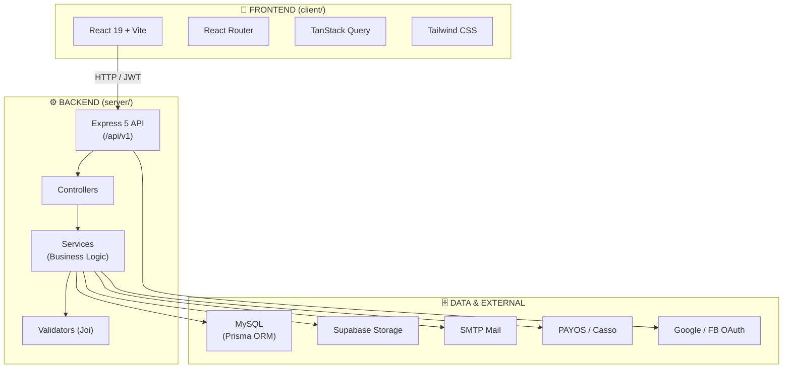
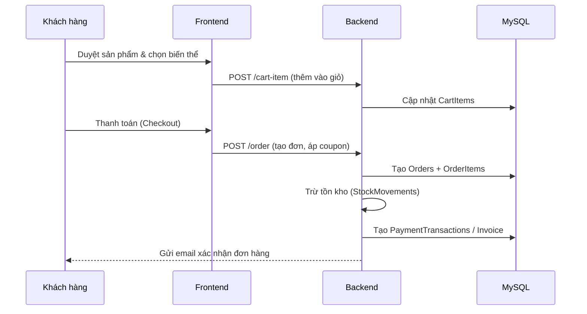

<p align="center">
  
</p>

<h1 align="center">BÁO CÁO HỆ THỐNG SPORTNEXUS</h1>

<p align="center">
  <strong>Nền tảng thương mại điện tử chuyên cho ngành thể thao</strong><br>
  React 19 · Express 5 · Prisma · MySQL · Supabase · JWT
</p>

<p align="center">
  
  
  
  
  
</p>

---

## 📑 Mục lục

1. [Giới thiệu tổng quan](#1-giới-thiệu-tổng-quan)
2. [Mục tiêu & Phạm vi](#2-mục-tiêu--phạm-vi)
3. [Kiến trúc hệ thống](#3-kiến-trúc-hệ-thống)
4. [Công nghệ sử dụng](#4-công-nghệ-sử-dụng)
5. [Mô hình dữ liệu](#5-mô-hình-dữ-liệu)
6. [Các phân hệ chức năng](#6-các-phân-hệ-chức-năng)
7. [Xác thực & Phân quyền](#7-xác-thực--phân-quyền)
8. [Quy trình nghiệp vụ chính](#8-quy-trình-nghiệp-vụ-chính)
9. [Bảo mật](#9-bảo-mật)
10. [Hướng dẫn triển khai](#10-hướng-dẫn-triển-khai)
11. [Cấu trúc thư mục](#11-cấu-trúc-thư-mục)
12. [Hạn chế & Hướng phát triển](#12-hạn-chế--hướng-phát-triển)

---

## 1. Giới thiệu tổng quan

**SportNexus** là một ứng dụng web **thương mại điện tử (e-commerce)** hoàn chỉnh dành riêng cho lĩnh vực thể thao. Hệ thống bao gồm **hai giao diện chính**:

| Khu vực                 | Vai trò                                                            | Công nghệ       |
| ----------------------- | ------------------------------------------------------------------ | --------------- |
| 🛍️ **Client (Bán lẻ)**  | Khách hàng duyệt sản phẩm, đặt hàng, thanh toán, theo dõi đơn hàng | React 19 + Vite |
| 🛠️ **Admin (Quản trị)** | Quản lý sản phẩm, đơn hàng, tồn kho, nhân sự, báo cáo              | React 19 + Vite |

<p align="center">
  
  
</p>

Hệ thống được thiết kế theo mô hình **client–server**, backend cung cấp **RESTful API** hoàn chỉnh để phục vụ cả website công khai lẫn khu quản trị nội bộ, đáp ứng đầy đủ chuỗi nghiệp vụ **bán hàng từ đầu đến cuối**.

---

## 2. Mục tiêu & Phạm vi

### 🎯 Mục tiêu

- Xây dựng nền tảng thương mại điện tử thể thao với đầy đủ tính năng **front-end** và **back-end**.
- Cho phép **đa vai trò** trong tổ chức (admin, nhân viên bán hàng, quản lý kho, nhân viên thu mua, khách hàng).
- Tự động hóa quy trình **đặt hàng → thanh toán → vận chuyển → hóa đơn → tồn kho**.

### 📌 Phạm vi chức năng

- **Website khách hàng**: Trang chủ, danh mục sản phẩm, tìm kiếm, chi tiết sản phẩm, giỏ hàng, thanh toán, đơn hàng, đánh giá, voucher, theo dõi vận đơn.
- **Hệ thống quản trị**: Dashboard báo cáo, quản lý người dùng & phân quyền, sản phẩm & biến thể, đơn hàng, coupon, nhà cung cấp, nhập hàng, tồn kho, hóa đơn, vận đơn, nhật ký hệ thống.
- **Tích hợp bên ngoài**: Supabase Storage (lưu ảnh), Nodemailer (email), PAYOS/Casso (thanh toán), Google/Facebook (đăng nhập xã hội).

---

## 3. Kiến trúc hệ thống

Hệ thống tuân theo mô hình **3 lớp** phổ biến của ứng dụng web hiện đại:



### Luồng xử lý tổng quát

1. **Frontend** gửi request đến backend thông qua base URL `VITE_API_URL`.
2. **Backend** xác thực JWT, kiểm tra phân quyền (`verifyToken`, `checkPermission`).
3. **Service** xử lý nghiệp vụ (catalog, cart, order, inventory…).
4. **Prisma** thực hiện đọc/ghi **MySQL**; tích hợp các dịch vụ ngoài khi cần.

> **Lưu ý**: API backend được mount dưới prefix `/api/v1/`, vì vậy `VITE_API_URL` cần trỏ đúng base path này.

---

## 4. Công nghệ sử dụng

### 🖥️ Frontend (`client/`)

| Công nghệ             | Vai trò                              |
| --------------------- | ------------------------------------ |
| React 19              | Thư viện UI                          |
| Vite 7                | Bundler & Dev server                 |
| React Router 7        | Định tuyến (lazy loading)            |
| TanStack Query        | Quản lý state / cache dữ liệu server |
| Tailwind CSS          | Thiết kế giao diện (utility-first)   |
| react-hook-form + zod | Form & validation                    |
| i18next               | Đa ngôn ngữ (vi/en)                  |
| Swiper                | Carousel / banner                    |
| Sonner                | Thông báo toast                      |

### ⚙️ Backend (`server/`)

| Công nghệ      | Vai trò                   |
| -------------- | ------------------------- |
| Express 5      | Framework HTTP            |
| Prisma ORM     | Truy cập database (MySQL) |
| MySQL          | Cơ sở dữ liệu quan hệ     |
| JWT            | Xác thực & refresh token  |
| Joi            | Validation request        |
| Supabase JS    | Lưu trữ file / hình ảnh   |
| Nodemailer     | Gửi email (EJS template)  |
| Multer + Sharp | Upload & xử lý ảnh        |
| ExcelJS        | Import / Export Excel     |
| bcrypt         | Mã hóa mật khẩu           |
| @payos/node    | Cổng thanh toán           |

### 🧩 Đa ngôn ngữ

Hệ thống hỗ trợ **song ngữ Việt – Anh** thông qua i18next ở frontend và hệ thống `locales/messages.js` ở backend.

---

## 5. Mô hình dữ liệu

Dưới đây là sơ đồ cơ sở dữ liệu tổng quan:

<p align="center">
  
</p>

### 🗂️ Các nhóm thực thể chính

| Nhóm           | Bảng / Model                                                                          | Mô tả                                        |
| -------------- | ------------------------------------------------------------------------------------- | -------------------------------------------- |
| **Người dùng** | `Users`, `Roles`, `Permissions`, `UserAddresses`                                      | Tài khoản, vai trò, quyền, địa chỉ giao hàng |
| **Catalog**    | `Categories`, `Brands`, `Suppliers`                                                   | Danh mục, thương hiệu, nhà cung cấp          |
| **Sản phẩm**   | `Products`, `ProductVariants`, `ProductImages`, `AttributeKeys`, `VariableAttributes` | Sản phẩm, biến thể, hình ảnh, thuộc tính     |
| **Bán hàng**   | `Carts`, `CartItems`, `Orders`, `OrderItems`, `Coupons`, `UserCoupons`                | Giỏ hàng, đơn hàng, khuyến mãi               |
| **Thanh toán** | `Invoices`, `PaymentTransactions`                                                     | Hóa đơn, lịch sử thanh toán                  |
| **Vận chuyển** | `Shipments`                                                                           | Vận đơn (mô phỏng GHN)                       |
| **Kho vận**    | `StockMovements`, `PurchaseOrders`, `PurchaseOrderItems`                              | Biến động tồn kho, phiếu nhập                |
| **Chất lượng** | `Reviews`                                                                             | Đánh giá sản phẩm                            |
| **Audit**      | `SystemLogs`                                                                          | Nhật ký hệ thống                             |

### 🔑 Các enum quan trọng

| Enum            | Giá trị                                                        |
| --------------- | -------------------------------------------------------------- |
| `OrderStatus`   | `Processing`, `Shipping`, `Delivered`, `Cancelled`, `Refunded` |
| `PaymentMethod` | `COD`, `BANK_TRANSFER`, `MOMO`, `VNPAY`, `CREDIT_CARD`         |
| `PaymentStatus` | `Pending`, `Paid`, `Failed`, `Refunded`                        |
| `DiscountType`  | `CASH`, `PERCENTAGE`                                           |
| `TypeStock`     | `IN`, `OUT`, `ADJUSTMENT`                                      |
| `InvoiceStatus` | `Pending`, `Completed`, `Cancelled`                            |

---

## 6. Các phân hệ chức năng

### 🛍️ Phân hệ khách hàng (Public Web)

- **Trang chủ**: banner, danh mục nổi bật, sản phẩm mới, khuyến mãi, coupon.
- **Danh sách sản phẩm**: lọc theo danh mục, thương hiệu, khoảng giá; tìm kiếm.
- **Chi tiết sản phẩm**: chọn biến thể (màu sắc, kích thước), đánh giá, đề xuất coupon.
- **Giỏ hàng** (Cart Context) & **Checkout**: địa chỉ giao hàng, chọn phương thức thanh toán.
- **Thanh toán**: COD / chuyển khoản qua PAYOS / QR; trang xác nhận thành công.
- **Tài khoản khách hàng**: hồ sơ, đổi mật khẩu, danh sách địa chỉ, đơn hàng.
- **Theo dõi đơn hàng** (`/tra-cuu-don`) và **vận đơn** (timeline giao hàng).
- **Hóa đơn điện tử**: xem & chi tiết hóa đơn (in, VAT).
- **Voucher**: trang khuyến mãi, gợi ý coupon khi mua.
- **Yêu thích** (Wishlist), **lịch sử tìm kiếm**, **hỗ trợ**.
- **Đăng nhập xã hội**: Google, Facebook.

### 🛠️ Phân hệ quản trị (Admin)

| Nhóm                             | Chức năng                                                              |
| -------------------------------- | ---------------------------------------------------------------------- |
| **Dashboard**                    | Báo cáo doanh thu, đơn hàng, khách hàng, tồn kho, sản phẩm, khuyến mãi |
| **Quản lý người dùng**           | CRUD user, gán vai trò & quyền                                         |
| **Phân quyền**                   | Quản lý Roles & Permissions                                            |
| **Sản phẩm**                     | CRUD sản phẩm, biến thể, hình ảnh, thuộc tính, attribute keys          |
| **Danh mục / Thương hiệu / NCC** | Quản lý catalog + import/export Excel                                  |
| **Đơn hàng**                     | Tạo, sửa, cập nhật trạng thái đơn hàng                                 |
| **Coupon**                       | Tạo mã giảm giá, tặng voucher, import/export                           |
| **Nhập hàng**                    | Purchase orders từ nhà cung cấp                                        |
| **Tồn kho**                      | Stock movements, điều chỉnh & kiểm kê                                  |
| **Hóa đơn**                      | Phát hành & quản lý hóa đơn bán hàng                                   |
| **Vận đơn**                      | Mô phỏng vận chuyển (GHN simulator)                                    |
| **Đánh giá**                     | Duyệt / ẩn đánh giá sản phẩm                                           |
| **Nhật ký**                      | Theo dõi hoạt động hệ thống                                            |

---

## 7. Xác thực & Phân quyền

### 🔐 Xác thực (Authentication)

- **Đăng ký** với email, xác thực tài khoản qua email, **đăng nhập** bằng mật khẩu.
- **Đăng nhập xã hội**: Google (`google-auth-library`) và Facebook.
- **JWT Access Token + Refresh Token** (`JWT_ACCESS_SECRET`, `JWT_REFRESH_SECRET`).
- Quên / đặt lại mật khẩu qua email, đổi mật khẩu khi đã đăng nhập.
- Mật khẩu được mã hóa bằng **bcrypt**.

### 🛡️ Phân quyền (Authorization)

Hệ thống sử dụng mô hình **RBAC** (Role-Based Access Control):

```
Users → (role) → Roles → (permissions) → Permissions
```

Các vai trò mặc định:

| Vai trò               | Quyền chính                                    |
| --------------------- | ---------------------------------------------- |
| **admin**             | Toàn quyền (quản trị tối cao)                  |
| **sales_staff**       | Quản lý đơn hàng, coupon, đánh giá             |
| **warehouse_manager** | Quản lý sản phẩm, biến thể, danh mục, kho hàng |
| **purchasing_staff**  | Quản lý nhà cung cấp, phiếu nhập               |
| **customer**          | Khách hàng mua hàng                            |

> **Bảo mật route**: Các route quản trị được bảo vệ bởi `verifyToken` và `checkPermission`. Frontend có `AdminGuard` để chặn truy cập trái phép.

---

## 8. Quy trình nghiệp vụ chính

### 🛒 Quy trình bán hàng



### 📦 Quy trình quản lý kho

1. **Bán hàng** → tạo `StockMovements` loại `OUT` (xuất).
2. **Nhập hàng** → `PurchaseOrders` + `PurchaseOrderItems`, cập nhật tồn kho `IN`.
3. **Kiểm kê / điều chỉnh** → `StockMovements` loại `ADJUSTMENT`.

### 🧾 Quy trình hóa đơn

- Mỗi đơn hàng tạo tương ứng **1 hóa đơn** (`Invoices`) với số hóa đơn duy nhất.
- Hóa đơn tính: `subtotal`, `discount_amount`, `vat_rate` (mặc định 8%), `vat_amount`, `total_amount`.
- Trạng thái hóa đơn: `Pending → Completed / Cancelled`.

---

## 9. Bảo mật

- ✅ Mã hóa mật khẩu bằng **bcrypt**.
- ✅ Xác thực bằng **JWT** (access + refresh).
- ✅ Kiểm tra phân quyền trên **từng route quản trị**.
- ✅ Validation đầu vào bằng **Joi**.
- ✅ Không log bí mật, token hay biến môi trường nhạy cảm.
- ✅ Soft delete cho dữ liệu quan trọng (dùng `deleted_at` mặc định `1000-01-01`).
- ✅ CORS giới hạn origin.

---

## 10. Hướng dẫn triển khai

### 📋 Yêu cầu hệ thống

- Node.js 18+
- npm 9+
- MySQL (compatible với Prisma schema)

### 📦 Cài đặt dependencies

```bash
npm install
npm install --prefix client
npm install --prefix server
```

### 🔧 Cấu hình môi trường

Tạo file `.env` từ các file mẫu:

```bash
cp client/.env.example client/.env
cp server/.env.example server/.env
```

**Biến quan trọng:**

| Khu vực  | Biến                                       | Mô tả                       |
| -------- | ------------------------------------------ | --------------------------- |
| Frontend | `VITE_API_URL`                             | Base URL API (`/api/v1`)    |
| Frontend | `VITE_APP_NAME`                            | Tên ứng dụng                |
| Backend  | `DATABASE_URL`                             | Chuỗi kết nối MySQL         |
| Backend  | `APP_PORT`                                 | Cổng server (mặc định 8081) |
| Backend  | `JWT_ACCESS_SECRET` / `JWT_REFRESH_SECRET` | Khóa ký JWT                 |
| Backend  | `SUPABASE_URL` / `SUPABASE_SERVICE_KEY`    | Supabase Storage            |
| Backend  | `EMAIL_ADMIN` / `EMAIL_PASS`               | SMTP gửi mail               |
| Backend  | `GOOGLE_CLIENT_*` / `FACEBOOK_APP_*`       | Đăng nhập xã hội            |
| Backend  | `PAYOS_*` / `CASSO_*`                      | Thanh toán                  |

### 🚀 Chạy hệ thống

Chạy đồng thời frontend + backend từ root:

```bash
npm run dev
```

Hoặc chạy riêng từng app:

```bash
npm run dev --prefix client   # Frontend (Vite, cổng 5173)
npm run dev --prefix server   # Backend (Express, cổng 8081)
```

### 🔁 Database

```bash
# Generate Prisma client
npx prisma generate

# Chạy migration (schema là nguồn chuẩn)
npx prisma migrate dev
```

### ✅ Lệnh kiểm tra / build

```bash
npm run build --prefix client   # Build production frontend
npm run lint --prefix client    # Lint frontend
```

> **Lưu ý**: `npm test --prefix server` hiện chỉ là placeholder, backend chưa có bộ test tự động hoàn chỉnh.

---

## 11. Cấu trúc thư mục

```text
SportNexus/
├─ client/                      # Frontend React + Vite
│  ├─ src/
│  │  ├─ pages/                 # Các trang (Home, Products, Admin, Profile...)
│  │  ├─ components/            # Component dùng chung (UI kit)
│  │  ├─ api/                   # Lớp gọi API (axios)
│  │  ├─ loaders/               # Data loaders (React Router)
│  │  ├─ contexts/              # Cart, Wishlist, Coupon context
│  │  ├─ hooks/                 # Custom hooks
│  │  ├─ routes/                # Định nghĩa route
│  │  ├─ locales/               # i18n (vi/en)
│  │  └─ layouts/               # AdminLayout, AuthLayout
│  └─ public/
├─ server/                      # Backend Express + Prisma
│  ├─ prisma/
│  │  ├─ schema.prisma          # 🔑 Source of truth (schema)
│  │  ├─ seed*.js               # Scripts seed dữ liệu
│  │  └─ migrations/            # Migration SQL
│  └─ src/
│     ├─ controllers/           # Xử lý HTTP
│     ├─ services/              # Logic nghiệp vụ
│     ├─ validators/            # Joi schemas
│     ├─ routes/                # Định tuyến API
│     ├─ middlewares/           # verifyToken, checkPermission, upload...
│     ├─ configs/               # Mail, Supabase, PAYOS, View...
│     ├─ views/emails/          # Template email (EJS)
│     └─ utils/                 # Tiện ích dùng chung
├─ docs/                        # Tài liệu tham khảo (diagram, ghi chú)
├─ report/                      # 📄 Báo cáo này
└─ package.json                 # Scripts orchestration (root)
```

---

## 12. Hạn chế & Hướng phát triển

### ⚠️ Hạn chế hiện tại

- **Backend chưa có bộ test tự động** hoàn chỉnh (`npm test` là placeholder).
- **Migrations chưa được version đầy đủ**; schema Prisma là nguồn chuẩn duy nhất.
- Một số route/auth còn **nợ bảo mật & layout** (ghi chú trong `AGENTS.md`).
- `docs/` chỉ là tài liệu tham khảo, có thể **lệch** so với code hiện tại.
- Không dùng npm workspaces → dependencies client/server quản lý riêng.

### 🚀 Đề xuất phát triển tương lai

- Bổ sung bộ **test tự động** cho backend (unit + integration).
- **Version hóa migration** database chuẩn quy trình.
- Hoàn thiện module thanh toán trực tuyến (VNPay, MoMo) ở production.
- Tích hợp **WebSocket** để cập nhật trạng thái đơn hàng / vận đơn theo thời gian thực.
- Cải thiện hiệu năng: lazy loading, cache phân tán, phân trang tối ưu.
- Mở rộng báo cáo dashboard với biểu đồ nâng cao & xuất báo cáo.

---

## 📌 Tổng kết

**SportNexus** là một hệ thống thương mại điện tử thể thao **hoàn chỉnh** với kiến trúc client–server rõ ràng, bao phủ đầy đủ chuỗi nghiệp vụ từ **sản phẩm → đơn hàng → thanh toán → vận chuyển → hóa đơn → tồn kho**. Với hệ thống phân quyền RBAC linh hoạt, tích hợp đa dịch vụ ngoài và giao diện hiện đại, hệ thống sẵn sàng làm nền tảng vững chắc để phát triển thành sản phẩm thương mại điện tử hoàn thiện.

---

<p align="center">
  <sub>© 2026 SportNexus · Báo cáo tổng quan hệ thống</sub>
</p>
