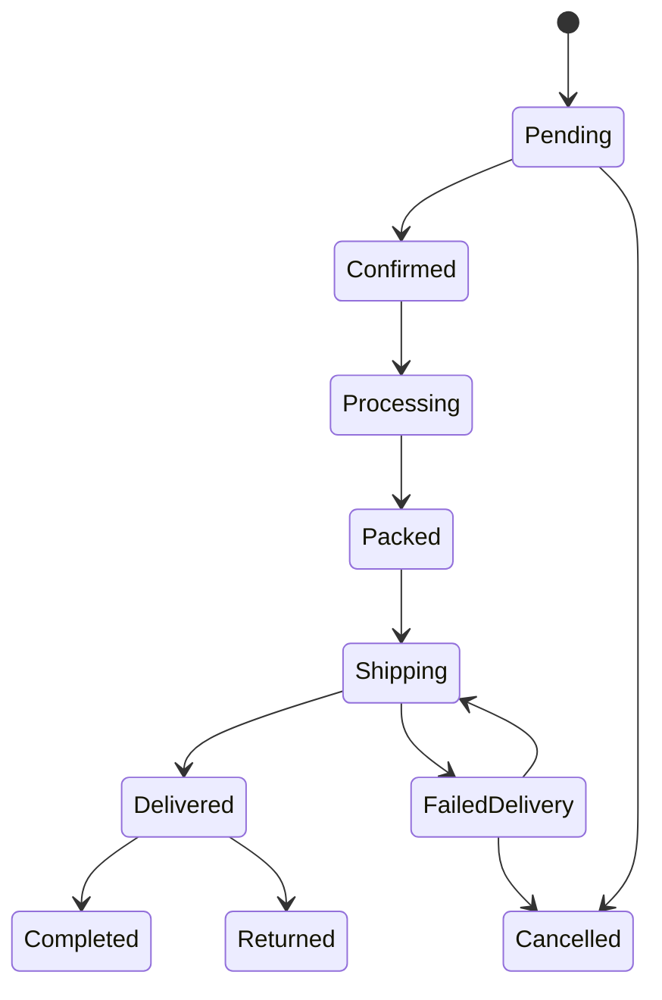

<p align="center">
  
</p>

<h1 align="center">TÀI LIỆU NGUỒN — SPORTNEXUS</h1>

<p align="center">
  <strong>Tài liệu phân tích và mô tả hệ thống thương mại điện tử thể thao</strong><br>
  Bản nội dung được viết lại theo cấu trúc 3 chương hướng báo cáo
</p>

---

# CHƯƠNG I. GIỚI THIỆU VỀ HỆ THỐNG SPORTNEXUS

## 1.1. Bối cảnh của đề tài

Trong thời đại số hóa, thương mại điện tử đã trở thành một xu hướng không thể thiếu trong mọi lĩnh vực kinh doanh, đặc biệt là trong ngành thể thao. Người tiêu dùng ngày càng ưu tiên mua sắm trực tuyến nhờ sự tiện lợi, tiết kiệm thời gian và khả năng tiếp cận sản phẩm đa dạng. Bên cạnh đó, các doanh nghiệp bán lẻ thể thao cũng cần một nền tảng quản lý toàn diện để tối ưu quy trình bán hàng, quản lý tồn kho, chăm sóc khách hàng và theo dõi doanh thu.

SportNexus là một hệ thống thương mại điện tử chuyên về lĩnh vực thể thao, được xây dựng nhằm đáp ứng nhu cầu bán hàng trực tuyến và quản trị vận hành. Hệ thống này tích hợp các chức năng chính như quản lý sản phẩm, giỏ hàng, đặt hàng, thanh toán, tài khoản người dùng và quản trị hệ thống. Sự kết hợp giữa frontend hiện đại và backend mạnh mẽ giúp dự án này mang tính khả thi cao trong thực tế và đồng thời phù hợp với yêu cầu của một đồ án hoặc khóa luận.

## 1.2. Mục tiêu của dự án

Dự án SportNexus hướng tới việc xây dựng một nền tảng thương mại điện tử hoàn chỉnh cho ngành thể thao với các mục tiêu chính như sau:

- Xây dựng giao diện bán hàng thân thiện, dễ sử dụng và tương thích với nhiều thiết bị.
- Quản lý sản phẩm theo mô hình đa biến thể với nhiều màu sắc, kích thước và mức tồn kho khác nhau.
- Tạo quy trình mua hàng từ tìm kiếm, thêm giỏ hàng đến đặt hàng và thanh toán.
- Hỗ trợ khách hàng theo dõi trạng thái đơn hàng và quản lý tài khoản cá nhân.
- Xây dựng hệ thống quản trị cho admin và nhân viên để quản lý sản phẩm, đơn hàng, tồn kho, khuyến mãi và quyền truy cập.
- Tích hợp các công nghệ hiện đại như xác thực JWT, lưu trữ hình ảnh, email và cổng thanh toán.

## 1.3. Phạm vi nghiên cứu

### 1.3.1. Đối tượng sử dụng

Hệ thống được thiết kế cho ba nhóm đối tượng chính:

- Khách vãng lai: có thể duyệt sản phẩm và tìm hiểu thông tin trước khi mua.
- Khách hàng đã đăng nhập: có quyền quản lý giỏ hàng, theo dõi đơn hàng, cập nhật thông tin cá nhân và tích lũy thành viên.
- Quản trị viên và nhân viên: thực hiện quản lý nội dung, đơn hàng, sản phẩm, tồn kho, khuyến mãi và quyền người dùng.

### 1.3.2. Chức năng chính

Dự án tập trung vào các chức năng cốt lõi của một hệ thống thương mại điện tử hiện đại:

- Quản lý danh mục và sản phẩm.
- Tìm kiếm, lọc và hiển thị sản phẩm theo nhiều tiêu chí.
- Giỏ hàng và đặt hàng.
- Thanh toán COD và thanh toán online qua PayOS.
- Quản lý trạng thái đơn hàng và vận chuyển.
- Quản lý tài khoản người dùng và phân quyền.
- Chương trình thành viên, ưu đãi và mã giảm giá.
- Dashboard thống kê cho quản trị.

### 1.3.3. Phạm vi công nghệ

Dự án được phát triển theo kiến trúc client-server, gồm hai phần chính:

- Frontend: React 19 + Vite + React Router + Tailwind CSS.
- Backend: Node.js + Express 5 + Prisma ORM + MySQL.

Ngoài ra, hệ thống còn tích hợp các dịch vụ hỗ trợ như:

- Supabase Storage: lưu trữ hình ảnh và tài nguyên tệp.
- PayOS: cổng thanh toán trực tuyến.
- Nodemailer: gửi email thông báo.
- JWT: xác thực người dùng.

## 1.4. Phương pháp nghiên cứu

Quá trình xây dựng dự án dựa trên phương pháp phân tích yêu cầu và phát triển theo hướng module hóa. Cụ thể:

- Nghiên cứu hệ thống thương mại điện tử hiện đại và các mô hình quản lý sản phẩm, người dùng và đơn hàng.
- Thiết kế kiến trúc hệ thống theo tầng rõ ràng: frontend, backend, cơ sở dữ liệu và dịch vụ hỗ trợ.
- Phân tích mã nguồn thực tế để xác định cấu trúc route, controller, service, schema và luồng nghiệp vụ.
- Kiểm tra chức năng theo luồng đặt hàng, thanh toán, quản trị và bảo mật.

## 1.5. Ý nghĩa khoa học và thực tiễn

SportNexus không chỉ là một sản phẩm demo mà còn có giá trị thực tiễn cao trong bối cảnh doanh nghiệp cần chuyển đổi số. Dự án này cho thấy cách một hệ thống thương mại điện tử có thể được xây dựng từ góc nhìn kỹ thuật, nghiệp vụ và vận hành.

Về mặt khoa học, dự án tích hợp nhiều khái niệm quan trọng của kỹ thuật phần mềm như: kiến trúc phân lớp, thiết kế dữ liệu quan hệ, xác thực và phân quyền, tích hợp API, và kiểm thử luồng nghiệp vụ. Về mặt thực tiễn, hệ thống có thể được mở rộng thành sản phẩm thương mại điện tử thực tế cho doanh nghiệp bán hàng thể thao.

---

# CHƯƠNG II. CƠ SỞ LÝ THUYẾT VÀ CÔNG NGHỆ CỦA HỆ THỐNG

## 2.1. Khái niệm thương mại điện tử

Thương mại điện tử là hình thức mua bán hàng hóa hoặc dịch vụ thông qua mạng Internet. Với mô hình này, khách hàng có thể tìm kiếm sản phẩm, so sánh giá, đặt hàng và thanh toán mà không cần đến trực tiếp cửa hàng. Đối với doanh nghiệp, thương mại điện tử giúp mở rộng thị trường, giảm chi phí, đồng thời nâng cao hiệu quả quản lý và chăm sóc khách hàng.

Trong bối cảnh thị trường thể thao phát triển mạnh, hệ thống thương mại điện tử cho phép doanh nghiệp tiếp cận nhiều nhóm khách hàng hơn, từ người tập gym, jogger, đến người yêu thích đồ thể thao chuyên nghiệp. Chính vì vậy, xây dựng một nền tảng bán hàng trực tuyến chuyên biệt cho lĩnh vực này là lựa chọn phù hợp và có tính ứng dụng cao.

## 2.2. Mô hình kiến trúc hệ thống

Hệ thống SportNexus được triển khai theo mô hình web full-stack với phần frontend và backend tách biệt nhưng đồng bộ về dữ liệu và nghiệp vụ. Cách tổ chức này giúp hệ thống dễ bảo trì, dễ mở rộng và dễ quản lý khi quy mô tăng trưởng.

### 2.2.1. Frontend

Frontend là phần giao diện người dùng, chạy trên trình duyệt. Nó đảm nhiệm việc hiển thị danh mục sản phẩm, khung giỏ hàng, tài khoản, thanh toán và các màn hình quản trị. Được xây dựng bằng React, frontend sử dụng các component để tách logic hiển thị thành từng phần nhỏ và dễ tái sử dụng.

### 2.2.2. Backend

Backend là nơi xử lý toàn bộ logic nghiệp vụ của hệ thống. Nó chịu trách nhiệm nhận request từ frontend, validate dữ liệu, xác thực người dùng, truy vấn cơ sở dữ liệu, và trả về kết quả dưới dạng JSON. Trong dự án này, backend được xây dựng bằng Node.js và Express để phục vụ API REST.

### 2.2.3. Cơ sở dữ liệu

Cơ sở dữ liệu của hệ thống được xây dựng theo mô hình quan hệ để đảm bảo tính nhất quán, toàn vẹn và khả năng trích xuất báo cáo. Prisma được dùng để định nghĩa và quản lý schema, giúp kết nối ứng dụng với MySQL một cách rõ ràng và dễ bảo trì.

## 2.3. Mô hình dữ liệu của hệ thống

Một hệ thống thương mại điện tử cần quản lý nhiều thực thể phức tạp. Trong SportNexus, các thực thể cốt lõi bao gồm:

- Người dùng (users)
- Vai trò và quyền (roles, permissions)
- Sản phẩm (products)
- Biến thể sản phẩm (product_variants)
- Danh mục và thương hiệu
- Đơn hàng (orders)
- Chi tiết đơn hàng (order_items)
- Thanh toán (payment_transactions)
- Hóa đơn (invoices)
- Coupon và ưu đãi
- Tồn kho và xuất nhập kho
- Vận chuyển và trạng thái giao hàng

Mô hình này cho phép hệ thống quản lý đầy đủ chuỗi nghiệp vụ từ đầu vào đến kết thúc. Một đơn hàng có thể liên kết với nhiều sản phẩm, nhiều biến thể, nhiều giao dịch thanh toán và các trạng thái theo dõi khác nhau.

## 2.4. Công nghệ chính được sử dụng

### 2.4.1. React 19 và Vite

React là thư viện JavaScript mạnh mẽ cho việc xây dựng giao diện người dùng. Vite giúp tăng tốc quá trình phát triển nhờ khả năng biên dịch nhanh và hiệu suất tốt. Cặp công nghệ này phù hợp với ứng dụng web hiện đại, có nhiều route và component phức tạp như SportNexus.

### 2.4.2. Express.js và Prisma

Express là framework Node.js giúp xây dựng API nhanh chóng, linh hoạt và dễ mở rộng. Prisma hỗ trợ thao tác với cơ sở dữ liệu theo cách rõ ràng và an toàn hơn, giúp giảm sai sót trong truy vấn dữ liệu và tối ưu việc quản lý schema.

### 2.4.3. MySQL

MySQL là cơ sở dữ liệu quan hệ được sử dụng để lưu trữ dữ liệu nghiệp vụ. Đây là lựa chọn phù hợp cho hệ thống thương mại điện tử khi cần xử lý dữ liệu lớn, tạo mối quan hệ phức tạp và phục vụ báo cáo thống kê.

### 2.4.4. JWT và phân quyền

JWT (JSON Web Token) được sử dụng để xác thực người dùng và cấp quyền truy cập cho các route hoặc chức năng cần bảo vệ. Cùng với cơ chế phân quyền theo vai trò, hệ thống có thể giới hạn quyền người dùng theo nhóm như khách hàng, nhân viên, quản lý và admin.

### 2.4.5. Supabase, PayOS và email

- Supabase Storage: lưu trữ hình ảnh, file đính kèm, dữ liệu media.
- PayOS: hỗ trợ tích hợp thanh toán trực tuyến.
- Nodemailer: gửi email như xác nhận đơn, quên mật khẩu, thông báo khuyến mãi.

Các dịch vụ này giúp hệ thống mang tính thực tiễn và gần với một sản phẩm đầy đủ ở mức demo hoặc triển khai thử nghiệm.

## 2.5. Quy trình nghiệp vụ chính

### 2.5.1. Quy trình mua hàng

Quy trình mua hàng trong SportNexus diễn ra theo thứ tự sau:

1. Khách hàng duyệt danh mục hoặc tìm kiếm sản phẩm.
2. Chọn biến thể sản phẩm phù hợp như màu sắc, kích thước, số lượng.
3. Thêm vào giỏ hàng.
4. Tiến hành thanh toán.
5. Hệ thống tạo đơn hàng và lưu lịch sử giao dịch.
6. Admin hoặc hệ thống cập nhật trạng thái đơn hàng và giao nhận.

### 2.5.2. Quy trình quản lý đơn hàng

Khi đơn hàng được tạo, dữ liệu được lưu trong các bảng như orders, order_items, payment_transactions và shipments. Quản trị viên có thể xử lý đơn theo từng giai đoạn như chờ xác nhận, đang xử lý, đang giao, hoàn thành hoặc hủy. Từng trạng thái được lưu rõ ràng để phục vụ tra cứu và báo cáo.

### 2.5.3. Quy trình quản trị

Các vai trò quản trị trong hệ thống được triển khai theo cấp độ quyền khác nhau. Admin có khả năng quản lý toàn bộ, trong khi các nhân viên có quyền được phép trên các module cụ thể như kho, sản phẩm hoặc đơn hàng. Bằng cách này, hệ thống đảm bảo rõ ràng về trách nhiệm và bảo mật dữ liệu.

---

# CHƯƠNG III. KẾT QUẢ THỰC HIỆN VÀ ĐÁNH GIÁ HỆ THỐNG

## 3.1. Kết quả xây dựng hệ thống

Dự án SportNexus đã xây dựng được một nền tảng thương mại điện tử với các chức năng cốt lõi sau:

- Giao diện public cho khách hàng để duyệt và mua hàng.
- Hệ thống quản lý tài khoản người dùng và đăng nhập.
- Tích hợp giỏ hàng, thanh toán và theo dõi đơn hàng.
- Module quản trị cho admin và nhân viên.
- Tích hợp dữ liệu sản phẩm đa biến thể và quản lý tồn kho.
- Hỗ trợ ưu đãi, coupon và chương trình thành viên.

Các chức năng này đã được triển khai theo tổ chức tách rõ giữa frontend và backend, giúp hệ thống dễ mở rộng và phù hợp với mô hình phát triển hiện đại.

## 3.2. Đánh giá chức năng chính

### 3.2.1. Giao diện người dùng

Giao diện của dự án được xây dựng theo hướng hiện đại, rõ ràng và thân thiện với người dùng. Cấu trúc route được tách theo public, auth và admin giúp hệ thống dễ tổ chức và quản lý. Về UX, người dùng có thể duyệt sản phẩm, tìm kiếm nhanh, và tiến hành đặt hàng mà không gặp khó khăn.

### 3.2.2. Backend và API

Backend cung cấp API theo kiểu REST, phục vụ cho các hoạt động chính của hệ thống. Các route được tổ chức theo module như auth, customer, management, product, order, payment. Cấu trúc này giúp hệ thống dễ kiểm tra, mục tiêu và bảo trì lâu dài.

### 3.2.3. Quản lý dữ liệu và thanh toán

Với Prisma và MySQL, dữ liệu được lưu theo mô hình quan hệ rõ ràng. Hệ thống quản lý đơn hàng, biến thể sản phẩm, transaction thanh toán và trạng thái cập nhật theo thời gian. Tích hợp PayOS cho phép phương thức thanh toán online có thể phát triển thêm trong tương lai khi môi trường thực tế sẵn sàng.

### 3.2.4. Bảo mật và phân quyền

Hệ thống áp dụng JWT và kiểm tra quyền truy cập theo từng route. Giao diện và API đều có cơ chế kiểm soát quyền nhằm ngăn người dùng không phù hợp truy cập dữ liệu nhạy cảm. Đây là một yếu tố quan trọng trong bất kỳ hệ thống thương mại điện tử nào.

## 3.3. Những hạn chế hiện tại

Mặc dù nền tảng đã xây dựng được các tính năng cốt lõi, hệ thống vẫn còn một số điểm cần hoàn thiện để tiến tới mức production thực tế:

- Luồng thanh toán online cần được kiểm thử và thực hiện đầy đủ trong môi trường chạy thật.
- Một số module quản trị chưa được mở rộng và tối ưu hoàn toàn cho quy mô lớn hơn.
- Cần tăng cường kiểm thử tự động và kiểm tra lỗi ở nhiều luồng nghiệp vụ.
- Cần bổ sung thêm báo cáo thống kê chuyên sâu và tối ưu trải nghiệm admin.

Những hạn chế này không làm giảm giá trị của dự án, mà ngược lại cho thấy hệ thống đang ở một giai đoạn phát triển rõ ràng, có khả năng nâng cấp và hoàn thiện tiếp theo.

## 3.4. Kết luận chung

SportNexus là một hệ thống thương mại điện tử thể thao được xây dựng với mục tiêu mang đến trải nghiệm mua sắm trực tuyến hiện đại và quy trình quản lý hiệu quả cho doanh nghiệp. Dự án thu thập và tích hợp nhiều yếu tố quan trọng của phần mềm chuyên nghiệp: thiết kế UI/UX, API backend, mô hình dữ liệu, quyền truy cập, thanh toán và quản trị.

Về mặt hoàn thiện, dự án đã đạt được các chức năng cốt lõi của một ứng dụng thương mại điện tử thực tế. Về mặt phát triển tiếp theo, hệ thống có tiềm năng mở rộng đáng kể trong các lĩnh vực như báo cáo doanh thu, phân tích khách hàng, tối ưu thanh toán và tích hợp vận chuyển thực tế.

---

## TÓM TẮT

SportNexus là một nền tảng thương mại điện tử thể thao, được xây dựng theo kiến trúc web hiện đại, với frontend React, backend Express, database MySQL và Prisma. Dự án đáp ứng được các nhu cầu chính của một hệ thống bán hàng trực tuyến như quản lý sản phẩm, giỏ hàng, đặt hàng, thanh toán, người dùng và quản trị. Mặc dù còn một số hạn chế trong quá trình hoàn thiện, hệ thống đã chứng minh được tính khả thi về kỹ thuật và tính ứng dụng thực tế trong thời đại chuyển đổi số.

---

# PHẦN MỞ RỘNG PHỤC VỤ BÁO CÁO CHI TIẾT

> Phần này tiếp tục thuộc ba chương chính ở trên, được bổ sung để người viết có đủ dữ liệu triển khai báo cáo dài. Khi dàn trang chính thức, các bảng, sơ đồ và ảnh chụp màn hình có thể tách thành các tiểu mục độc lập.

## I. PHÂN TÍCH HIỆN TRẠNG VÀ BÀI TOÁN NGHIỆP VỤ

### I.1. Hiện trạng quản lý bán hàng truyền thống

Trong mô hình bán hàng truyền thống, thông tin sản phẩm thường được lưu ở nhiều nơi: sổ theo dõi, bảng tính, phần mềm bán hàng hoặc tin nhắn nội bộ. Khi số lượng sản phẩm và đơn hàng tăng, dữ liệu dễ bị phân tán. Nhân viên có thể mất nhiều thời gian để kiểm tra giá, xác định tồn kho hoặc tìm lại lịch sử giao dịch của khách hàng.

Việc tiếp nhận đơn qua nhiều kênh cũng làm phát sinh nguy cơ bỏ sót. Một khách hàng có thể gửi yêu cầu qua mạng xã hội, điện thoại hoặc trực tiếp tại cửa hàng. Nếu không có hệ thống tập trung, nhân viên khó biết đơn đã được xử lý hay chưa, ai đang phụ trách và hàng đã được xuất kho hay chưa.

### I.2. Những vấn đề cần giải quyết

| Vấn đề                      | Nguyên nhân                     | Giải pháp trong SportNexus            |
| --------------------------- | ------------------------------- | ------------------------------------- |
| Tồn kho không chính xác     | Theo dõi thủ công hoặc tách rời | Quản lý tồn theo biến thể và movement |
| Nhập đơn chậm               | Nhiều kênh, nhập lại dữ liệu    | Checkout và order tập trung           |
| Khó tìm sản phẩm            | Danh mục thiếu cấu trúc         | Search, filter, category, brand       |
| Khó theo dõi thanh toán     | Không có transaction riêng      | PaymentTransactions và trạng thái     |
| Phân quyền không rõ         | Dùng chung tài khoản            | Role, permission và middleware        |
| Chăm sóc khách hàng hạn chế | Không lưu lịch sử đầy đủ        | Profile, order, review, loyalty       |
| Báo cáo chậm                | Tổng hợp bằng tay               | Dashboard và truy vấn dữ liệu         |

### I.3. Quy trình nghiệp vụ trước khi số hóa

Quy trình mua hàng bắt đầu khi khách hàng tìm hiểu sản phẩm, sau đó liên hệ với nhân viên để hỏi tồn kho và giá. Nhân viên xác nhận thủ công, ghi nhận thông tin nhận hàng rồi báo lại bộ phận kho. Nếu khách thanh toán chuyển khoản, nhân viên phải kiểm tra sao kê hoặc ảnh biên lai trước khi xác nhận. Cuối cùng, đơn được đóng gói và bàn giao cho đơn vị giao hàng.

Quy trình trên có thể hoạt động với số lượng đơn nhỏ, nhưng khó mở rộng khi nhu cầu tăng. SportNexus số hóa các bước này, giúp trạng thái và dữ liệu được lưu trên cùng một hệ thống. Mỗi người dùng nhìn thấy phần thông tin phù hợp với vai trò của mình.

### I.4. Quy trình sau khi triển khai hệ thống

Khách hàng tự xem sản phẩm và tồn kho, tự tạo giỏ hàng và nhập thông tin nhận hàng. Backend xác minh lại toàn bộ dữ liệu trước khi tạo đơn. Sau đó, nhân viên chỉ cần tiếp nhận đơn trên màn hình quản trị, kiểm tra thanh toán, xử lý kho và cập nhật vận chuyển. Khách hàng có thể theo dõi tiến độ mà không cần gọi điện hỏi từng bước.

### I.5. Lợi ích của việc số hóa

Việc số hóa giúp giảm thao tác nhập lại, tăng khả năng truy vết và giảm sai lệch giữa các bộ phận. Dữ liệu đơn hàng là nguồn chung cho bộ phận bán hàng, kho, kế toán và chăm sóc khách hàng. Đồng thời, doanh nghiệp có thể khai thác dữ liệu để biết sản phẩm bán chạy, nhóm khách hàng có giá trị cao và hiệu quả của các chương trình khuyến mãi.

## II. ĐẶC TẢ USE CASE CHI TIẾT

### II.1. Danh sách use case

| Mã   | Use case              | Tác nhân chính        |
| ---- | --------------------- | --------------------- |
| UC01 | Đăng ký tài khoản     | Khách vãng lai        |
| UC02 | Đăng nhập             | Khách hàng, nhân viên |
| UC03 | Tìm kiếm sản phẩm     | Mọi người dùng        |
| UC04 | Xem chi tiết sản phẩm | Mọi người dùng        |
| UC05 | Quản lý giỏ hàng      | Khách hàng            |
| UC06 | Tạo đơn hàng          | Khách hàng            |
| UC07 | Thanh toán online     | Khách hàng, PayOS     |
| UC08 | Theo dõi đơn hàng     | Khách hàng            |
| UC09 | Đánh giá sản phẩm     | Khách hàng            |
| UC10 | Quản lý sản phẩm      | Nhân viên có quyền    |
| UC11 | Quản lý đơn hàng      | Sales, admin          |
| UC12 | Quản lý tồn kho       | Kho, admin            |
| UC13 | Quản lý coupon        | Sales, admin          |
| UC14 | Quản lý thành viên    | Admin                 |
| UC15 | Xem dashboard         | Người quản trị        |
| UC16 | Quản lý quyền         | Admin                 |

### II.2. UC01 — Đăng ký tài khoản

**Mục đích:** tạo tài khoản để sử dụng các chức năng cá nhân.  
**Dữ liệu vào:** họ tên, email, số điện thoại, mật khẩu và thông tin xác nhận.  
**Dữ liệu ra:** tài khoản mới hoặc thông báo lỗi.

Luồng chính gồm: người dùng mở form đăng ký; hệ thống hiển thị các trường bắt buộc; người dùng nhập dữ liệu; frontend kiểm tra định dạng; backend kiểm tra email chưa tồn tại; mật khẩu được băm; tài khoản được lưu; hệ thống thông báo thành công. Nếu email trùng, dữ liệu thiếu hoặc mật khẩu không hợp lệ, hệ thống trả lỗi và giữ người dùng ở form để sửa.

### II.3. UC02 — Đăng nhập

Người dùng cung cấp email và mật khẩu. Backend tìm tài khoản, kiểm tra trạng thái và so sánh mật khẩu. Khi hợp lệ, hệ thống phát hành token. Nếu là nhân viên, frontend tải thêm thông tin vai trò và điều hướng vào khu vực quản trị nếu được phép.

Một trường hợp quan trọng là token hết hạn trong lúc người dùng đang thao tác. Frontend cần xử lý response tương ứng, thử refresh theo chính sách hoặc yêu cầu đăng nhập lại. Người dùng không nên bị chuyển sang màn hình lỗi chung mà không biết nguyên nhân.

### II.4. UC03 — Tìm kiếm và lọc sản phẩm

Người dùng nhập từ khóa hoặc chọn bộ lọc. Frontend đưa điều kiện vào query string. Backend chuẩn hóa từ khóa, xây dựng điều kiện tìm kiếm và giới hạn kết quả. Kết quả trả về gồm danh sách sản phẩm, số lượng kết quả, trang hiện tại và tổng số trang.

Các trường hợp cần kiểm tra là từ khóa rỗng, ký tự đặc biệt, giá trị min lớn hơn max, trang vượt giới hạn, danh mục không tồn tại và sản phẩm đã bị ẩn. Tất cả phải cho kết quả ổn định, không làm server lỗi.

### II.5. UC04 — Xem chi tiết sản phẩm

Trang chi tiết cần thể hiện tên, mã sản phẩm, mô tả, hình ảnh, giá, giá khuyến mãi, biến thể, tồn kho và đánh giá. Khi khách chọn màu hoặc size, giá và hình ảnh có thể thay đổi theo biến thể. Nút thêm giỏ chỉ được kích hoạt khi lựa chọn bắt buộc đã đầy đủ.

### II.6. UC05 — Quản lý giỏ hàng

Người dùng có thể thêm sản phẩm, thay đổi số lượng, xóa dòng hoặc xóa toàn bộ giỏ. Tổng tiền được tính lại sau mỗi thay đổi. Backend cần kiểm tra lại tồn kho vì số lượng có thể đã thay đổi kể từ lúc khách mở trang sản phẩm.

### II.7. UC06 — Tạo đơn hàng

Khi nhấn đặt hàng, frontend gửi thông tin địa chỉ, phương thức giao, phương thức thanh toán và coupon. Backend tải giỏ hàng thật từ database, kiểm tra từng dòng, tính lại tổng tiền và tạo đơn trong transaction. Không sử dụng tổng tiền do frontend gửi làm nguồn sự thật.

### II.8. UC07 — Thanh toán online

Sau khi tạo payment request, hệ thống trả về URL thanh toán. Người dùng thực hiện giao dịch tại PayOS. PayOS gửi kết quả về webhook hoặc người dùng quay về return URL. Backend xác minh kết quả, cập nhật transaction và liên kết trạng thái với đơn hàng.

### II.9. UC08 — Theo dõi đơn hàng

Khách hàng xem danh sách đơn theo thời gian, trạng thái hoặc mã đơn. Khi mở chi tiết, hệ thống hiển thị sản phẩm, địa chỉ, tổng tiền, thanh toán và lịch sử vận chuyển. Người dùng chỉ được xem đơn thuộc tài khoản của mình.

### II.10. UC09 — Đánh giá sản phẩm

Khách chỉ được đánh giá sản phẩm đã mua hoặc đơn đã hoàn thành theo chính sách. Đánh giá gồm số sao, nội dung và có thể có hình ảnh. Hệ thống cần chống đánh giá trùng nếu yêu cầu nghiệp vụ chỉ cho phép một đánh giá trên mỗi dòng hàng.

### II.11. UC10 — Quản lý sản phẩm

Nhân viên có quyền mở form tạo sản phẩm, nhập thông tin chung, thêm biến thể và tải hình ảnh. Backend validate dữ liệu, tạo sản phẩm và biến thể. Khi cập nhật, hệ thống phải phân biệt sửa thông tin mô tả với điều chỉnh tồn kho để lịch sử kho không bị sai.

### II.12. UC11 — Quản lý đơn hàng

Nhân viên lọc đơn theo trạng thái, ngày tạo, phương thức thanh toán hoặc khách hàng. Khi mở một đơn, nhân viên kiểm tra thông tin và thực hiện hành động được phép. Mỗi thay đổi trạng thái nên được kiểm tra theo sơ đồ chuyển trạng thái.

### II.13. UC12 — Quản lý tồn kho

Nhân viên kho xem số lượng theo SKU, nhập phiếu, điều chỉnh kiểm kê và theo dõi lịch sử. Một thao tác điều chỉnh phải có lý do. Tồn kho hiển thị cho khách cần được tính theo quy tắc rõ ràng, đặc biệt khi có số lượng đang được giữ cho đơn chờ xử lý.

### II.14. UC13 — Quản lý coupon

Nhân viên tạo coupon theo dạng phần trăm hoặc số tiền, cài ngày hiệu lực, giá trị đơn tối thiểu, số lượt dùng và phạm vi áp dụng. Backend phải kiểm tra điều kiện ở thời điểm checkout, vì điều kiện có thể thay đổi sau khi coupon được hiển thị.

### II.15. UC14 — Quản lý thành viên

Admin cấu hình ngưỡng điểm, quyền lợi và cách tính hạng. Khách hàng xem hạng hiện tại và tiến độ. Khi có đơn hoàn tất hoặc hoàn tiền, điểm và tổng chi tiêu cần được cập nhật theo chính sách nhất quán.

## III. THIẾT KẾ CƠ SỞ DỮ LIỆU MỞ RỘNG

### III.1. Quy tắc đặt tên

Tên bảng nên thể hiện rõ thực thể; khóa chính dùng hậu tố id; khóa ngoại giữ cùng tên với khóa được tham chiếu. Trường thời gian nên có created_at và updated_at khi cần truy vết. Trạng thái nên dùng enum hoặc tập giá trị được kiểm soát thay vì chuỗi tự do.

### III.2. Thiết kế bảng users

Bảng users là trung tâm của dữ liệu định danh. Các trường có thể gồm id, full_name, email, phone, password_hash, status, avatar_url, last_login_at, created_at và updated_at. Email cần duy nhất; password_hash không được trả về API public; status dùng để khóa tài khoản khi cần.

### III.3. Thiết kế bảng products

Products lưu thông tin dùng chung cho mọi biến thể. Các trường có thể gồm id, category_id, brand_id, name, slug, description, status, thumbnail_url, created_at và updated_at. ProductVariants lưu sku, color, size, price, sale_price, stock_quantity, image_url và product_id.

Việc tách product và variant tránh lặp mô tả chung. Nó cũng cho phép mỗi biến thể có SKU và tồn kho riêng. Khi trả dữ liệu, backend có thể dùng include có chọn lọc để tránh tải toàn bộ quan hệ không cần thiết.

### III.4. Thiết kế bảng orders và order_items

Orders lưu customer_id, order_code, status, payment_method, subtotal, discount_amount, shipping_fee, total_amount, receiver_name, receiver_phone, receiver_address, note và thời gian. OrderItems lưu order_id, variant_id, product_name_snapshot, sku_snapshot, unit_price, quantity và line_total.

Snapshot là yêu cầu quan trọng. Nếu tên hoặc giá sản phẩm thay đổi, lịch sử đơn vẫn phải phản ánh thông tin tại thời điểm mua. Các trường tiền tệ cần được xử lý với kiểu dữ liệu phù hợp, không dùng phép tính số thực thiếu kiểm soát.

### III.5. Thiết kế bảng payment_transactions

PaymentTransactions tách giao dịch khỏi đơn hàng để hỗ trợ nhiều lần thanh toán hoặc hoàn tiền. Các trường `method`, `status`, `amount`, `provider_ref`, `transaction_code`, `receipt_image_url`, `note` và `paid_at` phản ánh cả thanh toán online và thủ công.

Trạng thái gợi ý gồm pending, processing, paid, failed, cancelled và refunded. Việc chuyển trạng thái phải được giới hạn theo nghiệp vụ. Ví dụ, giao dịch failed có thể được tạo lại, nhưng giao dịch refunded không được chuyển ngược thành paid.

### III.6. Thiết kế bảng stock_movements

Stock movements giúp giải thích tại sao tồn kho thay đổi. Một bản ghi gồm variant_id, movement_type, quantity, reference_type, reference_id, reason, created_by và created_at. Khi điều tra chênh lệch, nhân viên có thể lần theo từng biến động thay vì chỉ nhìn một con số hiện tại.

### III.7. Chỉ mục và tối ưu truy vấn

Các trường thường dùng để tìm kiếm hoặc lọc như slug, sku, category_id, brand_id, status, created_at và order_code nên được cân nhắc tạo index. Không nên tạo chỉ mục tràn lan vì index làm tăng chi phí ghi. Cần dựa trên truy vấn thực tế và dữ liệu đo được.

## IV. THIẾT KẾ API VÀ HỢP ĐỒNG DỮ LIỆU

### IV.1. Quy ước response

Response thành công nên có dữ liệu và thông tin cần thiết cho frontend. Response lỗi nên có mã lỗi nội bộ, message hiển thị được và details cho lỗi validate nếu cần. Không trả stack trace hoặc thông tin database trong môi trường production.

Ví dụ dạng response lỗi:

```json
{
  "success": false,
  "error": {
    "code": "INSUFFICIENT_STOCK",
    "message": "Một sản phẩm trong giỏ hàng không còn đủ số lượng.",
    "fields": []
  }
}
```

### IV.2. Nhóm endpoint xác thực

| Method | Endpoint minh họa     | Mục đích            |
| ------ | --------------------- | ------------------- |
| POST   | /auth/register        | Tạo tài khoản       |
| POST   | /auth/login           | Đăng nhập           |
| POST   | /auth/refresh         | Làm mới token       |
| POST   | /auth/logout          | Đăng xuất           |
| POST   | /auth/forgot-password | Gửi yêu cầu đặt lại |
| POST   | /auth/reset-password  | Đặt mật khẩu mới    |

### IV.3. Nhóm endpoint sản phẩm

| Method | Endpoint minh họa        | Mục đích                 |
| ------ | ------------------------ | ------------------------ |
| GET    | /products                | Danh sách và bộ lọc      |
| GET    | /products/:slug          | Chi tiết sản phẩm        |
| POST   | /management/products     | Tạo sản phẩm             |
| PATCH  | /management/products/:id | Cập nhật                 |
| DELETE | /management/products/:id | Xóa mềm hoặc vô hiệu hóa |

### IV.4. Nhóm endpoint đơn hàng

| Method | Endpoint minh họa             | Mục đích           |
| ------ | ----------------------------- | ------------------ |
| POST   | /customer/orders              | Tạo đơn            |
| GET    | /customer/orders              | Đơn của khách      |
| GET    | /customer/orders/:id          | Chi tiết đơn       |
| PATCH  | /customer/orders/:id/cancel   | Hủy đơn            |
| GET    | /management/orders            | Danh sách quản trị |
| PATCH  | /management/orders/:id/status | Đổi trạng thái     |

### IV.5. Nhóm endpoint thanh toán

| Method | Endpoint minh họa                  | Mục đích             |
| ------ | ---------------------------------- | -------------------- |
| GET    | /customer/payment/methods          | Phương thức khả dụng |
| POST   | /customer/payment/orders/:id       | Tạo giao dịch        |
| GET    | /customer/payment/transactions/:id | Xem giao dịch        |
| POST   | /customer/payment/receipt          | Upload biên lai      |
| POST   | /customer/payment/webhooks/payos   | Nhận webhook PayOS   |
| POST   | /management/payment/:id/confirm    | Xác nhận thủ công    |
| POST   | /management/payment/:id/refund     | Hoàn tiền            |

## V. THIẾT KẾ CHUYỂN TRẠNG THÁI

### V.1. Trạng thái đơn hàng

Một sơ đồ trạng thái có thể gồm: pending, confirmed, processing, packed, shipping, delivered, completed, cancelled và returned. Mỗi trạng thái phản ánh một mốc nghiệp vụ, không chỉ là nhãn hiển thị.



### V.2. Quy tắc chuyển trạng thái

Đơn pending có thể được xác nhận hoặc hủy. Đơn confirmed chuyển sang processing khi kho bắt đầu chuẩn bị. Đơn packed chuyển sang shipping khi bàn giao cho đơn vị giao. Đơn shipping chuyển delivered khi giao thành công. Chỉ sau delivered, đơn mới nên chuyển completed nếu quy trình yêu cầu xác nhận sau giao.

Không nên cho phép thay đổi tùy ý vì có thể gây sai tồn kho hoặc sai thanh toán. Với mỗi action, backend cần kiểm tra trạng thái hiện tại, quyền người gọi và điều kiện dữ liệu.

### V.3. Trạng thái giao dịch

Giao dịch bắt đầu ở pending. Khi provider trả link hoặc đang xử lý, có thể dùng processing. Khi xác nhận thành công, chuyển paid. Khi provider báo lỗi, chuyển failed; khi người dùng hủy hoặc đơn hủy, chuyển cancelled; khi hoàn tiền thành công, chuyển refunded.

## VI. BẢO MẬT VÀ QUẢN TRỊ RỦI RO

### VI.1. Phân loại tài sản cần bảo vệ

Tài sản của hệ thống gồm thông tin tài khoản, địa chỉ, lịch sử mua hàng, dữ liệu thanh toán, thông tin nhà cung cấp, quyền quản trị, mã nguồn và biến môi trường. Mức độ bảo vệ cần khác nhau nhưng secret, mật khẩu và dữ liệu tài chính luôn phải được ưu tiên.

### VI.2. Các nguy cơ chính

| Nguy cơ             | Tác động                 | Biện pháp                        |
| ------------------- | ------------------------ | -------------------------------- |
| Token bị lộ         | Chiếm quyền tài khoản    | HTTPS, thời hạn token, không log |
| Gọi API trái quyền  | Lộ hoặc sửa dữ liệu      | verifyToken, checkPermission     |
| Giá gửi từ client   | Gian lận tiền            | Tính lại ở backend               |
| Webhook giả         | Ghi nhận thanh toán sai  | Xác minh chữ ký                  |
| Upload file độc hại | Ảnh hưởng máy chủ        | Giới hạn loại và kích thước      |
| SQL injection       | Lộ dữ liệu               | ORM, validate input              |
| Gửi request lặp     | Trùng đơn hoặc giao dịch | Idempotency và transaction       |

### VI.3. Nhật ký và truy vết

Log nên ghi thời điểm, route, mã request, user id đã ẩn bớt thông tin, kết quả và thời gian xử lý. Với thay đổi đơn hàng, thanh toán, quyền và tồn kho, nên có audit log. Không ghi password, token, API key, checksum key hoặc nội dung credential.

### VI.4. Sao lưu và phục hồi

Database cần có lịch sao lưu và kiểm tra khả năng phục hồi. File ảnh cần có chính sách backup hoặc lưu trữ bền vững. Kế hoạch phục hồi nên trả lời được: mất dữ liệu tối đa bao lâu, mất bao nhiêu dữ liệu có thể chấp nhận và ai chịu trách nhiệm khôi phục.

## VII. KIỂM THỬ CHI TIẾT

### VII.1. Kiểm thử giá trị biên

Các trường số lượng cần kiểm tra 0, 1, giá trị tối đa, số âm và số thập phân nếu không cho phép. Giá tiền cần kiểm tra 0, giá trị lớn, ký tự sai và sale_price lớn hơn price. Coupon cần kiểm tra thời điểm ngay trước khi bắt đầu, đúng thời điểm hết hạn và ngay sau khi hết hạn.

### VII.2. Kiểm thử chuyển trạng thái

Kiểm tra từng chuyển trạng thái hợp lệ và không hợp lệ. Ví dụ, đơn completed không được quay về pending; transaction refunded không được xác nhận paid lần nữa; phiếu nhập đã duyệt không được duyệt lần hai. Kết quả phải gồm cả response API và dữ liệu database sau thao tác.

### VII.3. Kiểm thử đồng thời

Hai khách cùng mua biến thể chỉ còn một sản phẩm là kịch bản quan trọng. Hệ thống cần tránh để cả hai request đều thành công nếu kho không đủ. Đây là lý do cần transaction, khóa hoặc cập nhật có điều kiện ở tầng database.

### VII.4. Kiểm thử tích hợp PayOS

Kịch bản cần bao gồm tạo payment request, URL không hợp lệ, người dùng hủy, webhook thành công, webhook thất bại, webhook gửi lặp, sai số tiền, sai chữ ký và provider timeout. Mỗi kịch bản phải xác định trạng thái cuối của order và payment transaction.

### VII.5. Kiểm thử giao diện responsive

Kiểm tra màn hình desktop, tablet và mobile. Các vùng cần chú ý là header, menu, bảng admin, form checkout, popup chọn biến thể, thẻ thành viên và màn hình chi tiết đơn. Nội dung không được tràn, nút không bị che và thao tác chạm phải đủ dễ sử dụng.

### VII.6. Mẫu báo cáo lỗi

| Trường           | Nội dung cần ghi                     |
| ---------------- | ------------------------------------ |
| Mã lỗi           | BUG-001                              |
| Tiêu đề          | Không thể cập nhật số lượng giỏ hàng |
| Môi trường       | Browser, OS, build                   |
| Tiền điều kiện   | Tài khoản và dữ liệu test            |
| Các bước         | Danh sách thao tác tái hiện          |
| Kết quả thực tế  | Điều đã xảy ra                       |
| Kết quả mong đợi | Điều hệ thống phải làm               |
| Mức độ           | Blocker, high, medium, low           |
| Cách xử lý       | Nguyên nhân và thay đổi              |
| Kiểm tra lại     | Kết quả sau khi sửa                  |

## VIII. HƯỚNG DẪN DEMO HỆ THỐNG

### VIII.1. Kịch bản demo cho khách hàng

Mở trang chủ, giới thiệu menu và sản phẩm nổi bật. Thực hiện tìm kiếm một sản phẩm thể thao, dùng bộ lọc danh mục hoặc giá, mở chi tiết, chọn biến thể rồi thêm vào giỏ. Tiếp tục đến checkout, nhập địa chỉ, chọn coupon và phương thức COD hoặc PayOS. Sau khi tạo đơn, mở lịch sử đơn và trình bày các trạng thái.

### VIII.2. Kịch bản demo cho quản trị viên

Đăng nhập bằng tài khoản admin, giới thiệu dashboard, mở danh sách sản phẩm và tạo một biến thể. Chuyển sang tồn kho để cho thấy số lượng. Mở danh sách đơn, xem chi tiết một đơn, xác nhận hoặc cập nhật trạng thái. Cuối cùng giới thiệu role, permission, coupon và thành viên.

### VIII.3. Kịch bản demo thanh toán

Chọn một đơn có phương thức online, tạo payment request và mở trang PayOS. Trình bày return URL, cancel URL và cách backend nhận trạng thái. Với môi trường demo, cần nói rõ giao dịch nào là sandbox hoặc mô phỏng, giao dịch nào đã được xác thực thực tế.

## IX. ĐÁNH GIÁ VÀ BÀI HỌC KINH NGHIỆM

### IX.1. Bài học về phân tích nghiệp vụ

Một tính năng nhìn đơn giản như đặt hàng thực tế liên quan đến sản phẩm, biến thể, tồn kho, coupon, địa chỉ, vận chuyển, thanh toán và email. Vì vậy, cần phân tích đầy đủ các tác nhân và trạng thái trước khi lập trình.

### IX.2. Bài học về dữ liệu

Dữ liệu lịch sử không nên phụ thuộc vào giá trị hiện tại. Tên sản phẩm, SKU, đơn giá và địa chỉ tại thời điểm mua cần được snapshot hoặc lưu theo lịch sử. Các giao dịch tài chính phải có mã tham chiếu và trạng thái để đối soát.

### IX.3. Bài học về frontend

Giao diện cần phản ánh đúng trạng thái backend. Không nên chỉ dựa vào màu sắc hoặc thay đổi cục bộ mà không tải lại dữ liệu cần thiết. Các trạng thái loading, lỗi, rỗng và thành công phải được thiết kế ngay từ đầu.

### IX.4. Bài học về backend

Backend là nơi quyết định dữ liệu cuối cùng. Mọi giá trị từ client đều có thể bị thay đổi nên phải validate và tính lại. Logic liên quan đến tiền, tồn và thanh toán cần được xử lý bằng transaction hoặc cơ chế bảo đảm nhất quán.

### IX.5. Bài học về tích hợp bên ngoài

Tích hợp provider không kết thúc ở việc gọi được SDK. Cần xử lý timeout, retry, webhook, chữ ký, sự kiện lặp, đối soát và trạng thái không đồng bộ. Cấu hình môi trường cũng cần được kiểm tra mà không làm lộ secret.

## X. BẢNG ĐỐI CHIẾU MỤC TIÊU VÀ KẾT QUẢ

| Mục tiêu             | Mức độ đáp ứng  | Nhận xét                            |
| -------------------- | --------------- | ----------------------------------- |
| Website bán hàng     | Đạt             | Có public pages và luồng mua hàng   |
| Sản phẩm đa biến thể | Đạt             | Có cấu trúc product và variant      |
| Giỏ hàng             | Đạt             | Có thao tác thêm, sửa, xóa          |
| Đặt hàng             | Đạt             | Có tạo order và order items         |
| COD                  | Đạt             | Có transaction và xác nhận thủ công |
| PayOS                | Đang hoàn thiện | Cần kiểm thử end-to-end đầy đủ      |
| Quản trị             | Đạt theo module | Phụ thuộc permission từng vai trò   |
| Tồn kho              | Đạt nền tảng    | Cần kiểm thử đồng thời sâu hơn      |
| Thành viên           | Đạt nền tảng    | Có thể mở rộng quyền lợi            |
| Kiểm thử tự động     | Một phần        | Cần tăng độ bao phủ                 |

## XI. PHÂN BỔ DUNG LƯỢNG BÁO CÁO KHOẢNG 100 TRANG

| Phần               | Nội dung                              | Số trang gợi ý |
| ------------------ | ------------------------------------- | -------------: |
| Mở đầu             | Lý do, mục tiêu, phạm vi, phương pháp |              5 |
| Chương I           | Hiện trạng, yêu cầu, use case         |             25 |
| Chương II          | Lý thuyết, kiến trúc, công nghệ       |             25 |
| Chương III         | Thiết kế, triển khai, kiểm thử        |             30 |
| Kết luận           | Đánh giá, hạn chế, hướng phát triển   |              5 |
| Tài liệu tham khảo | Nguồn lý thuyết và công nghệ          |              3 |
| Phụ lục            | API, test case, ảnh giao diện, sơ đồ  |              7 |
| **Tổng cộng**      |                                       |        **100** |

### XI.1. Gợi ý mở rộng Chương I

Chương I có thể đạt 25 trang khi bổ sung khảo sát các mô hình cửa hàng thể thao, phân tích đối tượng sử dụng, bảng yêu cầu chức năng, yêu cầu phi chức năng, use case diagram, đặc tả từng use case và kế hoạch thực hiện. Mỗi use case nên trình bày tác nhân, tiền điều kiện, hậu điều kiện, luồng chính, luồng thay thế và ngoại lệ.

### XI.2. Gợi ý mở rộng Chương II

Chương II có thể đạt 25 trang khi trình bày sâu về thương mại điện tử B2C, REST, HTTP, JWT, RBAC, ORM, quan hệ dữ liệu, transaction, responsive design, bảo mật web và các công nghệ được chọn. Mỗi công nghệ nên có khái niệm, ưu điểm, hạn chế, lý do chọn và cách áp dụng trong dự án.

### XI.3. Gợi ý mở rộng Chương III

Chương III có thể đạt 30 trang khi mô tả kiến trúc, thư mục, schema, API, giao diện, quy trình mua hàng, thanh toán, kho, thành viên, triển khai và bảng kiểm thử. Hình ảnh chụp từ hệ thống nên có chú thích, đánh số và phần phân tích bên dưới, không chỉ chèn ảnh không có diễn giải.

## XII. KẾT LUẬN MỞ RỘNG

Qua quá trình phân tích và xây dựng, SportNexus cho thấy một hệ thống thương mại điện tử cần được xem xét đồng thời ở ba góc độ: trải nghiệm người dùng, nghiệp vụ doanh nghiệp và tính đúng đắn kỹ thuật. Giao diện tốt giúp khách hàng thao tác dễ dàng, nhưng chỉ backend và database mới bảo đảm dữ liệu cuối cùng chính xác. Ngược lại, một kiến trúc kỹ thuật tốt cũng cần được trình bày qua luồng sử dụng rõ ràng để tạo ra giá trị thực tế.

Tài liệu nguồn này cung cấp nền tảng để viết báo cáo dài mà không phải kéo giãn nội dung bằng các đoạn lặp. Người viết có thể chọn lọc phần phù hợp với yêu cầu của trường, bổ sung hình ảnh và sơ đồ được tạo từ mã nguồn, đồng thời ghi rõ những chức năng đã hoàn thiện và những chức năng vẫn đang trong quá trình kiểm thử hoặc phát triển.
