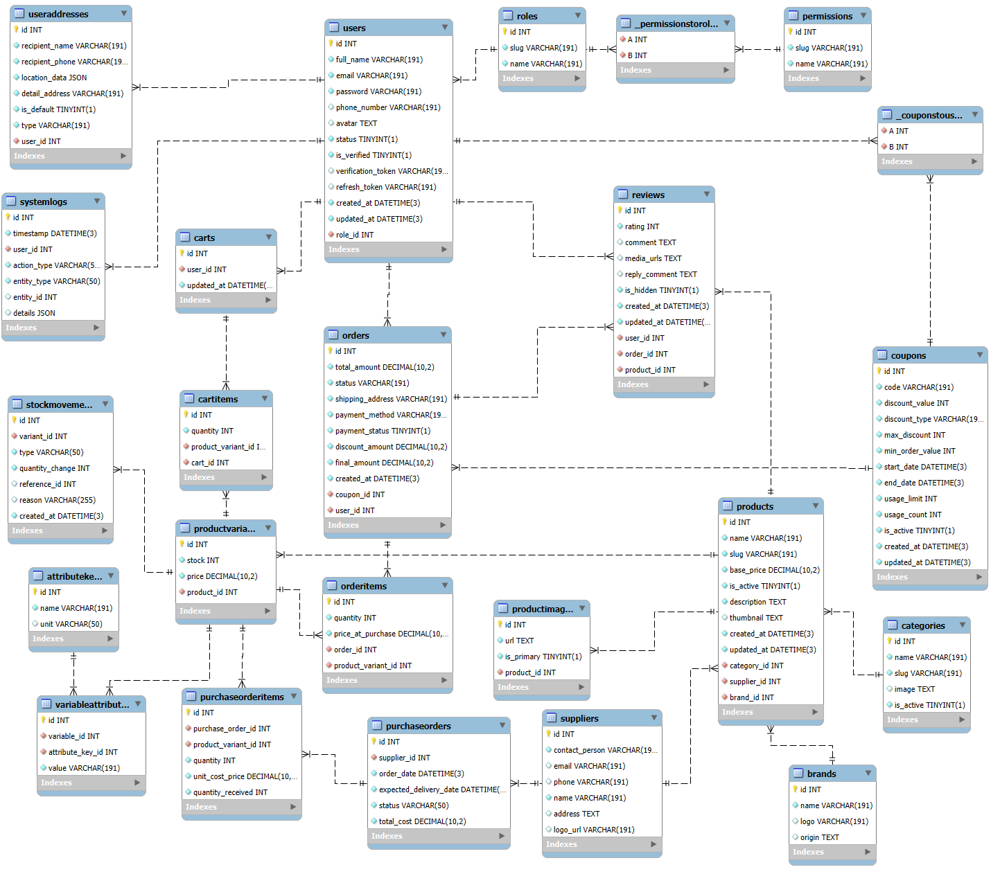

<p align="center">
  
</p>

<h1 align="center">TÀI LIỆU NGUỒN — HỆ THỐNG THƯƠNG MẠI ĐIỆN TỬ SPORTNEXUS</h1>

<p align="center">
  <strong>Tài liệu phân tích & thiết kế chi tiết toàn bộ hệ thống</strong><br>
  Dùng làm cơ sở để biên soạn báo cáo đồ án / khóa luận (~100 trang)
</p>

---

# CHƯƠNG MỞ ĐẦU

## 0.1 Về tài liệu này

Tài liệu này là **nguồn dữ liệu kỹ thuật và nghiệp vụ** đầy đủ của hệ thống SportNexus, được khảo sát trực tiếp từ mã nguồn. Mục đích cung cấp mọi thông tin cần thiết (kiến trúc, công nghệ, mô hình dữ liệu, từng module chức năng, quy trình nghiệp vụ, bảo mật, triển khai, hạn chế) để người viết có thể triển khai thành một quyển báo cáo khoa học hoàn chỉnh.

**Cách sử dụng:** Mỗi mục trong tài liệu tương ứng với nội dung có thể đưa vào một phần (hoặc một chương) của báo cáo. Số liệu, tên hàm, tên bảng, endpoint được ghi chính xác từ mã nguồn — chỉ cần chuyển đổi ngôn ngữ sang văn phong báo cáo.

## 0.2 Cấu trúc tài liệu

| Chương | Nội dung |
|--------|----------|
| Chương 1 | Giới thiệu đề tài (bối cảnh, mục tiêu, phạm vi) |
| Chương 2 | Cơ sở lý thuyết & công nghệ |
| Chương 3 | Phân tích hệ thống (yêu cầu, use case, vai trò) |
| Chương 4 | Thiết kế kiến trúc tổng thể |
| Chương 5 | Thiết kế cơ sở dữ liệu |
| Chương 6 | Thiết kế chi tiết Backend |
| Chương 7 | Thiết kế chi tiết Frontend |
| Chương 8 | Triển khai & kiểm thử |
| Chương 9 | Đánh giá & hướng phát triển |
| Chương 10 | Kết luận |

---

# CHƯƠNG 1. GIỚI THIỆU ĐỀ TÀI

## 1.1 Bối cảnh và lý do chọn đề tài

Thương mại điện tử đã trở thành một phần không thể thiếu của nền kinh tế hiện đại. Các cửa hàng bán lẻ, đặc biệt trong lĩnh vực **thể thao**, đang chuyển dần sang mô hình bán hàng trực tuyến để mở rộng thị trường, tối ưu chi phí vận hành và nâng cao trải nghiệm khách hàng.

SportNexus được phát triển nhằm xây dựng một **nền tảng thương mại điện tử chuyên biệt cho ngành thể thao**, đáp ứng đầy đủ chuỗi nghiệp vụ: quản lý sản phẩm (đa biến thể, thuộc tính), giỏ hàng, đặt hàng, thanh toán đa phương thức, vận chuyển, hóa đơn, tồn kho và báo cáo thống kê.

## 1.2 Mục tiêu của đề tài

1. Xây dựng một **website bán hàng** (frontend) hiện đại, thân thiện, responsive cho khách hàng.
2. Xây dựng **hệ thống quản trị** (admin) cho nhân viên vận hành.
3. Phát triển **API backend** hoàn chỉnh phục vụ cả website lẫn hệ thống quản trị.
4. Thiết kế **cơ sở dữ liệu quan hệ** chuẩn hóa.
5. Áp dụng các cơ chế **bảo mật**: xác thực JWT, phân quyền RBAC, mã hóa mật khẩu.
6. Tích hợp các **dịch vụ bên ngoài**: lưu trữ đám mây, gửi email, cổng thanh toán.

## 1.3 Phạm vi của đề tài

**Phạm vi bao gồm:**

- Website công khai: trang chủ, danh mục sản phẩm, tìm kiếm, chi tiết sản phẩm (chọn biến thể), giỏ hàng, thanh toán, theo dõi đơn hàng/vận đơn, hóa đơn, đánh giá, khuyến mãi, tài khoản khách hàng.
- Hệ thống quản trị: dashboard thống kê, quản lý người dùng & phân quyền, sản phẩm, biến thể, danh mục, thương hiệu, nhà cung cấp, coupon, đơn hàng, phiếu nhập, tồn kho, hóa đơn, vận đơn, nhật ký hệ thống.
- Khả năng nhập/xuất dữ liệu qua Excel.

**Phạm vi ngoài (không bao gồm):**

- Phát triển ứng dụng di động native.
- Tích hợp giao dịch thực tế với các sàn thương mại điện tử lớn.
- Hệ thống thanh toán quốc tế đầy đủ (chỉ mô phỏng + PayOS).

## 1.4 Đối tượng sử dụng

| Nhóm người dùng | Vai trò |
|-----------------|---------|
| Khách vãng lai | Duyệt sản phẩm, đặt hàng không cần đăng nhập |
| Khách hàng | Mua hàng, quản lý đơn, đánh giá, hóa đơn |
| Nhân viên bán hàng (sales_staff) | Quản lý đơn hàng, coupon, đánh giá |
| Quản lý kho (warehouse_manager) | Quản lý sản phẩm, danh mục, tồn kho |
| Nhân viên thu mua (purchasing_staff) | Quản lý nhà cung cấp, phiếu nhập |
| Quản trị viên (admin) | Toàn quyền, quản lý hệ thống & phân quyền |

---

# CHƯƠNG 2. CƠ SỞ LÝ THUYẾT VÀ CÔNG NGHỆ

## 2.1 Mô hình Client – Server

Hệ thống tuân theo mô hình **client–server**:

- **Client** (frontend): chịu trách nhiệm giao diện người dùng, định tuyến, gọi API.
- **Server** (backend): chịu trách nhiệm xác thực, xử lý nghiệp vụ, truy cập dữ liệu.
- **Giao tiếp** qua HTTP với định dạng JSON, sử dụng RESTful API.

## 2.2 Kiến trúc 3 lớp (Three-Layer Architecture)

Backend tổ chức theo 3 lớp rõ ràng:

1. **Controller layer** (`controllers/`): nhận request từ route, gọi service, trả response.
2. **Service layer** (`services/`): chứa toàn bộ logic nghiệp vụ, thao tác với Prisma.
3. **Data layer**: Prisma ORM truy cập MySQL.

Kiến trúc này giúp tách biệt HTTP concerns khỏi business logic, dễ bảo trì, dễ kiểm thử.

## 2.3 Công nghệ Frontend

### 2.3.1 React 19
- Thư viện JavaScript xây dựng giao diện người dùng theo thành phần (component).
- Sử dụng **lazy loading** cho các route để tối ưu hiệu năng.

### 2.3.2 Vite
- Bundler và development server thế hệ mới, khởi động nhanh, HMR (Hot Module Replacement) mượt mà.

### 2.3.3 React Router 7
- Thư viện định tuyến cho ứng dụng React SPA.
- Hỗ trợ **data loaders** — nạp dữ liệu trước khi render route, server-driven navigation.

### 2.3.4 TanStack Query
- Thư viện quản lý **state phía server** (server state).
- Cung cấp cache, refetch, invalidation — giảm đáng kể code quản lý trạng thái tải dữ liệu.

### 2.3.5 Tailwind CSS
- Framework CSS **utility-first**, thiết kế giao diện nhanh, responsive.

### 2.3.6 Các thư viện hỗ trợ khác
- `react-hook-form` + `zod`: quản lý form & validation.
- `i18next` (`react-i18next`): đa ngôn ngữ (vi/en).
- `lucide-react`: icon.
- `swiper`: carousel.
- `sonner`: thông báo toast.
- `axios`: HTTP client.
- `dayjs`: xử lý thời gian.
- `clsx` + `tailwind-merge`: gộp class có điều kiện.

## 2.4 Công nghệ Backend

### 2.4.1 Node.js & Express 5
- **Express 5**: framework web cho Node.js, nhẹ và linh hoạt, xử lý middleware & routing.

### 2.4.2 Prisma ORM
- ORM hiện đại cho Node.js/TypeScript.
- **Schema-first**: khai báo model trong `schema.prisma` — là **nguồn chuẩn** của cấu trúc DB.
- Tự sinh Prisma Client, hỗ trợ transaction, query linh hoạt.

### 2.4.3 MySQL
- Hệ quản trị cơ sở dữ liệu quan hệ, được sử dụng để lưu trữ toàn bộ dữ liệu nghiệp vụ.

### 2.4.4 JWT (JSON Web Token)
- Chuẩn xác thực token-based, gồm **Access Token** (ngắn hạn) và **Refresh Token** (dài hạn).

### 2.4.5 Các thư viện hỗ trợ
- `joi`: validation request.
- `bcrypt`: mã hóa mật khẩu.
- `jsonwebtoken`: tạo/xác minh JWT.
- `multer` + `sharp`: xử lý upload ảnh.
- `@supabase/supabase-js`: lưu trữ đám mây.
- `nodemailer` + `ejs`: gửi email với template.
- `exceljs`: xuất/nhập Excel.
- `@payos/node`: tích hợp cổng thanh toán PayOS.
- `google-auth-library`: đăng nhập Google.
- `slugify`: tạo slug tiếng Việt.
- `adm-zip`: xử lý file nén.

## 2.5 Các khái niệm nghiệp vụ

- **Biến thể sản phẩm (Product Variant)**: sản phẩm có nhiều phiên bản khác nhau (màu sắc, kích thước...), mỗi biến thể có giá và tồn kho riêng.
- **Thuộc tính (Attribute Key)**: đơn vị mô tả đặc tính (vd "Màu sắc", "Kích thước").
- **Coupon**: mã giảm giá, giảm theo số tiền (CASH) hoặc phần trăm (PERCENTAGE).
- **Soft delete**: xóa mềm — đánh dấu `deleted_at` thay vì xóa hẳn bản ghi.
- **RBAC**: phân quyền dựa trên vai trò (Role-Based Access Control).

---

# CHƯƠNG 3. PHÂN TÍCH HỆ THỐNG

## 3.1 Yêu cầu chức năng — Website khách hàng

### 3.1.1 Nhóm: Xác thực
| Mã | Yêu cầu | Mô tả |
|----|---------|-------|
| UC-A1 | Đăng ký | Tạo tài khoản bằng email, gửi link xác minh |
| UC-A2 | Đăng nhập | Bằng email/số điện thoại + mật khẩu |
| UC-A3 | Đăng nhập xã hội | Google, Facebook |
| UC-A4 | Quên mật khẩu | Gửi email đặt lại mật khẩu |
| UC-A5 | Đăng xuất | Hủy refresh token |
| UC-A6 | Đổi mật khẩu | Khi đã đăng nhập |

### 3.1.2 Nhóm: Mua sắm
| Mã | Yêu cầu | Mô tả |
|----|---------|-------|
| UC-B1 | Duyệt sản phẩm | Trang chủ, danh sách, chi tiết |
| UC-B2 | Lọc & tìm kiếm | Theo danh mục, thương hiệu, giá, thuộc tính; tìm theo từ khóa |
| UC-B3 | Chọn biến thể | Chọn tổ hợp màu sắc/kích thước còn hàng |
| UC-B4 | Giỏ hàng | Thêm/sửa/xóa, đồng bộ local ↔ server |
| UC-B5 | Checkout | Điền thông tin, chọn địa chỉ, chọn thanh toán |
| UC-B6 | Áp coupon | Kiểm tra & áp mã giảm giá |
| UC-B7 | Đặt hàng | Tạo đơn, trừ tồn kho, tạo hóa đơn & vận đơn |
| UC-B8 | Thanh toán | COD, chuyển khoản (PayOS/Casso/QR) |
| UC-B9 | Theo dõi đơn | Tra cứu vận đơn không cần đăng nhập |

### 3.1.3 Nhóm: Hậu mãi & tài khoản
| Mã | Yêu cầu | Mô tả |
|----|---------|-------|
| UC-C1 | Quản lý hồ sơ | Sửa thông tin, avatar |
| UC-C2 | Sổ địa chỉ | CRUD địa chỉ giao hàng, đặt mặc định |
| UC-C3 | Xem đơn hàng | Danh sách & chi tiết, trạng thái |
| UC-C4 | Đánh giá | Đánh giá sản phẩm sau khi nhận hàng |
| UC-C5 | Hóa đơn | Xem danh sách & chi tiết hóa đơn |
| UC-C6 | Yêu thích | Wishlist (lưu local) |
| UC-C7 | Coupon đã lưu | Lưu mã giảm giá, xem mã được tặng |
| UC-C8 | Lịch sử tìm kiếm | Ghi nhớ & xóa từ khóa |
| UC-C9 | Hỗ trợ | Gửi yêu cầu qua email |

## 3.2 Yêu cầu chức năng — Hệ thống quản trị

| Mã | Module | Yêu cầu |
|----|--------|---------|
| UC-M1 | Dashboard | Thống kê doanh thu, đơn hàng, khách hàng, sản phẩm, tồn kho, coupon, supplier, review, hệ thống |
| UC-M2 | Người dùng | CRUD, gán vai trò, gán quyền, import/export Excel |
| UC-M3 | Phân quyền | Quản lý role & permission theo module |
| UC-M4 | Sản phẩm | CRUD sản phẩm + biến thể + hình ảnh + thuộc tính |
| UC-M5 | Danh mục | CRUD, import/export Excel |
| UC-M6 | Thương hiệu | CRUD, import/export Excel |
| UC-M7 | Nhà cung cấp | CRUD, import/export Excel |
| UC-M8 | Coupon | CRUD, tặng mã, import/export |
| UC-M9 | Đơn hàng | Tạo, sửa, cập nhật trạng thái |
| UC-M10 | Phiếu nhập | Lập phiếu nhập từ nhà cung cấp |
| UC-M11 | Tồn kho | Nhập kho, xuất kho, điều chỉnh, xem tồn |
| UC-M12 | Hóa đơn | Phát hành & quản lý hóa đơn |
| UC-M13 | Vận đơn | Mô phỏng vận chuyển GHN, theo dõi |
| UC-M14 | Đánh giá | Duyệt/ẩn đánh giá |
| UC-M15 | Nhật ký | Theo dõi hoạt động hệ thống |

## 3.3 Yêu cầu phi chức năng

| Nhóm | Yêu cầu |
|-------|---------|
| Bảo mật | Xác thực JWT, phân quyền RBAC, mã hóa mật khẩu, validation đầu vào |
| Hiệu năng | Lazy loading, caching dữ liệu, phân trang |
| Khả năng mở rộng | Kiến trúc phân lớp, tách client/server |
| Khả năng bảo trì | Mã nguồn có cấu trúc rõ ràng, quy ước đặt tên |
| Đa ngôn ngữ | Hỗ trợ tiếng Việt và tiếng Anh |
| Responsive | Giao diện thích ứng mobile/tablet/desktop |

## 3.4 Đặc tả use case — ví dụ: "Đặt hàng"

**Tác nhân:** Khách hàng (đã đăng nhập hoặc vãng lai).

**Tiền điều kiện:** Giỏ hàng có sản phẩm, đã điền thông tin.

**Luồng chính:**
1. Người dùng mở trang Checkout với các sản phẩm đã chọn.
2. Điền/ chọn email, tên, số điện thoại, địa chỉ giao hàng.
3. Chọn phương thức thanh toán (COD / online).
4. Hệ thống tính phí vận chuyển động theo tỉnh thành.
5. Người dùng nhập mã coupon (tùy chọn) — hệ thống kiểm tra.
6. Nhấn "Đặt hàng".
7. Hệ thống tạo đơn hàng, trừ tồn kho, tạo hóa đơn, tạo vận đơn.
8. Gửi email xác nhận. Nếu thanh toán online → chuyển hướng cổng thanh toán.

**Hậu điều kiện:** Đơn hàng tồn tại với trạng thái Processing, vận đơn được tạo.

---

# CHƯƠNG 4. THIẾT KẾ KIẾN TRÚC TỔNG THỂ

## 4.1 Sơ đồ kiến trúc tổng thể

```
                  ┌─────────────────────────────────────┐
                  │          FRONTEND (client/)          │
                  │  React 19 + Vite  ·  React Router     │
                  │  TanStack Query  ·  Tailwind CSS      │
                  └───────────────────┬──────────────────┘
                                      │ HTTP / JWT / JSON
                                      ▼
                  ┌─────────────────────────────────────┐
                  │        BACKEND (server/)             │
                  │  Express 5 API  (/api/v1)            │
                  │  Routes → Controllers → Services     │
                  │  Middleware: verifyToken/checkPerm   │
                  │  Validators (Joi)                    │
                  └──────┬───────────────┬──────────────┘
                         │               │
            ┌────────────▼───┐   ┌───────▼──────────────┐
            │   MySQL        │   │  External Services   │
            │   (Prisma ORM) │   │  Supabase · SMTP     │
            └────────────────┘   │  PayOS · Casso       │
                                 │  Google · Facebook   │
                                 └──────────────────────┘
```

## 4.2 Các thành phần

1. **Frontend (React SPA):** giao diện người dùng, định tuyến, quản lý state.
2. **Backend API (Express):** xử lý HTTP, xác thực, nghiệp vụ.
3. **Database (MySQL qua Prisma):** lưu trữ dữ liệu.
4. **Dịch vụ ngoài:** Supabase Storage (ảnh), Nodemailer (email), PayOS (thanh toán), Casso (webhook ngân hàng), Google/Facebook (OAuth).

## 4.3 Luồng xử lý request tổng quát

1. Frontend gửi request HTTP đến backend (`VITE_API_URL`).
2. Express xử lý qua middleware (CORS, JSON, locale).
3. Route match → áp middleware bảo vệ (`verifyToken`, `checkPermission`, `validate`).
4. Controller gọi Service.
5. Service thực hiện nghiệp vụ + truy cập DB qua Prisma.
6. Trả response JSON về frontend.

## 4.4 Phân lớp mã nguồn Backend

```
routes/        →  định nghĩa endpoint + middleware
controllers/   →  nhận request, gọi service, trả response
services/      →  logic nghiệp vụ, thao tác Prisma
validators/    →  Joi schema validation
middlewares/   →  xác thực, phân quyền, upload, log
configs/       →  cấu hình dịch vụ ngoài
utils/         →  tiện ích dùng chung
views/emails/  →  template email (EJS)
db/            →  kết nối Prisma
locales/       →  i18n backend
```

## 4.5 Phân lớp mã nguồn Frontend

```
routes/        →  định nghĩa cây route (web/auth/admin)
pages/         →  các trang (Home, Products, Admin...)
components/    →  component dùng chung (UI kit)
api/           →  lớp gọi API (axios)
loaders/       →  data loaders (React Router)
contexts/      →  Cart, Wishlist, Coupon
hooks/         →  custom hooks
lib/           →  axios client, i18n, react-query
locales/       →  file ngôn ngữ
constants/     →  cấu hình (menu, trạng thái, quyền)
layouts/       →  AdminLayout, AuthLayout
utils/         →  tiện ích
```

---

# CHƯƠNG 5. THIẾT KẾ CƠ SỞ DỮ LIỆU

> **Nguồn chuẩn:** `server/prisma/schema.prisma`.

**Sơ đồ ERD tổng thể của hệ thống:**

<p align="center">
  
  <br><em>Hình 5.1 — Sơ đồ quan hệ cơ sở dữ liệu SportNexus</em>
</p>

## 5.1 Tổng quan các bảng

| Nhóm | Bảng | Ghi chú |
|------|------|---------|
| Identity | `permissions`, `roles`, `users`, `useraddresses` | Phân quyền & người dùng |
| Catalog | `categories`, `brands`, `suppliers` | |
| Sản phẩm | `products`, `productimages`, `productvariants`, `attributekeys`, `variableattributes`, `productattributekeys` | |
| Bán hàng | `carts`, `cartitems`, `orders`, `orderitems`, `coupons`, `user_coupons`, `reviews` | |
| Thanh toán | `invoices`, `payment_transactions` | |
| Vận chuyển | `shipments` | |
| Kho | `stockmovements`, `purchaseorders`, `purchaseorderitems` | |
| Audit | `systemlogs` | |

## 5.2 Chi tiết từng bảng

### 5.2.1 `permissions`
| Cột | Kiểu | Mô tả |
|-----|------|-------|
| id | Int (PK) | Khóa chính |
| slug | String (unique) | Mã quyền, vd `them-san-pham` |
| name | String | Tên quyền tiếng Việt |
| module | String | Nhóm module, vd `products` |
| action | String | Hành động, vd `them`, `sua`, `xoa`, `xem` |

Quan hệ: N-N với `roles` (qua mối quan hệ implicit), N-N với `users`.

### 5.2.2 `roles`
| Cột | Kiểu | Mô tả |
|-----|------|-------|
| id | Int (PK) | Khóa chính |
| slug | String (unique) | `admin`, `sales_staff`, `warehouse_manager`, `purchasing_staff`, `customer` |
| name | String | Tên vai trò |

### 5.2.3 `users`
| Cột | Kiểu | Mô tả |
|-----|------|-------|
| id | Int (PK) | |
| full_name | String | Họ tên |
| email | String | Email (unique cùng deleted_at) |
| password | String | Mật khẩu (bcrypt hash) |
| phone_number | String? | SĐT |
| avatar | Text? | Ảnh đại diện |
| status | Boolean | Active/blocked (mặc định true) |
| is_verified | Boolean | Đã xác minh email |
| verification_token | String? | Token xác minh/đặt lại mật khẩu |
| refresh_token | String? | JWT refresh |
| created_at / updated_at | DateTime | Thời gian |
| deleted_at | DateTime | Soft delete (mặc định `1000-01-01`) |
| role_id | Int (FK) | → roles |

Quan hệ: 1-N tới `useraddresses`, `orders`, `carts`, `reviews`, `systemlogs`; N-N tới `coupons`, `permissions`.

### 5.2.4 `useraddresses`
| Cột | Kiểu | Mô tả |
|-----|------|-------|
| id | Int (PK) | |
| recipient_name / recipient_phone | String | Người nhận |
| location_data | Json | {province, ward...} |
| detail_address | String | Địa chỉ chi tiết |
| is_default | Boolean | Địa chỉ mặc định |
| type | String | Loại |
| user_id | Int (FK) | → users |

### 5.2.5 `categories`
| Cột | Kiểu | Mô tả |
|-----|------|-------|
| id | Int (PK) | |
| name | String | Tên danh mục |
| slug | String (unique + deleted_at) | |
| image | Text? | Ảnh |
| is_active | Boolean | |
| deleted_at | DateTime | Soft delete |

### 5.2.6 `brands`
| Cột | Kiểu | Mô tả |
|-----|------|-------|
| id | Int (PK) | |
| name | String | |
| logo | String? | |
| origin | Text? | Xuất xứ |
| deleted_at | DateTime | Soft delete |

### 5.2.7 `suppliers`
| Cột | Kiểu | Mô tả |
|-----|------|-------|
| id | Int (PK) | |
| contact_person | String | Người liên hệ |
| email / phone | String? | |
| name | String (unique + deleted_at) | |
| location_data | Json | Vị trí |
| logo_url | String? | |
| deleted_at | DateTime | |

### 5.2.8 `products`
| Cột | Kiểu | Mô tả |
|-----|------|-------|
| id | Int (PK) | |
| name | String | |
| slug | String (unique + deleted_at) | |
| base_price | Decimal(10,2) | Giá cơ sở |
| is_active | Boolean | |
| description | Text | Mô tả |
| thumbnail | Text? | Ảnh đại diện |
| created_at / updated_at | DateTime | |
| deleted_at | DateTime | |
| category_id / supplier_id / brand_id | Int (FK) | |

Quan hệ: 1-N tới `productimages`, `productvariants`, `productattributekeys`, `reviews`.

### 5.2.9 `productimages`
| Cột | Kiểu | Mô tả |
|-----|------|-------|
| id | Int (PK) | |
| url | Text | Đường dẫn ảnh |
| is_primary | Boolean | Ảnh chính |
| product_id | Int (FK) | |

### 5.2.10 `productvariants`
| Cột | Kiểu | Mô tả |
|-----|------|-------|
| id | Int (PK) | |
| stock | Int | Tồn kho |
| price | Decimal(10,2) | Giá biến thể |
| deleted_at | DateTime | |
| product_id | Int (FK) | |

Quan hệ: 1-N tới `variableattributes`, `orderitems`, `cartitems`, `stockmovements`, `purchaseorderitems`.

### 5.2.11 `attributekeys`
| Cột | Kiểu | Mô tả |
|-----|------|-------|
| id | Int (PK) | |
| name | String (unique) | Tên thuộc tính, vd "Màu sắc" |
| unit | VarChar(50)? | Đơn vị |

### 5.2.12 `variableattributes`
| Cột | Kiểu | Mô tả |
|-----|------|-------|
| id | Int (PK) | |
| variable_id | Int (FK) | → productvariants |
| attribute_key_id | Int (FK) | → attributekeys |
| value | VarChar(191) | Giá trị, vd "Đỏ" |

Unique: `(variable_id, attribute_key_id)`.

### 5.2.13 `productattributekeys`
Liên kết sản phẩm với thuộc tính mô tả chung (chất liệu, xuất xứ...). Unique `(product_id, attribute_key_id)`.

### 5.2.14 `coupons`
| Cột | Kiểu | Mô tả |
|-----|------|-------|
| id | Int (PK) | |
| code | String (unique) | Mã giảm giá |
| discount_value | Int | Giá trị giảm |
| discount_type | DiscountType | CASH / PERCENTAGE |
| max_discount | Int | Giảm tối đa (cho %) |
| min_order_value | Int | Đơn tối thiểu |
| start_date / end_date | DateTime | Thời gian hiệu lực |
| usage_limit | Int | Số lượt tối đa |
| usage_count | Int (default 0) | Đã dùng |
| is_active | Boolean | |
| max_uses_per_user | Int (default 1) | Giới hạn mỗi user |
| deleted_at | DateTime | |

### 5.2.15 `user_coupons`
Ghi nhận coupon mà user sở hữu/đã dùng. Có cờ `is_gift` (coupon được tặng), `used_count`. Unique `(user_id, coupon_id)`.

### 5.2.16 `orders`
| Cột | Kiểu | Mô tả |
|-----|------|-------|
| id | Int (PK) | |
| total_amount | Decimal | Tổng tiền hàng |
| status | OrderStatus | Processing/Shipping/Delivered/Cancelled/Refunded |
| shipping_address | String | Địa chỉ giao |
| payment_method | PaymentMethod | COD/BANK_TRANSFER/MOMO/VNPAY/CREDIT_CARD |
| payment_status | PaymentStatus | Pending/Paid/Failed/Refunded |
| discount_amount | Decimal | Tiền giảm |
| final_amount | Decimal | Tổng sau giảm |
| coupon_code | String? (FK) | → coupons.code |
| user_email | String? | Email khách (vãng lai) |
| usersId | Int? (FK) | → users |
| created_at | DateTime | |

Quan hệ: 1-N tới `orderitems`, `reviews`, `payment_transactions`, `shipments`; 1-1 tới `invoices`.

### 5.2.17 `orderitems`
| Cột | Kiểu | Mô tả |
|-----|------|-------|
| id | Int (PK) | |
| quantity | Int | Số lượng |
| price_at_purchase | Decimal | Giá tại thời điểm mua |
| order_id | Int (FK) | |
| product_variant_id | Int (FK) | |

### 5.2.18 `invoices`
| Cột | Kiểu | Mô tả |
|-----|------|-------|
| id | Int (PK) | |
| invoice_number | String (unique) | Số hóa đơn |
| order_id | Int (unique FK) | 1-1 với order |
| customer_name / email / phone | String | Thông tin khách |
| shipping_address | String | |
| subtotal | Decimal | Tiền hàng |
| discount_amount | Decimal | Giảm |
| vat_rate | Decimal (default 0.08) | Thuế VAT |
| vat_amount | Decimal | Tiền thuế |
| total_amount | Decimal | Tổng cộng |
| status | InvoiceStatus | Pending/Completed/Cancelled |
| issued_at / created_at / updated_at | DateTime | |
| note | Text? | |

### 5.2.19 `payment_transactions`
| Cột | Kiểu | Mô tả |
|-----|------|-------|
| id | Int (PK) | |
| order_id | Int (FK) | |
| method | PaymentMethod | |
| amount | Decimal | |
| status | PaymentStatus | |
| provider_ref | String? | Mã tham chiếu PayOS |
| transaction_code | String? | Nội dung chuyển khoản/QR |
| receipt_image_url | String? | Ảnh hóa đơn chuyển khoản |
| note | String? | |
| paid_at / created_at / updated_at | DateTime | |

### 5.2.20 `shipments`
| Cột | Kiểu | Mô tả |
|-----|------|-------|
| id | Int (PK) | |
| order_id | Int (FK) | |
| tracking_code | String (unique) | Mã vận đơn |
| service_type | String | FAST/ECONOMY |
| status | String | RECEIVED...DELIVERED |
| weight_grams | Int | |
| cod_amount / shipping_fee / cod_fee / insurance_fee / total_fee | Decimal | Phí |
| estimated_delivery / delivered_at | DateTime | |
| recipient_name / phone | String | |
| province_name / ward_name / detail_address | String | |
| timeline | Json | Các mốc trạng thái |
| created_at / updated_at | DateTime | |

### 5.2.21 `stockmovements`
| Cột | Kiểu | Mô tả |
|-----|------|-------|
| id | Int (PK) | |
| variant_id | Int (FK) | |
| type | TypeStock | IN/OUT/ADJUSTMENT |
| quantity_change | Int | Âm/dương |
| reference_id | Int? | Tham chiếu (order/purchase) |
| reason | VarChar(255)? | Lý do |
| created_at | DateTime | |

### 5.2.22 `purchaseorders`
| Cột | Kiểu | Mô tả |
|-----|------|-------|
| id | Int (PK) | |
| supplier_id | Int (FK) | |
| order_date | DateTime | |
| expected_delivery_date | DateTime | |
| status | StatusPurchaseOrders | PENDING/RECEIVED/PARTIALLY_RECEIVED/CANCELLED |
| total_cost | Decimal | |

### 5.2.23 `purchaseorderitems`
| Cột | Kiểu | Mô tả |
|-----|------|-------|
| id | Int (PK) | |
| purchase_order_id | Int (FK) | |
| product_variant_id | Int (FK) | |
| quantity | Int | |
| unit_cost_price | Decimal | |
| quantity_received | Int (default 0) | |

### 5.2.24 `reviews`
| Cột | Kiểu | Mô tả |
|-----|------|-------|
| id | Int (PK) | |
| rating | Int | 1-5 |
| comment | Text? | |
| media_urls | Json | Ảnh đánh giá |
| reply_comment | Text? | Phản hồi |
| is_hidden | Boolean | Ẩn/hiện |
| user_id / order_id / product_id | Int (FK) | |

### 5.2.25 `systemlogs`
| Cột | Kiểu | Mô tả |
|-----|------|-------|
| id | Int (PK) | |
| timestamp | DateTime | |
| user_id | Int? (FK) | |
| action_type | VarChar(50) | CREATE/UPDATE/DELETE... |
| entity_type | VarChar(50) | ProductVariants/Orders... |
| entity_id | Int? | |
| status | LogStatus | SUCCESS/FAILED |
| ip_address | VarChar(45)? | |
| details | Json? | Chi tiết thay đổi |

## 5.3 Các enum

| Enum | Giá trị |
|------|---------|
| OrderStatus | Processing, Shipping, Delivered, Cancelled, Refunded |
| PaymentMethod | COD, BANK_TRANSFER, MOMO, VNPAY, CREDIT_CARD |
| PaymentStatus | Pending, Paid, Failed, Refunded |
| InvoiceStatus | Pending, Completed, Cancelled |
| DiscountType | CASH, PERCENTAGE |
| TypeStock | IN, OUT, ADJUSTMENT |
| StatusPurchaseOrders | PENDING, RECEIVED, PARTIALLY_RECEIVED, CANCELLED |
| LogStatus | SUCCESS, FAILED |

## 5.4 Cơ chế Soft Delete

Hệ thống sử dụng **soft delete** với cột `deleted_at`:
- Bản ghi "hoạt động" có `deleted_at = '1000-01-01 00:00:00'` (hằng số `ACTIVE` trong `utils/prisma.js`).
- Khi xóa → set `deleted_at = new Date()`.
- Các query mặc định lọc `deleted_at: ACTIVE`.
- Unique key kết hợp `deleted_at` (vd `@@unique([slug, deleted_at])`) cho phép tạo lại bản ghi cùng slug sau khi xóa.

## 5.5 Quan hệ quan trọng (đọc nhanh)

- `users` N-N `permissions` (quyền trực tiếp), `users` N-1 `roles`.
- `products` 1-N `productvariants`; `productvariants` N-N `attributekeys` qua `variableattributes`.
- `orders` 1-N `orderitems` → `productvariants`.
- `orders` 1-1 `invoices`; `orders` 1-N `payment_transactions`, `shipments`.
- `productvariants` 1-N `stockmovements`, `purchaseorderitems`.

---

# CHƯƠNG 6. THIẾT KẾ CHI TIẾT BACKEND

## 6.1 Xác thực (Authentication)

### 6.1.1 Luồng đăng nhập
1. User gửi `{ username, password }` (username = email hoặc SĐT).
2. Service tìm user (`deleted_at: ACTIVE`, OR email/phone).
3. Kiểm tra tồn tại (404), bị khóa (403), mật khẩu đúng (401).
4. Tạo **Access Token** (JWT, 15 phút) với payload `{id, role, email}`.
5. Tạo **Refresh Token** (JWT, 7 ngày), lưu vào DB.
6. Trả `{ user, accessToken }` (xoá password, verification_token khỏi response).

### 6.1.2 Refresh Token
- Client gửi refresh token → server verify với `JWT_REFRESH_SECRET`.
- Kiểm tra khớp token lưu trong DB.
- Tạo access token mới. Nếu refresh hết hạn → xóa token trong DB, yêu cầu đăng nhập lại.

### 6.1.3 Đăng ký & xác minh
- Đăng ký tạo user + gửi email welcome kèm link xác minh.
- `verifyAccount(token)` → set `is_verified = true`, xóa token.
- Mật khẩu hash bằng bcrypt (10 rounds).

### 6.1.4 Quên / đặt lại mật khẩu
- `forgotPassword(email)`: tạo token ngẫu nhiên, lưu vào `verification_token`, gửi email link.
- `resetPassword(token, password)`: kiểm tra token, hash mật khẩu mới, xóa token.

### 6.1.5 Đăng nhập xã hội
- **Google:** nhận access_token → gọi Google userinfo API → lấy email/name/picture → tìm/ tạo user với vai trò `customer`.
- **Facebook:** verify token qua Graph API → lấy thông tin → tìm/tạo user.
- Cả hai: nếu user mới, tạo mật khẩu giả ngẫu nhiên.

### 6.1.6 Đổi mật khẩu
- Kiểm tra mật khẩu hiện tại (bcrypt.compare), hash mật khẩu mới.

## 6.2 Phân quyền (Authorization)

### 6.2.1 Middleware
| Middleware | Chức năng |
|------------|-----------|
| `verifyToken` | Xác thực JWT, nạp user + role + permissions vào `req.user` |
| `checkPermission(slug)` | Kiểm tra user có slug quyền trong `permissionSlugs` |
| `isAdmin` | Chỉ chấp nhận role `admin` hoặc tên "Quản trị viên" |
| `verifyTokenOptional` | Xác thực tùy chọn (không bắt buộc) |

### 6.2.2 Hệ thống vai trò & quyền

**Các vai trò mặc định (`ROLE_DEFAULT_PERMISSIONS`):**

| Vai trò | Danh sách quyền mặc định |
|---------|--------------------------|
| **admin** | `[]` (rỗng — kiểm soát riêng qua isAdmin) |
| **sales_staff** | them/sua/xem đơn hàng; them/sua/xem/tang mã giảm giá; them/sua/xem đánh giá; xem sản phẩm, biến thể, danh mục, thương hiệu |
| **warehouse_manager** | them/sua/xem sản phẩm, biến thể, danh mục, thương hiệu, thuộc tính, hình ảnh SP; them/sua/xem kho hàng |
| **purchasing_staff** | them/sua/xem nhà cung cấp, phiếu nhập; xem sản phẩm, biến thể, kho |
| **customer** | `[]` (chỉ dùng route công khai/customer) |

**Các quyền (permission) theo module:** được seed trong `server/prisma/data/permissions.js` với cấu trúc `{slug, name, module, action}` cho các module: brands, categories, suppliers, users, coupons, stockmovements, products, productimages, productvariants, attributekeys, purchaseorders, orders, reviews...

**Cấu trúc liên kết:** `users → role → roles.permissions`, và `users.permissions` (quyền trực tiếp). `verifyToken` đọc thẳng mảng permissions của user để xây `permissionSlugs`.

## 6.3 Module Giỏ hàng (Cart)

### 6.3.1 Service methods
| Method | Chức năng |
|--------|-----------|
| `getOrCreateCart(userId)` | Tìm giỏ, không có thì tạo |
| `getCartWithItems(userId)` | Giỏ kèm chi tiết variant + thuộc tính |
| `syncCart(userId, items)` | Đồng bộ giỏ local → server (gộp trùng) |

### 6.3.2 Endpoint
| Method | Path | Mô tả |
|--------|------|-------|
| GET | `/customer/cart/` | Lấy giỏ (cần login) |
| POST | `/customer/cart/sync` | Đồng bộ giỏ |
| POST | `/customer/cart-item/` | Thêm item |
| GET | `/customer/cart-item/:id` | Chi tiết |
| PUT | `/customer/cart-item/:id` | Cập nhật số lượng |
| DELETE | `/customer/cart-item/:id` | Xóa |

## 6.4 Module Sản phẩm (Product)

### 6.4.1 Service methods (core/product.service.js)
| Method | Chức năng |
|--------|-----------|
| `createProduct` | Tạo sản phẩm + slug + connect danh mục/ncc/brand + upload thumbnail |
| `getProductById` / `getProductBySlug` | Chi tiết (web đầy đủ quan hệ) |
| `getAllProduct` | Danh sách quản trị (phân trang, lọc) |
| `searchProducts` | Tìm kiếm web (giá min, đánh giá) |
| `getProductsByIds` | Lấy theo danh sách id |
| `updateProduct` | Cập nhật + xóa thumbnail cũ |
| `deleteProduct` | Soft delete |

### 6.4.2 Luồng tạo sản phẩm hoàn chỉnh (qua nhiều endpoint)
1. `POST /core/product/` — tạo sản phẩm + thumbnail (tạo 1 ProductImage primary).
2. `POST /core/product-variant/` — tạo biến thể + `variableAttributes`.
3. `POST /core/product-image/` — upload nhiều ảnh (tối đa 10).
4. `POST /management/product-attribute-key/` — liên kết thuộc tính mô tả.

### 6.4.3 Endpoint
| Method | Path | Quyền |
|--------|------|-------|
| POST | `/core/product/` | CP("them-san-pham") |
| GET | `/core/product/all`, `/:id`, `/` | Public |
| PUT | `/core/product/:id` | (thiếu VT/CP — lưu ý) |
| DELETE | `/core/product/:id` | (thiếu VT/CP) |
| POST | `/core/product-variant/` | (thiếu VT/CP) |
| PUT/DELETE | `/core/product-variant/:id` | (thiếu VT/CP) |
| POST | `/core/product-image/` | (thiếu VT/CP) |

## 6.5 Module Danh mục / Thương hiệu / Nhà cung cấp

Các module quản trị CRUD với cấu trúc tương tự:
- **Category:** `/management/category/` (POST/PUT/DELETE có VT+CP, upload ảnh, import/export Excel riêng).
- **Brand:** `/management/brand/` (VT+CP, upload logo, import/export Excel).
- **Supplier:** `/management/supplier/` (VT+CP, upload logo, lọc tỉnh bằng raw SQL `JSON_EXTRACT`).

**Điểm nổi bật:** module Category dùng hệ thống import riêng (`categoryImport`) hỗ trợ upsert theo tên, batch transaction, trả file lỗi (errorFile TTL 30 phút).

## 6.6 Module Coupon (Khuyến mãi)

### 6.6.1 Logic giảm giá
- `CASH` → giảm đúng `discount_value`.
- `PERCENTAGE` → `amount * discount_value/100`, chặn `max_discount`.

### 6.6.2 Kiểm tra coupon (checkCoupon)
Kiểm tra lần lượt: tồn tại → is_active → trong thời hạn → chưa hết usage_limit → đạt min_order_value → chưa quá max_uses_per_user.

### 6.6.3 Endpoint
| Method | Path | Mô tả |
|--------|------|-------|
| POST | `/customer/coupon/check` | Kiểm tra (cần login) |
| GET | `/customer/coupon/gifted` | Coupon được tặng |
| POST | `/management/coupon/` | Tạo coupon |
| POST | `/management/coupon/gift` | Tặng coupon cho user |
| EX | `/management/coupon/...` | Import/export |

## 6.7 Module Đơn hàng (Order)

### 6.7.1 Luồng tạo đơn (`createOrder`) — chi tiết
1. Chặn coupon khi chưa đăng nhập (`COUPON_REQUIRES_LOGIN`).
2. Kiểm tra tồn kho từng variant (nếu thiếu → `INSUFFICIENT_STOCK`).
3. Sinh số hóa đơn `HD-{year}-{count+1}`.
4. **Trong transaction:**
   - Validate coupon (server-side): tồn tại, active, thời hạn, usage, min order.
   - Tính `discount_amount` qua `computeCouponDiscount`, `final_amount = total - discount`.
   - `userCoupons.upsert` + tăng `used_count` (kiểm tra `max_uses_per_user`).
   - Tính VAT: `vat = (subtotal - discount) * VAT_RATE` (mặc định 0.08).
   - Tạo `orders` + `OrderItems` (nested) + `invoice` (nested).
   - Tăng `usage_count` của coupon.
   - Trừ tồn kho từng variant.
   - Tạo shipment giả lập (nếu đủ thông tin người nhận + tỉnh).
5. Gửi email xác nhận đơn (best-effort).

### 6.7.2 Cập nhật đơn
- Thay thế toàn bộ OrderItems (deleteMany + create).
- `Cancelled` → hóa đơn chuyển Cancelled.
- `Delivered` → `markCodPaid` (nếu COD).

### 6.7.3 Endpoint
| Method | Path | Mô tả |
|--------|------|-------|
| POST | `/customer/order/` | Tạo đơn (verifyTokenOptional) |
| GET | `/customer/order/` | Danh sách (phân trang, lọc) |
| GET | `/customer/order/:id` | Chi tiết |
| GET | `/customer/order/email/:email` | Theo email |
| GET | `/customer/order/code/:code` | Theo mã coupon |
| PUT | `/customer/order/:id` | Cập nhật |
| DELETE | `/customer/order/:id` | Xóa |

## 6.8 Module Thanh toán (Payment)

### 6.8.1 Các phương thức
| Phương thức | Cách hoạt động |
|-------------|----------------|
| COD | Thanh toán khi nhận hàng; đánh dấu Paid khi giao thành công |
| BANK_TRANSFER | Chuyển khoản; nếu có PayOS → qua PayOS, nếu không → QR thủ công + chờ Casso webhook |
| MOMO / VNPAY / CREDIT_CARD | Qua PayOS (khi được cấu hình) |

### 6.8.2 Luồng tạo transaction
1. Tìm order.
2. Chọn provider (cod hoặc payos) dựa trên method + cấu hình.
3. Tạo `paymentTransactions` (status Pending).
4. Build returnUrl/cancelUrl.
5. Gọi provider `createPayment`.
6. Nếu chuyển khoản thủ công → sinh QR VietQR (`qr.service`).
7. Trả về checkoutUrl/QR/instructions.

### 6.8.3 Webhook
- **PayOS:** `POST /customer/payment/webhook/payos` — verify checksum, khớp `orderCode` = transaction id, set Paid.
- **Casso:** `POST /customer/payment/webhook/casso` — verify HMAC-SHA512 (header `x-casso-signature`), khớp nội dung chuyển khoản `SN{orderId}...` với `transaction_code` + đúng amount, set Paid (idempotent qua `provider_ref`).

### 6.8.4 QR VietQR (`qr.service.js`)
- Sinh content chuyển khoản `SN{orderId}{6 số cuối Date.now()}`.
- URL ảnh: `https://img.vietqr.io/image/{BANK_ID}-{BANK_ACCOUNT_NO}-qr_only.png?amount=...&addInfo=...`.
- Cần env `BANK_ACCOUNT_NO`, `BANK_NAME`, `BANK_ID`.

### 6.8.5 Endpoint
| Method | Path | Mô tả |
|--------|------|-------|
| GET | `/customer/payment/methods` | Danh sách phương thức |
| POST | `/customer/payment/orders/:orderId` | Tạo thanh toán |
| GET | `/customer/payment/orders/:orderId/transactions` | Lịch sử giao dịch |
| POST | `/customer/payment/transactions/:id/receipt` | Upload ảnh chuyển khoản |
| POST | `/customer/payment/webhook/payos` | Webhook PayOS |
| POST | `/customer/payment/webhook/casso` | Webhook Casso |

## 6.9 Module Vận chuyển (Shipping — GHN Simulator)

### 6.9.1 Dữ liệu cước (`shippingZone.data.js`)
- Cửa hàng đặt tại **Hà Nội**.
- 4 vùng: same (HN), north, central, south.
- Phí cơ bản theo vùng: 20k / 25k / 30k / 40k.
- Bậc cân nặng: 500g→0đ, 1kg→7k, 2kg→16k, 5kg→30k, 10kg→55k, +5k/kg ngoài 10kg.
- ECONOMY giảm 15%; COD fee 2% (tối thiểu 5k); bảo hiểm 0.5%.

### 6.9.2 Dịch vụ (`ghnSimulator.service.js`)
- `calculateFee`: tính shippingFee, codFee, insuranceFee, totalFee, estimateDays.
- `generateTrackingCode`: `SN` + 10 chữ số.
- `buildTimeline`: 5 mốc `RECEIVED → PICKED_UP → IN_TRANSIT → OUT_FOR_DELIVERY → DELIVERED`.
- `computeShipmentState` / `syncShipmentState`: cập nhật trạng thái theo thời gian thực.
- `createShipmentForOrder`: tự tạo vận đơn khi đặt hàng.

### 6.9.3 Endpoint
- `GET /customer/shipping/track/:code` — tra cứu (public, không cần login).
- `GET /customer/shipping/calculate` — tính phí.
- `GET /management/shipping/` — danh sách vận đơn (admin).

## 6.10 Module Đánh giá (Review)

### 6.10.1 Validation theo tầng
1. Order tồn tại → 2. thuộc sở hữu → 3. đã Delivered → 4. sản phẩm thuộc đơn → 5. chưa đánh giá.

### 6.10.2 Endpoint
| Method | Path | Mô tả |
|--------|------|-------|
| POST | `/customer/review/` | Tạo (verifyToken + upload ảnh) |
| PUT | `/customer/review/:id` | Sửa (xóa ảnh cũ) |
| GET | `/customer/review/product/:id` | Xem theo sản phẩm |
| DELETE | `/customer/review/:id` | Xóa |

## 6.11 Module Hóa đơn (Invoice)

- **Khách:** `GET /customer/invoice/` + `/:id` — khóa theo `req.user.email` (chống IDOR).
- **Quản trị:** `POST /management/invoice/` — tạo hóa đơn từ order (tính subtotal, VAT). `GET /` + `/:id`.

## 6.12 Module Nhập hàng & Tồn kho

### 6.12.1 Phiếu nhập (Purchase Order)
- Tạo phiếu + items (nested create).
- Cập nhật → thay thế toàn bộ items.
- Xóa → đổi status `CANCELLED`.

### 6.12.2 Nhập/Xuất kho (Stock)
- **Nhập kho** `POST /management/stock/import` (transaction): tăng stock từng variant + tạo `StockMovements` type IN + đổi phiếu nhập status RECEIVED.
- **Xuất kho** `POST /management/stock/export` (transaction): kiểm tra đủ stock, giảm stock + tạo StockMovements OUT + đơn chuyển Shipping.

### 6.12.3 Endpoint
| Method | Path | Mô tả |
|--------|------|-------|
| POST | `/management/purchase-order/` | Tạo phiếu nhập |
| GET | `/management/purchase-order/` | Danh sách |
| POST | `/management/stock/import` | Nhập kho (CP them-nhap-kho-hang) |
| POST | `/management/stock/export` | Xuất kho |
| GET | `/management/stock/` | Danh sách tồn |
| PUT/DELETE | `/management/stock/:id` | Sửa/xóa |

## 6.13 Module Dashboard (Thống kê)

Service dùng factory `createBusinessDashboardService` với 9 overview:

| Overview | Các metric chính |
|----------|------------------|
| **business** | Tổng doanh thu, tổng đơn, AOV, tỷ lệ thành công/hủy/hoàn, doanh thu theo trạng thái & phương thức thanh toán, xu hướng doanh thu |
| **product** | Tổng/active/inactive SP, thiếu ảnh/biến thể; SP mới; top bán chạy/doanh thu; phân phối theo danh mục/thương hiệu/NCC |
| **order** | Đơn theo 5 trạng thái, phương thức thanh toán, coupon stats, đơn gần đây, xu hướng đơn mới, top sản phẩm |
| **inventory** | Tổng tồn kho, tổng biến thể, giá trung bình, giá trị kho, biến động gần đây, theo loại |
| **customer** | Tổng/verified/unverified/active/blocked user; khách mua lặp lại, tỷ lệ mua lại, top khách |
| **coupon** | Tổng/active/inactive coupon, tổng lượt dùng, tỷ lệ dùng |
| **supplier** | Tổng NCC, tổng phiếu nhập, tổng chi phí nhập |
| **review** | Tổng đánh giá, điểm trung bình, phân phối sao |
| **system** | Tổng log, số user, loại action, log gần đây |

Endpoint: 9 route GET tại `/management/dashboard/...`, tất cả bảo vệ `verifyToken + isAdmin`.

## 6.14 Module Nhập/Xuất Excel (`excelCrudImport`)

### 6.14.1 Kiến trúc
```
excelCrudImport/
├── index.js       # Facade: generateTemplate / generateExport / previewImport / importFile
├── config.js      # Registry module config
├── columns.js     # Định nghĩa cột + map Việt ↔ enum
├── workbook.js    # ExcelJS: build/load workbook
├── builders.js    # buildSingleSheetModule / buildDualSheetModule
├── helpers.js     # Converter + resolveProductVariant
└── modules/       # 11 module cấu hình
```

### 6.14.2 Các module hỗ trợ
brands, suppliers, users, attributeKey, category, products, productVariants, coupons, orders (2 sheet), purchaseOrder (2 sheet), stockMovements (chỉ export).

### 6.14.3 Điểm nổi bật
- Module 2 sheet (orders, purchaseOrder) dựng hyperlink nội bộ cha-con.
- `resolveProductVariant` khớp sản phẩm + biến thể theo "chữ ký thuộc tính".
- Template hiển thị tiếng Việt, DB lưu enum tiếng Anh.

### 6.14.4 Endpoint
`/helpers/excel-crud-import/:module/...` — 4 endpoint: `POST /import/preview`, `POST /import`, `GET /export`, `GET /template`.

## 6.15 Module Nhật ký hệ thống (System Logs)

- Ghi log qua middleware `logAction` trên các thao tác CREATE/UPDATE/DELETE.
- Bắt response (wrap `res.json`), xác định SUCCESS/FAILED, ghi details thay đổi, IP.
- `GET /management/log/` + `/:id` — bảo vệ `verifyToken + isAdmin`.

## 6.16 Email service

| Hàm | Template | Nội dung |
|-----|----------|----------|
| `sendWelcomeEmail` | welcome.ejs | Chào mừng + link xác minh |
| `sendResetPasswordEmail` | forgot-password.ejs | Link đặt lại mật khẩu |
| `sendOrderConfirmationEmail` | order-confirmation.ejs | Xác nhận đơn (format VNĐ) |
| `sendOrderStatusUpdateEmail` | order-status-update.ejs | Cập nhật trạng thái đơn |
| `sendSupportEmail` | support.ejs | Gửi 2 mail (tự động + cho admin) |

## 6.17 Upload & xử lý ảnh

- `uploadFileToSupabase(fileBuffer, folderPath, namePrefix)`: dùng `sharp` resize 200x200 + chuyển webp quality 80, upload Supabase (`upsert`), trả public URL.
- Các thư mục: `user_avatars`, `logo_suppliers`, `logo_brands`, `image_categories`, `thumbnail_products`, `products_images/product_{id}`, `media_images/product_{id}`, `payment_receipts`, `new_media_review`.
- `deleteImage(recordId, model, field)`: xóa file Supabase theo URL hiện tại.
- Giới hạn: 5MB/file; `uploadProductImage` tối đa 10 ảnh, `uploadMediaImage` tối đa 5.

## 6.18 i18n Backend

- `localeMiddleware` đọc `accept-language` → đặt `req.lang` (chỉ vi/en, mặc định vi).
- `messages.js`: `enMessages` map (key là chuỗi tiếng Việt), `viMessages` sinh tự động, `t(req, key, params)` trả message theo ngôn ngữ, hỗ trợ placeholder `${var}`.

## 6.19 Danh sách biến môi trường Backend

| Biến | Mục đích |
|------|----------|
| DATABASE_URL | Kết nối MySQL (Prisma) |
| APP_PORT | Cổng server (mặc định 8081) |
| VAT_RATE | Thuế VAT (mặc định 0.08) |
| JWT_ACCESS_SECRET | Ký access token |
| JWT_REFRESH_SECRET | Ký refresh token |
| SUPABASE_URL / SUPABASE_SERVICE_KEY / SUPABASE_GENERAL_BUCKET_NAME | Lưu ảnh |
| EMAIL_ADMIN / EMAIL_PASS | SMTP |
| GOOGLE_CLIENT_ID / SECRET | Đăng nhập Google |
| FACEBOOK_APP_ID / SECRET | Đăng nhập Facebook |
| BACKEND_URL / FRONTEND_URL | Base URL |
| PAYOS_CLIENT_ID / API_KEY / CHECKSUM_KEY / RETURN_URL | Cổng thanh toán |
| CASSO_SECURE_TOKEN | Webhook Casso |
| BANK_ACCOUNT_NO / BANK_NAME / BANK_ID | QR VietQR |

## 6.20 Điểm yếu bảo mật cần lưu ý (từ khảo sát)

- Một số route `core/product`, `core/product-image`, `core/product-variant`, `variant-attribute-key`, `invoice`, `permission`, `purchase-order`, `user-address` **thiếu `verifyToken`/`checkPermission`** — trái quy tắc bảo mật. Đây là điểm yếu cần ghi nhận và khắc phục.
- `getOrderByEmail` không kiểm tra quyền sở hữu.
- `userAddresses` nhận `user_id` từ body — rủi ro IDOR.
- Số hóa đơn sinh bằng `count+1` không thread-safe.
- Coupon bị "tiêu thụ" ngay khi tạo đơn; hủy đơn không hoàn lượt.
- Refund PayOS/COD chỉ mang tính tượng trưng (cần thao tác thủ công trên PayOS dashboard).

---

# CHƯƠNG 7. THIẾT KẾ CHI TIẾT FRONTEND

## 7.1 Khởi tạo ứng dụng

`main.jsx` wrap theo thứ tự: `GoogleOAuthProvider → QueryClientProvider → CartProvider → WishlistProvider → CouponProvider → RouterProvider`.

## 7.2 Định tuyến

### 7.2.1 Cấu trúc
- Layout gốc `/` = `<App />` (render Header, NavCategoryMenu, HeroBanner, Outlet, ChatWidget, Footer; ẩn khi vào `/management`).
- 3 nhóm con: `webRoutes`, `authRoutes`, `adminRoutes`.
- Tất cả trang lazy-load, bọc `<Suspense>`.

### 7.2.2 Web routes (public)
`/`, `/san-pham`, `/san-pham/:slug`, `/tim-kiem`, `/gio-hang`, `/thanh-toan`, `/thanh-toan/success`, `/tra-cuu-don`, `/he-thong-cua-hang`, `/chinh-sach-bao-hanh`, `/dieu-khoan-su-dung`, `/chinh-sach-bao-mat`, `/tuyen-dung`, `/tai-khoan/*` (profile, dia-chi, don-hang, hóa đơn...), `/yeu-thich`, `/hoa-don`, `/hoa-don/:id`, `/khuyen-mai`, `/lich-su-tim-kiem`, `/ho-tro`.

### 7.2.3 Auth routes
`/auth/login`, `/auth/register`, `/auth/quen-mat-khau`, `/auth/dat-lai-mat-khau/:token`, `/auth/facebook/callback`.

### 7.2.4 Admin routes
Bọc bởi `AdminGuard` (đọc localStorage user, role không phải admin/customer → redirect 404) → `AdminLayout` → các module.

## 7.3 Quản lý State

### 7.3.1 TanStack Query
- `queryClient` với `staleTime: 5 phút`, `refetchOnWindowFocus: false`.
- Loaders dùng `queryClient.fetchQuery` để populate cache; mutation → `invalidateQueries`.

### 7.3.2 Context
| Context | Chức năng | Lưu trữ |
|---------|-----------|---------|
| CartContext | Giỏ hàng (reducer), đồng bộ local ↔ server | localStorage `sportnexus_cart` |
| WishlistContext | Yêu thích | localStorage `sportnexus_wishlist` |
| CouponContext | Coupon đã lưu | localStorage `sportnexus_saved_coupons` |

## 7.4 Lớp API (axios)

`axiosClient`:
- Base URL từ `VITE_API_URL`.
- Request interceptor: gắn `Accept-Language`, `Authorization: Bearer <token>`.
- Response interceptor: trả `response.data`; xử lý 401 `TOKEN_EXPIRED` → tự refresh token → retry; refresh fail → `clearAuth()` + redirect.

## 7.5 Các trang quan trọng

### 7.5.1 Trang chủ (Home)
Thành phần dọc: CouponsSection → SpecialSale (best-seller) → CategoryBanners → NewArrivals → ProductSection (mỗi category) → MiddleBanner.

### 7.5.2 Danh sách sản phẩm (Products)
- Lọc theo danh mục, thương hiệu, giá, size; sắp xếp (newest, best-selling, price-asc/desc, rating).
- Server-driven qua `useSearchParams` + loader.
- Lưới sản phẩm responsive, phân trang.

### 7.5.3 Chi tiết sản phẩm (ProductDetail)
- **Chọn biến thể client-side:** gom attribute keys, tính `availableValues` (theo tồn kho), match `selectedVariant`, tính giá/tồn.
- Nút Thêm giỏ / Mua ngay (navigate checkout với items).
- CouponInput (gợi ý coupon — demo), ProductTabs, ReviewList.
- Tự ghi lịch sử tìm kiếm sau 120s.

### 7.5.4 Giỏ hàng (Cart)
- Chọn sản phẩm (checkbox), cập nhật số lượng, xóa.
- Hiển thị tối đa 4 item/trang (carousel).
- Nút Thanh toán → navigate checkout.

### 7.5.5 Checkout
- ContactSection, AddressSection (chọn tỉnh/quận từ JSON tĩnh), PaymentSection, OrderSummary, ConfirmModal.
- Tính phí ship động (tỉnh, cân nặng 500g/sản phẩm, FAST, COD).
- Áp coupon (cần login).
- Đặt hàng → nếu online thì redirect cổng thanh toán, không thì OrderSuccess.

### 7.5.6 Theo dõi đơn (Tracking)
- Tra cứu vận đơn không cần đăng nhập bằng mã code.
- Timeline dạng vertical stepper (RECEIVED...DELIVERED).

### 7.5.7 Tài khoản (Profile)
- Sidebar: Thông tin, Sổ địa chỉ, Đơn hàng, Đổi mật khẩu, Đăng xuất.
- Hồ sơ (avatar upload), 5 đơn gần nhất.
- Đơn hàng: danh sách phân trang, đánh giá (mở ReviewModal).
- Địa chỉ: CRUD, đặt mặc định.

### 7.5.8 Settings
- favorites (wishlist), coupons (đã lưu + được tặng), invoices, searchHistory, supports.

## 7.6 Hệ thống Admin

### 7.6.1 Layout
Responsive 3 chế độ: Desktop sidebar (260px/78px), Tablet (SidebarCollapsed), Mobile (BottomNav). Hỗ trợ dark mode + đa ngôn ngữ.

### 7.6.2 Menu quản trị (5 nhóm)
| Nhóm | Mục |
|------|-----|
| system | Dashboard, Logs |
| business | Orders, Shipping, Carts, Coupons, Reviews |
| products_warehouse | Categories, Products, Variants, Attribute Key, Product Attribute Key, Brands, Stocks |
| supply_chain | Suppliers, Purchase |
| users_acl | Users, Permissions, Addresses |

### 7.6.3 Pattern CRUD chung
`useLoaderData()` + `useTableFilters` (debounce 400ms) + `FilterPanel` + bảng với badge trạng thái + `ConfirmDelete` + `invalidateQueries` + `revalidator.revalidate()` + `ExcelCrudActions`.

## 7.7 i18n Frontend
- 2 ngôn ngữ vi/en, tự phát hiện (localStorage `language`/trình duyệt).
- Locale là object `translation` merge từ 14 file JSON, dùng `keyPrefix`.

## 7.8 Biến môi trường Frontend
`VITE_API_URL`, `VITE_APP_NAME`, `VITE_GOOGLE_CLIENT_ID`, `VITE_FACEBOOK_APP_ID`.

---

# CHƯƠNG 8. TRIỂN KHAI & KIỂM THỬ

## 8.1 Yêu cầu hệ thống
- Node.js 18+, npm 9+, MySQL.

## 8.2 Cài đặt
```bash
npm install
npm install --prefix client
npm install --prefix server
```

## 8.3 Cấu hình môi trường
```bash
cp client/.env.example client/.env
cp server/.env.example server/.env
```
Điền các biến đã liệt kê ở mục 6.19 (backend) và 7.8 (frontend).

## 8.4 Database
```bash
npx prisma generate   # sinh Prisma Client
npx prisma migrate dev  # chạy migration
```
Seed dữ liệu: `npm run seed --prefix server`, `npm run seed:permissions --prefix server`.

## 8.5 Chạy hệ thống
```bash
npm run dev                      # đồng thời client + server
npm run dev --prefix client      # frontend (cổng 5173)
npm run dev --prefix server      # backend (cổng 8081)
```

## 8.6 Build & Lint
```bash
npm run build --prefix client
npm run lint --prefix client
```

## 8.7 Kiểm thử
- **Frontend:** có test cơ bản (vd `form.utils.test.js` trong module stockmovements).
- **Backend:** **chưa có bộ test tự động hoàn chỉnh** — `npm test --prefix server` chỉ là placeholder. Đây là một hạn chế lớn cần ghi nhận trong báo cáo và là đề xuất cải tiến.

## 8.8 Triển khai
- Frontend build tĩnh → serve bởi backend Express (khi có `client/dist`).
- Hỗ trợ demo mode (`npm run demo`).
- Đã deploy demo lên Vercel (homepage `https://sport-nexus-five.vercel.app`) và GitHub Pages (`ng-chi-nguyen.github.io`).

---

# CHƯƠNG 9. ĐÁNH GIÁ & HƯỚNG PHÁT TRIỂN

## 9.1 Ưu điểm
- Kiến trúc phân lớp rõ ràng (controller/service), dễ bảo trì.
- Hệ thống phân quyền RBAC linh hoạt, đa vai trò.
- Chuỗi nghiệp vụ đầy đủ: sản phẩm → đơn → thanh toán → vận chuyển → hóa đơn → tồn kho.
- Tích hợp nhiều dịch vụ ngoài (Supabase, PayOS, email, OAuth).
- Nhập/xuất Excel linh hoạt, hỗ trợ 11 module.
- Dashboard thống kê đa chiều, có phân tích theo period.
- Responsive, đa ngôn ngữ.

## 9.2 Hạn chế
- **Backend chưa có bộ test tự động** hoàn chỉnh.
- **Migrations chưa version hóa đầy đủ**; schema Prisma là nguồn chuẩn duy nhất.
- **Nhiều route thiếu bảo vệ xác thực/phân quyền** (core product/image/variant, invoice, permission, purchase-order, user-address).
- Một số thao tác thiếu transaction (tạo sản phẩm + ảnh).
- Soft-delete bất nhất (một số dùng hard delete).
- `stockMovement.getAllStockMovement` đặt tên gây hiểu nhầm (trả danh sách variant).
- Module `productAttributeKey` trong Excel không được đăng ký (dead code).
- Sinh số hóa đơn không thread-safe.
- Coupon tiêu thụ ngay khi tạo đơn, hủy không hoàn lượt.

## 9.3 Hướng phát triển
1. Bổ sung bộ **test tự động** backend (unit + integration, CI/CD).
2. **Version hóa migration** database.
3. Bảo vệ đầy đủ các route còn thiếu `verifyToken`/`checkPermission`.
4. Hoàn thiện thanh toán online (VNPay, MoMo) ở production, refund thực.
5. Tích hợp **WebSocket** cập nhật trạng thái đơn/vận đơn thời gian thực.
6. Tối ưu hiệu năng: index DB, cache, lazy load.
7. Nâng cấp dashboard với nhiều biểu đồ & xuất báo cáo PDF.
8. Phát triển ứng dụng di động.

---

# CHƯƠNG 10. KẾT LUẬN

## 10.1 Kết quả đạt được

Đề tài đã xây dựng thành công **hệ thống thương mại điện tử thể thao SportNexus** bao gồm:

- **Frontend** (React 19 + Vite + TanStack Query + Tailwind): website bán hàng hiện đại, responsive, và hệ thống quản trị đầy đủ.
- **Backend** (Express 5 + Prisma + MySQL): RESTful API hoàn chỉnh, xác thực JWT, phân quyền RBAC, tích hợp thanh toán, email, lưu trữ đám mây.
- **Cơ sở dữ liệu** quan hệ chuẩn hóa với cơ chế soft delete.
- Hệ thống **báo cáo/thống kê** đa chiều phục vụ quản trị.

## 10.2 Đóng góp chính
- Thiết kế kiến trúc client-server phân lớp.
- Xây dựng chuỗi nghiệp vụ bán hàng trọn vẹn từ đầu đến cuối.
- Hệ thống phân quyền linh hoạt theo vai trò.
- Tích hợp đa dịch vụ ngoài.
- Hỗ trợ nhập/xuất dữ liệu hàng loạt.

## 10.3 Ý nghĩa và khả năng ứng dụng
Hệ thống có thể ứng dụng làm nền tảng cho các cửa hàng thể thao chuyển đổi số, đồng thời là cơ sở để tiếp tục nghiên cứu và phát triển các giải pháp thương mại điện tử hoàn thiện hơn.

---

<p align="center">
  <sub>© 2026 SportNexus · Tài liệu nguồn phục vụ biên soạn báo cáo</sub>
</p>
