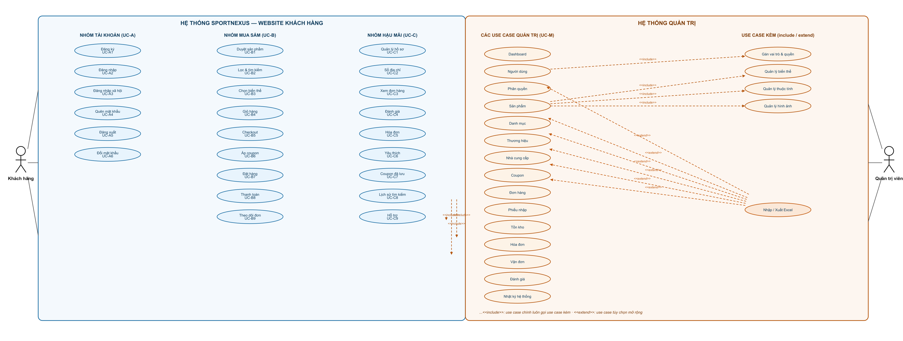
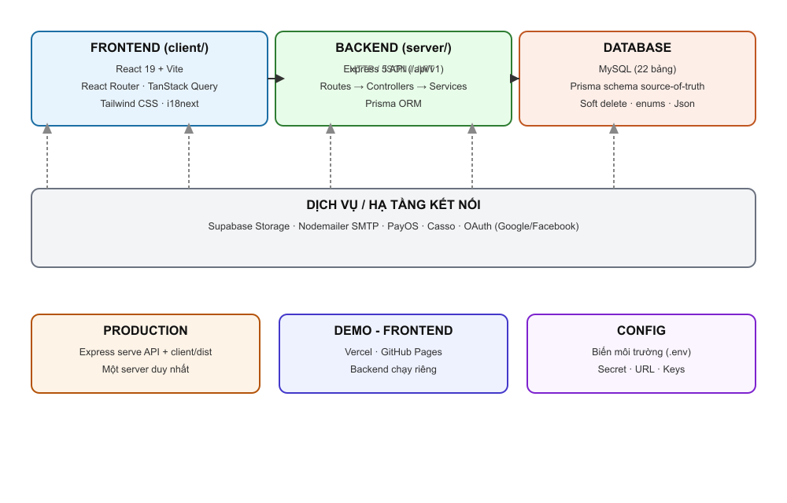
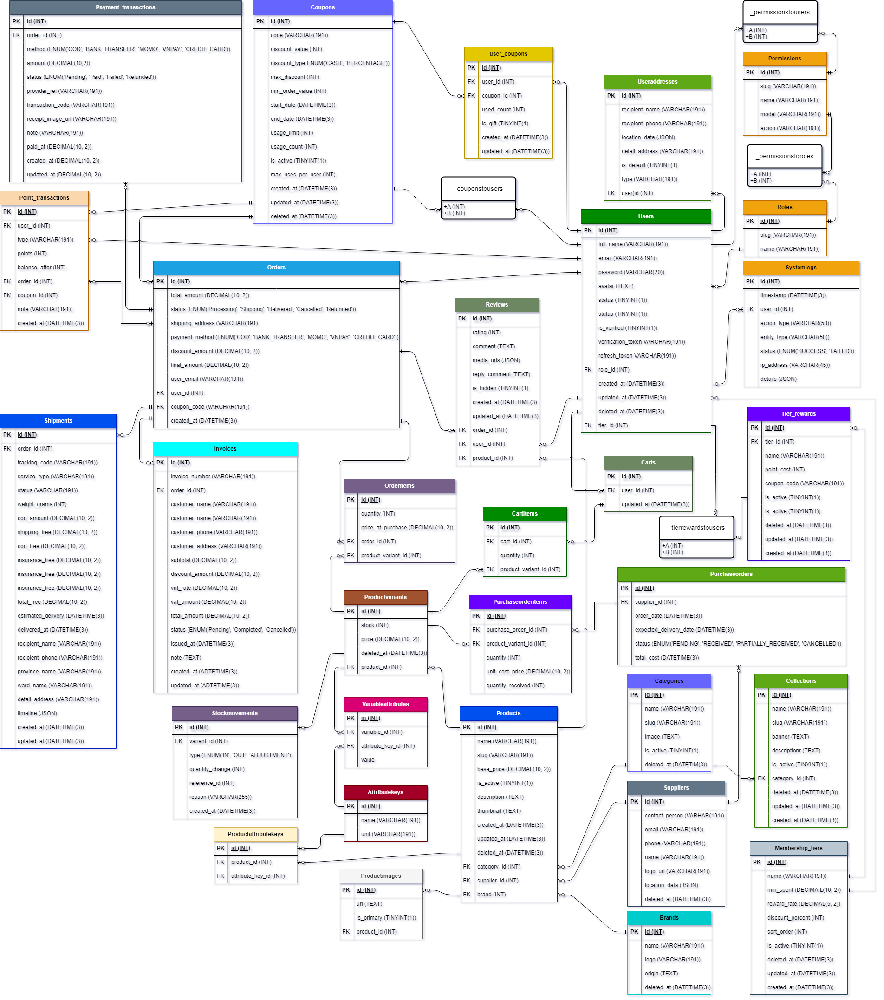
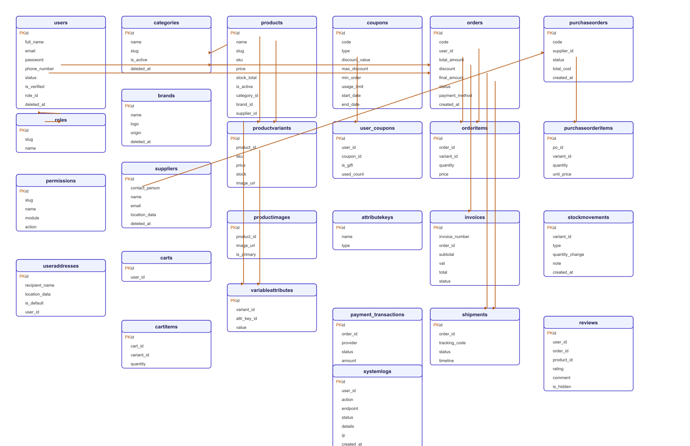
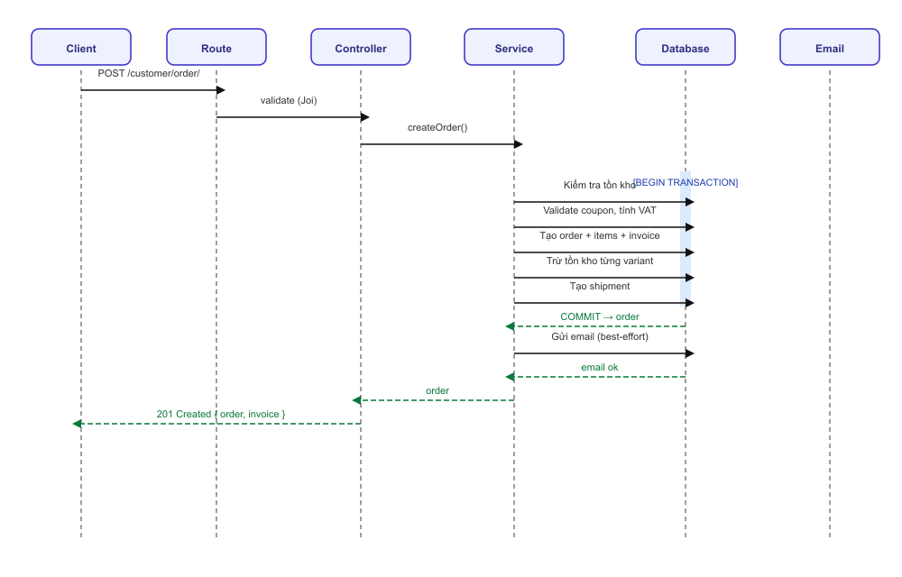
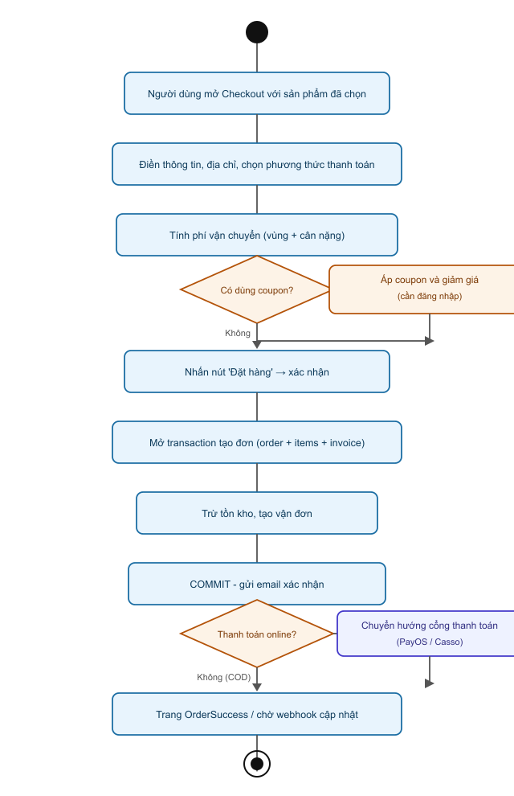

<p align="center">
  
</p>

<h1 align="center">TÀI LIỆU NGUỒN — HỆ THỐNG THƯƠNG MẠI ĐIỆN TỬ SPORTNEXUS</h1>

<p align="center">
  <strong>Tài liệu phân tích & thiết kế chi tiết toàn bộ hệ thống</strong><br>
  Dùng làm cơ sở để biên soạn báo cáo đồ án / khóa luận (~100 trang)
</p>

---

# CHƯƠNG MỞ ĐẦU

## 0.1 Về tài liệu này

Tài liệu này là **nguồn dữ liệu kỹ thuật và nghiệp vụ** đầy đủ của hệ thống SportNexus, được khảo sát trực tiếp từ mã nguồn. Mục đích cung cấp mọi thông tin cần thiết (kiến trúc, công nghệ, mô hình dữ liệu, từng module chức năng, quy trình nghiệp vụ, bảo mật, triển khai, hạn chế) để người viết có thể triển khai thành một quyển báo cáo khoa học hoàn chỉnh.

**Cách sử dụng:** Mỗi mục trong tài liệu tương ứng với nội dung có thể đưa vào một phần (hoặc một chương) của báo cáo. Số liệu, tên hàm, tên bảng, endpoint được ghi chính xác từ mã nguồn — chỉ cần chuyển đổi ngôn ngữ sang văn phong báo cáo.

### 0.1.1 Phạm vi và giới hạn của tài liệu

Tài liệu được biên soạn nhằm phục vụ ba đối tượng chính:

1. **Người viết báo cáo đồ án/khóa luận:** mỗi chương trong tài liệu là "nguyên liệu thô" có thể chuyển hóa trực tiếp thành các phần tương ứng của báo cáo mà không cần khảo sát lại mã nguồn.
2. **Người kiểm thử và đánh giá:** các bảng mô tả endpoint, luồng nghiệp vụ, và bảng dữ liệu giúp xác định kịch bản kiểm thử và tiêu chí chấm điểm.
3. **Người bảo trì hệ thống:** danh sách hạn chế, điểm yếu bảo mật và hướng phát triển giúp định hướng các cải tiến kỹ thuật sau này.

Điểm cần lưu ý: tài liệu mô tả hệ thống **đúng theo trạng thái hiện tại của mã nguồn**, bao gồm cả những hạn chế chưa được khắc phục. Điều này có chủ đích — một báo cáo khoa học có giá trị khi phản ánh trung thực cả mặt mạnh lẫn mặt yếu của sản phẩm.

### 0.1.2 Phương pháp khảo sát

Quá trình biên soạn tuân theo quy trình sau:

| Bước | Hoạt động                                                             | Kết quả                           |
| ---- | --------------------------------------------------------------------- | --------------------------------- |
| 1    | Đọc `server/prisma/schema.prisma`                                     | Mô hình dữ liệu đầy đủ 32 bảng    |
| 2    | Đọc cây thư mục `server/src/{routes,controllers,services,validators}` | Danh sách module, endpoint, quyền |
| 3    | Đọc cây thư mục `client/src/{routes,pages,components}`                | Cấu trúc giao diện và định tuyến  |
| 4    | Đối chiếu chéo endpoint ↔ service ↔ schema                            | Đảm bảo tính nhất quán            |
| 5    | Ghi nhận hạn chế, điểm yếu bảo mật                                    | Mục 6.20, 9.2                     |

## 0.2 Cấu trúc tài liệu

| Chương    | Nội dung                                        |
| --------- | ----------------------------------------------- |
| Chương 1  | Giới thiệu đề tài (bối cảnh, mục tiêu, phạm vi) |
| Chương 2  | Cơ sở lý thuyết & công nghệ                     |
| Chương 3  | Phân tích hệ thống (yêu cầu, use case, vai trò) |
| Chương 4  | Thiết kế kiến trúc tổng thể                     |
| Chương 5  | Thiết kế cơ sở dữ liệu                          |
| Chương 6  | Thiết kế chi tiết Backend                       |
| Chương 7  | Thiết kế chi tiết Frontend                      |
| Chương 8  | Triển khai & kiểm thử                           |
| Chương 9  | Đánh giá & hướng phát triển                     |
| Chương 10 | Kết luận                                        |

---

# CHƯƠNG 1. GIỚI THIỆU ĐỀ TÀI

## 1.1 Bối cảnh và lý do chọn đề tài

### 1.1.1 Bối cảnh thương mại điện tử thể thao

Thương mại điện tử đã trở thành một phần không thể thiếu của nền kinh tế hiện đại. Theo các báo cáo thị trường trong những năm gần đây, doanh thu thương mại điện tử toàn cầu liên tục tăng trưởng hai chữ số, trong đó nhóm hàng thể thao và thiết bị tập luyện là một trong những phân khúc tăng trưởng nhanh nhất. Sự bùng nổ của xu hướng rèn luyện sức khỏe, thể hình và thể thao nghiệp dư đã tạo ra nhu cầu mua sắm trực tuyến ngày càng lớn.

Các cửa hàng bán lẻ thể thao, đặc biệt tại thị trường Việt Nam, đang đối mặt với bài toán chuyển đổi số. Mô hình bán hàng truyền thống (cửa hàng vật lý) gặp nhiều hạn chế:

- **Giới hạn về phạm vi địa lý:** chỉ phục vụ khách hàng trong khu vực lân cận.
- **Giới hạn về thời gian:** hoạt động theo giờ hành chính, không phục vụ nhu cầu mua sắm ngoài giờ.
- **Chi phí vận hành cao:** mặt bằng, nhân sự, kho bãi.
- **Khó mở rộng quy mô:** khó tăng doanh thu mà không tăng chi phí tương ứng.

Trong bối cảnh đó, các cửa hàng thể thao cần một giải pháp bán hàng trực tuyến để mở rộng thị trường, tối ưu chi phí vận hành và nâng cao trải nghiệm khách hàng.

### 1.1.2 Sự cần thiết của một nền tảng chuyên biệt

Khác với các sàn thương mại điện tử tổng hợp, ngành thể thao có những đặc thù nghiệp vụ riêng đòi hỏi một hệ thống chuyên biệt:

- **Sản phẩm đa biến thể:** giày thể thao có nhiều kích cỡ, áo đấu có nhiều màu sắc, mỗi tổ hợp màu–size lại có giá và tồn kho riêng.
- **Quản lý tồn kho phức tạp:** tồn kho phải tính theo từng biến thể, theo dõi nhập–xuất, kiểm kê, và truy vết lịch sử biến động.
- **Chuỗi nghiệp vụ kéo dài:** từ sản phẩm → giỏ hàng → đơn hàng → thanh toán → vận chuyển → hóa đơn → hậu mãi.
- **Nhập hàng từ nhà cung cấp:** cửa hàng thể thao thường kinh doanh đa thương hiệu, cần quản lý nhà cung cấp và phiếu nhập.

Chính những đặc thù này là lý do đề tài tập trung xây dựng một nền tảng thương mại điện tử **chuyên biệt cho ngành thể thao** thay vì sử dụng giải pháp tổng quát.

### 1.1.3 Lý do chọn đề tài

Đề tài được lựa chọn dựa trên các tiêu chí sau:

1. **Tính thực tiễn:** giải quyết bài toán có thật của doanh nghiệp bán lẻ thể thao.
2. **Tính giáo dục:** bao trùm nhiều kiến thức quan trọng của kỹ thuật phần mềm — kiến trúc phân lớp, cơ sở dữ liệu quan hệ, bảo mật, tích hợp dịch vụ bên ngoài.
3. **Tính đầy đủ:** chuỗi nghiệp vụ từ đầu đến cuối, có cả website bán hàng và hệ thống quản trị.
4. **Tính khả thi:** sử dụng công nghệ phổ biến, mã nguồn mở, có cộng đồng lớn.

## 1.2 Mục tiêu của đề tài

### 1.2.1 Mục tiêu tổng quát

Xây dựng **nền tảng thương mại điện tử thể thao SportNexus** hoàn chỉnh, đáp ứng đầy đủ chuỗi nghiệp vụ: quản lý sản phẩm đa biến thể, giỏ hàng, đặt hàng, thanh toán đa phương thức, vận chuyển, hóa đơn, tồn kho và báo cáo thống kê.

### 1.2.2 Mục tiêu cụ thể

Đề tài đặt ra sáu mục tiêu cụ thể:

1. Xây dựng một **website bán hàng** (frontend) hiện đại, thân thiện, responsive cho khách hàng.
2. Xây dựng **hệ thống quản trị** (admin) cho nhân viên vận hành với nhiều vai trò khác nhau.
3. Phát triển **API backend** hoàn chỉnh phục vụ cả website lẫn hệ thống quản trị.
4. Thiết kế **cơ sở dữ liệu quan hệ** chuẩn hóa, đảm bảo tính toàn vẹn dữ liệu.
5. Áp dụng các cơ chế **bảo mật**: xác thực JWT, phân quyền RBAC, mã hóa mật khẩu.
6. Tích hợp các **dịch vụ bên ngoài**: lưu trữ đám mây, gửi email, cổng thanh toán.

### 1.2.3 Tiêu chí đánh giá thành công

| Tiêu chí                  | Mức đạt được                              |
| ------------------------- | ----------------------------------------- |
| Hoàn thiện chuỗi mua hàng | Từ duyệt sản phẩm đến theo dõi vận đơn    |
| Bảo mật                   | JWT 2 token, RBAC, bcrypt, validation     |
| Đầy đủ nghiệp vụ quản trị | 15 module quản trị + dashboard thống kê   |
| Trải nghiệm người dùng    | Responsive, đa ngôn ngữ (vi/en)           |
| Tích hợp dịch vụ ngoài    | Supabase, Nodemailer, PayOS, Casso, OAuth |

## 1.3 Phạm vi của đề tài

### 1.3.1 Phạm vi bao gồm

**Website công khai (public):**

- Trang chủ, danh mục sản phẩm, tìm kiếm.
- Chi tiết sản phẩm với chức năng chọn biến thể (màu sắc, kích thước).
- Giỏ hàng (đồng bộ local ↔ server), thanh toán.
- Theo dõi đơn hàng và vận đơn.
- Hóa đơn, đánh giá sản phẩm.
- Khuyến mãi, tài khoản khách hàng (hồ sơ, địa chỉ, lịch sử tìm kiếm, yêu thích).

**Hệ thống quản trị (admin):**

- Dashboard thống kê đa chiều.
- Quản lý người dùng & phân quyền.
- Sản phẩm, biến thể, danh mục, thương hiệu, nhà cung cấp.
- Coupon, đơn hàng, phiếu nhập, tồn kho.
- Hóa đơn, vận đơn, đánh giá, nhật ký hệ thống.

**Hỗ trợ nhập/xuất dữ liệu:** khả năng nhập/xuất dữ liệu qua Excel cho 11 module.

### 1.3.2 Phạm vi không bao gồm

Đề tài xác định rõ các phần **không nằm trong phạm vi**:

- Phát triển ứng dụng di động native (chỉ có web responsive).
- Tích hợp giao dịch thực tế với các sàn thương mại điện tử lớn (Shopee, Lazada, TikTok Shop...).
- Hệ thống thanh toán quốc tế đầy đủ (chỉ mô phỏng COD + PayOS).
- Vận chuyển thực tế (sử dụng mô phỏng GHN, không nối API thật).

## 1.4 Đối tượng sử dụng

### 1.4.1 Các nhóm người dùng

| Nhóm người dùng                      | Vai trò                                      |
| ------------------------------------ | -------------------------------------------- |
| Khách vãng lai                       | Duyệt sản phẩm, đặt hàng không cần đăng nhập |
| Khách hàng                           | Mua hàng, quản lý đơn, đánh giá, hóa đơn     |
| Nhân viên bán hàng (sales_staff)     | Quản lý đơn hàng, coupon, đánh giá           |
| Quản lý kho (warehouse_manager)      | Quản lý sản phẩm, danh mục, tồn kho          |
| Nhân viên thu mua (purchasing_staff) | Quản lý nhà cung cấp, phiếu nhập             |
| Quản trị viên (admin)                | Toàn quyền, quản lý hệ thống & phân quyền    |

### 1.4.2 Phân tích vai trò từng nhóm

- **Khách vãng lai:** đối tượng tiềm năng, có thể tham khảo sản phẩm và giá mà không cần tài khoản. Được khuyến khích chuyển thành khách hàng đăng ký.
- **Khách hàng:** người mua chính. Sau khi đăng nhập được hưởng đầy đủ tính năng: giỏ hàng đồng bộ, sổ địa chỉ, theo dõi đơn, đánh giá, lưu coupon.
- **Nhân viên bán hàng:** xử lý đơn hàng, tặng coupon cho khách, quản lý đánh giá.
- **Quản lý kho:** duy trì danh mục sản phẩm và số lượng tồn kho chính xác.
- **Nhân viên thu mua:** phối hợp với nhà cung cấp, lập phiếu nhập hàng.
- **Quản trị viên:** vai trò cao nhất, kiểm soát toàn hệ thống và phân quyền cho nhân viên.

### 1.4.3 Ma trận quyền truy cập tổng quan

| Chức năng              | Khách |    Khách hàng    |  Sales  |     Kho      | Thu mua | Admin |
| ---------------------- | :---: | :--------------: | :-----: | :----------: | :-----: | :---: |
| Duyệt sản phẩm         |   ✓   |        ✓         |    ✓    |      ✓       |    ✓    |   ✓   |
| Giỏ hàng/Thanh toán    |   ✓   |        ✓         |    –    |      –       |    –    |   –   |
| Quản lý đơn hàng       |   –   | ✓ (đơn của mình) |    ✓    | ✓ (xuất kho) |    –    |   ✓   |
| Quản lý sản phẩm       |   –   |        –         | ✓ (xem) |      ✓       | ✓ (xem) |   ✓   |
| Quản lý NCC/Phiếu nhập |   –   |        –         |    –    |      –       |    ✓    |   ✓   |
| Phân quyền hệ thống    |   –   |        –         |    –    |      –       |    –    |   ✓   |

## 1.5 Tính khả thi của đề tài

Một đề tài phần mềm chỉ có giá trị khi được đánh giá khả thi trên nhiều khía cạnh. Dưới đây là phân tích tính khả thi của SportNexus theo bốn trục chính.

### 1.5.1 Tính khả thi về kỹ thuật

| Tiêu chí        | Đánh giá   | Phân tích                                                                                                          |
| --------------- | ---------- | ------------------------------------------------------------------------------------------------------------------ |
| Công nghệ       | Cao        | Sử dụng công nghệ mã nguồn mở, phổ biến (React, Node.js, Express, MySQL, Prisma) — tài liệu và cộng đồng phong phú |
| Kỹ năng đội ngũ | Cao        | Các công nghệ đã được giảng dạy rộng rãi, có nhiều ví dụ thực tế                                                   |
| Hạ tầng         | Cao        | Chạy được trên máy cá nhân; deploy demo miễn phí (Vercel, GitHub Pages)                                            |
| Tích hợp        | Trung bình | PayOS, Supabase, SMTP cung cấp SDK — nhưng cần cấu hình tài khoản thực                                             |

**Kết luận:** hoàn toàn khả thi về mặt kỹ thuật trong phạm vi một đồ án/khoá luận.

### 1.5.2 Tính khả thi về kinh tế

- **Chi phí phần mềm:** toàn bộ công nghệ đều mã nguồn mở/miễn phí cho quy mô nhỏ.
- **Chi phí hạ tầng:** Supabase có gói miễn phí; Vercel, GitHub Pages miễn phí cho demo.
- **Chi phí vận hành:** chỉ phát sinh khi triển khai production quy mô lớn (không nằm trong phạm vi).
- **Lợi ích:** tiết kiệm đáng kể so với thuê nền tảng thương mại điện tử đóng gói.

**Kết luận:** chi phí thấp, phù hợp với quy mô đồ án.

### 1.5.3 Tính khả thi về vận hành

- Người quản trị có thể vận hành hệ thống qua giao diện admin trực quan, không cần can thiệp code.
- Hỗ trợ nhập/xuất Excel giúp nhập liệu hàng loạt nhanh chóng.
- Hệ thống log và dashboard hỗ trợ giám sát.

### 1.5.4 Tính khả thi về thời gian

Với phạm vi chức năng được xác định rõ (mục 1.3), hệ thống có thể hoàn thành trong một học kỳ nếu tuân thủ kế hoạch phát triển có giai đoạn (mục 1.7).

## 1.6 Phương pháp nghiên cứu và phát triển

### 1.6.1 Quy trình phát triển phần mềm

Dự án áp dụng quy trình phát triển **lặp và tăng dần** (iterative & incremental), kết hợp các pha chính của mô hình thác nước cho từng giai đoạn:

| Giai đoạn  | Hoạt động                                          | Sản phẩm                |
| ---------- | -------------------------------------------------- | ----------------------- |
| Khảo sát   | Thu thập yêu cầu, khảo sát hệ thống tương tự       | Danh sách yêu cầu       |
| Phân tích  | Xây dựng use case, yêu cầu chức năng/phi chức năng | Tài liệu phân tích      |
| Thiết kế   | Thiết kế kiến trúc, CSDL, module                   | Tài liệu thiết kế       |
| Lập trình  | Viết backend → frontend → tích hợp                 | Mã nguồn hoàn chỉnh     |
| Kiểm thử   | Kiểm thử chức năng, xử lý lỗi                      | Hệ thống ổn định        |
| Triển khai | Deploy demo, viết tài liệu                         | Sản phẩm demo + báo cáo |

### 1.6.2 Phương pháp kỹ thuật

- **Khảo sát mã nguồn trực tiếp:** mọi thông tin trong tài liệu được đối chiếu với mã nguồn thực tế để đảm bảo chính xác.
- **Phát triển module hóa:** xây dựng từng module độc lập (auth, product, order...) rồi tích hợp.
- **Kiểm thử đơn vị và tích hợp:** kiểm thử từng hàm, từng luồng nghiệp vụ.

## 1.7 Kế hoạch thực hiện

| Giai đoạn | Tuần  | Nội dung chính                                        |
| --------- | ----- | ----------------------------------------------------- |
| 1         | 1–2   | Khảo sát, phân tích yêu cầu, xây dựng use case        |
| 2         | 3–4   | Thiết kế kiến trúc và cơ sở dữ liệu                   |
| 3         | 5–9   | Phát triển backend (auth, product, order, payment...) |
| 4         | 10–12 | Phát triển frontend (web + admin) và tích hợp         |
| 5         | 13–14 | Kiểm thử, xử lý lỗi, hoàn thiện                       |
| 6         | 15    | Triển khai demo, viết báo cáo                         |

## 1.8 Cấu trúc tổ chức và phân công công việc

### 1.8.1 Mô hình triển khai

Dự án SportNexus được triển khai theo mô hình **full-stack** — một đội ngũ phụ trách cả frontend và backend để đảm bảo tính nhất quán xuyên suốt chuỗi nghiệp vụ. Sự phối hợp giữa hai tầng là yếu tố then chốt vì API và giao diện phải đồng bộ (endpoint, cấu trúc dữ liệu, mã lỗi).

### 1.8.2 Trách nhiệm theo tầng

| Tầng     | Trách nhiệm chính                                                         |
| -------- | ------------------------------------------------------------------------- |
| Backend  | Thiết kế schema, viết service/controller, bảo mật, tích hợp dịch vụ ngoài |
| Frontend | Thiết kế giao diện, định tuyến, quản lý state, gọi API                    |
| Tích hợp | Đối chiếu endpoint, kiểm thử luồng nghiệp vụ, xử lý lỗi                   |

### 1.8.3 Quy ước hợp tác giữa hai tầng

- **API contract** được thống nhất trước (endpoint, request/response).
- **Mã lỗi** dùng chung (vd `INSUFFICIENT_STOCK`, `COUPON_REQUIRES_LOGIN`) để frontend xử lý nhất quán.
- **Field naming** thống nhất (snake_case trong DB, camelCase trong JS — map qua service/validation).

## 1.9 Mục tiêu chất lượng

### 1.9.1 Tiêu chí đánh giá chất lượng sản phẩm

| Tiêu chí   | Mô tả                        | Cách đạt                             |
| ---------- | ---------------------------- | ------------------------------------ |
| Chính xác  | Nghiệp vụ đúng, dữ liệu đúng | Transaction, validation, server-side |
| An toàn    | Bảo mật dữ liệu              | JWT, RBAC, bcrypt, chống IDOR        |
| Dễ dùng    | Trải nghiệm tốt              | Giao diện thân thiện, responsive     |
| Dễ bảo trì | Mã nguồn sạch, có cấu trúc   | Kiến trúc 3 lớp, quy ước đặt tên     |
| Hiệu năng  | Tải nhanh, mượt              | Lazy loading, cache, phân trang      |

### 1.9.2 Kiểm soát chất lượng

- Kiểm thử thủ công theo kịch bản (Chương 8).
- Lint + build kiểm tra trước khi hoàn thiện.
- Ghi nhận và sửa lỗi trong quá trình phát triển.

## 1.10 Tổng kết chương 1

Chương 1 đã giới thiệu tổng quan về đề tài: bối cảnh thương mại điện tử thể thao, lý do chọn đề tài, mục tiêu (tổng quát và cụ thể), phạm vi bao gồm/không bao gồm, đối tượng sử dụng với ma trận quyền truy cập, tính khả thi (kỹ thuật, kinh tế, vận hành, thời gian), phương pháp phát triển, kế hoạch thực hiện, tổ chức công việc và mục tiêu chất lượng.

**Ý nghĩa của chương:** chương này định hướng toàn bộ nội dung các chương sau. Mục tiêu và phạm vi xác định rõ ranh giới hệ thống; ma trận quyền truy cập là nền tảng cho thiết kế phân quyền ở Chương 6; đối tượng sử dụng dẫn dắt việc phân tích yêu cầu ở Chương 3.

---

# CHƯƠNG 2. CƠ SỞ LÝ THUYẾT VÀ CÔNG NGHỆ

## 2.1 Mô hình Client – Server

### 2.1.1 Khái niệm

Mô hình **client–server** là mô hình kiến trúc phân tán phổ biến nhất trong phát triển ứng dụng web. Theo mô hình này, hệ thống được chia thành hai thành phần chính:

- **Client** (máy khách): chịu trách nhiệm về giao diện người dùng, định tuyến, và gọi API. Trong hệ thống này, client là một Single Page Application (SPA) xây dựng bằng React.
- **Server** (máy chủ): chịu trách nhiệm xác thực, xử lý nghiệp vụ, truy cập dữ liệu. Trong hệ thống này, server là một RESTful API xây dựng bằng Express.

**Giao tiếp:** giữa client và server sử dụng giao thức HTTP với định dạng dữ liệu JSON, theo phong cách RESTful.

### 2.1.2 Lợi ích của mô hình client–server

| Lợi ích               | Mô tả                                                   |
| --------------------- | ------------------------------------------------------- |
| Tách biệt trách nhiệm | Mỗi thành phần chỉ đảm nhiệm một vai trò riêng          |
| Dễ mở rộng            | Có thể mở rộng client hoặc server độc lập               |
| Đa client             | Một server phục vụ nhiều client khác nhau (web, mobile) |
| Bảo mật tập trung     | Logic bảo mật tập trung ở server                        |
| Dễ bảo trì            | Thay đổi một phía không ảnh hưởng phía kia              |

### 2.1.3 Áp dụng trong SportNexus

```
┌─────────────────────┐         ┌─────────────────────┐
│  Client (React SPA) │  HTTP   │  Server (Express)   │
│  • Giao diện        │  JSON   │  • Xác thực JWT     │
│  • Định tuyến       │◄───────►│  • Nghiệp vụ        │
│  • Quản lý state    │  REST   │  • Truy cập DB      │
└─────────────────────┘         └─────────┬───────────┘
                                          │ Prisma ORM
                                     ┌────▼────┐
                                     │  MySQL  │
                                     └─────────┘
```

### 2.1.4 Phân tích sâu việc áp dụng trong SportNexus

Trong SportNexus, mô hình client–server được áp dụng một cách nhất quán:

| Khía cạnh | Cách triển khai                                               |
| --------- | ------------------------------------------------------------- |
| Giao diện | React SPA — xử lý định tuyến, quản lý state, render component |
| Nghiệp vụ | Express API — xác thực, kiểm tra quyền, xử lý nghiệp vụ       |
| Dữ liệu   | MySQL truy cập qua Prisma ORM                                 |
| Giao tiếp | HTTP + JSON theo phong cách RESTful                           |

**Phân tích về phân tách trách nhiệm:** việc để server xử lý toàn bộ logic nghiệp vụ và bảo mật mang lại lợi ích quan trọng — client chỉ là "tầng trình diễn", không chứa logic nhạy cảm. Nhờ đó, khi phát triển thêm client mới (vd mobile app) chỉ cần tái sử dụng API hiện có mà không phải viết lại logic nghiệp vụ.

**Phân tích về trạng thái:** mô hình REST là **stateless** — mỗi request chứa đủ thông tin (thông qua JWT token) để server xử lý độc lập. Điều này giúp server dễ mở rộng theo chiều ngang (thêm nhiều instance) mà không phải chia sẻ session.

## 2.2 Kiến trúc 3 lớp (Three-Layer Architecture)

### 2.2.1 Tổng quan

Backend SportNexus được tổ chức theo **kiến trúc 3 lớp** (three-layer architecture), một trong những kiến trúc phân lớp kinh điển nhất trong phát triển phần mềm:

1. **Presentation layer (Controller):** `controllers/` — nhận request từ route, gọi service, trả response.
2. **Business logic layer (Service):** `services/` — chứa toàn bộ logic nghiệp vụ, thao tác với Prisma.
3. **Data access layer:** Prisma ORM truy cập MySQL.

### 2.2.2 Ưu điểm của kiến trúc 3 lớp

- **Tách biệt HTTP concerns khỏi business logic:** controller chỉ làm nhiệm vụ "đón – gọi – trả", mọi quyết định nghiệp vụ nằm trong service.
- **Dễ bảo trì:** khi logic nghiệp vụ thay đổi, chỉ cần sửa service, không cần động đến controller.
- **Dễ kiểm thử:** service có thể kiểm thử độc lập không phụ thuộc vào HTTP.
- **Tái sử dụng:** cùng một service có thể được gọi từ nhiều controller hoặc từ các module khác.

### 2.2.3 Ví dụ minh họa luồng

Với request "tạo đơn hàng":

```
Route (POST /customer/order/)
   │
   ├── verifyTokenOptional (middleware)
   ├── validate (middleware — Joi)
   ▼
Controller (orderController.create)
   │
   └── Service (orderService.createOrder)
           │
           ├── Kiểm tra tồn kho
           ├── Validate coupon
           ├── Trong transaction:
           │     • Tạo order + orderItems + invoice
           │     • Trừ tồn kho
           │     • Tạo shipment
           └── Gửi email (best-effort)
   │
   ▼
Response JSON
```

### 2.2.4 Phân tích sâu vai trò từng lớp

| Lớp        | File trong SportNexus        | Vai trò                                                |
| ---------- | ---------------------------- | ------------------------------------------------------ |
| Route      | `routes/*Routes.js`          | Khai báo endpoint, gắn middleware                      |
| Controller | `controllers/*Controller.js` | Tiếp nhận request, validate, gọi service, trả response |
| Service    | `services/*Service.js`       | Chứa logic nghiệp vụ, truy cập Prisma                  |
| Validator  | `validators/*Validator.js`   | Định nghĩa schema validate input                       |

**Phân tích lợi ích:**

1. **Dễ bảo trì:** mỗi lớp có một trách nhiệm rõ ràng. Khi thay đổi cách validate (vd đổi Joi sang zod) chỉ cần sửa lớp validator, không ảnh hưởng service.
2. **Tái sử dụng:** cùng một service có thể được gọi từ nhiều controller khác nhau (vd service tạo đơn được gọi từ cả web và admin).
3. **Dễ kiểm thử:** mỗi lớp có thể được test độc lập; service không phụ thuộc vào HTTP.
4. **Kiểm soát lỗi:** controller tập trung bắt lỗi từ service và chuẩn hóa response lỗi.

### 2.2.5 Nhược điểm và cách khắc phục

| Nhược điểm                                 | Cách khắc phục trong SportNexus                       |
| ------------------------------------------ | ----------------------------------------------------- |
| Nhiều file phải tạo cho mỗi tính năng      | Tuân theo quy ước cấu trúc thư mục rõ ràng            |
| Có thể phức tạp hóa cho tính năng đơn giản | Với tính năng nhỏ, route có thể gọi service trực tiếp |
| Dễ lạm dụng tạo lớp trung gian             | Chỉ tạo validator/service khi cần thiết thực sự       |

## 2.3 Công nghệ Frontend

### 2.3.1 React 19

**React** là thư viện JavaScript phổ biến nhất hiện nay để xây dựng giao diện người dùng theo thành phần (component). React 19 mang đến nhiều cải tiến về hiệu năng và khả năng sử dụng:

- **Component-based:** giao diện được chia thành các thành phần nhỏ, tái sử dụng được.
- **Declarative:** lập trình viên mô tả trạng thái mong muốn, React tự quản lý việc cập nhật DOM.
- **Virtual DOM:** tối ưu hiệu năng bằng cách so sánh và cập nhật tối thiểu các thay đổi.
- **Hooks:** quản lý state và side effects theo cách hiện đại.

**Trong SportNexus:** React 19 được sử dụng với **lazy loading** cho các route nhằm tối ưu kích thước bundle ban đầu, giúp trang tải nhanh hơn.

### 2.3.2 Vite

**Vite** là công cụ build và development server thế hệ mới cho các dự án JavaScript/TypeScript. Vite nổi bật với:

- **Khởi động nhanh:** dựa trên native ES modules, không cần bundle toàn bộ lúc khởi động.
- **HMR (Hot Module Replacement) mượt mà:** thay đổi code được cập nhật ngay trên trình duyệt mà không làm mất trạng thái.
- **Tối ưu production build:** dùng Rollup, tree-shaking hiệu quả.

### 2.3.3 React Router 7

**React Router** là thư viện định tuyến chuẩn cho ứng dụng React SPA. Phiên bản 7 mang đến:

- **Data loaders:** nạp dữ liệu trước khi render route, giúp tránh hiện tượng "flash of loading".
- **Server-driven navigation:** server có thể điều hướng, hỗ trợ SSG/SSR.
- **Route organization:** cây route được tổ chức rõ ràng.

**Trong SportNexus:** route chia thành 3 nhóm `webRoutes`, `authRoutes`, `adminRoutes`, tất cả lazy-load và bọc trong `<Suspense>`.

### 2.3.4 TanStack Query

**TanStack Query** (trước đây là React Query) là thư viện quản lý **state phía server** (server state). Nó giải quyết các vấn đề phức tạp của việc đồng bộ dữ liệu client – server:

- **Cache:** dữ liệu được cache để tránh gọi API trùng lặp.
- **Refetch:** tự động cập nhật dữ liệu khi cần.
- **Invalidation:** hủy cache và nạp lại sau khi mutation.
- **Optimistic updates:** cập nhật giao diện trước, đảm bảo sau.

**Trong SportNexus:** `queryClient` được cấu hình với `staleTime: 5 phút`, `refetchOnWindowFocus: false`. Loaders dùng `queryClient.fetchQuery` để populate cache; sau mutation gọi `invalidateQueries`.

### 2.3.5 Tailwind CSS

**Tailwind CSS** là framework CSS theo triết lý **utility-first**. Thay vì viết các class có nghĩa ngữ cảnh (`btn-primary`, `card`), lập trình viên dùng trực tiếp các utility class (`px-4 py-2 bg-blue-500`):

- **Thiết kế nhanh:** không cần rời khỏi JSX để viết CSS.
- **Responsive dễ dàng:** dùng tiền tố `sm:`, `md:`, `lg:`.
- **Tối ưu kích thước:** loại bỏ các class không dùng khi build.

### 2.3.6 Các thư viện hỗ trợ khác

| Thư viện                    | Mục đích                  |
| --------------------------- | ------------------------- |
| `react-hook-form` + `zod`   | Quản lý form & validation |
| `i18next` (`react-i18next`) | Đa ngôn ngữ (vi/en)       |
| `lucide-react`              | Icon                      |
| `swiper`                    | Carousel                  |
| `sonner`                    | Thông báo toast           |
| `axios`                     | HTTP client               |
| `dayjs`                     | Xử lý thời gian           |
| `clsx` + `tailwind-merge`   | Gộp class có điều kiện    |

## 2.4 Công nghệ Backend

### 2.4.1 Node.js & Express 5

**Node.js** là môi trường chạy JavaScript phía server, dựa trên V8 engine của Chrome, nổi bật với mô hình bất đồng bộ, hướng sự kiện (event-driven, non-blocking I/O). Điều này phù hợp với các ứng dụng web có nhiều thao tác I/O như truy cập database, gọi API ngoài.

**Express 5** là framework web tối giản và linh hoạt cho Node.js. Express quản lý:

- **Routing:** định nghĩa các endpoint HTTP.
- **Middleware:** xử lý trước/sau khi xử lý request (xác thực, log, parse body, CORS).
- **Error handling:** tập trung xử lý lỗi.

Express 5 cải tiến xử lý promise rejection và một số hành vi routing so với phiên bản 4.

### 2.4.2 Prisma ORM

**Prisma** là ORM (Object-Relational Mapping) hiện đại cho Node.js/TypeScript. Điểm khác biệt của Prisma so với ORM truyền thống:

- **Schema-first:** khai báo model trong `schema.prisma` — đây là **nguồn chuẩn** của cấu trúc database.
- **Type safety:** Prisma Client tự sinh với kiểu TypeScript đầy đủ, giảm lỗi runtime.
- **Migration:** hỗ trợ sinh và quản lý migration.
- **Transaction:** hỗ trợ transaction cho các thao tác phức tạp.
- **Query linh hoạt:** API query mạnh mẽ (nested include, filtering, pagination).

**Trong SportNexus:** toàn bộ 32 bảng được khai báo trong `server/prisma/schema.prisma`, và mọi thao tác dữ liệu trong service đều dùng Prisma Client.

### 2.4.3 MySQL

**MySQL** là hệ quản trị cơ sở dữ liệu quan hệ mã nguồn mở phổ biến nhất thế giới:

- **Độ tin cậy cao:** đã được kiểm chứng trong nhiều hệ thống lớn.
- **Hỗ trợ SQL chuẩn:** ACID transactions, JOIN, khóa ngoại.
- **Hỗ trợ kiểu JSON:** hữu ích cho dữ liệu bán cấu trúc.
- **Cộng đồng lớn:** dễ tìm tài liệu và hỗ trợ.

**Trong SportNexus:** MySQL lưu trữ toàn bộ dữ liệu nghiệp vụ, kết nối qua Prisma.

### 2.4.4 JWT (JSON Web Token)

**JWT** là chuẩn mở (RFC 7519) để trao đổi thông tin an toàn dưới dạng token. Cấu trúc JWT gồm 3 phần:

1. **Header:** thuật toán ký (vd HS256).
2. **Payload:** dữ liệu (vd `{id, role, email}`).
3. **Signature:** chữ ký xác thực tính toàn vẹn.

SportNexus sử dụng **2 loại token**:

| Loại          | Thời hạn | Mục đích                         |
| ------------- | -------- | -------------------------------- |
| Access Token  | 15 phút  | Xác thực mỗi request API         |
| Refresh Token | 7 ngày   | Cấp lại access token khi hết hạn |

Chiến lược hai token này cân bằng giữa **bảo mật** (access token ngắn hạn giảm rủi ro lộ) và **trải nghiệm người dùng** (không phải đăng nhập lại thường xuyên).

### 2.4.5 Các thư viện hỗ trợ

| Thư viện                | Mục đích                       |
| ----------------------- | ------------------------------ |
| `joi`                   | Validation request schema      |
| `bcrypt`                | Mã hóa mật khẩu                |
| `jsonwebtoken`          | Tạo/xác minh JWT               |
| `multer` + `sharp`      | Xử lý upload ảnh               |
| `@supabase/supabase-js` | Lưu trữ đám mây                |
| `nodemailer` + `ejs`    | Gửi email với template         |
| `exceljs`               | Xuất/nhập Excel                |
| `@payos/node`           | Tích hợp cổng thanh toán PayOS |
| `google-auth-library`   | Đăng nhập Google               |
| `slugify`               | Tạo slug tiếng Việt            |
| `adm-zip`               | Xử lý file nén                 |

## 2.5 Các khái niệm nghiệp vụ

### 2.5.1 Biến thể sản phẩm (Product Variant)

**Biến thể sản phẩm** là một phiên bản cụ thể của sản phẩm, được xác định bởi một tổ hợp các thuộc tính. Ví dụ: sản phẩm "Giày chạy bộ A" có các biến thể "Màu trắng, size 40", "Màu đen, size 41"... Mỗi biến thể có **giá** và **tồn kho** riêng.

**Ý nghĩa:** cho phép kinh doanh sản phẩm đa dạng mà vẫn kiểm soát chính xác giá và tồn kho từng phiên bản.

### 2.5.2 Thuộc tính (Attribute Key)

**Thuộc tính** là đơn vị mô tả đặc tính của sản phẩm, ví dụ "Màu sắc", "Kích thước". Trong SportNexus có hai loại:

- **Thuộc tính mô tả chung:** đặc trưng cho toàn sản phẩm (chất liệu, xuất xứ...).
- **Thuộc tính phân biệt biến thể:** dùng để tạo ra các biến thể (màu, size).

### 2.5.3 Coupon

**Coupon** là mã giảm giá, có hai loại:

- **CASH:** giảm đúng một số tiền cố định.
- **PERCENTAGE:** giảm theo phần trăm, có giới hạn `max_discount`.

Coupon đi kèm các ràng buộc: thời hạn, đơn tối thiểu, số lượt dùng tối đa, giới hạn mỗi người.

### 2.5.4 Soft Delete (Xóa mềm)

**Soft delete** là kỹ thuật không xóa hẳn bản ghi khỏi database mà đánh dấu bằng cột `deleted_at`. Bản ghi "hoạt động" có `deleted_at = '1000-01-01 00:00:00'`, bản ghi đã xóa có `deleted_at = ngày xóa`.

**Lợi ích:**

- Bảo toàn dữ liệu lịch sử (phục vụ báo cáo, kiểm toán).
- Tránh lỗi khóa ngoại khi có bản ghi con tham chiếu.
- Có thể khôi phục dữ liệu khi cần.

**Hạn chế:** phức tạp hóa các truy vấn (phải lọc `deleted_at`), và phải thiết kế unique kết hợp để cho phép tạo lại slug/email trùng.

### 2.5.5 RBAC (Role-Based Access Control)

**RBAC** là mô hình phân quyền dựa trên vai trò:

- **User** được gán **Role** (vai trò).
- **Role** gồm tập hợp các **Permission** (quyền).
- **Permission** mô tả một hành động cụ thể trên một module (vd "thêm sản phẩm").

SportNexus bổ sung thêm **quyền trực tiếp** (user có thể được gán quyền riêng ngoài vai trò) để tăng tính linh hoạt.

## 2.6 Các khái niệm nền tảng web

Để hiểu rõ hệ thống, cần nắm các khái niệm nền tảng về web và HTTP được áp dụng xuyên suốt.

### 2.6.1 HTTP và các phương thức

HTTP (HyperText Transfer Protocol) là giao thức truyền tải dữ liệu giữa client và server. Các phương thức được SportNexus sử dụng:

| Phương thức | Mục đích         | Ví dụ trong hệ thống             |
| ----------- | ---------------- | -------------------------------- |
| GET         | Lấy dữ liệu      | `GET /core/product/all`          |
| POST        | Tạo dữ liệu mới  | `POST /customer/order/`          |
| PUT         | Cập nhật toàn bộ | `PUT /management/category/:id`   |
| DELETE      | Xóa dữ liệu      | `DELETE /customer/cart-item/:id` |

Mã trạng thái HTTP quan trọng: `200 OK`, `201 Created`, `400 Bad Request`, `401 Unauthorized`, `403 Forbidden`, `404 Not Found`, `500 Internal Server Error`.

### 2.6.2 RESTful API

**REST** (Representational State Transfer) là phong cách kiến trúc API dựa trên HTTP:

- **Tài nguyên** được định danh bằng URI (vd `/products/:id`).
- **Hành động** thể hiện qua phương thức HTTP.
- **Không trạng thái** (stateless): mỗi request độc lập, trạng thái xác thực gửi qua token.

**Trong SportNexus:** API được tổ chức RESTful theo tiền tố `/api/v1`, tài nguyên theo nhóm (core, customer, management).

### 2.6.3 JSON (JavaScript Object Notation)

JSON là định dạng trao đổi dữ liệu nhẹ, dễ đọc. SportNexus dùng JSON cho:

- Dữ liệu response của API.
- Kiểu dữ liệu bán cấu trúc trong database (`location_data`, `timeline`, `media_urls`, `details`).

### 2.6.4 Phân tích sâu cách tổ chức API RESTful

Trong SportNexus, API được chia theo **không gian truy cập** để quản lý quyền rõ ràng:

| Tiền tố              | Đối tượng         | Đặc điểm                           |
| -------------------- | ----------------- | ---------------------------------- |
| `/api/v1/core`       | Dữ liệu công khai | Sản phẩm, danh mục, thương hiệu    |
| `/api/v1/customer`   | Khách hàng        | Giỏ hàng, đơn hàng, tài khoản      |
| `/api/v1/management` | Quản trị          | Sản phẩm, kho, báo cáo, phân quyền |
| `/api/v1/helpers`    | Tiện ích          | Tính phí ship, mã vận đơn          |
| `/api/v1/auth`       | Xác thực          | Đăng ký, đăng nhập, token          |

Cách chia này giúp: (1) áp dụng middleware bảo vệ phù hợp cho từng nhóm, (2) dễ dàng kiểm soát và mở rộng.

## 2.7 Bảo mật ứng dụng web

### 2.7.1 Xác thực (Authentication)

Xác thực trả lời câu hỏi "**Bạn là ai?**". SportNexus dùng:

- **JWT (Access + Refresh Token)** cho người dùng đăng nhập.
- **OAuth 2.0** cho đăng nhập Google/Facebook.
- **Webhook signature** (checksum/HMAC) cho xác nhận thanh toán.

### 2.7.2 Phân quyền (Authorization)

Phân quyền trả lời câu hỏi "**Bạn được làm gì?**". SportNexus dùng mô hình RBAC với middleware `verifyToken`, `checkPermission`, `isAdmin`.

### 2.7.3 Mã hóa mật khẩu — bcrypt

bcrypt là thuật toán băm mật khẩu có **salt** (muối) tự động. Đặc điểm:

- **Chậm có chủ đích:** khó brute-force.
- **Salt riêng cho từng mật khẩu:** chống rainbow table.
- Trong hệ thống dùng **10 rounds**.

### 2.7.4 Mã hóa hàm băm và chữ ký

- **Hàm băm (hash):** một chiều, dùng cho mật khẩu.
- **HMAC-SHA512:** dùng để xác minh webhook Casso (header `x-casso-signature`).
- **Checksum:** dùng để xác minh webhook PayOS.

### 2.7.5 Các mối đe dọa phổ biến và cách phòng chống

| Mối đe dọa    | Mô tả                                  | Phòng chống trong SportNexus             |
| ------------- | -------------------------------------- | ---------------------------------------- |
| IDOR          | Truy cập tài nguyên người khác bằng id | Kiểm tra `req.user` (invoice theo email) |
| SQL Injection | Chèn câu lệnh SQL độc hại              | Prisma ORM tham số hóa                   |
| XSS           | Chèn script độc hại                    | React tự escape, validation              |
| CSRF          | Giả mạo request từ trình duyệt khác    | JWT trong header, CORS                   |
| Token leak    | Đánh cắp token                         | Refresh token ngắn hạn + thu hồi         |

### 2.7.6 Phân tích sâu chiến lược bảo mật

SportNexus áp dụng nguyên tắc **phòng thủ theo chiều sâu** (defense in depth) — nhiều lớp bảo vệ độc lập:

1. **Lớp xác thực (Authentication):** JWT access token (ngắn hạn) + refresh token, OAuth cho đăng nhập xã hội.
2. **Lớp phân quyền (Authorization):** RBAC với `verifyToken`, `checkPermission`, `isAdmin` — kiểm soát hành vi theo vai trò và quyền.
3. **Lớp validate dữ liệu:** Joi validator kiểm tra input trước khi vào service.
4. **Lớp ORM:** Prisma tham số hóa truy vấn, chống SQL injection.
5. **Lớp xử lý nghiệp vụ:** kiểm tra quyền sở hữu (chống IDOR), transaction đảm bảo toàn vẹn.

**Nhận xét:** tuy nhiều lớp bảo vệ, khảo sát (mục 6.20) cho thấy vẫn còn một số route chưa gắn middleware bảo vệ — minh chứng rằng bảo mật cần được rà soát liên tục, không chỉ thiết kế một lần.

## 2.8 Giao dịch (Transaction) trong CSDL

**Transaction** là một nhóm thao tác dữ liệu được thực hiện như một đơn vị nguyên tử — **tất cả hoặc không gì cả** (all-or-nothing). Tính chất ACID:

| Tính chất   | Ý nghĩa                                             |
| ----------- | --------------------------------------------------- |
| Atomicity   | Toàn bộ thao tác thành công hoặc không thao tác nào |
| Consistency | Dữ liệu luôn hợp lệ trước và sau transaction        |
| Isolation   | Các transaction độc lập, không can thiệp lẫn nhau   |
| Durability  | Kết quả được lưu vĩnh viễn sau commit               |

**Trong SportNexus:** các luồng phức tạp dùng transaction — tạo đơn hàng (tạo order + items + invoice + trừ kho + tạo shipment), nhập kho (tăng stock + ghi stockmovements).

### 2.8.1 Phân tích sâu tính chất ACID áp dụng cho tạo đơn hàng

Để minh họa, xét luồng tạo đơn hàng — luồng chạy trong transaction:

| Tính chất   | Cách áp dụng trong luồng tạo đơn                                                |
| ----------- | ------------------------------------------------------------------------------- |
| Atomicity   | Nếu trừ tồn kho thất bại, toàn bộ order/items/invoice bị hủy — không để dở dang |
| Consistency | Không bao giờ có đơn mới kèm tồn kho sai lệch                                   |
| Isolation   | Hai khách mua cùng lúc không làm giảm stock sai                                 |
| Durability  | Sau khi đơn được tạo, dữ liệu được lưu vĩnh viễn                                |

**Vì sao cần transaction?** Nếu không dùng transaction, khi tạo đơn gặp lỗi giữa chừng (vd hết hàng ở biến thể thứ 2), có thể xảy ra tình trạng: đơn được tạo nhưng tồn kho chưa được trừ, hoặc invoice thiếu. Transaction đảm bảo toàn vẹn dữ liệu trong mọi tình huống.

## 2.9 Đa ngôn ngữ (i18n)

**i18n (internationalization)** là kỹ thuật thiết kế phần mềm hỗ trợ nhiều ngôn ngữ. SportNexus hỗ trợ tiếng Việt và tiếng Anh:

- **Backend:** middleware đọc header `accept-language`, `t(req, key, params)` trả message theo ngôn ngữ.
- **Frontend:** thư viện i18next, 14 file JSON, tự phát hiện ngôn ngữ trình duyệt.

### 2.9.1 Cơ chế hoạt động

1. Người dùng chọn ngôn ngữ (hoặc hệ thống tự phát hiện từ trình duyệt).
2. Frontend lưu lựa chọn vào localStorage (`language`) và gửi `Accept-Language` khi gọi API.
3. Backend đọc header, đặt `req.lang`, trả message theo ngôn ngữ.
4. Giao diện render text theo file ngôn ngữ đã chọn.

### 2.9.2 Lợi ích

- **Mở rộng thị trường:** phục vụ cả khách nội địa và quốc tế.
- **Nhất quán:** một ngôn ngữ gốc (tiếng Việt), dịch sang tiếng Anh tập trung.
- **Trải nghiệm tốt:** người dùng dùng ngôn ngữ mình quen thuộc.

## 2.10 Đánh giá và so sánh công nghệ

### 2.10.1 So sánh React vs các framework khác

| Tiêu chí       | React         | Vue       | Angular      |
| -------------- | ------------- | --------- | ------------ |
| Cộng đồng      | Rất lớn       | Lớn       | Trung bình   |
| Hệ sinh thái   | Rất phong phú | Phong phú | Đầy đủ       |
| Độ phức tạp    | Trung bình    | Thấp      | Cao          |
| Học tập        | Trung bình    | Dễ        | Khó          |
| Tính linh hoạt | Cao           | Cao       | Thấp (gò bó) |

**Chọn React** vì hệ sinh thái phong phú (TanStack Query, React Router), cộng đồng lớn, phù hợp SPA và cơ hội việc làm cao.

### 2.10.2 So sánh Express vs các framework khác

| Tiêu chí        | Express      | NestJS               | Fastify       |
| --------------- | ------------ | -------------------- | ------------- |
| Nhẹ & linh hoạt | Cao          | Trung bình           | Cao           |
| Cấu trúc        | Tự do        | Bắt buộc (decorator) | Tự do         |
| TypeScript      | Hỗ trợ       | Sẵn có               | Hỗ trợ        |
| Học tập         | Dễ           | Trung bình           | Dễ            |
| Phù hợp         | API nhỏ-giữa | Dự án lớn            | Hiệu năng cao |

**Chọn Express** vì nhẹ, linh hoạt, dễ học, cộng đồng lớn — phù hợp phạm vi đồ án. Kiến trúc 3 lớp tự tổ chức bù đắp việc thiếu cấu trúc mặc định.

### 2.10.3 So sánh Prisma vs các ORM khác

| Tiêu chí     | Prisma    | Sequelize | TypeORM |
| ------------ | --------- | --------- | ------- |
| Schema-first | ✓         | ✗         | ✗       |
| Type safety  | Rất cao   | Thấp      | Cao     |
| Migration    | Tốt       | Tốt       | Tốt     |
| Độ phổ biến  | Đang tăng | Cao       | Cao     |

**Chọn Prisma** vì schema-first là nguồn chuẩn CSDL, type safety cao giảm lỗi runtime, cú pháp query hiện đại.

---

# CHƯƠNG 3. PHÂN TÍCH HỆ THỐNG

## 3.1 Giới thiệu chung về phân tích hệ thống

Phân tích hệ thống là giai đoạn quan trọng để xác định **yêu cầu chức năng** (what the system does) và **yêu cầu phi chức năng** (how well the system does it). Kết quả phân tích là nền tảng cho các giai đoạn thiết kế và triển khai.

Hệ thống SportNexus được phân tích thành hai nhóm chức năng chính:

1. **Website khách hàng** — phục vụ người mua.
2. **Hệ thống quản trị** — phục vụ nhân viên vận hành.

## 3.2 Yêu cầu chức năng — Website khách hàng

### 3.2.1 Nhóm: Xác thực

| Mã    | Yêu cầu          | Mô tả                                       |
| ----- | ---------------- | ------------------------------------------- |
| UC-A1 | Đăng ký          | Tạo tài khoản bằng email, gửi link xác minh |
| UC-A2 | Đăng nhập        | Bằng email/số điện thoại + mật khẩu         |
| UC-A3 | Đăng nhập xã hội | Google, Facebook                            |
| UC-A4 | Quên mật khẩu    | Gửi email đặt lại mật khẩu                  |
| UC-A5 | Đăng xuất        | Hủy refresh token                           |
| UC-A6 | Đổi mật khẩu     | Khi đã đăng nhập                            |

**Phân tích chi tiết:**

- **UC-A1 (Đăng ký):** người dùng nhập họ tên, email, mật khẩu. Hệ thống tạo tài khoản với trạng thái chưa xác minh, gửi email chứa link xác minh. Bắt buộc xác minh email để đảm bảo địa chỉ hợp lệ và hạn chế tài khoản rác.
- **UC-A2 (Đăng nhập):** chấp nhận email **hoặc** số điện thoại làm username. Kiểm tra mật khẩu bằng bcrypt. Bị chặn nếu tài khoản bị khóa (status false).
- **UC-A3 (Đăng nhập xã hội):** tích hợp OAuth Google và Facebook. Người dùng mới được tạo với vai trò `customer` và mật khẩu giả ngẫu nhiên.
- **UC-A4 (Quên mật khẩu):** sinh token ngẫu nhiên, lưu vào `verification_token`, gửi email chứa link đặt lại.
- **UC-A5 (Đăng xuất):** xóa refresh token khỏi database, client xóa token khỏi storage.
- **UC-A6 (Đổi mật khẩu):** yêu cầu xác nhận mật khẩu cũ trước khi cập nhật mật khẩu mới.

### 3.2.2 Nhóm: Mua sắm

| Mã    | Yêu cầu        | Mô tả                                                         |
| ----- | -------------- | ------------------------------------------------------------- |
| UC-B1 | Duyệt sản phẩm | Trang chủ, danh sách, chi tiết                                |
| UC-B2 | Lọc & tìm kiếm | Theo danh mục, thương hiệu, giá, thuộc tính; tìm theo từ khóa |
| UC-B3 | Chọn biến thể  | Chọn tổ hợp màu sắc/kích thước còn hàng                       |
| UC-B4 | Giỏ hàng       | Thêm/sửa/xóa, đồng bộ local ↔ server                          |
| UC-B5 | Checkout       | Điền thông tin, chọn địa chỉ, chọn thanh toán                 |
| UC-B6 | Áp coupon      | Kiểm tra & áp mã giảm giá                                     |
| UC-B7 | Đặt hàng       | Tạo đơn, trừ tồn kho, tạo hóa đơn & vận đơn                   |
| UC-B8 | Thanh toán     | COD, chuyển khoản (PayOS/Casso/QR)                            |
| UC-B9 | Theo dõi đơn   | Tra cứu vận đơn không cần đăng nhập                           |

**Phân tích chi tiết:**

- **UC-B2 (Lọc & tìm kiếm):** hỗ trợ lọc đa tiêu chí (danh mục, thương hiệu, giá, kích thước) kết hợp tìm từ khóa và sắp xếp (mới nhất, bán chạy, giá tăng/giảm, đánh giá).
- **UC-B3 (Chọn biến thể):** frontend gom các attribute keys, tính toán tập giá trị khả dụng dựa trên tồn kho, tự động khớp biến thể được chọn. Đây là tính năng trọng tâm trải nghiệm mua sắm.
- **UC-B4 (Giỏ hàng):** hỗ trợ cả khách vãng lai (lưu localStorage) và khách đã đăng nhập (lưu server). Có cơ chế **đồng bộ giỏ** khi đăng nhập, gộp các item trùng biến thể.
- **UC-B5 (Checkout):** thu thập thông tin liên hệ, địa chỉ giao hàng, phương thức thanh toán. Tính phí vận chuyển động theo tỉnh và cân nặng.
- **UC-B7 (Đặt hàng):** quy trình quan trọng nhất, chạy trong **transaction** để đảm bảo toàn vẹn (tạo đơn, trừ kho, tạo hóa đơn, tạo vận đơn đồng bộ).
- **UC-B8 (Thanh toán):** hỗ trợ COD và chuyển khoản. Chuyển khoản có thể qua PayOS (nếu cấu hình) hoặc QR thủ công + webhook Casso.
- **UC-B9 (Theo dõi đơn):** tra cứu bằng mã vận đơn mà không cần đăng nhập, thuận tiện cho khách vãng lai.

### 3.2.3 Nhóm: Hậu mãi & tài khoản

| Mã    | Yêu cầu          | Mô tả                                |
| ----- | ---------------- | ------------------------------------ |
| UC-C1 | Quản lý hồ sơ    | Sửa thông tin, avatar                |
| UC-C2 | Sổ địa chỉ       | CRUD địa chỉ giao hàng, đặt mặc định |
| UC-C3 | Xem đơn hàng     | Danh sách & chi tiết, trạng thái     |
| UC-C4 | Đánh giá         | Đánh giá sản phẩm sau khi nhận hàng  |
| UC-C5 | Hóa đơn          | Xem danh sách & chi tiết hóa đơn     |
| UC-C6 | Yêu thích        | Wishlist (lưu local)                 |
| UC-C7 | Coupon đã lưu    | Lưu mã giảm giá, xem mã được tặng    |
| UC-C8 | Lịch sử tìm kiếm | Ghi nhớ & xóa từ khóa                |
| UC-C9 | Hỗ trợ           | Gửi yêu cầu qua email                |

**Phân tích chi tiết:**

- **UC-C4 (Đánh giá):** chỉ cho phép đánh giá sau khi đơn hàng **Delivered**, sản phẩm thuộc đơn hàng đó, và chưa đánh giá. Điều này đảm bảo tính xác thực của đánh giá.
- **UC-C6 (Yêu thích):** lưu ở localStorage (không đồng bộ server), phù hợp vì là dữ liệu nhẹ, ít quan trọng.
- **UC-C7 (Coupon đã lưu):** cho phép lưu mã khuyến mãi và xem mã được tặng (`is_gift`).
- **UC-C9 (Hỗ trợ):** gửi email yêu cầu hỗ trợ, hệ thống gửi 2 email (tự động xác nhận + thông báo cho admin).

## 3.3 Yêu cầu chức năng — Hệ thống quản trị

| Mã     | Module       | Yêu cầu                                                                                         |
| ------ | ------------ | ----------------------------------------------------------------------------------------------- |
| UC-M1  | Dashboard    | Thống kê doanh thu, đơn hàng, khách hàng, sản phẩm, tồn kho, coupon, supplier, review, hệ thống |
| UC-M2  | Người dùng   | CRUD, gán vai trò, gán quyền, import/export Excel                                               |
| UC-M3  | Phân quyền   | Quản lý role & permission theo module                                                           |
| UC-M4  | Sản phẩm     | CRUD sản phẩm + biến thể + hình ảnh + thuộc tính                                                |
| UC-M5  | Danh mục     | CRUD, import/export Excel                                                                       |
| UC-M6  | Thương hiệu  | CRUD, import/export Excel                                                                       |
| UC-M7  | Nhà cung cấp | CRUD, import/export Excel                                                                       |
| UC-M8  | Coupon       | CRUD, tặng mã, import/export                                                                    |
| UC-M9  | Đơn hàng     | Tạo, sửa, cập nhật trạng thái                                                                   |
| UC-M10 | Phiếu nhập   | Lập phiếu nhập từ nhà cung cấp                                                                  |
| UC-M11 | Tồn kho      | Nhập kho, xuất kho, điều chỉnh, xem tồn                                                         |
| UC-M12 | Hóa đơn      | Phát hành & quản lý hóa đơn                                                                     |
| UC-M13 | Vận đơn      | Mô phỏng vận chuyển GHN, theo dõi                                                               |
| UC-M14 | Đánh giá     | Duyệt/ẩn đánh giá                                                                               |
| UC-M15 | Nhật ký      | Theo dõi hoạt động hệ thống                                                                     |

**Phân tích các module quản trị:**

- **UC-M1 (Dashboard):** 9 khối thống kê (business, product, order, inventory, customer, coupon, supplier, review, system). Mỗi khối có các metric riêng, phục vụ quản trị viên ra quyết định.
- **UC-M2 (Người dùng):** ngoài CRUD còn hỗ trợ gán vai trò, gán quyền trực tiếp, và nhập/xuất Excel.
- **UC-M4 (Sản phẩm):** module phức tạp nhất, bao gồm quản lý sản phẩm, biến thể, hình ảnh, thuộc tính. Việc tạo một sản phẩm hoàn chỉnh đi qua nhiều endpoint.
- **UC-M11 (Tồn kho):** các thao tác nhập/xuất đều ghi nhận vào `stockmovements` để truy vết.

## 3.4 Yêu cầu phi chức năng

| Nhóm             | Yêu cầu                                                            |
| ---------------- | ------------------------------------------------------------------ |
| Bảo mật          | Xác thực JWT, phân quyền RBAC, mã hóa mật khẩu, validation đầu vào |
| Hiệu năng        | Lazy loading, caching dữ liệu, phân trang                          |
| Khả năng mở rộng | Kiến trúc phân lớp, tách client/server                             |
| Khả năng bảo trì | Mã nguồn có cấu trúc rõ ràng, quy ước đặt tên                      |
| Đa ngôn ngữ      | Hỗ trợ tiếng Việt và tiếng Anh                                     |
| Responsive       | Giao diện thích ứng mobile/tablet/desktop                          |

### 3.4.1 Phân tích yêu cầu phi chức năng

- **Bảo mật:** là yêu cầu quan trọng nhất. Hệ thống áp dụng đa lớp: xác thực JWT 2 token, phân quyền RBAC, mã hóa mật khẩu bằng bcrypt (10 rounds), validation đầu vào bằng Joi, chống IDOR ở một số route.
- **Hiệu năng:** lazy loading giảm thời gian tải ban đầu, TanStack Query cache giảm số request, phân trang giảm lượng dữ liệu trả về.
- **Đa ngôn ngữ:** hỗ trợ cả backend (middleware đọc `accept-language`) và frontend (i18next, 14 file JSON).

## 3.5 Đặc tả use case

### 3.5.1 Use case "Đặt hàng"

**Tác nhân:** Khách hàng (đã đăng nhập hoặc vãng lai).

**Tiền điều kiện:** Giỏ hàng có sản phẩm, đã điền thông tin.

**Luồng chính:**

1. Người dùng mở trang Checkout với các sản phẩm đã chọn.
2. Điền/chọn email, tên, số điện thoại, địa chỉ giao hàng.
3. Chọn phương thức thanh toán (COD / online).
4. Hệ thống tính phí vận chuyển động theo tỉnh thành.
5. Người dùng nhập mã coupon (tùy chọn) — hệ thống kiểm tra.
6. Nhấn "Đặt hàng".
7. Hệ thống tạo đơn hàng, trừ tồn kho, tạo hóa đơn, tạo vận đơn.
8. Gửi email xác nhận. Nếu thanh toán online → chuyển hướng cổng thanh toán.

**Luồng ngoại lệ:**

| Tình huống                     | Xử lý                                       |
| ------------------------------ | ------------------------------------------- |
| Tồn kho không đủ               | Trả lỗi `INSUFFICIENT_STOCK`, không tạo đơn |
| Coupon không hợp lệ            | Trả lỗi, không áp dụng giảm giá             |
| Coupon dùng khi chưa đăng nhập | Trả lỗi `COUPON_REQUIRES_LOGIN`             |
| Vượt giới hạn lượt dùng coupon | Trả lỗi, chặn tạo đơn                       |

**Hậu điều kiện:** Đơn hàng tồn tại với trạng thái Processing, vận đơn được tạo.

### 3.5.2 Use case "Đánh giá sản phẩm"

**Tác nhân:** Khách hàng đã đăng nhập.

**Tiền điều kiện:** Người dùng đã mua và nhận được sản phẩm.

**Luồng chính:**

1. Người dùng mở trang đơn hàng đã giao thành công.
2. Nhấn nút đánh giá.
3. Chọn số sao (1–5), nhập bình luận, tải ảnh (tùy chọn).
4. Gửi đánh giá.

**Luồng ngoại lệ:**

| Tình huống                             | Xử lý                                               |
| -------------------------------------- | --------------------------------------------------- |
| Đơn chưa Delivered                     | Chặn, thông báo chỉ được đánh giá sau khi nhận hàng |
| Đã đánh giá sản phẩm này trong đơn này | Chặn trùng lặp                                      |
| Đánh giá ẩn (is_hidden)                | Admin cần duyệt hiển thị                            |

**Hậu điều kiện:** Đánh giá được lưu, hiển thị cho admin, có thể được hiển thị công khai sau khi duyệt.

### 3.5.3 Use case "Đăng nhập" (UC-A2)

**Tác nhân:** Khách hàng.

**Tiền điều kiện:** Người dùng chưa đăng nhập.

**Luồng chính:**

1. Người dùng nhập tên đăng nhập (email hoặc SĐT) và mật khẩu.
2. Hệ thống xác thực bằng bcrypt.
3. Nếu hợp lệ, sinh access token + refresh token, trả về thông tin người dùng.

**Luồng ngoại lệ:**

| Tình huống                    | Xử lý                     |
| ----------------------------- | ------------------------- |
| Sai mật khẩu                  | Trả lỗi 401               |
| Tài khoản bị khóa             | Trả lỗi 403               |
| Tài khoản chưa xác minh email | Có thể chặn hoặc cảnh báo |
| Chưa xác minh email           | Gửi lại email xác minh    |

**Hậu điều kiện:** Người dùng có phiên đăng nhập, giỏ hàng local được đồng bộ lên server.

### 3.5.4 Use case "Nhập kho" (UC-M11)

**Tác nhân:** Quản trị viên / nhân viên kho.

**Luồng chính:**

1. Tạo phiếu nhập hàng từ nhà cung cấp.
2. Khi hàng về, thực hiện nhập kho.
3. Hệ thống tăng tồn kho từng biến thể.
4. Ghi nhận biến động vào sổ kho (`stockmovements` type IN).
5. Đổi trạng thái phiếu nhập thành RECEIVED.

**Luồng ngoại lệ:**

| Tình huống               | Xử lý           |
| ------------------------ | --------------- |
| Phiếu nhập không tồn tại | Trả lỗi         |
| Phiếu đã nhập trước đó   | Chặn nhập trùng |

**Hậu điều kiện:** Tồn kho tăng chính xác, lịch sử sổ kho được ghi nhận.

### 3.5.5 Use case "Theo dõi đơn hàng" (UC-B9)

**Tác nhân:** Khách hàng (có thể vãng lai).

**Luồng chính:**

1. Người dùng nhập mã vận đơn trên trang tracking.
2. Hệ thống tra cứu trạng thái vận đơn.
3. Hiển thị timeline các mốc trạng thái.

**Luồng ngoại lệ:**

| Tình huống               | Xử lý       |
| ------------------------ | ----------- |
| Mã vận đơn không tồn tại | Trả lỗi 404 |

**Phân tích:** việc cho phép tra cứu không cần đăng nhập giảm rào cản trải nghiệm, hữu ích cho khách vãng lai.

## 3.6 Biểu đồ use case tổng quát

### 3.6.1 Use case — Khách hàng

```
                  ┌──────────────────────────────┐
                  │         KHÁCH HÀNG            │
                  │                              │
    ┌─────────────┼──────────────────────────────┼──────────────┐
    │             │                              │              │
  Đăng ký      Đăng nhập                    Duyệt sản phẩm   Giỏ hàng
  (UC-A1)       (UC-A2)                     (UC-B1)          (UC-B4)
    │             │                              │              │
  Xác minh     Đăng nhập xã hội             Lọc & tìm kiếm   Checkout
  email         (UC-A3)                     (UC-B2)          (UC-B5)
    │             │                              │              │
  Quên mật     Đăng xuất                   Chọn biến thể     Đặt hàng
  khẩu          (UC-A5)                     (UC-B3)          (UC-B7)
  (UC-A4)        │                              │              │
                Đổi mật khẩu                  Áp coupon     Thanh toán
                 (UC-A6)                       (UC-B6)       (UC-B8)
                                                  │              │
                                          Theo dõi đơn    Xem hóa đơn
                                           (UC-B9)         (UC-C5)
                                                  │
                                          Đánh giá sản phẩm
                                           (UC-C4)
                  └──────────────────────────────────────────────┘
```

### 3.6.2 Use case — Quản trị viên

```
                 ┌─────────────────────────────────────────────┐
                 │            QUẢN TRỊ VIÊN                    │
                 │                                              │
   ┌──────────────┼──────────────┬──────────────┬──────────────┐
   │              │              │              │              │
 Dashboard      Quản lý       Quản lý        Quản lý       Phân quyền
 (UC-M1)       người dùng     sản phẩm       đơn hàng      (UC-M3)
                 (UC-M2)       (UC-M4)        (UC-M9)
   │              │              │              │
 Quản lý        Quản lý       Quản lý        Quản lý
 tồn kho        danh mục      coupon         hóa đơn
 (UC-M11)       (UC-M5)       (UC-M8)        (UC-M12)
   │              │              │
 Quản lý        Quản lý       Quản lý
 phiếu nhập     thương hiệu    vận đơn
 (UC-M10)       (UC-M6)        (UC-M13)
   │
 Quản lý nhật ký hệ thống (UC-M15)
                 └─────────────────────────────────────────────┘
```

### 3.6.3 Sơ đồ Use Case tổng quan (Use Case Diagram)

<p align="center">
  
</p>

Sơ đồ thể hiện hai hệ thống con chính với hai tác nhân, trong đó **khách hàng** được thể hiện đầy đủ **toàn bộ 24 use case** chia theo 3 nhóm nghiệp vụ:

**Nhóm Tài khoản (UC-A) — 6 use case:**

- UC-A1 Đăng ký (gửi email xác minh)
- UC-A2 Đăng nhập (email/SĐT + mật khẩu)
- UC-A3 Đăng nhập xã hội (Google, Facebook)
- UC-A4 Quên mật khẩu
- UC-A5 Đăng xuất
- UC-A6 Đổi mật khẩu

**Nhóm Mua sắm (UC-B) — 9 use case:**

- UC-B1 Duyệt sản phẩm
- UC-B2 Lọc & tìm kiếm
- UC-B3 Chọn biến thể
- UC-B4 Giỏ hàng
- UC-B5 Checkout
- UC-B6 Áp coupon
- UC-B7 Đặt hàng
- UC-B8 Thanh toán (COD / chuyển khoản)
- UC-B9 Theo dõi đơn

**Nhóm Hậu mãi & tài khoản (UC-C) — 9 use case:**

- UC-C1 Quản lý hồ sơ
- UC-C2 Sổ địa chỉ
- UC-C3 Xem đơn hàng
- UC-C4 Đánh giá sản phẩm
- UC-C5 Hóa đơn
- UC-C6 Yêu thích (wishlist)
- UC-C7 Coupon đã lưu
- UC-C8 Lịch sử tìm kiếm
- UC-C9 Hỗ trợ (gửi yêu cầu qua email)

**Quản trị viên** tương tác với Hệ thống Quản trị gồm 15 use case chính (UC-M1..M15): dashboard, người dùng, phân quyền, sản phẩm, danh mục, thương hiệu, nhà cung cấp, coupon, đơn hàng, phiếu nhập, tồn kho, hóa đơn, vận đơn, đánh giá, nhật ký hệ thống.

Các quan hệ giữa use case của quản trị viên được thể hiện bằng mũi tên đứt nét:

**Quan hệ «include» (use case chính luôn gọi use case kèm):**

- **Người dùng (UC-M2)** → _Gán vai trò & quyền_
- **Sản phẩm (UC-M4)** → _Quản lý biến thể_, _Quản lý thuộc tính_, _Quản lý hình ảnh_
- **Đơn hàng (UC-M9)** → _Tạo hóa đơn (UC-M12)_, _Tạo vận đơn (UC-M13)_
- **Phiếu nhập (UC-M10)** → _Cập nhật tồn kho (UC-M11)_

**Quan hệ «extend» (use case tùy chọn mở rộng):**

- **Nhập/Xuất Excel** → mở rộng các module _Người dùng (UC-M2)_, _Sản phẩm (UC-M4)_, _Danh mục (UC-M5)_, _Thương hiệu (UC-M6)_, _Nhà cung cấp (UC-M7)_, _Coupon (UC-M8)_ khi quản trị viên cần nhập/xuất dữ liệu hàng loạt.

Tất cả **24 use case của khách hàng** (UC-A1..A6, UC-B1..B9, UC-C1..C9) **đều đã được triển khai đầy đủ** trong hệ thống.

## 3.7 Phân tích sâu các use case phức tạp

### 3.7.1 Use case "Áp coupon" (UC-B6)

**Mô tả:** người dùng nhập mã giảm giá tại trang checkout, hệ thống kiểm tra và áp dụng.

**Các bước kiểm tra (thứ tự):**

| Bước | Điều kiện                    | Kết quả nếu sai             |
| ---- | ---------------------------- | --------------------------- |
| 1    | Coupon tồn tại               | Lỗi "mã không tồn tại"      |
| 2    | `is_active = true`           | Lỗi "mã đã ngừng"           |
| 3    | Trong thời hạn start/end     | Lỗi "hết hạn"               |
| 4    | Chưa hết `usage_limit`       | Lỗi "đã hết lượt"           |
| 5    | Đạt `min_order_value`        | Lỗi "đơn chưa đủ điều kiện" |
| 6    | Chưa quá `max_uses_per_user` | Lỗi "đã dùng tối đa"        |

**Phân tích:** kiểm tra tuần tự theo thứ tự ưu tiên logic, mỗi bước một điều kiện rõ ràng. Việc kiểm tra thực hiện **server-side** (không tin client) để chống lạm dụng.

### 3.7.2 Use case "Thanh toán chuyển khoản" (UC-B8)

**Luồng:**

1. Người dùng chọn phương thức BANK_TRANSFER.
2. Hệ thống kiểm tra cấu hình PayOS.
3. **Nếu có PayOS:** tạo transaction → gọi PayOS tạo link thanh toán → redirect.
4. **Nếu không có PayOS:** sinh QR VietQR với nội dung `SN{orderId}{6 số}` → người dùng chuyển khoản → hệ thống chờ webhook Casso.
5. Webhook xác minh chữ ký, khớp nội dung và số tiền → cập nhật trạng thái Paid.

**Phân tích:** hỗ trợ hai chế độ linh hoạt — tự động qua PayOS khi có cấu hình, thủ công qua QR khi chưa tích hợp. Webhook có **idempotency** chống trùng lặp.

### 3.7.3 Use case "Nhập kho" (UC-M11)

**Luồng chính:**

1. Admin mở trang phiếu nhập.
2. Tạo phiếu nhập từ nhà cung cấp, kèm các biến thể và số lượng.
3. Khi hàng về, thực hiện nhập kho.
4. Hệ thống **trong transaction:** tăng stock từng biến thể + tạo StockMovements type IN + đổi phiếu nhập thành RECEIVED.
5. Lưu lịch sử biến động.

**Phân tích:** việc ghi tăng stock và tạo bản ghi biến động trong cùng transaction đảm bảo sổ kho luôn khớp với số tồn.

## 3.8 Đặc tả các thực thể dữ liệu chính (use case → dữ liệu)

| Use case       | Thực thể dữ liệu liên quan                               |
| -------------- | -------------------------------------------------------- |
| Đăng ký        | `users`, `roles`                                         |
| Duyệt sản phẩm | `products`, `productvariants`, `categories`, `brands`    |
| Giỏ hàng       | `carts`, `cartitems`, `productvariants`                  |
| Đặt hàng       | `orders`, `orderitems`, `invoices`, `coupons`            |
| Thanh toán     | `payment_transactions`                                   |
| Vận chuyển     | `shipments`                                              |
| Đánh giá       | `reviews`                                                |
| Nhập kho       | `purchaseorders`, `purchaseorderitems`, `stockmovements` |

## 3.9 Phân tích các quy trình nghiệp vụ chính

### 3.9.1 Quy trình bán hàng

```
Tiếp nhận đơn ──► Kiểm tra tồn kho ──► Xác nhận (Processing)
      │
      ├──► Giao hàng (Shipping) ──► Giao thành công (Delivered)
      │
      └──► Hủy (Cancelled) / Hoàn (Refunded)
```

**Các điểm kiểm soát:**

- Kiểm tra tồn kho trước khi xác nhận.
- Cập nhật trạng thái theo chuỗi rõ ràng.
- Giao thành công kích hoạt thanh toán COD.

### 3.9.2 Quy trình thanh toán

```
Đặt hàng
   │
   ├── COD → Thanh toán khi nhận hàng → Paid khi Delivered
   │
   └── Online → Tạo transaction Pending
          │
          ├── PayOS → redirect → webhook → Paid
          └── QR thủ công → chuyển khoản → webhook Casso → Paid
```

### 3.9.3 Quy trình nhập kho

```
Lập phiếu nhập (PENDING) ──► Hàng về ──► Nhập kho
                                        │
                                        ├── Tăng stock
                                        ├── Ghi stockmovements IN
                                        └── Phiếu → RECEIVED
```

### 3.9.4 Quy trình vận chuyển

```
Tạo vận đơn khi đặt hàng
   │
   ▼
RECEIVED → PICKED_UP → IN_TRANSIT → OUT_FOR_DELIVERY → DELIVERED
   │                                                      │
   └── syncShipmentState tự cập nhật theo thời gian ───────┘
```

## 3.10 Ma trận tương tác giữa các module

| Module    | Phụ thuộc vào                 | Phục vụ cho                |
| --------- | ----------------------------- | -------------------------- |
| Auth      | users, roles                  | Mọi module có xác thực     |
| Product   | categories, brands, suppliers | Cart, Order, Stock         |
| Cart      | productvariants               | Checkout                   |
| Order     | productvariants, coupons      | Payment, Shipping, Invoice |
| Payment   | orders                        | Order                      |
| Shipping  | orders                        | Order, Tracking            |
| Stock     | productvariants               | Order, Purchase            |
| Coupon    | users, orders                 | Order                      |
| Invoice   | orders                        | Báo cáo                    |
| Dashboard | Toàn bộ                       | Quản trị                   |

**Phân tích:** module Order là trung tâm, phụ thuộc và phục vụ nhiều module nhất. Điều này giải thích vì sao luồng tạo đơn phức tạp và phải dùng transaction.

## 3.11 Tổng kết chương 3

Chương 3 đã phân tích đầy đủ hệ thống SportNexus: yêu cầu chức năng (website khách hàng + quản trị), yêu cầu phi chức năng, đặc tả use case, biểu đồ use case, phân tích các use case phức tạp, ánh xạ use case → dữ liệu, quy trình nghiệp vụ và ma trận tương tác module.

**Điểm nổi bật:**

- Yêu cầu được phân tách rõ cho hai đối tượng: khách hàng và quản trị.
- Use case phức tạp (coupon, thanh toán, nhập kho) được phân tích luồng chi tiết kèm xử lý ngoại lệ.
- Mối quan hệ use case ↔ dữ liệu là nền tảng cho thiết kế CSDL ở Chương 5.

---

# CHƯƠNG 4. THIẾT KẾ KIẾN TRÚC TỔNG THỂ

## 4.1 Sơ đồ kiến trúc tổng thể

```
                  ┌─────────────────────────────────────┐
                  │          FRONTEND (client/)          │
                  │  React 19 + Vite  ·  React Router     │
                  │  TanStack Query  ·  Tailwind CSS      │
                  └───────────────────┬──────────────────┘
                                      │ HTTP / JWT / JSON
                                      ▼
                  ┌─────────────────────────────────────┐
                  │        BACKEND (server/)             │
                  │  Express 5 API  (/api/v1)            │
                  │  Routes → Controllers → Services     │
                  │  Middleware: verifyToken/checkPerm   │
                  │  Validators (Joi)                    │
                  └──────┬───────────────┬──────────────┘
                         │               │
            ┌────────────▼───┐   ┌───────▼──────────────┐
            │   MySQL        │   │  External Services   │
            │   (Prisma ORM) │   │  Supabase · SMTP     │
            └────────────────┘   │  PayOS · Casso       │
                                 │  Google · Facebook   │
                                 └──────────────────────┘
```

### 4.1.1 Sơ đồ kiến trúc hệ thống (System Architecture Diagram)

<p align="center">
  
</p>

Sơ đồ trên mô tả kiến trúc tổng thể: tầng Frontend (React) giao tiếp với tầng Backend (Express) qua HTTP/JSON/JWT; Backend truy cập CSDL MySQL qua Prisma và kết nối các dịch vụ ngoài (Supabase Storage, SMTP, PayOS, Casso, OAuth). Phần dưới thể hiện hai phương án triển khai (production một server / demo tách frontend) và cấu hình biến môi trường.

## 4.2 Các thành phần

### 4.2.1 Frontend (React SPA)

Frontend chịu trách nhiệm giao diện người dùng. Sử dụng React 19 với:

- **Định tuyến:** React Router 7, chia 3 nhóm route (web/auth/admin).
- **Quản lý state server:** TanStack Query.
- **Quản lý state client:** React Context (Cart, Wishlist, Coupon).
- **Giao diện:** Tailwind CSS, responsive, dark mode.

### 4.2.2 Backend API (Express)

Backend xử lý HTTP, xác thực, và nghiệp vụ:

- **RESTful API** tại tiền tố `/api/v1`.
- **Kiến trúc 3 lớp:** routes → controllers → services.
- **Middleware:** `verifyToken`, `checkPermission`, `validate`, `logAction`, locale.

### 4.2.3 Database (MySQL qua Prisma)

Lưu trữ toàn bộ dữ liệu nghiệp vụ. 32 bảng, được mô tả chi tiết ở Chương 5.

### 4.2.4 Dịch vụ ngoài

| Dịch vụ                 | Mục đích                                    |
| ----------------------- | ------------------------------------------- |
| Supabase Storage        | Lưu trữ ảnh (avatar, sản phẩm, đánh giá...) |
| Nodemailer (SMTP)       | Gửi email (welcome, reset, xác nhận đơn...) |
| PayOS                   | Cổng thanh toán online                      |
| Casso                   | Webhook ngân hàng (chuyển khoản)            |
| Google / Facebook OAuth | Đăng nhập xã hội                            |

## 4.3 Luồng xử lý request tổng quát

1. Frontend gửi request HTTP đến backend (`VITE_API_URL`).
2. Express xử lý qua middleware (CORS, JSON, locale).
3. Route match → áp middleware bảo vệ (`verifyToken`, `checkPermission`, `validate`).
4. Controller gọi Service.
5. Service thực hiện nghiệp vụ + truy cập DB qua Prisma.
6. Trả response JSON về frontend.

### 4.3.1 Sơ đồ luồng chi tiết

```
Client ──► HTTP Request
              │
              ▼
        Express App
              │
              ├── CORS middleware
              ├── JSON body parser
              ├── locale middleware (accept-language)
              │
              ▼
        Route match (/api/v1/...)
              │
              ├── verifyToken / verifyTokenOptional
              ├── checkPermission(slug) [nếu cần]
              ├── validate (Joi schema)
              │
              ▼
        Controller
              │
              ▼
        Service (business logic)
              │
              ├── Prisma Client ──► MySQL
              ├── Dịch vụ ngoài (upload, email, payment)
              │
              ▼
        Response JSON ──► Client
```

## 4.4 Phân lớp mã nguồn Backend

```
routes/        →  định nghĩa endpoint + middleware
controllers/   →  nhận request, gọi service, trả response
services/      →  logic nghiệp vụ, thao tác Prisma
validators/    →  Joi schema validation
middlewares/   →  xác thực, phân quyền, upload, log
configs/       →  cấu hình dịch vụ ngoài
utils/         →  tiện ích dùng chung
views/emails/  →  template email (EJS)
db/            →  kết nối Prisma
locales/       →  i18n backend
```

### 4.4.1 Giải thích từng lớp

- **routes/:** khai báo endpoint, gắn middleware và controller. Đây là nơi duy nhất định nghĩa "đường đi" của HTTP.
- **controllers/:** "người gác cổng" — nhận request đã được validate, gọi service, bắt lỗi và trả response chuẩn.
- **services/:** "bộ não" — chứa toàn bộ logic nghiệp vụ. Không được import bất kỳ thứ gì liên quan HTTP.
- **validators/:** định nghĩa Joi schema, đảm bảo dữ liệu đầu vào hợp lệ trước khi vào service.
- **middlewares/:** các hàm xử lý trung gian (xác thực, phân quyền, log, upload file).
- **configs/:** cấu hình các dịch vụ ngoài (Supabase, PayOS, email, Casso).
- **utils/:** hàm tiện ích dùng chung.
- **views/emails/:** template EJS cho email.
- **db/:** khởi tạo Prisma Client.
- **locales/:** file thông điệp i18n backend.

## 4.5 Phân lớp mã nguồn Frontend

```
routes/        →  định nghĩa cây route (web/auth/admin)
pages/         →  các trang (Home, Products, Admin...)
components/    →  component dùng chung (UI kit)
api/           →  lớp gọi API (axios)
loaders/       →  data loaders (React Router)
contexts/      →  Cart, Wishlist, Coupon
hooks/         →  custom hooks
lib/           →  axios client, i18n, react-query
locales/       →  file ngôn ngữ
constants/     →  cấu hình (menu, trạng thái, quyền)
layouts/       →  AdminLayout, AuthLayout
utils/         →  tiện ích
```

### 4.5.1 Phân tích vai trò từng thư mục frontend

| Thư mục       | Vai trò chính                      | Ví dụ                              |
| ------------- | ---------------------------------- | ---------------------------------- |
| `routes/`     | Khai báo cây route, gắn layout     | `webRoutes.jsx`, `adminRoutes.jsx` |
| `pages/`      | Các trang hoàn chỉnh               | `Home`, `Products`, `Admin`        |
| `components/` | Component tái sử dụng              | `Button`, `Modal`, `Card`          |
| `api/`        | Gọi backend qua axios              | `products.js`, `orders.js`         |
| `loaders/`    | Nạp dữ liệu trước khi render route | `homeLoader`, `productsLoader`     |
| `contexts/`   | State toàn cục                     | `CartContext`, `WishlistContext`   |
| `hooks/`      | Custom hooks dùng lại              | `useTableFilters`                  |
| `lib/`        | Khởi tạo thư viện                  | axios client, i18n, react-query    |
| `locales/`    | File ngôn ngữ                      | `vi.json`, `en.json`               |
| `constants/`  | Hằng số cấu hình                   | menu, trạng thái, quyền            |
| `layouts/`    | Bố cục chung                       | `AdminLayout`                      |
| `utils/`      | Hàm tiện ích                       | format tiền, xử lý ngày            |

Sự phân lớp này giúp tách rõ: dữ liệu (`api`), giao diện (`components`), logic (`hooks`, `utils`), cấu hình (`constants`) — dễ bảo trì và mở rộng.

## 4.6 Thiết kế luồng dữ liệu giữa các tầng

Để minh họa rõ hơn, xét luồng **xem danh sách sản phẩm**:

```
Home page
   │  loader (React Router)
   │    └── queryClient.fetchQuery(["products"], fetchProducts)
   │         └── api/products (axios) ──► GET /api/v1/core/product/
   │                                       │
   │                                       ▼
   │                                 Express + verifyTokenOptional
   │                                       │
   │                                       ▼
   │                                 productService.getAllProduct
   │                                       │
   │                                       ▼
   │                                 Prisma (lọc deleted_at: ACTIVE, phân trang)
   │                                       │
   │                                       ▼
   │                                 Response JSON
   │
   ▼
Render giao diện (TanStack Query cung cấp data từ cache)
```

## 4.7 Các mô hình kiến trúc đã xem xét và lựa chọn

### 4.7.1 So sánh các mô hình

| Mô hình                  | Đặc điểm              | Phù hợp khi             | Kết luận                         |
| ------------------------ | --------------------- | ----------------------- | -------------------------------- |
| Nguyên khối (Monolithic) | Một ứng dụng duy nhất | Dự án nhỏ, đội ngũ ít   | **Chọn** — phù hợp phạm vi đồ án |
| Microservices            | Nhiều dịch vụ độc lập | Hệ thống lớn, nhiều đội | Loại — quá phức tạp cho đồ án    |
| Serverless               | Chạy theo sự kiện     | Hệ thống thất thường    | Loại — chi phí học tập cao       |

### 4.7.2 Lý do chọn kiến trúc nguyên khối phân lớp

SportNexus chọn kiến trúc **nguyên khối nhưng phân lớp rõ ràng**:

- **Phù hợp quy mô:** hệ thống vừa phải, một repo, một server — dễ quản lý.
- **Phân lớp (3-layer)** vẫn được áp dụng để tách biệt trách nhiệm, dễ bảo trì, dễ chuyển sang microservices sau này.
- **Chi phí vận hành thấp:** không cần hạ tầng phân tán phức tạp.

### 4.7.3 Khả năng tiến hóa

Do mã nguồn được phân lớp chặt chẽ (controller/service/dao), về lâu dài có thể tách từng module thành microservice mà không phải viết lại toàn bộ logic nghiệp vụ — chỉ cần chuyển service sang endpoint riêng.

## 4.8 Thiết kế giao thức và chuẩn hóa API

### 4.8.1 Quy ước URL

- Tiền tố chung: `/api/v1`.
- Phân nhóm theo người dùng: `core` (public/product), `customer` (khách hàng), `management` (quản trị), `auth`, `helpers`.
- Động từ mô tả hành động trong path khi không phải CRUD thuần: `/stock/import`, `/coupon/check`, `/payment/webhook/payos`.

### 4.8.2 Quy ước response

API trả JSON thống nhất:

- Thành công: dữ liệu trực tiếp hoặc `{ data, pagination }`.
- Lỗi: `{ status, message, errors? }` với mã HTTP tương ứng.
- Lỗi validation: `joi` trả danh sách `errors` chi tiết từng trường.

### 4.8.3 Quy ước phân trang

Danh sách lớn dùng phân trang: `page`, `limit`, trả kèm `total`, `totalPages`. Frontend dùng `useTableFilters` để quản lý.

## 4.9 Kiến trúc bảo mật tổng thể

```
                    ┌───────────────────────────────┐
                    │        BẢO MẬT 3 LỚP          │
                    └───────────────────────────────┘
   ┌────────────────────────┬────────────────────────┐
   │       LỚP 1            │       LỚP 2            │
   │  Xác thực (Auth)       │  Phân quyền (Authz)    │
   │  • JWT Access/Refresh  │  • RBAC (role)         │
   │  • OAuth Google/      │  • checkPermission     │
   │    Facebook            │  • isAdmin             │
   │  • bcrypt password     │                        │
   └────────────────────────┴────────────────────────┘
                    ┌───────────────────────────────┐
                    │       LỚP 3                   │
                    │  Bảo vệ dữ liệu & tích hợp    │
                    │  • Prisma tham số hóa (chống  │
                    │    SQL injection)             │
                    │  • Webhook signature (PayOS,  │
                    │    Casso)                     │
                    │  • Chống IDOR                │
                    └───────────────────────────────┘
```

### 4.9.1 Nguyên tắc phân lớp bảo mật

- **Không tin tưởng client:** mọi tính toán quan trọng (giảm giá, VAT, tồn kho) thực hiện server-side.
- **Kiểm tra quyền tại server:** mỗi route quản trị có middleware bảo vệ.
- **Đa lớp:** kể cả khi một lớp bị vượt qua, lớp kế tiếp vẫn chặn.

## 4.10 Kiến trúc triển khai

```
                          ┌──────────────────────────┐
                          │      DEPLOYMENT          │
                          └──────────────────────────┘
   ┌───────────────────────┼────────────────────────┐
   │                       │                        │
   ▼                       ▼                        ▼
Vercel                 GitHub Pages              Express Server
(Frontend demo)        (Frontend alt)           (Backend + serve dist)
   │                       │                        │
   └───────────────────────┴────────────────────────┘
                                │
                                ▼
                         Supabase (ảnh)
                         SMTP (email)
                         PayOS/Casso (thanh toán)
```

- **Production:** frontend build tĩnh → serve bởi Express (khi có `client/dist`).
- **Demo:** deploy frontend lên Vercel/GitHub Pages, backend chạy riêng.
- **External services:** Supabase, SMTP, PayOS, Casso cấu hình qua biến môi trường.

### 4.10.1 Phân tích lựa chọn nền tảng triển khai

| Phương án                              | Ưu điểm             | Nhược điểm             | Kết luận                |
| -------------------------------------- | ------------------- | ---------------------- | ----------------------- |
| Một Express server serve cả API + tĩnh | Đơn giản, 1 hạ tầng | Backend single point   | **Chọn** cho production |
| Vercel (frontend) + backend riêng      | Tách biệt, dễ scale | Cấu hình CORS phức tạp | Dùng cho demo           |
| GitHub Pages (frontend)                | Miễn phí, tĩnh      | Chỉ frontend tĩnh      | Dùng cho demo alt       |

**Phân tích:** mô hình production "một server" tối ưu chi phí và độ phức tạp vận hành. Cách chia theo môi trường (production vs demo) giúp linh hoạt trong trình diễn mà không ảnh hưởng kiến trúc chung.

## 4.11 Tổng kết chương 4

Chương 4 trình bày thiết kế kiến trúc tổng thể: sơ đồ kiến trúc, các thành phần, luồng request, phân lớp mã nguồn frontend/backend, luồng dữ liệu, so sánh mô hình, chuẩn hóa API, bảo mật 3 lớp và kiến trúc triển khai.

**Điểm nổi bật:**

- Kiến trúc nguyên khối phân lớp rõ ràng — phù hợp quy mô đồ án, dễ tiến hóa.
- Chuẩn hóa API nhất quán (URL, response, phân trang).
- Bảo mật theo chiều sâu với 3 lớp.
- Mô hình triển khai linh hoạt theo môi trường.

---

# CHƯƠNG 5. THIẾT KẾ CƠ SỞ DỮ LIỆU

> **Nguồn chuẩn:** `server/prisma/schema.prisma`.

## 5.0 Giới thiệu chung

Cơ sở dữ liệu của SportNexus sử dụng **MySQL**, được quản lý thông qua **Prisma ORM**. Toàn bộ cấu trúc được khai báo tập trung trong `schema.prisma` — đây là nguồn chuẩn duy nhất, từ đó Prisma sinh client và migration.

Hệ thống gồm **32 bảng** chia thành 9 nhóm nghiệp vụ: Identity, Catalog, Sản phẩm, Bán hàng, Thanh toán, Vận chuyển, Kho, Loyalty, và Audit. Dưới đây trình bày chi tiết từng bảng cùng **lý do thiết kế**.

**Sơ đồ ERD tổng thể của hệ thống:**

<p align="center">
  
  <br><em>Hình 5.1 — Sơ đồ quan hệ cơ sở dữ liệu SportNexus</em>
</p>

## 5.0.1 Chuẩn hóa dữ liệu (Normalization)

CSDL được thiết kế theo các chuẩn chuẩn hóa cơ bản để giảm dư thừa và đảm bảo toàn vẹn:

| Chuẩn | Mô tả                            | Áp dụng                                      |
| ----- | -------------------------------- | -------------------------------------------- |
| 1NF   | Mỗi ô chứa một giá trị nguyên tử | Toàn bộ — không có cột lặp                   |
| 2NF   | Không có phụ thuộc bộ phận       | Tách thực thể con (orderitems, cartitems...) |
| 3NF   | Không có phụ thuộc bắc cầu       | Khóa ngoại thay cho dữ liệu lặp              |

**Ví dụ:** thay vì lưu trực tiếp tên danh mục trong `products`, ta lưu `category_id` (khóa ngoại) trỏ tới `categories`. Điều này tránh dư thừa và lỗi không nhất quán khi đổi tên danh mục.

## 5.0.2 Sơ đồ quan hệ dạng văn bản

```
permissions ──< roles_permissions >── roles
     │                                  │
     └──────────< users_permissions >───┤
                                        │
users ────────> useraddresses          roles_id
  │                │                     │
  │                └── carts ──< cartitems
  │                              │
  │                       productvariants
  │                              │
  ├──> reviews ──────────────────┘
  │     │
  │     └──> orders ──< orderitems >── productvariants
  │             │          │
  │             ├──> invoices
  │             ├──< payment_transactions
  │             ├──< shipments
  │             └──< coupons (coupon_code)
  │                    │
  │                    └──< user_coupons >── users
  │
products ──< productimages
  │  └──< productvariants ──< variableattributes >── attributekeys
  │  └──< productattributekeys >── attributekeys
  │  └──< reviews
  │
categories ───> products
categories ───> collections        // Bộ sưu tập gắn 1 danh mục
brands ───────> products
suppliers ────> products
suppliers ────> purchaseorders ──< purchaseorderitems >── productvariants
productvariants ──< stockmovements
users ──< systemlogs
users ──> membership_tiers         // Hạng thành viên (tier_id)
membership_tiers ──< tier_rewards
users ──< point_transactions >── orders
point_transactions >── coupons
loyalty_settings                  // Cấu hình điểm/key-value
```

### 5.0.3 Sơ đồ thực thể – mối quan hệ (ERD)

<p align="center">
  
</p>

Sơ đồ ERD trực quan thể hiện 32 bảng cùng các quan hệ chính được nhóm theo nghiệp vụ (Identity, Catalog, Sản phẩm, Bán hàng, Thanh toán, Vận chuyển, Kho, Loyalty, Audit). Các bảng khóa chính đánh dấu **PK**; quan hệ 1–N được nối từ khóa chính bảng cha đến khóa ngoại bảng con. Sơ đồ này là nền tảng trực quan cho việc trao đổi thiết kế và phục vụ trình bày trong báo cáo.

## 5.1 Tổng quan các bảng

| Nhóm       | Bảng                                                                                                          | Ghi chú                                   |
| ---------- | ------------------------------------------------------------------------------------------------------------- | ----------------------------------------- |
| Identity   | `permissions`, `roles`, `users`, `useraddresses`                                                              | Phân quyền & người dùng                   |
| Catalog    | `categories`, `collections`, `brands`, `suppliers`                                                            | `collections` = bộ sưu tập gắn 1 danh mục |
| Sản phẩm   | `products`, `productimages`, `productvariants`, `attributekeys`, `variableattributes`, `productattributekeys` |                                           |
| Bán hàng   | `carts`, `cartitems`, `orders`, `orderitems`, `coupons`, `user_coupons`, `reviews`                            |                                           |
| Thanh toán | `invoices`, `payment_transactions`                                                                            |                                           |
| Vận chuyển | `shipments`                                                                                                   |                                           |
| Kho        | `stockmovements`, `purchaseorders`, `purchaseorderitems`                                                      |                                           |
| Loyalty    | `membership_tiers`, `tier_rewards`, `point_transactions`, `loyalty_settings`                                  | Điểm thưởng & hạng thành viên             |
| Audit      | `systemlogs`                                                                                                  |                                           |

## 5.1.1 Nhóm Identity — Phân quyền và người dùng

Nhóm này phục vụ xác thực (authentication) và phân quyền (authorization). Thiết kế dựa trên mô hình **RBAC** với sự bổ sung quyền trực tiếp.

### 5.2.1 `permissions`

| Cột    | Kiểu            | Mô tả                                     |
| ------ | --------------- | ----------------------------------------- |
| id     | Int (PK)        | Khóa chính                                |
| slug   | String (unique) | Mã quyền, vd `them-san-pham`              |
| name   | String          | Tên quyền tiếng Việt                      |
| module | String          | Nhóm module, vd `products`                |
| action | String          | Hành động, vd `them`, `sua`, `xoa`, `xem` |

Quan hệ: N-N với `roles` (qua mối quan hệ implicit), N-N với `users`.

**Lý do thiết kế:**

- Cột `slug` unique dùng làm định danh cho middleware `checkPermission(slug)` — kiểm tra quyền bằng slug nhanh, không cần dịch ngữ nghĩa.
- Cột `module` + `action` cho phép nhóm quyền theo module và liệt kê các thao tác, hữu ích cho giao diện quản lý phân quyền và việc seed dữ liệu.

### 5.2.2 `roles`

| Cột  | Kiểu            | Mô tả                                                                       |
| ---- | --------------- | --------------------------------------------------------------------------- |
| id   | Int (PK)        | Khóa chính                                                                  |
| slug | String (unique) | `admin`, `sales_staff`, `warehouse_manager`, `purchasing_staff`, `customer` |
| name | String          | Tên vai trò                                                                 |

**Lý do thiết kế:** Khai báo 5 vai trò cố định tương ứng 5 nhóm người dùng (mục 1.4). Lưu `slug` riêng (không dùng id) vì slug ổn định hơn khi đổi tên hiển thị, và dùng làm định danh trong logic (vd `isAdmin` kiểm tra role `admin`).

### 5.2.3 `users`

| Cột                     | Kiểu                      | Mô tả                                |
| ----------------------- | ------------------------- | ------------------------------------ |
| id                      | Int (PK)                  |                                      |
| full_name               | String                    | Họ tên                               |
| email                   | String                    | Email (unique cùng deleted_at)       |
| password                | String                    | Mật khẩu (bcrypt hash)               |
| phone_number            | String?                   | SĐT                                  |
| avatar                  | Text?                     | Ảnh đại diện                         |
| status                  | Boolean                   | Active/blocked (mặc định true)       |
| is_verified             | Boolean                   | Đã xác minh email                    |
| verification_token      | String?                   | Token xác minh/đặt lại mật khẩu      |
| refresh_token           | String?                   | JWT refresh                          |
| created_at / updated_at | DateTime                  | Thời gian                            |
| deleted_at              | DateTime                  | Soft delete (mặc định `1000-01-01`)  |
| role_id                 | Int (FK)                  | → roles                              |
| points_balance          | Int (default 0)           | Điểm thưởng hiện có                  |
| total_spent             | Decimal(10,2) (default 0) | Tổng chi tiêu tích lũy               |
| tier_id                 | Int? (FK)                 | → membership_tiers (hạng thành viên) |

Quan hệ: 1-N tới `useraddresses`, `orders`, `carts`, `reviews`, `systemlogs`, `point_transactions`, `tier_rewards`; N-N tới `coupons`, `permissions`; N-1 tới `membership_tiers`.

**Lý do thiết kế:**

- **`status` Boolean:** cờ active/blocked để admin khóa tài khoản mà không cần xóa.
- **`is_verified` + `verification_token`:** hỗ trợ luồng xác minh email và đặt lại mật khẩu bằng một cột token tái sử dụng.
- **`refresh_token`:** lưu refresh token trong DB để có thể thu hồi khi đăng xuất.
- **Khóa unique kết hợp `deleted_at`:** cho phép đăng ký lại cùng email/số điện thoại sau khi tài khoản bị soft-delete.
- **Nhóm cột Loyalty:** `points_balance`, `total_spent`, `tier_id` hỗ trợ chương trình thành viên — điểm được tích lũy theo chi tiêu, `tier_id` xác định hạng hiện tại của khách để áp ưu đãi theo hạng (mục 5.2.26).

### 5.2.4 `useraddresses`

| Cột                              | Kiểu     | Mô tả               |
| -------------------------------- | -------- | ------------------- |
| id                               | Int (PK) |                     |
| recipient_name / recipient_phone | String   | Người nhận          |
| location_data                    | Json     | {province, ward...} |
| detail_address                   | String   | Địa chỉ chi tiết    |
| is_default                       | Boolean  | Địa chỉ mặc định    |
| type                             | String   | Loại                |
| user_id                          | Int (FK) | → users             |

**Lý do thiết kế:**

- **`location_data` Json:** lưu tỉnh/quận/phường dưới dạng đối tượng linh hoạt, tránh phải thiết kế bảng địa chính hành chính phức tạp. Tần suất truy vấn theo trường con thấp nên Json là lựa chọn hợp lý.
- **`is_default`:** đánh dấu địa chỉ mặc định để checkout tự điền.
- **`type`:** phân loại địa chỉ (nhà/ngân hàng...) mở rộng cho tương lai.

## 5.1.2 Nhóm Catalog

### 5.2.5 `categories`

| Cột        | Kiểu                         | Mô tả        |
| ---------- | ---------------------------- | ------------ |
| id         | Int (PK)                     |              |
| name       | String                       | Tên danh mục |
| slug       | String (unique + deleted_at) |              |
| image      | Text?                        | Ảnh          |
| is_active  | Boolean                      |              |
| deleted_at | DateTime                     | Soft delete  |

### 5.2.5a `collections`

| Cột                     | Kiểu                         | Mô tả            |
| ----------------------- | ---------------------------- | ---------------- |
| id                      | Int (PK)                     |                  |
| name                    | String                       | Tên bộ sưu tập   |
| slug                    | String (unique + deleted_at) |                  |
| banner                  | Text?                        | Ảnh bìa          |
| description             | Text?                        | Mô tả            |
| is_active               | Boolean                      | Bật/tắt hiển thị |
| category_id             | Int (FK)                     | → categories     |
| created_at / updated_at | DateTime                     |                  |
| deleted_at              | DateTime                     | Soft delete      |

Quan hệ: N-1 tới `categories`.

**Lý do thiết kế:**

- **`category_id` bắt buộc:** mỗi bộ sưu tập gắn vào đúng một danh mục, sản phẩm thuộc bộ sưu tập được xác định **gián tiếp qua danh mục** đó (không tạo quan hệ trực tiếp tới `products`).
- **`banner` + `description`:** phục vụ trưng bày marketing (trang chủ/landing) theo chiến dịch, mùa, dịp lễ.
- **`is_active`:** bật/tắt bộ sưu tập mà không cần xóa.
- **Phân biệt với `categories`:** danh mục là cây phân loại cấu trúc sản phẩm; `collections` là nhóm có chủ đề trưng bày, gắn lên trên một danh mục để phục vụ marketing.

### 5.2.6 `brands`

| Cột        | Kiểu     | Mô tả       |
| ---------- | -------- | ----------- |
| id         | Int (PK) |             |
| name       | String   |             |
| logo       | String?  |             |
| origin     | Text?    | Xuất xứ     |
| deleted_at | DateTime | Soft delete |

### 5.2.7 `suppliers`

| Cột            | Kiểu                         | Mô tả         |
| -------------- | ---------------------------- | ------------- |
| id             | Int (PK)                     |               |
| contact_person | String                       | Người liên hệ |
| email / phone  | String?                      |               |
| name           | String (unique + deleted_at) |               |
| location_data  | Json                         | Vị trí        |
| logo_url       | String?                      |               |
| deleted_at     | DateTime                     |               |

**Lý do thiết kế chung nhóm Catalog:**

- Mỗi thực thể đều có `slug` (hoặc `name`) unique kết hợp `deleted_at` để hỗ trợ soft delete mà vẫn cho phép tái tạo bản ghi trùng tên.
- `location_data` Json ở `suppliers` lưu vị trí nhà cung cấp, phục vụ lọc theo tỉnh (dùng `JSON_EXTRACT`).

## 5.1.3 Nhóm Sản phẩm

Nhóm này thể hiện mô hình **EAV** (Entity–Attribute–Value) cho thuộc tính sản phẩm, giải quyết bài toán sản phẩm đa biến thể.

### 5.2.8 `products`

| Cột                                  | Kiểu                         | Mô tả        |
| ------------------------------------ | ---------------------------- | ------------ |
| id                                   | Int (PK)                     |              |
| name                                 | String                       |              |
| slug                                 | String (unique + deleted_at) |              |
| base_price                           | Decimal(10,2)                | Giá cơ sở    |
| is_active                            | Boolean                      |              |
| description                          | Text                         | Mô tả        |
| thumbnail                            | Text?                        | Ảnh đại diện |
| created_at / updated_at              | DateTime                     |              |
| deleted_at                           | DateTime                     |              |
| category_id / supplier_id / brand_id | Int (FK)                     |              |

Quan hệ: 1-N tới `productimages`, `productvariants`, `productattributekeys`, `reviews`.

**Lý do thiết kế:**

- `base_price` là giá gốc, các biến thể có thể có giá riêng cao hơn/thấp hơn.
- Ba khóa ngoại (danh mục, nhà cung cấp, thương hiệu) gắn sản phẩm vào đúng phân loại và nguồn cung.
- Giữ `category_id` (bắt buộc) vì mỗi sản phẩm thuộc một danh mục.

### 5.2.9 `productimages`

| Cột        | Kiểu     | Mô tả         |
| ---------- | -------- | ------------- |
| id         | Int (PK) |               |
| url        | Text     | Đường dẫn ảnh |
| is_primary | Boolean  | Ảnh chính     |
| product_id | Int (FK) |               |

**Lý do thiết kế:** Tách ảnh ra bảng riêng (thay vì cột mảng) vì một sản phẩm có nhiều ảnh (tối đa 10), và `is_primary` đánh dấu ảnh chính hiển thị trong danh sách.

### 5.2.10 `productvariants`

| Cột        | Kiểu          | Mô tả        |
| ---------- | ------------- | ------------ |
| id         | Int (PK)      |              |
| stock      | Int           | Tồn kho      |
| price      | Decimal(10,2) | Giá biến thể |
| deleted_at | DateTime      |              |
| product_id | Int (FK)      |              |

Quan hệ: 1-N tới `variableattributes`, `orderitems`, `cartitems`, `stockmovements`, `purchaseorderitems`.

**Lý do thiết kế:**

- Một sản phẩm có nhiều biến thể với **giá và tồn kho riêng**. Tách riêng cho phép theo dõi chính xác tồn kho từng tổ hợp màu–size — điều kiện tiên quyết cho bán hàng thực tế.
- Mọi thực thể tham chiếu "một sản phẩm cụ thể đã bán/nhập" (orderitems, cartitems, stockmovements, purchaseorderitems) đều trỏ vào **biến thể** thay vì sản phẩm.

### 5.2.11 `attributekeys`

| Cột  | Kiểu            | Mô tả                        |
| ---- | --------------- | ---------------------------- |
| id   | Int (PK)        |                              |
| name | String (unique) | Tên thuộc tính, vd "Màu sắc" |
| unit | VarChar(50)?    | Đơn vị                       |

### 5.2.12 `variableattributes`

| Cột              | Kiểu         | Mô tả             |
| ---------------- | ------------ | ----------------- |
| id               | Int (PK)     |                   |
| variable_id      | Int (FK)     | → productvariants |
| attribute_key_id | Int (FK)     | → attributekeys   |
| value            | VarChar(191) | Giá trị, vd "Đỏ"  |

Unique: `(variable_id, attribute_key_id)`.

### 5.2.13 `productattributekeys`

Liên kết sản phẩm với thuộc tính mô tả chung (chất liệu, xuất xứ...). Unique `(product_id, attribute_key_id)`.

**Lý do thiết kế EAV:**

- **Linh hoạt thuộc tính:** thêm thuộc tính mới (vd "Công nghệ đế") mà **không cần ALTER TABLE** — chỉ thêm bản ghi vào `attributekeys`.
- **Phân biệt 2 cấp độ:**
  - `productattributekeys` = thuộc tính mô tả **chung toàn sản phẩm** (chất liệu, xuất xứ).
  - `variableattributes` = thuộc tính **phân biệt các biến thể** (mỗi biến thể = 1 tổ hợp màu+size).
- **Unique `(variable_id, attribute_key_id)`:** một biến thể không thể có 2 giá trị cho cùng một thuộc tính.
- Đây là nền tảng để frontend tính toán `availableValues` (tập giá trị khả dụng theo tồn kho) khi khách chọn biến thể.

## 5.1.4 Nhóm Bán hàng

### 5.2.14 `coupons`

| Cột                   | Kiểu            | Mô tả               |
| --------------------- | --------------- | ------------------- |
| id                    | Int (PK)        |                     |
| code                  | String (unique) | Mã giảm giá         |
| discount_value        | Int             | Giá trị giảm        |
| discount_type         | DiscountType    | CASH / PERCENTAGE   |
| max_discount          | Int             | Giảm tối đa (cho %) |
| min_order_value       | Int             | Đơn tối thiểu       |
| start_date / end_date | DateTime        | Thời gian hiệu lực  |
| usage_limit           | Int             | Số lượt tối đa      |
| usage_count           | Int (default 0) | Đã dùng             |
| is_active             | Boolean         |                     |
| max_uses_per_user     | Int (default 1) | Giới hạn mỗi user   |
| deleted_at            | DateTime        |                     |

**Lý do thiết kế:**

- `discount_type` enum phân biệt giảm tiền cố định (CASH) và giảm phần trăm (PERCENTAGE).
- `max_discount` chặn số tiền giảm tối đa cho loại phần trăm.
- `min_order_value` đảm bảo đơn tối thiểu.
- `usage_limit`/`usage_count` quản lý tổng lượt dùng; `max_uses_per_user` giới hạn mỗi người.
- Quan hệ 1-N tới `point_transactions`: coupon có thể được đổi bằng điểm thưởng (mục 5.2.29).

### 5.2.15 `user_coupons`

Ghi nhận coupon mà user sở hữu/đã dùng. Có cờ `is_gift` (coupon được tặng), `used_count`. Unique `(user_id, coupon_id)`.

**Lý do thiết kế:** đây là bảng liên kết có **trạng thái** (associative entity). Cần biết user nào sở hữu coupon nào, đã dùng bao nhiêu lần (`used_count` để kiểm tra `max_uses_per_user`), và coupon được tặng (`is_gift`) hay tự chọn.

### 5.2.16 `orders`

| Cột              | Kiểu          | Mô tả                                            |
| ---------------- | ------------- | ------------------------------------------------ |
| id               | Int (PK)      |                                                  |
| total_amount     | Decimal       | Tổng tiền hàng                                   |
| status           | OrderStatus   | Processing/Shipping/Delivered/Cancelled/Refunded |
| shipping_address | String        | Địa chỉ giao                                     |
| payment_method   | PaymentMethod | COD/BANK_TRANSFER/MOMO/VNPAY/CREDIT_CARD         |
| payment_status   | PaymentStatus | Pending/Paid/Failed/Refunded                     |
| discount_amount  | Decimal       | Tiền giảm                                        |
| final_amount     | Decimal       | Tổng sau giảm                                    |
| coupon_code      | String? (FK)  | → coupons.code                                   |
| user_email       | String?       | Email khách (vãng lai)                           |
| usersId          | Int? (FK)     | → users                                          |
| created_at       | DateTime      |                                                  |

Quan hệ: 1-N tới `orderitems`, `reviews`, `payment_transactions`, `shipments`; 1-1 tới `invoices`.

**Lý do thiết kế:**

- **`user_email` + `usersId` nullable:** cho phép **khách vãng lai** đặt hàng không cần đăng nhập. `usersId` rỗng nếu khách vãng lai.
- **`coupon_code` là khóa ngoại chuỗi** tham chiếu `coupons.code` (không phải id) — đơn giản vì code là định danh tự nhiên của coupon.
- **`final_amount`:** lưu tổng sau giảm giá, khác `total_amount` (tiền hàng), thuận tiện cho báo cáo doanh thu.
- **Tách `payment_status` khỏi `status`:** trạng thái đơn và trạng thái thanh toán biến đổi độc lập (đơn Delivered nhưng có thể đang chờ COD).

### 5.2.17 `orderitems`

| Cột                | Kiểu     | Mô tả                 |
| ------------------ | -------- | --------------------- |
| id                 | Int (PK) |                       |
| quantity           | Int      | Số lượng              |
| price_at_purchase  | Decimal  | Giá tại thời điểm mua |
| order_id           | Int (FK) |                       |
| product_variant_id | Int (FK) |                       |

**Lý do thiết kế:** `price_at_purchase` lưu **giá chốt tại thời điểm mua** — quan trọng vì giá biến thể có thể đổi sau này; đơn hàng phải giữ nguyên giá đã thỏa thuận. Trỏ vào biến thể để biết chính xác sản phẩm nào đã bán.

### 5.2.18 `invoices`

| Cột                                 | Kiểu                   | Mô tả                       |
| ----------------------------------- | ---------------------- | --------------------------- |
| id                                  | Int (PK)               |                             |
| invoice_number                      | String (unique)        | Số hóa đơn                  |
| order_id                            | Int (unique FK)        | 1-1 với order               |
| customer_name / email / phone       | String                 | Thông tin khách             |
| shipping_address                    | String                 |                             |
| subtotal                            | Decimal                | Tiền hàng                   |
| discount_amount                     | Decimal                | Giảm                        |
| vat_rate                            | Decimal (default 0.08) | Thuế VAT                    |
| vat_amount                          | Decimal                | Tiền thuế                   |
| total_amount                        | Decimal                | Tổng cộng                   |
| status                              | InvoiceStatus          | Pending/Completed/Cancelled |
| issued_at / created_at / updated_at | DateTime               |                             |
| note                                | Text?                  |                             |

**Lý do thiết kế:**

- Hóa đơn là **chứng từ kế toán** có vòng đời riêng (`Pending/Completed/Cancelled`) và khác đơn hàng. Tách riêng `invoices` 1:1 với `orders` giúp quản lý thuế VAT và phát hành chứng từ độc lập.
- **`vat_rate` có default 0.08:** thuế VAT mặc định 8%, có thể tùy chỉnh theo thời điểm phát hành.
- **`invoice_number` unique:** số hóa đơn tự sinh `HD-{year}-{count+1}`.

### 5.2.19 `payment_transactions`

| Cột                               | Kiểu          | Mô tả                    |
| --------------------------------- | ------------- | ------------------------ |
| id                                | Int (PK)      |                          |
| order_id                          | Int (FK)      |                          |
| method                            | PaymentMethod |                          |
| amount                            | Decimal       |                          |
| status                            | PaymentStatus |                          |
| provider_ref                      | String?       | Mã tham chiếu PayOS      |
| transaction_code                  | String?       | Nội dung chuyển khoản/QR |
| receipt_image_url                 | String?       | Ảnh hóa đơn chuyển khoản |
| note                              | String?       |                          |
| paid_at / created_at / updated_at | DateTime      |                          |

**Lý do thiết kế:** một đơn hàng có thể có **nhiều lần thanh toán** (thử chuyển khoản thất bại rồi thành công). `payment_transactions` 1:N lưu toàn bộ lịch sử. `provider_ref` giúp **idempotent** khi webhook Casso trùng lặp.

### 5.2.20 `shipments`

| Cột                                                             | Kiểu            | Mô tả                |
| --------------------------------------------------------------- | --------------- | -------------------- |
| id                                                              | Int (PK)        |                      |
| order_id                                                        | Int (FK)        |                      |
| tracking_code                                                   | String (unique) | Mã vận đơn           |
| service_type                                                    | String          | FAST/ECONOMY         |
| status                                                          | String          | RECEIVED...DELIVERED |
| weight_grams                                                    | Int             |                      |
| cod_amount / shipping_fee / cod_fee / insurance_fee / total_fee | Decimal         | Phí                  |
| estimated_delivery / delivered_at                               | DateTime        |                      |
| recipient_name / phone                                          | String          |                      |
| province_name / ward_name / detail_address                      | String          |                      |
| timeline                                                        | Json            | Các mốc trạng thái   |
| created_at / updated_at                                         | DateTime        |                      |

**Lý do thiết kế:**

- `tracking_code` unique là mã vận đơn để khách tra cứu (không cần đăng nhập).
- Tách các loại phí (shipping/cod/insurance) riêng để minh bạch cước phí.
- `timeline` Json lưu chuỗi mốc trạng thái vận chuyển, phục vụ hiển thị stepper.

## 5.1.5 Nhóm Kho

### 5.2.21 `stockmovements`

| Cột             | Kiểu          | Mô tả                       |
| --------------- | ------------- | --------------------------- |
| id              | Int (PK)      |                             |
| variant_id      | Int (FK)      |                             |
| type            | TypeStock     | IN/OUT/ADJUSTMENT           |
| quantity_change | Int           | Âm/dương                    |
| reference_id    | Int?          | Tham chiếu (order/purchase) |
| reason          | VarChar(255)? | Lý do                       |
| created_at      | DateTime      |                             |

**Lý do thiết kế:** bảng này là **sổ kho** (inventory ledger) — ghi lại mọi biến động tồn kho với loại (`IN`/`OUT`/`ADJUSTMENT`), số lượng thay đổi (âm/dương), và tham chiếu nguồn. Cho phép **truy vết** ai nhập/xuất khi nào, từ đơn nào — quan trọng cho kiểm toán và phân tích.

### 5.2.22 `purchaseorders`

| Cột                    | Kiểu                 | Mô tả                                         |
| ---------------------- | -------------------- | --------------------------------------------- |
| id                     | Int (PK)             |                                               |
| supplier_id            | Int (FK)             |                                               |
| order_date             | DateTime             |                                               |
| expected_delivery_date | DateTime             |                                               |
| status                 | StatusPurchaseOrders | PENDING/RECEIVED/PARTIALLY_RECEIVED/CANCELLED |
| total_cost             | Decimal              |                                               |

### 5.2.23 `purchaseorderitems`

| Cột                | Kiểu            | Mô tả |
| ------------------ | --------------- | ----- |
| id                 | Int (PK)        |       |
| purchase_order_id  | Int (FK)        |       |
| product_variant_id | Int (FK)        |       |
| quantity           | Int             |       |
| unit_cost_price    | Decimal         |       |
| quantity_received  | Int (default 0) |       |

**Lý do thiết kế:** `quantity_received` theo dõi **nhận hàng từng phần**, hỗ trợ trạng thái `PARTIALLY_RECEIVED` — thực tế nhà cung cấp có thể giao nhiều đợt. `unit_cost_price` lưu giá nhập của từng biến thể.

### 5.2.24 `reviews`

| Cột                             | Kiểu     | Mô tả        |
| ------------------------------- | -------- | ------------ |
| id                              | Int (PK) |              |
| rating                          | Int      | 1-5          |
| comment                         | Text?    |              |
| media_urls                      | Json     | Ảnh đánh giá |
| reply_comment                   | Text?    | Phản hồi     |
| is_hidden                       | Boolean  | Ẩn/hiện      |
| user_id / order_id / product_id | Int (FK) |              |

**Lý do thiết kế:**

- Ba khóa ngoại gắn đánh giá vào người đánh giá, đơn hàng (để xác thực đã mua) và sản phẩm (để hiển thị).
- `is_hidden` mặc định `true` — đánh giá cần admin duyệt trước khi hiển thị công khai.
- `media_urls` Json lưu danh sách ảnh đánh giá.

## 5.1.6 Nhóm Audit

### 5.2.25 `systemlogs`

| Cột         | Kiểu         | Mô tả                     |
| ----------- | ------------ | ------------------------- |
| id          | Int (PK)     |                           |
| timestamp   | DateTime     |                           |
| user_id     | Int? (FK)    |                           |
| action_type | VarChar(50)  | CREATE/UPDATE/DELETE...   |
| entity_type | VarChar(50)  | ProductVariants/Orders... |
| entity_id   | Int?         |                           |
| status      | LogStatus    | SUCCESS/FAILED            |
| ip_address  | VarChar(45)? |                           |
| details     | Json?        | Chi tiết thay đổi         |

**Lý do thiết kế:** bảng nhật ký hệ thống lưu hoạt động admin với `details` Json chứa cấu trúc thay đổi (vd `{oldPrice, newPrice}`). Dùng kiểu linh hoạt `Json` vì mỗi thực thể có chi tiết thay đổi khác nhau.

## 5.1.7 Nhóm Loyalty — Điểm thưởng và hạng thành viên

Nhóm này hiện thực hóa **chương trình khách hàng thân thiết**: khách tích lũy điểm khi chi tiêu, lên hạng thành viên để được ưu đãi, và có thể dùng điểm đổi quà/coupon. Gồm 4 bảng: `membership_tiers`, `tier_rewards`, `point_transactions`, `loyalty_settings`.

### 5.2.26 `membership_tiers`

| Cột                     | Kiểu                     | Mô tả                                 |
| ----------------------- | ------------------------ | ------------------------------------- |
| id                      | Int (PK)                 |                                       |
| name                    | String                   | Tên hạng (vd Silver, Gold)            |
| min_spent               | Decimal(10,2)            | Ngưỡng chi tiêu tối thiểu để đạt hạng |
| reward_rate             | Decimal(5,2) (default 0) | Tỷ lệ tích điểm (điểm/đơn vị tiền)    |
| discount_percent        | Int (default 0)          | % ưu đãi theo hạng                    |
| sort_order              | Int (default 0)          | Thứ tự sắp xếp hạng                   |
| is_active               | Boolean                  | Bật/tắt                               |
| deleted_at              | DateTime                 | Soft delete                           |
| created_at / updated_at | DateTime                 |                                       |

Quan hệ: 1-N tới `users`, `tier_rewards`.

**Lý do thiết kế:**

- **`min_spent` + `sort_order`:** xác định thứ bậc hạng theo ngưỡng chi tiêu; khi `users.total_spent` vượt ngưỡng sẽ tự nâng hạng.
- **`reward_rate`:** tỷ lệ quy đổi chi tiêu thành điểm thưởng.
- **`discount_percent`:** ưu đãi riêng cho từng hạng.
- **Seed cố định các hạng, ngưỡng linh hoạt** qua `loyalty_settings` (mục 5.2.29).

### 5.2.27 `tier_rewards`

| Cột                     | Kiểu     | Mô tả              |
| ----------------------- | -------- | ------------------ |
| id                      | Int (PK) |                    |
| tier_id                 | Int (FK) | → membership_tiers |
| name                    | String   | Tên quà tặng       |
| point_cost              | Int      | Điểm cần để đổi    |
| coupon_code             | String?  | Coupon kèm theo    |
| is_active               | Boolean  |                    |
| deleted_at              | DateTime | Soft delete        |
| created_at / updated_at | DateTime |                    |

Quan hệ: N-1 tới `membership_tiers`; 1-N tới `users`.

**Lý do thiết kế:** mỗi hạng có danh sách quà đổi riêng. `point_cost` quy định điểm cần thiết, `coupon_code` liên kết quà với mã giảm giá thực tế khi đổi.

### 5.2.28 `point_transactions`

| Cột           | Kiểu      | Mô tả                                     |
| ------------- | --------- | ----------------------------------------- |
| id            | Int (PK)  |                                           |
| user_id       | Int (FK)  | → users                                   |
| type          | String    | Loại giao dịch điểm (tích/chi/điều chỉnh) |
| points        | Int       | Số điểm (âm/dương)                        |
| balance_after | Int       | Số dư sau giao dịch                       |
| order_id      | Int? (FK) | → orders                                  |
| coupon_id     | Int? (FK) | → coupons                                 |
| note          | String?   | Ghi chú                                   |
| created_at    | DateTime  |                                           |

Quan hệ: N-1 tới `users`; N-1 tới `orders` (tùy chọn); N-1 tới `coupons` (tùy chọn). Index trên `user_id`.

**Lý do thiết kế:** đây là **sổ cái điểm** — ghi lại mọi biến động điểm của từng khách. Lưu `balance_after` để truy vết số dư tại mọi thời điểm; `order_id`/`coupon_id` liên kết nguồn biến động (mua hàng, đổi quà). Thiết kế tương tự `stockmovements` ở nhóm Kho.

### 5.2.29 `loyalty_settings`

| Cột        | Kiểu            | Mô tả                                  |
| ---------- | --------------- | -------------------------------------- |
| id         | Int (PK)        |                                        |
| key        | String (unique) | Tên cấu hình, vd điểm tặng khi đăng ký |
| value      | String          | Giá trị                                |
| updated_at | DateTime        |                                        |

**Lý do thiết kế:** mô hình **key–value** để cấu hình các tham số loyalty mà không cần thay đổi schema (vd tỷ lệ tích điểm mặc định, điểm tặng chào mừng). Linh hoạt, dễ thay đổi từ admin.

## 5.3 Các enum

| Enum                 | Giá trị                                              |
| -------------------- | ---------------------------------------------------- |
| OrderStatus          | Processing, Shipping, Delivered, Cancelled, Refunded |
| PaymentMethod        | COD, BANK_TRANSFER, MOMO, VNPAY, CREDIT_CARD         |
| PaymentStatus        | Pending, Paid, Failed, Refunded                      |
| InvoiceStatus        | Pending, Completed, Cancelled                        |
| DiscountType         | CASH, PERCENTAGE                                     |
| TypeStock            | IN, OUT, ADJUSTMENT                                  |
| StatusPurchaseOrders | PENDING, RECEIVED, PARTIALLY_RECEIVED, CANCELLED     |
| LogStatus            | SUCCESS, FAILED                                      |

**Lý do dùng enum:** giới hạn giá trị hợp lệ ngay tại tầng database, tránh lỗi chính tả/giá trị lạ trong code, tăng tính toàn vẹn dữ liệu.

## 5.4 Cơ chế Soft Delete

Hệ thống sử dụng **soft delete** với cột `deleted_at`:

- Bản ghi "hoạt động" có `deleted_at = '1000-01-01 00:00:00'` (hằng số `ACTIVE` trong `utils/prisma.js`).
- Khi xóa → set `deleted_at = new Date()`.
- Các query mặc định lọc `deleted_at: ACTIVE`.
- Unique key kết hợp `deleted_at` (vd `@@unique([slug, deleted_at])`) cho phép tạo lại bản ghi cùng slug sau khi xóa.

### 5.4.1 Phân tích cơ chế

**Ưu điểm:**

- Bảo toàn lịch sử dữ liệu (đơn hàng, sản phẩm đã bán) — thiết yếu cho báo cáo và kiểm toán.
- Cho phép tái sử dụng slug/email nhờ unique kết hợp.
- Có thể khôi phục.

**Hạn chế:**

- Phức tạp hóa truy vấn (mọi query phải lọc `deleted_at`).
- `'1000-01-01'` là giá trị "magic" — kém chuẩn hóa so với cột `is_deleted` riêng.
- Bất nhất: một số bảng (`cartitems`, `reviews`, `orders`) không áp dụng soft delete.

## 5.5 Quan hệ quan trọng (đọc nhanh)

- `users` N-N `permissions` (quyền trực tiếp), `users` N-1 `roles`.
- `products` 1-N `productvariants`; `productvariants` N-N `attributekeys` qua `variableattributes`.
- `orders` 1-N `orderitems` → `productvariants`.
- `orders` 1-1 `invoices`; `orders` 1-N `payment_transactions`, `shipments`.
- `productvariants` 1-N `stockmovements`, `purchaseorderitems`.
- `categories` 1-N `collections`; `users` N-1 `membership_tiers`; `users` 1-N `point_transactions`, `tier_rewards`.

## 5.6 Nguyên tắc thiết kế cốt lõi (tổng kết)

| Nguyên tắc       | Áp dụng                        | Lý do                        |
| ---------------- | ------------------------------ | ---------------------------- |
| Chuẩn hóa        | Tách thực thể, tránh trùng lặp | Toàn vẹn dữ liệu             |
| Khóa ngoại       | Đảm bảo tham chiếu             | Nhất quán dữ liệu            |
| Decimal cho tiền | `Decimal(10,2)`                | Tránh lỗi làm tròn           |
| Enum             | Trạng thái cố định             | Toàn vẹn miền giá trị        |
| Soft delete      | Bảng nghiệp vụ chính           | Bảo toàn lịch sử             |
| EAV              | Thuộc tính sản phẩm            | Linh hoạt, không ALTER TABLE |
| Json             | Dữ liệu bán cấu trúc           | Đơn giản hóa mô hình         |
| Unique composite | Kết hợp `deleted_at`           | Cho phép tái tạo bản ghi     |

## 5.7 Phân tích thiết kế theo nhóm nghiệp vụ

### 5.7.1 Nhóm Identity — Phân quyền

Nhóm này gồm `permissions`, `roles`, `users`, `useraddresses`. Điểm thiết kế trọng tâm:

- **RBAC chuẩn:** `users` (1) — (N) `roles`, `roles` (N) — (N) `permissions`.
- **Quyền trực tiếp:** `users` (N) — (N) `permissions` (mối quan hệ implicit).
- **Vì sao vừa có role vừa có quyền trực tiếp:** vai trò giúp gán quyền hàng loạt (nhân viên bán hàng đều có chung quyền bán hàng); quyền trực tiếp xử lý ngoại lệ cá nhân (một nhân viên được thêm quyền đặc biệt).

```
users ──(role_id)──► roles ──(N:N)── permissions
   │                                    ▲
   └──────────────(N:N)─────────────────┘
```

### 5.7.2 Nhóm Sản phẩm — Mô hình EAV

Ba bảng `attributekeys`, `variableattributes`, `productattributekeys` tạo nên hệ thống thuộc tính linh hoạt:

- `attributekeys`: định nghĩa "loại thuộc tính" (Màu sắc, Kích thước, Chất liệu).
- `variableattributes`: gán giá trị thuộc tính cho từng biến thể (biến thể 1 có màu Đỏ, size 40).
- `productattributekeys`: gán thuộc tính mô tả chung cho sản phẩm (chất liệu vải, xuất xứ).

**Ưu điểm:** thêm thuộc tính mới không cần thay đổi cấu trúc bảng. Đây là mô hình chuẩn cho bài toán danh mục đa dạng.

### 5.7.3 Nhóm Bán hàng — Vòng đời đơn hàng

Chuỗi bảng `carts → orders → invoices/payments/shipments` mô tả đầy đủ vòng đời một giao dịch:

```
Giỏ hàng ──► Đơn hàng ──► { Hóa đơn, Thanh toán, Vận đơn, Đánh giá }
(carts)      (orders)      (invoices, payment_transactions, shipments, reviews)
```

- Mỗi đơn có đúng 1 hóa đơn (1:1).
- Mỗi đơn có thể có nhiều lần thanh toán (1:N) và nhiều vận đơn (1:N).
- Sau khi giao thành công, khách có thể đánh giá (1:N qua `reviews`).

### 5.7.4 Nhóm Kho — Sổ nhập xuất

`purchaseorders` (phiếu nhập) + `purchaseorderitems` + `stockmovements` (sổ kho) tạo thành hệ thống quản lý hàng tồn:

- Phiếu nhập đặt hàng từ nhà cung cấp, theo dõi nhận từng phần.
- Khi nhập kho, `stockmovements` ghi biến động, cập nhật stock biến thể.
- Sổ kho cho phép truy vết đầy đủ lịch sử.

## 5.8 Chiến lược khóa ngoại và onDelete

| Bảng con         | Quan hệ                   | onDelete   |
| ---------------- | ------------------------- | ---------- |
| `useraddresses`  | N-1 users                 | (mặc định) |
| `orders`         | N-1 users                 | (mặc định) |
| `productimages`  | N-1 products              | Cascade    |
| `orderitems`     | N-1 orders                | Cascade    |
| `cartitems`      | N-1 carts                 | Cascade    |
| `reviews`        | N-1 users/orders/products | Cascade    |
| `stockmovements` | N-1 variants              | Cascade    |

**Phân tích:** hầu hết bảng con dùng `onDelete: Cascade` — khi bản ghi cha bị xóa (hoặc soft-delete) thì bản ghi con cũng biến mất. Điều này hợp lý với quan hệ "sở hữu" (ảnh thuộc sản phẩm, item thuộc đơn). Tuy nhiên cần thận trọng vì Cascade có thể xóa dữ liệu lịch sử quan trọng.

## 5.9 Vòng đời dữ liệu và chiến lược xóa

### 5.9.1 Phân loại

| Loại dữ liệu             | Chiến lược  | Lý do                              |
| ------------------------ | ----------- | ---------------------------------- |
| Sản phẩm, danh mục, user | Soft delete | Bảo toàn lịch sử, tái sử dụng slug |
| Giỏ hàng                 | Hard delete | Dữ liệu tạm thời                   |
| Đơn hàng, hóa đơn        | Không xóa   | Chứng từ kế toán                   |
| Vận đơn                  | Không xóa   | Lịch sử giao hàng                  |

### 5.9.2 Nhận xét

Hệ thống áp dụng soft delete **không hoàn toàn nhất quán**: sản phẩm/danh mục/user dùng soft delete, nhưng một số thực thể khác dùng hard delete. Đây là hạn chế đã ghi nhận (mục 9.2). Trong báo cáo cần nêu rõ quy tắc và đề xuất chuẩn hóa.

## 5.10 Các chỉ mục quan trọng

| Bảng                   | Chỉ mục                          | Mục đích                     |
| ---------------------- | -------------------------------- | ---------------------------- |
| `payment_transactions` | `order_id`                       | Truy vấn giao dịch theo đơn  |
| `shipments`            | `order_id`                       | Truy vấn vận đơn theo đơn    |
| `products`             | `slug` (unique)                  | Tìm sản phẩm theo slug nhanh |
| `categories`           | `slug` (unique)                  | Tìm danh mục theo slug nhanh |
| `users`                | `email`, `phone_number` (unique) | Đăng nhập/tìm user nhanh     |
| `cartitems`            | `(cart_id, product_variant_id)`  | Chống trùng item trong giỏ   |

**Phân tích:** các chỉ mục được thiết kế theo đúng nhu cầu truy vấn thực tế (đăng nhập theo email, tìm theo slug, liệt kê theo khóa ngoại). Việc bổ sung chỉ mục cho các cột `foreign key` thường xuyên truy vấn giúp tăng hiệu năng.

## 5.11 Ví dụ truy vấn Prisma tương ứng

Để minh họa cách CSDL được truy cập qua Prisma, trình bày một số truy vấn tiêu biểu.

### 5.11.1 Lấy danh sách sản phẩm hoạt động (phân trang)

```js
// Prisma — tương đương:
// SELECT * FROM products
// WHERE deleted_at = '1000-01-01' AND is_active = true
// ORDER BY created_at DESC LIMIT ? OFFSET ?
const products = await prisma.products.findMany({
  where: { deleted_at: ACTIVE, is_active: true },
  orderBy: { created_at: "desc" },
  skip: (page - 1) * limit,
  take: limit,
});
```

### 5.11.2 Lấy chi tiết sản phẩm kèm quan hệ (nested include)

```js
// Lấy sản phẩm + biến thể + thuộc tính + ảnh
const product = await prisma.products.findUnique({
  where: { id },
  include: {
    ProductVariants: { include: { VariableAttributes: true } },
    ProductImages: true,
    Category: true,
    Brand: true,
  },
});
```

### 5.11.3 Tạo đơn hàng trong transaction (trích đoạn)

```js
const result = await prisma.$transaction(async (tx) => {
  const order = await tx.orders.create({
    data: {
      total_amount,
      final_amount,
      OrderItems: { create: items }, // nested create
      invoice: { create: invoiceData }, // 1-1
    },
  });
  // Trừ tồn kho từng biến thể
  for (const item of items) {
    await tx.productvariants.update({
      where: { id: item.product_variant_id },
      data: { stock: { decrement: item.quantity } },
    });
  }
  return order;
});
```

### 5.11.4 Lọc supplier theo tỉnh (raw SQL JSON_EXTRACT)

```js
// Lọc nhà cung cấp theo tỉnh trong location_data (Json)
const suppliers = await prisma.$queryRaw`
  SELECT * FROM suppliers
  WHERE JSON_EXTRACT(location_data, '$.province') = ${province}
    AND deleted_at = '1000-01-01'
`;
```

## 5.12 Tổng kết chương 5

Chương này đã trình bày chi tiết 32 bảng của cơ sở dữ liệu SportNexus, chia thành 9 nhóm nghiệp vụ (Identity, Catalog, Sản phẩm, Bán hàng, Thanh toán, Vận chuyển, Kho, Loyalty, Audit), cùng các nguyên tắc thiết kế (chuẩn hóa, khóa ngoại, Decimal, enum, soft delete, EAV, Json, chỉ mục). Thiết kế này đáp ứng đầy đủ các yêu cầu chức năng đã phân tích ở Chương 3 và là nền tảng cho việc triển khai backend ở Chương 6.

## 5.13 Các ràng buộc toàn vẹn nghiệp vụ

### 5.13.1 Ràng buộc về tiền tệ

| Ràng buộc           | Bảng                                  | Cách đảm bảo                                |
| ------------------- | ------------------------------------- | ------------------------------------------- |
| Giá luôn dương      | products, productvariants             | Kiểu `Decimal`, validation                  |
| Số lượng luôn dương | orderitems, cartitems, stockmovements | Validation, transaction                     |
| Tồn kho không âm    | productvariants                       | Trừ stock trong transaction, kiểm tra trước |

### 5.13.2 Ràng buộc về khóa ngoại

| Quan hệ                          | Ý nghĩa nghiệp vụ                  |
| -------------------------------- | ---------------------------------- |
| orderitems → orders              | Mỗi mục đơn thuộc một đơn          |
| orders → users                   | Mỗi đơn thuộc một khách            |
| payment_transactions → orders    | Mỗi giao dịch gắn một đơn          |
| shipments → orders               | Mỗi vận đơn gắn một đơn            |
| stockmovements → productvariants | Mỗi biến động kho gắn một biến thể |

### 5.13.3 Ràng buộc về trạng thái

- **Đơn hàng:** theo chuỗi trạng thái xác định; chỉ chuyển theo thứ tự hợp lệ.
- **Phiếu nhập:** PENDING → RECEIVED/CANCELLED.
- **Coupon:** phải còn hạn, đúng đối tượng, đúng đơn tối thiểu, còn lượt.

### 5.13.4 Phân tích rủi ro toàn vẹn

Một số ràng buộc chưa được đảm bảo hoàn toàn ở mức database mà phụ thuộc logic ứng dụng (vd số hóa đơn, hoàn lượt coupon khi hủy đơn). Điều này làm tăng trách nhiệm kiểm chứng ở service layer — đã được ghi nhận ở Chương 6 và 9.

---

# CHƯƠNG 6. THIẾT KẾ CHI TIẾT BACKEND

## 6.0 Tổng quan

Backend SportNexus là RESTful API xây dựng bằng Express 5, tổ chức theo kiến trúc 3 lớp (route → controller → service). Toàn bộ logic truy cập dữ liệu qua Prisma Client. Chương này trình bày chi tiết từng module chức năng.

### 6.0.1 Cấu trúc thư mục backend

```
server/
├── src/
│   ├── index.js              # Entry point, khởi tạo Express app
│   ├── routes/               # Định nghĩa endpoint + middleware
│   ├── controllers/          # Nhận request, gọi service, trả response
│   ├── services/             # Logic nghiệp vụ, thao tác Prisma
│   ├── validators/           # Joi schema validation
│   ├── middlewares/          # verifyToken, checkPermission, upload, log
│   ├── configs/              # Cấu hình dịch vụ ngoài
│   ├── utils/                # Tiện ích dùng chung
│   ├── views/emails/         # Template email (EJS)
│   ├── db/                   # Khởi tạo Prisma Client
│   └── locales/              # i18n backend
├── prisma/
│   ├── schema.prisma         # Nguồn chuẩn CSDL
│   └── data/                 # Seed dữ liệu (permissions, roles...)
└── .env.example              # Biến môi trường mẫu
```

### 6.0.2 Khởi tạo Express app

```js
// index.js — mô tả khái quát (không phải code chính xác từng dòng)
const express = require("express");
const app = express();

// Middleware toàn cục
app.use(cors()); // CORS
app.use(express.json()); // parse JSON body
app.use(localeMiddleware); // đọc accept-language

// Mount các route theo nhóm
app.use("/api/v1/auth", authRoutes);
app.use("/api/v1/core", coreRoutes);
app.use("/api/v1/customer", customerRoutes);
app.use("/api/v1/management", managementRoutes);
app.use("/api/v1/helpers", helperRoutes);

// Error handling tập trung
app.use(errorHandler);
```

### 6.0.3 Phân tích các middleware toàn cục

| Middleware         | Vai trò                                      | Khi nào chạy    |
| ------------------ | -------------------------------------------- | --------------- |
| `cors()`           | Cho phép frontend (origin khác port) gọi API | Mọi request     |
| `express.json()`   | Parse body JSON thành object                 | Request có body |
| `localeMiddleware` | Đọc `accept-language`, đặt `req.lang`        | Mọi request     |
| `errorHandler`     | Bắt lỗi, chuẩn hóa response lỗi              | Cuối chuỗi      |

**Phân tích:** thứ tự middleware quan trọng — CORS và json phải đặt trước các route để đảm bảo mọi handler đều nhận được body đã parse và header CORS hợp lệ. Error handler đặt cuối để bắt mọi lỗi từ route.

### 6.0.4 Vòng đời một request

```
Request vào
   │
   ├─► CORS → json → locale
   │
   ├─► Route matched → [verifyToken/checkPermission nếu cần]
   │        └─► Controller (validate, gọi service, trả response)
   │
   ├─► Thành công → JSON response 2xx
   │
   └─► Lỗi → errorHandler → JSON { code, message } 4xx/5xx
```

### 6.0.5 Cấu trúc một module (ví dụ Auth)

```
server/src/
├── routes/authRoutes.js       // định nghĩa endpoint
├── controllers/authController.js // validate, gọi service, trả response
├── services/authService.js    // logic nghiệp vụ (đăng nhập, đăng ký, token)
├── validators/authValidator.js  // schema validate input
└── middlewares/...            // verifyToken, checkPermission
```

## 6.1 Xác thực (Authentication)

### 6.1.1 Luồng đăng nhập

1. User gửi `{ username, password }` (username = email hoặc SĐT).
2. Service tìm user (`deleted_at: ACTIVE`, OR email/phone).
3. Kiểm tra tồn tại (404), bị khóa (403), mật khẩu đúng (401).
4. Tạo **Access Token** (JWT, 15 phút) với payload `{id, role, email}`.
5. Tạo **Refresh Token** (JWT, 7 ngày), lưu vào DB.
6. Trả `{ user, accessToken }` (xoá password, verification_token khỏi response).

### 6.1.2 Phân tích luồng đăng nhập

- Sử dụng **2 token** cân bằng bảo mật và trải nghiệm.
- Lưu refresh token trong DB để có thể thu hồi khi đăng xuất.
- Loại bỏ thông tin nhạy cảm (password, verification_token) khỏi response.
- Dùng `username` linh hoạt (email hoặc SĐT) tăng tính tiện dụng.

### 6.1.3 Refresh Token

- Client gửi refresh token → server verify với `JWT_REFRESH_SECRET`.
- Kiểm tra khớp token lưu trong DB.
- Tạo access token mới. Nếu refresh hết hạn → xóa token trong DB, yêu cầu đăng nhập lại.

### 6.1.4 Đăng ký & xác minh

- Đăng ký tạo user + gửi email welcome kèm link xác minh.
- `verifyAccount(token)` → set `is_verified = true`, xóa token.
- Mật khẩu hash bằng bcrypt (10 rounds).

### 6.1.5 Quên / đặt lại mật khẩu

- `forgotPassword(email)`: tạo token ngẫu nhiên, lưu vào `verification_token`, gửi email link.
- `resetPassword(token, password)`: kiểm tra token, hash mật khẩu mới, xóa token.

### 6.1.6 Đăng nhập xã hội

- **Google:** nhận access_token → gọi Google userinfo API → lấy email/name/picture → tìm/ tạo user với vai trò `customer`.
- **Facebook:** verify token qua Graph API → lấy thông tin → tìm/tạo user.
- Cả hai: nếu user mới, tạo mật khẩu giả ngẫu nhiên.

### 6.1.7 Đổi mật khẩu

- Kiểm tra mật khẩu hiện tại (bcrypt.compare), hash mật khẩu mới.

#### 6.1.7.1 Sơ đồ luồng đăng ký + xác minh email

```
Client        Route            Controller      Service               Email
  │   POST register  │               │             │                  │
  │─────────────────►│               │             │                  │
  │                  │ validate      │             │                  │
  │                  │──────────────►│             │                  │
  │                  │               │ register    │                  │
  │                  │               │────────────►│                  │
  │                  │               │             │ bcrypt hash      │
  │                  │               │             │ create user      │
  │                  │               │             │ gen verify token │
  │                  │               │             │─────────────────►│
  │                  │               │             │  sendWelcomeEmail │
  │                  │               │             │◄─────────────────│
  │  response        │               │             │                  │
  │◄─────────────────│               │             │                  │
  │                  │               │             │                  │
  │  GET verify/:token │             │             │                  │
  │─────────────────►│               │             │                  │
  │                  │               │ verify      │                  │
  │                  │               │────────────►│ set is_verified  │
  │                  │               │             │ clear token      │
  │  redirect / login│◄──────────────│             │                  │
```

## 6.2 Phân quyền (Authorization)

### 6.2.1 Middleware

| Middleware              | Chức năng                                                  |
| ----------------------- | ---------------------------------------------------------- |
| `verifyToken`           | Xác thực JWT, nạp user + role + permissions vào `req.user` |
| `checkPermission(slug)` | Kiểm tra user có slug quyền trong `permissionSlugs`        |
| `isAdmin`               | Chỉ chấp nhận role `admin` hoặc tên "Quản trị viên"        |
| `verifyTokenOptional`   | Xác thực tùy chọn (không bắt buộc)                         |

### 6.2.2 Hệ thống vai trò & quyền

**Các vai trò mặc định (`ROLE_DEFAULT_PERMISSIONS`):**

| Vai trò               | Danh sách quyền mặc định                                                                                                   |
| --------------------- | -------------------------------------------------------------------------------------------------------------------------- |
| **admin**             | `[]` (rỗng — kiểm soát riêng qua isAdmin)                                                                                  |
| **sales_staff**       | them/sua/xem đơn hàng; them/sua/xem/tang mã giảm giá; them/sua/xem đánh giá; xem sản phẩm, biến thể, danh mục, thương hiệu |
| **warehouse_manager** | them/sua/xem sản phẩm, biến thể, danh mục, thương hiệu, thuộc tính, hình ảnh SP; them/sua/xem kho hàng                     |
| **purchasing_staff**  | them/sua/xem nhà cung cấp, phiếu nhập; xem sản phẩm, biến thể, kho                                                         |
| **customer**          | `[]` (chỉ dùng route công khai/customer)                                                                                   |

**Các quyền (permission) theo module:** được seed trong `server/prisma/data/permissions.js` với cấu trúc `{slug, name, module, action}` cho các module: brands, categories, suppliers, users, coupons, stockmovements, products, productimages, productvariants, attributekeys, purchaseorders, orders, reviews...

**Cấu trúc liên kết:** `users → role → roles.permissions`, và `users.permissions` (quyền trực tiếp). `verifyToken` đọc thẳng mảng permissions của user để xây `permissionSlugs`.

### 6.2.3 Phân tích mô hình phân quyền

- **RBAC cơ bản:** user thuộc một vai trò, vai trò gom nhiều quyền — cấp quyền hàng loạt.
- **Quyền trực tiếp:** user có thể được gán quyền riêng ngoài vai trò — linh hoạt cho trường hợp cá biệt.
- **`isAdmin` dựa trên slug/tên role:** không cần quyền cụ thể, đơn giản và rõ ràng.
- **`verifyTokenOptional`:** cho phép các route công khai vẫn nhận diện user nếu có token (vd hiển thị giỏ hàng).

#### 6.2.4 Luồng kiểm tra quyền của một request

```
Request quản trị (vd tạo đơn)
   │
   ▼
verifyToken
   │  • Giải mã JWT access token
   │  • Nạp user từ DB
   │  • Gộp permissions của role + quyền trực tiếp
   │  • Gắn vào req.user.permissionSlugs
   ▼
checkPermission("them-don-hang")
   │  • Kiểm tra slug có trong permissionSlugs không
   │  • Nếu không → 403 Forbidden
   ▼
Controller → Service (xử lý nghiệp vụ)
```

#### 6.2.5 Ưu điểm và lưu ý thiết kế

**Ưu điểm:**

- Kiểm tra quyền bằng slug là chuỗi, dễ đọc, dễ ghi nhớ (`them-san-pham`).
- `verifyToken` nạp sẵn quyền vào `req.user`, giảm truy vấn DB mỗi request.
- Linh hoạt: gán quyền qua role (hàng loạt) hoặc trực tiếp (cá nhân).

**Lưu ý (điểm yếu):** một số route trong hệ thống **chưa gắn** `verifyToken`/`checkPermission` (mục 6.20). Đây là rủi ro bảo mật cần khắc phục trong quá trình phát triển tiếp theo.

## 6.3 Module Giỏ hàng (Cart)

### 6.3.1 Service methods

| Method                     | Chức năng                              |
| -------------------------- | -------------------------------------- |
| `getOrCreateCart(userId)`  | Tìm giỏ, không có thì tạo              |
| `getCartWithItems(userId)` | Giỏ kèm chi tiết variant + thuộc tính  |
| `syncCart(userId, items)`  | Đồng bộ giỏ local → server (gộp trùng) |

### 6.3.2 Endpoint

| Method | Path                      | Mô tả               |
| ------ | ------------------------- | ------------------- |
| GET    | `/customer/cart/`         | Lấy giỏ (cần login) |
| POST   | `/customer/cart/sync`     | Đồng bộ giỏ         |
| POST   | `/customer/cart-item/`    | Thêm item           |
| GET    | `/customer/cart-item/:id` | Chi tiết            |
| PUT    | `/customer/cart-item/:id` | Cập nhật số lượng   |
| DELETE | `/customer/cart-item/:id` | Xóa                 |

### 6.3.3 Phân tích

- Giỏ hàng là dữ liệu **theo user** (1 giỏ/user), lưu server khi đăng nhập.
- `syncCart` cho phép đồng bộ giỏ từ localStorage khi đăng nhập, gộp các item trùng biến thể.
- Tách `carts` và `cartitems` để một giỏ chứa nhiều sản phẩm.

### 6.3.4 Phân tích sâu cơ chế đồng bộ giỏ hàng

| Tình huống                   | Xử lý                                                         |
| ---------------------------- | ------------------------------------------------------------- |
| Khách vãng lai               | Giỏ lưu localStorage, không gọi server                        |
| Khách đăng nhập              | Giỏ lưu server (1 giỏ/user)                                   |
| Đăng nhập có giỏ local       | `syncCart` gộp local lên server, cộng dồn item trùng biến thể |
| Đăng nhập không có giỏ local | Lấy giỏ server hiện có                                        |

**Ưu điểm:** trải nghiệm liền mạch — khách duyệt trước, đăng nhập sau vẫn giữ được giỏ hàng. **Lưu ý:** nếu cùng lúc đăng nhập trên nhiều thiết bị, cần xác định chính sách gộp giỏ rõ ràng để tránh mất dữ liệu.

## 6.4 Module Sản phẩm (Product)

### 6.4.1 Service methods (core/product.service.js)

| Method                                | Chức năng                                                           |
| ------------------------------------- | ------------------------------------------------------------------- |
| `createProduct`                       | Tạo sản phẩm + slug + connect danh mục/ncc/brand + upload thumbnail |
| `getProductById` / `getProductBySlug` | Chi tiết (web đầy đủ quan hệ)                                       |
| `getAllProduct`                       | Danh sách quản trị (phân trang, lọc)                                |
| `searchProducts`                      | Tìm kiếm web (giá min, đánh giá)                                    |
| `getProductsByIds`                    | Lấy theo danh sách id                                               |
| `updateProduct`                       | Cập nhật + xóa thumbnail cũ                                         |
| `deleteProduct`                       | Soft delete                                                         |

### 6.4.2 Luồng tạo sản phẩm hoàn chỉnh (qua nhiều endpoint)

1. `POST /core/product/` — tạo sản phẩm + thumbnail (tạo 1 ProductImage primary).
2. `POST /core/product-variant/` — tạo biến thể + `variableAttributes`.
3. `POST /core/product-image/` — upload nhiều ảnh (tối đa 10).
4. `POST /management/product-attribute-key/` — liên kết thuộc tính mô tả.

### 6.4.3 Endpoint

| Method     | Path                             | Quyền                 |
| ---------- | -------------------------------- | --------------------- |
| POST       | `/core/product/`                 | CP("them-san-pham")   |
| GET        | `/core/product/all`, `/:id`, `/` | Public                |
| PUT        | `/core/product/:id`              | (thiếu VT/CP — lưu ý) |
| DELETE     | `/core/product/:id`              | (thiếu VT/CP)         |
| POST       | `/core/product-variant/`         | (thiếu VT/CP)         |
| PUT/DELETE | `/core/product-variant/:id`      | (thiếu VT/CP)         |
| POST       | `/core/product-image/`           | (thiếu VT/CP)         |

### 6.4.4 Phân tích

- Module sản phẩm là module **phức tạp nhất**, chia nhỏ theo entity (product, variant, image, attribute).
- Có sự **bất nhất về phân quyền**: `POST /core/product/` có kiểm tra quyền nhưng PUT/DELETE và các endpoint biến thể/ảnh lại **thiếu** `verifyToken`/`checkPermission`. Đây là điểm yếu bảo mật cần khắc phục.

### 6.4.5 Phân tích sâu mô hình dữ liệu sản phẩm

Module sản phẩm áp dụng mô hình **EAV** (Entity–Attribute–Value) qua các bảng `attributekeys`, `variableattributes`, `productattributekeys`:

| Khái niệm           | Bảng                   | Vai trò                                           |
| ------------------- | ---------------------- | ------------------------------------------------- |
| Sản phẩm            | `products`             | Thực thể chính                                    |
| Biến thể            | `productvariants`      | Mỗi biến thể = một sản phẩm cụ thể (size, màu...) |
| Thuộc tính biến thể | `variableattributes`   | Giá trị thuộc tính của từng biến thể (EAV)        |
| Thuộc tính mô tả    | `productattributekeys` | Thuộc tính mô tả sản phẩm                         |

**Vì sao dùng EAV?** Sản phẩm thể thao (giày, áo, quần) có bộ thuộc tính khác nhau (size, màu, chất liệu). EAV cho phép lưu thuộc tính linh hoạt mà không phải thêm cột mới mỗi khi có thuộc tính mới — giải quyết bài toán đa dạng hóa sản phẩm.

**Nhược điểm và cách giảm thiểu:** truy vấn theo thuộc tính phức tạp hơn; được giảm thiểu bằng cách dùng các method chuyên biệt và tối ưu truy vấn nested.

## 6.5 Module Danh mục / Thương hiệu / Nhà cung cấp

Các module quản trị CRUD với cấu trúc tương tự:

- **Category:** `/management/category/` (POST/PUT/DELETE có VT+CP, upload ảnh, import/export Excel riêng).
- **Brand:** `/management/brand/` (VT+CP, upload logo, import/export Excel).
- **Supplier:** `/management/supplier/` (VT+CP, upload logo, lọc tỉnh bằng raw SQL `JSON_EXTRACT`).

**Điểm nổi bật:** module Category dùng hệ thống import riêng (`categoryImport`) hỗ trợ upsert theo tên, batch transaction, trả file lỗi (errorFile TTL 30 phút).

## 6.6 Module Coupon (Khuyến mãi)

### 6.6.1 Logic giảm giá

- `CASH` → giảm đúng `discount_value`.
- `PERCENTAGE` → `amount * discount_value/100`, chặn `max_discount`.

### 6.6.2 Kiểm tra coupon (checkCoupon)

Kiểm tra lần lượt: tồn tại → is_active → trong thời hạn → chưa hết usage_limit → đạt min_order_value → chưa quá max_uses_per_user.

### 6.6.3 Endpoint

| Method | Path                      | Mô tả                |
| ------ | ------------------------- | -------------------- |
| POST   | `/customer/coupon/check`  | Kiểm tra (cần login) |
| GET    | `/customer/coupon/gifted` | Coupon được tặng     |
| POST   | `/management/coupon/`     | Tạo coupon           |
| POST   | `/management/coupon/gift` | Tặng coupon cho user |
| EX     | `/management/coupon/...`  | Import/export        |

### 6.6.4 Phân tích

- Logic giảm giá rõ ràng, tách hai loại CASH/PERCENTAGE.
- `checkCoupon` kiểm tra chuỗi điều kiện theo thứ tự, dễ hiểu.
- Hỗ trợ **tặng coupon** cho user cụ thể (đánh dấu `is_gift`).

### 6.6.5 Phân tích sâu ràng buộc coupon

Coupon bị giới hạn bởi nhiều ràng buộc để ngăn lạm dụng:

| Ràng buộc          | Bảng/Cột                  | Mục đích                            |
| ------------------ | ------------------------- | ----------------------------------- |
| Thời hạn           | `start_date` / `end_date` | Chỉ giảm giá trong khoảng thời gian |
| Đơn tối thiểu      | `min_order_value`         | Đảm bảo giá trị đơn                 |
| Số lượt tối đa     | `usage_limit`             | Giới hạn tổng lượt dùng             |
| Giới hạn mỗi người | `max_uses_per_user`       | Ngăn một người dùng hết lượt        |
| Đối tượng          | `user_coupons`            | Coupon chỉ dành cho user được tặng  |

**Phân tích rủi ro:** coupon được "tiêu thụ" ngay khi tạo đơn; nếu đơn bị hủy, lượt dùng không được hoàn lại (mục 6.20) — dẫn đến tổn thất doanh thu. Đây là điểm cần cải tiến.

## 6.7 Module Đơn hàng (Order)

### 6.7.1 Luồng tạo đơn (`createOrder`) — chi tiết

1. Chặn coupon khi chưa đăng nhập (`COUPON_REQUIRES_LOGIN`).
2. Kiểm tra tồn kho từng variant (nếu thiếu → `INSUFFICIENT_STOCK`).
3. Sinh số hóa đơn `HD-{year}-{count+1}`.
4. **Trong transaction:**
   - Validate coupon (server-side): tồn tại, active, thời hạn, usage, min order.
   - Tính `discount_amount` qua `computeCouponDiscount`, `final_amount = total - discount`.
   - `userCoupons.upsert` + tăng `used_count` (kiểm tra `max_uses_per_user`).
   - Tính VAT: `vat = (subtotal - discount) * VAT_RATE` (mặc định 0.08).
   - Tạo `orders` + `OrderItems` (nested) + `invoice` (nested).
   - Tăng `usage_count` của coupon.
   - Trừ tồn kho từng variant.
   - Tạo shipment giả lập (nếu đủ thông tin người nhận + tỉnh).
5. Gửi email xác nhận đơn (best-effort).

### 6.7.2 Cập nhật đơn

- Thay thế toàn bộ OrderItems (deleteMany + create).
- `Cancelled` → hóa đơn chuyển Cancelled.
- `Delivered` → `markCodPaid` (nếu COD).

### 6.7.3 Endpoint

| Method | Path                           | Mô tả                         |
| ------ | ------------------------------ | ----------------------------- |
| POST   | `/customer/order/`             | Tạo đơn (verifyTokenOptional) |
| GET    | `/customer/order/`             | Danh sách (phân trang, lọc)   |
| GET    | `/customer/order/:id`          | Chi tiết                      |
| GET    | `/customer/order/email/:email` | Theo email                    |
| GET    | `/customer/order/code/:code`   | Theo mã coupon                |
| PUT    | `/customer/order/:id`          | Cập nhật                      |
| DELETE | `/customer/order/:id`          | Xóa                           |

### 6.7.4 Phân tích luồng tạo đơn

- Toàn bộ bước ghi dữ liệu nằm trong **transaction** → đảm bảo tính nguyên tử (nếu một bước lỗi, không bước nào được ghi).
- Tính toán giảm giá và VAT được làm **server-side** (không tin client).
- Đơn được tạo với `verifyTokenOptional` → hỗ trợ khách vãng lai.
- Email xác nhận là **best-effort** (không làm fail cả luồng nếu email lỗi).

#### 6.7.4.1 Sơ đồ tuần tự tạo đơn

```
Client          Route             Controller        Service                 DB
  │                │                  │               │                    │
  │ POST order     │                  │               │                    │
  │────────────────►│                  │               │                    │
  │                │ verifyTokenOpt   │               │                    │
  │                │ validate (Joi)   │               │                    │
  │                │─────────────────►│               │                    │
  │                │                  │ createOrder   │                    │
  │                │                  │──────────────►│                    │
  │                │                  │               │  [BEGIN TX]        │
  │                │                  │               │────► kiểm tra kho  │
  │                │                  │               │      coupon        │
  │                │                  │               │      tính VAT      │
  │                │                  │               │      tạo order+items│
  │                │                  │               │      tạo invoice    │
  │                │                  │               │      trừ stock     │
  │                │                  │               │      tạo shipment   │
  │                │                  │               │  [COMMIT]          │
  │                │                  │               │                    │
  │                │                  │  send email   │                    │
  │                │                  │ (best-effort) │                    │
  │                │◄─────────────────│               │                    │
  │◄───────────────│  response JSON   │               │                    │
```

#### 6.7.4.1 Sơ đồ tuần tự (Sequence Diagram) tạo đơn hàng

<p align="center">
  
</p>

Sơ đồ tuần tự mô tả luồng tạo đơn hàng giữa các đối tượng **Client → Route → Controller → Service → Database → Email**. Điểm trọng tâm là việc ghi dữ liệu được bọc trong **transaction** (BEGIN → ghi order/items/invoice → trừ tồn kho → tạo shipment → COMMIT), đảm bảo tính nguyên tử. Sau đó, email xác nhận được gửi theo nguyên tắc **best-effort** không làm ảnh hưởng luồng chính.

#### 6.7.4.2 Các trạng thái đơn hàng

| Trạng thái | Ý nghĩa           | Chuyển đến           |
| ---------- | ----------------- | -------------------- |
| Processing | Đã đặt, chờ xử lý | Shipping, Cancelled  |
| Shipping   | Đang giao hàng    | Delivered, Cancelled |
| Delivered  | Giao thành công   | –                    |
| Cancelled  | Đã hủy            | –                    |
| Refunded   | Đã hoàn tiền      | –                    |

### 6.7.5 Phân tích rủi ro luồng đơn hàng

| Rủi ro              | Mô tả                            | Mức                      | Khắc phục đề xuất                  |
| ------------------- | -------------------------------- | ------------------------ | ---------------------------------- |
| Số hóa đơn trùng    | Sinh `count+1` không thread-safe | Trung bình               | Dùng transaction + sequence/UUID   |
| Thiếu kho đồng thời | Hai đơn cùng mua biến thể cuối   | Thấp (đã có transaction) | Khóa hàng (row lock) khi trừ stock |
| Coupon bị hủy       | Hủy đơn không hoàn lượt dùng     | Thấp                     | Hoàn lượt khi đơn Cancelled        |
| Giỏ rỗng khi đặt    | Đặt đơn không kiểm tra giỏ       | Thấp                     | Validate danh sách item khác rỗng  |

**Nhận xét:** luồng tạo đơn được bảo vệ tốt bằng transaction và tính toán server-side. Các rủi ro còn lại chủ yếu nằm ở vấn đề thread-safety và hoàn lại coupon — đã được ghi nhận ở Chương 9.

## 6.8 Module Thanh toán (Payment)

### 6.8.1 Các phương thức

| Phương thức                | Cách hoạt động                                                                      |
| -------------------------- | ----------------------------------------------------------------------------------- |
| COD                        | Thanh toán khi nhận hàng; đánh dấu Paid khi giao thành công                         |
| BANK_TRANSFER              | Chuyển khoản; nếu có PayOS → qua PayOS, nếu không → QR thủ công + chờ Casso webhook |
| MOMO / VNPAY / CREDIT_CARD | Qua PayOS (khi được cấu hình)                                                       |

### 6.8.2 Luồng tạo transaction

1. Tìm order.
2. Chọn provider (cod hoặc payos) dựa trên method + cấu hình.
3. Tạo `paymentTransactions` (status Pending).
4. Build returnUrl/cancelUrl.
5. Gọi provider `createPayment`.
6. Nếu chuyển khoản thủ công → sinh QR VietQR (`qr.service`).
7. Trả về checkoutUrl/QR/instructions.

### 6.8.3 Webhook

- **PayOS:** `POST /customer/payment/webhook/payos` — verify checksum, khớp `orderCode` = transaction id, set Paid.
- **Casso:** `POST /customer/payment/webhook/casso` — verify HMAC-SHA512 (header `x-casso-signature`), khớp nội dung chuyển khoản `SN{orderId}...` với `transaction_code` + đúng amount, set Paid (idempotent qua `provider_ref`).

### 6.8.4 QR VietQR (`qr.service.js`)

- Sinh content chuyển khoản `SN{orderId}{6 số cuối Date.now()}`.
- URL ảnh: `https://img.vietqr.io/image/{BANK_ID}-{BANK_ACCOUNT_NO}-qr_only.png?amount=...&addInfo=...`.
- Cần env `BANK_ACCOUNT_NO`, `BANK_NAME`, `BANK_ID`.

### 6.8.5 Endpoint

| Method | Path                                             | Mô tả                   |
| ------ | ------------------------------------------------ | ----------------------- |
| GET    | `/customer/payment/methods`                      | Danh sách phương thức   |
| POST   | `/customer/payment/orders/:orderId`              | Tạo thanh toán          |
| GET    | `/customer/payment/orders/:orderId/transactions` | Lịch sử giao dịch       |
| POST   | `/customer/payment/transactions/:id/receipt`     | Upload ảnh chuyển khoản |
| POST   | `/customer/payment/webhook/payos`                | Webhook PayOS           |
| POST   | `/customer/payment/webhook/casso`                | Webhook Casso           |

### 6.8.6 Phân tích

- Hỗ trợ **đa phương thức** thanh toán qua 2 provider: PayOS (online) và Casso (chuyển khoản QR).
- Webhook được **verify chữ ký** (checksum/HMAC) để chống giả mạo.
- Casso webhook **idempotent** qua `provider_ref` → tránh trùng lặp khi webhook gửi lại.

### 6.8.7 Phân tích sâu bảo mật thanh toán

| Khía cạnh        | Cách xử lý                                     |
| ---------------- | ---------------------------------------------- |
| Xác thực webhook | Verify checksum (PayOS) / HMAC-SHA512 (Casso)  |
| Khớp nội dung    | Đối chiếu mã chuyển khoản + đúng số tiền       |
| Idempotency      | Dùng `provider_ref` chống ghi trùng            |
| Chống giả mạo QR | Mã chuyển khoản `SN{orderId}...` gắn với order |

**Phân tích:** thanh toán là vùng nhạy cảm nhất về bảo mật. Việc xác thực chữ ký webhook ngăn chặn kẻ tấn công giả mạo thông báo thanh toán thành công. Idempotency đảm bảo hệ thống nhất quán ngay cả khi webhook được gửi lại nhiều lần.

### 6.8.8 Hạn chế của module thanh toán

- **Refund chưa hoàn chỉnh:** hoàn tiền PayOS/COD chỉ mang tính tượng trưng, cần thao tác thủ công trên dashboard.
- **Cần cấu hình production:** để thanh toán online hoạt động thực, cần tài khoản PayOS thật.

## 6.9 Module Vận chuyển (Shipping — GHN Simulator)

### 6.9.1 Dữ liệu cước (`shippingZone.data.js`)

- Cửa hàng đặt tại **Hà Nội**.
- 4 vùng: same (HN), north, central, south.
- Phí cơ bản theo vùng: 20k / 25k / 30k / 40k.
- Bậc cân nặng: 500g→0đ, 1kg→7k, 2kg→16k, 5kg→30k, 10kg→55k, +5k/kg ngoài 10kg.
- ECONOMY giảm 15%; COD fee 2% (tối thiểu 5k); bảo hiểm 0.5%.

### 6.9.2 Dịch vụ (`ghnSimulator.service.js`)

- `calculateFee`: tính shippingFee, codFee, insuranceFee, totalFee, estimateDays.
- `generateTrackingCode`: `SN` + 10 chữ số.
- `buildTimeline`: 5 mốc `RECEIVED → PICKED_UP → IN_TRANSIT → OUT_FOR_DELIVERY → DELIVERED`.
- `computeShipmentState` / `syncShipmentState`: cập nhật trạng thái theo thời gian thực.
- `createShipmentForOrder`: tự tạo vận đơn khi đặt hàng.

### 6.9.3 Endpoint

- `GET /customer/shipping/track/:code` — tra cứu (public, không cần login).
- `GET /customer/shipping/calculate` — tính phí.
- `GET /management/shipping/` — danh sách vận đơn (admin).

### 6.9.4 Phân tích

- Do không nối API GHN thật, hệ thống **mô phỏng** toàn bộ: phí theo vùng/bậc cân nặng, mã vận đơn, timeline 5 mốc.
- `syncShipmentState` cập nhật trạng thái theo thời gian thực giúp demo sinh động.
- Tra cứu công khai không cần đăng nhập — tiện cho khách vãng lai.

#### 6.9.5 Bảng cước vận chuyển chi tiết

| Vùng               | Phí cơ bản |
| ------------------ | ---------- |
| same (Hà Nội)      | 20.000đ    |
| north (Bắc Bộ)     | 25.000đ    |
| central (Trung Bộ) | 30.000đ    |
| south (Nam Bộ)     | 40.000đ    |

| Bậc cân nặng | Phí cộng thêm |
| ------------ | ------------- |
| ≤ 500g       | 0đ            |
| ≤ 1kg        | +7.000đ       |
| ≤ 2kg        | +16.000đ      |
| ≤ 5kg        | +30.000đ      |
| ≤ 10kg       | +55.000đ      |
| > 10kg       | +5.000đ/kg    |

**Phí phụ:**

- ECONOMY: giảm 15% tổng cước.
- COD fee: 2% số tiền thu hộ, tối thiểu 5.000đ.
- Bảo hiểm: 0.5% giá trị hàng.

#### 6.9.6 Sơ đồ các mốc trạng thái vận đơn

```
RECEIVED ──► PICKED_UP ──► IN_TRANSIT ──► OUT_FOR_DELIVERY ──► DELIVERED
(đã nhận)    (lấy hàng)     (đang vận chuyển)  (đang giao)     (đã giao)
```

- `syncShipmentState` tự động cập nhật mốc dựa trên thời gian trôi qua kể từ khi tạo vận đơn.
- Khách tra cứu thấy mốc hiện tại trên timeline stepper.

## 6.10 Module Đánh giá (Review)

### 6.10.1 Validation theo tầng

1. Order tồn tại → 2. thuộc sở hữu → 3. đã Delivered → 4. sản phẩm thuộc đơn → 5. chưa đánh giá.

### 6.10.2 Endpoint

| Method | Path                           | Mô tả                          |
| ------ | ------------------------------ | ------------------------------ |
| POST   | `/customer/review/`            | Tạo (verifyToken + upload ảnh) |
| PUT    | `/customer/review/:id`         | Sửa (xóa ảnh cũ)               |
| GET    | `/customer/review/product/:id` | Xem theo sản phẩm              |
| DELETE | `/customer/review/:id`         | Xóa                            |

### 6.10.3 Phân tích

- Validation **theo tầng** nghiêm ngặt đảm bảo chỉ người mua thực sự mới đánh giá được.
- Đánh giá mặc định `is_hidden = true`, cần admin duyệt.

### 6.10.4 Phân tích sâu chuỗi validation

Chuỗi 5 bước validation là điểm kiểm soát chất lượng quan trọng nhất của module đánh giá:

| Bước | Kiểm tra           | Mục đích                              |
| ---- | ------------------ | ------------------------------------- |
| 1    | Order tồn tại      | Tránh đánh giá trên đơn không có thật |
| 2    | Thuộc sở hữu       | Chỉ chủ đơn được đánh giá             |
| 3    | Đã Delivered       | Chỉ đánh giá sau khi nhận hàng        |
| 4    | Sản phẩm thuộc đơn | Không đánh giá sản phẩm không mua     |
| 5    | Chưa đánh giá      | Chống đánh giá trùng lặp              |

**Nhận xét:** việc kiểm tra theo thứ tự này ngăn chặn hầu hết các dạng đánh giá giả mạo, đảm bảo độ tin cậy của điểm số sản phẩm — yếu tố quyết định uy tín cửa hàng.

## 6.11 Module Hóa đơn (Invoice)

- **Khách:** `GET /customer/invoice/` + `/:id` — khóa theo `req.user.email` (chống IDOR).
- **Quản trị:** `POST /management/invoice/` — tạo hóa đơn từ order (tính subtotal, VAT). `GET /` + `/:id`.

### 6.11.1 Cấu trúc hóa đơn

| Field            | Mô tả                         |
| ---------------- | ----------------------------- |
| `invoice_number` | Mã hóa đơn duy nhất (tự sinh) |
| `subtotal`       | Tổng tiền trước thuế          |
| `vat`            | Thuế VAT (%)                  |
| `total`          | Tổng tiền sau thuế            |
| `issued_at`      | Ngày xuất hóa đơn             |
| `status`         | Trạng thái hóa đơn            |

### 6.11.2 Phân tích bảo mật

- **Khách** chỉ xem hóa đơn của chính mình, khóa theo `req.user.email` — chống IDOR.
- **Quản trị** mới có quyền tạo hóa đơn (tính toán VAT).
- Hóa đơn là bản ghi kế toán nên không cho sửa/xóa — chỉ tạo mới khi cần điều chỉnh.

### 6.11.3 Phân tích cách tính hóa đơn

| Thành phần | Công thức                                        |
| ---------- | ------------------------------------------------ |
| subtotal   | Tổng giá các mục trong đơn                       |
| VAT        | `(subtotal - discount) * VAT_RATE` (mặc định 8%) |
| total      | `subtotal - discount + VAT`                      |

**Phân tích:** hóa đơn được tạo từ đơn hàng sau khi đã tính giảm giá coupon, đảm bảo số tiền hóa đơn khớp với số tiền khách thực trả. VAT tính trên giá trị sau giảm giá, phù hợp quy định thuế.

## 6.12 Module Nhập hàng & Tồn kho

### 6.12.1 Phiếu nhập (Purchase Order)

- Tạo phiếu + items (nested create).
- Cập nhật → thay thế toàn bộ items.
- Xóa → đổi status `CANCELLED`.

### 6.12.2 Nhập/Xuất kho (Stock)

- **Nhập kho** `POST /management/stock/import` (transaction): tăng stock từng variant + tạo `StockMovements` type IN + đổi phiếu nhập status RECEIVED.
- **Xuất kho** `POST /management/stock/export` (transaction): kiểm tra đủ stock, giảm stock + tạo StockMovements OUT + đơn chuyển Shipping.

### 6.12.3 Endpoint

| Method     | Path                          | Mô tả                            |
| ---------- | ----------------------------- | -------------------------------- |
| POST       | `/management/purchase-order/` | Tạo phiếu nhập                   |
| GET        | `/management/purchase-order/` | Danh sách                        |
| POST       | `/management/stock/import`    | Nhập kho (CP them-nhap-kho-hang) |
| POST       | `/management/stock/export`    | Xuất kho                         |
| GET        | `/management/stock/`          | Danh sách tồn                    |
| PUT/DELETE | `/management/stock/:id`       | Sửa/xóa                          |

### 6.12.4 Phân tích

- Các thao tác nhập/xuất chạy trong **transaction** đảm bảo cập nhật `stock` và ghi `StockMovements` đồng bộ.
- Nhập kho tự đổi phiếu nhập thành RECEIVED — liên kết phiếu nhập với kho.

### 6.12.4.1 Phân tích sâu sổ kho (Stock Ledger)

Mô hình **sổ kho** (`stockmovements`) ghi nhận mọi biến động tồn kho dạng "sự kiện":

| Loại biến động | type   | quantity_change | Nguồn            |
| -------------- | ------ | --------------- | ---------------- |
| Nhập kho       | IN     | +n              | Nhập hàng        |
| Xuất kho       | OUT    | -n              | Xuất kho / bán   |
| Điều chỉnh     | ADJUST | ±n              | Kiểm kê, sửa tồn |

**Lợi ích:**

- **Truy vết đầy đủ:** biết từng biến thể tăng/giảm bao nhiêu, khi nào, bởi hành động nào.
- **Kiểm toán:** phục vụ kiểm kê và đối chiếu sổ sách.
- **Dữ liệu lịch sử:** không mất thông tin khi sửa tồn kho.

**Vì sao quan trọng?** Trong bán lẻ, sai lệch tồn kho gây tổn thất trực tiếp. Sổ kho cho phép phát hiện và truy vết sai lệch, đảm bảo số liệu kho đáng tin cậy cho dashboard và đặt hàng.

#### 6.12.5 Sơ đồ nhập kho

```
Admin
  │  POST /management/stock/import
  ▼
Service (trong transaction)
  │
  ├── Kiểm tra phiếu nhập tồn tại
  ├── Với từng item:
  │     ├── Tăng stock biến thể (increment)
  │     └── Tạo StockMovements (type = IN, quantity_change = +n)
  ├── Đổi phiếu nhập status → RECEIVED
  │
  └── COMMIT (hoặc ROLLBACK nếu lỗi)
```

#### 6.12.6 Sơ đồ xuất kho

```
Admin
  │  POST /management/stock/export
  ▼
Service (trong transaction)
  │
  ├── Với từng item:
  │     ├── Kiểm tra stock đủ (nếu thiếu → lỗi, rollback)
  │     └── Giảm stock biến thể
  ├── Tạo StockMovements (type = OUT, quantity_change = -n)
  ├── Đổi đơn hàng → Shipping
  │
  └── COMMIT
```

### 6.12.7 Sơ đồ hoạt động (Activity Diagram) – luồng đặt hàng

<p align="center">
  
</p>

Sơ đồ hoạt động mô tả luồng nghiệp vụ đặt hàng từ phía người dùng: mở Checkout, điền thông tin, tính phí vận chuyển, rẽ nhánh theo việc **có dùng coupon hay không**, tạo đơn trong transaction, rồi rẽ nhánh theo **phương thức thanh toán** (online → chuyển hướng cổng thanh toán / COD → OrderSuccess). Sơ đồ này thể hiện rõ các điểm quyết định (hình thoi) và luồng hội tụ của nghiệp vụ.

## 6.13 Module Dashboard (Thống kê)

Service dùng factory `createBusinessDashboardService` với 9 overview:

| Overview      | Các metric chính                                                                                                                 |
| ------------- | -------------------------------------------------------------------------------------------------------------------------------- |
| **business**  | Tổng doanh thu, tổng đơn, AOV, tỷ lệ thành công/hủy/hoàn, doanh thu theo trạng thái & phương thức thanh toán, xu hướng doanh thu |
| **product**   | Tổng/active/inactive SP, thiếu ảnh/biến thể; SP mới; top bán chạy/doanh thu; phân phối theo danh mục/thương hiệu/NCC             |
| **order**     | Đơn theo 5 trạng thái, phương thức thanh toán, coupon stats, đơn gần đây, xu hướng đơn mới, top sản phẩm                         |
| **inventory** | Tổng tồn kho, tổng biến thể, giá trung bình, giá trị kho, biến động gần đây, theo loại                                           |
| **customer**  | Tổng/verified/unverified/active/blocked user; khách mua lặp lại, tỷ lệ mua lại, top khách                                        |
| **coupon**    | Tổng/active/inactive coupon, tổng lượt dùng, tỷ lệ dùng                                                                          |
| **supplier**  | Tổng NCC, tổng phiếu nhập, tổng chi phí nhập                                                                                     |
| **review**    | Tổng đánh giá, điểm trung bình, phân phối sao                                                                                    |
| **system**    | Tổng log, số user, loại action, log gần đây                                                                                      |

Endpoint: 9 route GET tại `/management/dashboard/...`, tất cả bảo vệ `verifyToken + isAdmin`.

#### 6.13.1 Phân tích thiết kế dashboard

- **Factory pattern** `createBusinessDashboardService` tạo 9 overview thống nhất — giảm code trùng lặp, dễ mở rộng thêm overview.
- Mỗi overview phục vụ một khía cạnh quản trị: tài chính (business), hàng hóa (product/inventory), bán hàng (order/coupon), khách hàng (customer), chất lượng (review), hệ thống (system).
- **AOV (Average Order Value):** doanh thu trung bình mỗi đơn — metric quan trọng đánh giá hiệu quả bán hàng.
- **Tỷ lệ mua lại (repeat purchase rate):** đánh giá mức độ trung thành của khách hàng.
- Hỗ trợ lọc theo **period** (ngày/tuần/tháng) để phân tích xu hướng.

#### 6.13.2 Đối tượng sử dụng từng overview

| Overview  | Đối tượng  | Quyết định hỗ trợ                                 |
| --------- | ---------- | ------------------------------------------------- |
| business  | Admin      | Đánh giá tổng quan doanh thu                      |
| product   | Warehouse  | Quản lý danh mục, phát hiện SP thiếu ảnh/biến thể |
| inventory | Warehouse  | Điều chỉnh tồn kho kịp thời                       |
| order     | Sales      | Theo dõi đơn theo trạng thái                      |
| customer  | Admin      | Chiến lược giữ chân khách hàng                    |
| coupon    | Sales      | Đánh giá hiệu quả khuyến mãi                      |
| supplier  | Purchasing | Quản lý chi phí nhập                              |
| review    | Sales      | Theo dõi chất lượng sản phẩm                      |
| system    | Admin      | Giám sát hoạt động hệ thống                       |

### 6.13.3 Phân tích sâu các metric chủ chốt

| Metric               | Công thức ý nghĩa             | Giá trị quản trị                         |
| -------------------- | ----------------------------- | ---------------------------------------- |
| AOV                  | Tổng doanh thu / tổng đơn     | Đánh giá giá trị mỗi đơn hàng            |
| Tỷ lệ đơn thành công | Đơn Delivered / tổng đơn      | Đo hiệu quả vận hành                     |
| Tỷ lệ hủy            | Đơn Cancelled / tổng đơn      | Phát hiện vấn đề (hết hàng, khách đổi ý) |
| Tỷ lệ mua lại        | Khách mua ≥2 lần / tổng khách | Đo mức độ trung thành                    |
| Giá trị kho          | Σ(stock × giá)                | Đánh giá vốn hàng tồn                    |
| Tỷ lệ dùng coupon    | Lượt dùng / lượt tối đa       | Đánh giá hiệu quả khuyến mãi             |

**Phân tích:** các metric này cung cấp cái nhìn toàn diện, hỗ trợ quyết định chiến lược (giá, khuyến mãi, tồn kho, chăm sóc khách hàng) dựa trên dữ liệu thực thay vì cảm tính.

## 6.14 Module Nhập/Xuất Excel (`excelCrudImport`)

### 6.14.1 Kiến trúc

```
excelCrudImport/
├── index.js       # Facade: generateTemplate / generateExport / previewImport / importFile
├── config.js      # Registry module config
├── columns.js     # Định nghĩa cột + map Việt ↔ enum
├── workbook.js    # ExcelJS: build/load workbook
├── builders.js    # buildSingleSheetModule / buildDualSheetModule
├── helpers.js     # Converter + resolveProductVariant
└── modules/       # 11 module cấu hình
```

### 6.14.2 Các module hỗ trợ

brands, suppliers, users, attributeKey, category, products, productVariants, coupons, orders (2 sheet), purchaseOrder (2 sheet), stockMovements (chỉ export).

### 6.14.3 Điểm nổi bật

- Module 2 sheet (orders, purchaseOrder) dựng hyperlink nội bộ cha-con.
- `resolveProductVariant` khớp sản phẩm + biến thể theo "chữ ký thuộc tính".
- Template hiển thị tiếng Việt, DB lưu enum tiếng Anh.

### 6.14.4 Endpoint

`/helpers/excel-crud-import/:module/...` — 4 endpoint: `POST /import/preview`, `POST /import`, `GET /export`, `GET /template`.

### 6.14.5 Phân tích

- Kiến trúc **module hóa**: mỗi module Excel khai báo cấu hình riêng, dùng chung cơ chế build/load.
- Hỗ trợ **preview** trước khi import → an toàn, giảm lỗi.
- Bản đồ **Việt ↔ enum** giúp người dùng nhập liệu tiếng Việt, DB vẫn lưu chuẩn.

#### 6.14.6 Quy trình import file Excel

```
Admin tải template
   │  GET /template
   ▼
Điền dữ liệu (tiếng Việt)
   │
   ▼
Upload lên preview
   │  POST /import/preview
   ▼
Hệ thống kiểm tra từng dòng (validate, map enum)
   │
   ├── Nếu có lỗi → trả file lỗi (đánh dấu dòng lỗi)
   │
   ▼
Import chính thức
   │  POST /import
   ▼
Ghi vào DB (batch, transaction)
```

#### 6.14.7 Vì sao dùng "chữ ký thuộc tính" (`resolveProductVariant`)

Khi import biến thể sản phẩm, hệ thống cần khớp đúng biến thể nào trong DB. Thay vì dùng id (khó cho người nhập), nó dùng **chữ ký thuộc tính** — tổ hợp các giá trị thuộc tính (vd "Đỏ + Size 40") để xác định biến thể. Cách này thân thiện với người nhập Excel và giảm sai sót.

### 6.14.8 Phân tích sâu lợi ích module Excel

| Lợi ích          | Mô tả                                            |
| ---------------- | ------------------------------------------------ |
| Nhập hàng loạt   | Nhập nhiều sản phẩm/coupon/nhà cung cấp cùng lúc |
| An toàn          | Chế độ preview kiểm tra trước khi ghi DB         |
| Giảm lỗi         | Bản đồ Việt↔enum, template có sẵn                |
| 2 sheet liên kết | Orders, purchaseOrder dựng quan hệ cha-con       |
| Tái sử dụng      | 11 module dùng chung cơ chế                      |

**Phân tích:** module Excel giúp chuyển đổi từ vận hành thủ công (nhập từng bản ghi) sang vận hành hàng loạt, giảm thời gian và lỗi — một yếu tố quan trọng để hệ thống được áp dụng thực tế.

## 6.15 Module Nhật ký hệ thống (System Logs)

- Ghi log qua middleware `logAction` trên các thao tác CREATE/UPDATE/DELETE.
- Bắt response (wrap `res.json`), xác định SUCCESS/FAILED, ghi details thay đổi, IP.
- `GET /management/log/` + `/:id` — bảo vệ `verifyToken + isAdmin`.

#### 6.15.1 Cơ chế hoạt động

```
Request ──► logAction middleware
              │
              ├── Ghi nhận thời điểm bắt đầu, user, IP, endpoint
              │
              ▼
        Controller xử lý → Service → Response
              │
              ▼
        Wrap res.json để bắt response
              │
              ├── SUCCESS nếu status 2xx
              ├── FAILED nếu status 4xx/5xx
              ├── Ghi details (dữ liệu thay đổi)
              └── Lưu vào systemlogs
```

#### 6.15.2 Ý nghĩa

- **Truy vết trách nhiệm:** biết ai đã thao tác gì, khi nào, từ IP nào.
- **Kiểm toán:** phục vụ bảo mật và điều tra khi có sự cố.
- **Giám sát hệ thống:** dashboard `system` overview tổng hợp log.

## 6.16 Email service

| Hàm                          | Template                | Nội dung                         |
| ---------------------------- | ----------------------- | -------------------------------- |
| `sendWelcomeEmail`           | welcome.ejs             | Chào mừng + link xác minh        |
| `sendResetPasswordEmail`     | forgot-password.ejs     | Link đặt lại mật khẩu            |
| `sendOrderConfirmationEmail` | order-confirmation.ejs  | Xác nhận đơn (format VNĐ)        |
| `sendOrderStatusUpdateEmail` | order-status-update.ejs | Cập nhật trạng thái đơn          |
| `sendSupportEmail`           | support.ejs             | Gửi 2 mail (tự động + cho admin) |

#### 6.16.1 Phân tích

- Dùng **Nodemailer** + template **EJS** — tách nội dung email khỏi code, dễ chỉnh sửa.
- **`sendSupportEmail`** gửi 2 mail: một xác nhận tự động cho khách, một thông báo cho admin — đảm bảo yêu cầu hỗ trợ không bị bỏ lỡ.
- Email xác nhận đơn **format VNĐ** (định dạng tiền tệ Việt Nam) cho trải nghiệm phù hợp.
- Các email gửi theo nguyên tắc **best-effort** trong các luồng nghiệp vụ quan trọng (đặt hàng).

## 6.17 Upload & xử lý ảnh

- `uploadFileToSupabase(fileBuffer, folderPath, namePrefix)`: dùng `sharp` resize 200x200 + chuyển webp quality 80, upload Supabase (`upsert`), trả public URL.
- Các thư mục: `user_avatars`, `logo_suppliers`, `logo_brands`, `image_categories`, `thumbnail_products`, `products_images/product_{id}`, `media_images/product_{id}`, `payment_receipts`, `new_media_review`.
- `deleteImage(recordId, model, field)`: xóa file Supabase theo URL hiện tại.
- Giới hạn: 5MB/file; `uploadProductImage` tối đa 10 ảnh, `uploadMediaImage` tối đa 5.

#### 6.17.1 Phân tích

- **Tự động xử lý ảnh với sharp:** resize về 200x200 và chuyển sang **webp quality 80** — giảm đáng kể dung lượng file, tăng tốc tải trang. Đây là tối ưu quan trọng cho website nhiều ảnh sản phẩm.
- **Phân loại thư mục** theo mục đích (avatar, logo, sản phẩm, đánh giá...) giúp quản lý file rõ ràng.
- **`upsert`** tránh tạo file trùng lặp.
- Giới hạn số lượng ảnh và kích thước file bảo vệ tài nguyên và chống lạm dụng.

## 6.18 i18n Backend

- `localeMiddleware` đọc `accept-language` → đặt `req.lang` (chỉ vi/en, mặc định vi).
- `messages.js`: `enMessages` map (key là chuỗi tiếng Việt), `viMessages` sinh tự động, `t(req, key, params)` trả message theo ngôn ngữ, hỗ trợ placeholder `${var}`.

#### 6.18.1 Phân tích

- **Cơ chế thông minh:** `enMessages` map key là chuỗi tiếng Việt, `viMessages` được **sinh tự động** — nghĩa là tiếng Việt là mặc định, chỉ cần dịch sang tiếng Anh. Giảm công sức duy trì hai ngôn ngữ.
- **Placeholder `${var}`:** cho phép chèn biến động vào thông báo (vd tên sản phẩm, mã đơn) linh hoạt.
- **Tách ngôn ngữ khỏi logic:** message được lấy qua hàm `t(req, key, params)`, thống nhất cách hiển thị lỗi.

## 6.19 Danh sách biến môi trường Backend

| Biến                                                               | Mục đích                    |
| ------------------------------------------------------------------ | --------------------------- |
| DATABASE_URL                                                       | Kết nối MySQL (Prisma)      |
| APP_PORT                                                           | Cổng server (mặc định 8081) |
| VAT_RATE                                                           | Thuế VAT (mặc định 0.08)    |
| JWT_ACCESS_SECRET                                                  | Ký access token             |
| JWT_REFRESH_SECRET                                                 | Ký refresh token            |
| SUPABASE_URL / SUPABASE_SERVICE_KEY / SUPABASE_GENERAL_BUCKET_NAME | Lưu ảnh                     |
| EMAIL_ADMIN / EMAIL_PASS                                           | SMTP                        |
| GOOGLE_CLIENT_ID / SECRET                                          | Đăng nhập Google            |
| FACEBOOK_APP_ID / SECRET                                           | Đăng nhập Facebook          |
| BACKEND_URL / FRONTEND_URL                                         | Base URL                    |
| PAYOS_CLIENT_ID / API_KEY / CHECKSUM_KEY / RETURN_URL              | Cổng thanh toán             |
| CASSO_SECURE_TOKEN                                                 | Webhook Casso               |
| BANK_ACCOUNT_NO / BANK_NAME / BANK_ID                              | QR VietQR                   |

## 6.20 Điểm yếu bảo mật cần lưu ý (từ khảo sát)

- Một số route `core/product`, `core/product-image`, `core/product-variant`, `variant-attribute-key`, `invoice`, `permission`, `purchase-order`, `user-address` **thiếu `verifyToken`/`checkPermission`** — trái quy tắc bảo mật. Đây là điểm yếu cần ghi nhận và khắc phục.
- `getOrderByEmail` không kiểm tra quyền sở hữu.
- `userAddresses` nhận `user_id` từ body — rủi ro IDOR.
- Số hóa đơn sinh bằng `count+1` không thread-safe.
- Coupon bị "tiêu thụ" ngay khi tạo đơn; hủy đơn không hoàn lượt.
- Refund PayOS/COD chỉ mang tính tượng trưng (cần thao tác thủ công trên PayOS dashboard).

### 6.20.1 Phân tích chi tiết và đề xuất khắc phục

| STT | Điểm yếu                                             | Tác động                                                   | Đề xuất khắc phục                                      |
| --- | ---------------------------------------------------- | ---------------------------------------------------------- | ------------------------------------------------------ |
| 1   | Route quản trị thiếu `verifyToken`/`checkPermission` | Kẻ tấn công biết endpoint có thể thao tác dữ liệu quản trị | Gắn middleware bảo vệ cho tất cả route quản trị        |
| 2   | `getOrderByEmail` không kiểm tra quyền sở hữu        | Lộ thông tin đơn hàng của người khác qua email             | Kiểm tra `req.user.email` trùng với email truy vấn     |
| 3   | `userAddresses` nhận `user_id` từ body               | IDOR — sửa/xóa địa chỉ người khác                          | Lấy `user_id` từ token (`req.user.id`), không tin body |
| 4   | Số hóa đơn sinh `count+1` không thread-safe          | Trùng số hóa đơn khi đồng thời cao                         | Dùng transaction + khóa, hoặc UUID/sequence            |
| 5   | Coupon tiêu thụ ngay, hủy không hoàn                 | Tổn thất doanh thu                                         | Hoàn lại lượt dùng khi hủy đơn                         |
| 6   | Refund tượng trưng                                   | Không hoàn tiền thực                                       | Tích hợp API refund thực của PayOS                     |

### 6.20.2 Nguyên tắc an toàn cần đảm bảo

- **Không tin dữ liệu từ body** cho các tham số nhạy cảm (user_id, order_id...) — ưu tiên lấy từ token/context.
- **Mọi route thay đổi dữ liệu** phải có `verifyToken` + `checkPermission` phù hợp.
- **Tính toán số/số tiền** phải thread-safe và kiểm chứng server-side.

## 6.21 Tổng kết chương 6

Chương 6 đã trình bày thiết kế chi tiết toàn bộ backend SportNexus theo kiến trúc 3 lớp. Các nội dung chính gồm:

| Phần      | Nội dung                                                           |
| --------- | ------------------------------------------------------------------ |
| 6.0       | Tổng quan cấu trúc Express, middleware, vòng đời request           |
| 6.1–6.9   | Auth, product, cart, order, payment, shipping                      |
| 6.10–6.20 | Review, invoice, stock, dashboard, Excel, log, email, upload, i18n |
| 6.20–6.21 | Điểm yếu bảo mật và khắc phục, tổng kết                            |

**Nhận xét chung:**

- Backend bao phủ đầy đủ các nghiệp vụ đã phân tích ở Chương 3.
- Sử dụng đúng các nguyên tắc: xác thực JWT, RBAC, transaction, validation theo tầng.
- Đã nhận diện các điểm yếu bảo mật và đề xuất khắc phục — thể hiện tinh thần đánh giá khách quan.
- Kiến trúc 3 lớp giúp mã nguồn dễ đọc, dễ bảo trì và dễ kiểm thử.

---

# CHƯƠNG 7. THIẾT KẾ CHI TIẾT FRONTEND

## 7.1 Khởi tạo ứng dụng

`main.jsx` wrap theo thứ tự: `GoogleOAuthProvider → QueryClientProvider → CartProvider → WishlistProvider → CouponProvider → RouterProvider`.

**Phân tích thứ tự provider:** việc bọc theo thứ tự đảm bảo các context phụ thuộc lẫn nhau được khởi tạo đúng. RouterProvider là lớp ngoài cùng vì các trang cần truy cập tất cả context phía trên.

## 7.2 Định tuyến

### 7.2.1 Cấu trúc

- Layout gốc `/` = `<App />` (render Header, NavCategoryMenu, HeroBanner, Outlet, ChatWidget, Footer; ẩn khi vào `/management`).
- 3 nhóm con: `webRoutes`, `authRoutes`, `adminRoutes`.
- Tất cả trang lazy-load, bọc `<Suspense>`.

### 7.2.2 Web routes (public)

`/`, `/san-pham`, `/san-pham/:slug`, `/tim-kiem`, `/gio-hang`, `/thanh-toan`, `/thanh-toan/success`, `/tra-cuu-don`, `/he-thong-cua-hang`, `/chinh-sach-bao-hanh`, `/dieu-khoan-su-dung`, `/chinh-sach-bao-mat`, `/tuyen-dung`, `/tai-khoan/*` (profile, dia-chi, don-hang, hóa đơn...), `/yeu-thich`, `/hoa-don`, `/hoa-don/:id`, `/khuyen-mai`, `/lich-su-tim-kiem`, `/ho-tro`.

### 7.2.3 Auth routes

`/auth/login`, `/auth/register`, `/auth/quen-mat-khau`, `/auth/dat-lai-mat-khau/:token`, `/auth/facebook/callback`.

### 7.2.4 Admin routes

Bọc bởi `AdminGuard` (đọc localStorage user, role không phải admin/customer → redirect 404) → `AdminLayout` → các module.

### 7.2.5 Phân tích định tuyến

- **Lazy-load toàn bộ** trang giúp giảm kích thước bundle ban đầu.
- **Tách 3 nhóm route** rõ ràng: web (công khai), auth (đăng nhập/đăng ký), admin (quản trị có bảo vệ).
- **AdminGuard** chặn truy cập admin nếu không đúng vai trò.

#### 7.2.6 Sơ đồ cây route

```
RouterProvider
│
└── Route "/" (App layout)
    │   Header, NavCategoryMenu, HeroBanner, Outlet, ChatWidget, Footer
    │
    ├── webRoutes (public)
    │   ├── "/" Home
    │   ├── "/san-pham" Products
    │   ├── "/san-pham/:slug" ProductDetail
    │   ├── "/tim-kiem" Search
    │   ├── "/gio-hang" Cart
    │   ├── "/thanh-toan" Checkout
    │   ├── "/tra-cuu-don" Tracking
    │   ├── "/tai-khoan/*" Profile
    │   ├── "/yeu-thich" Wishlist
    │   ├── "/hoa-don" Invoices
    │   └── ... (chính sách, điều khoản, hỗ trợ...)
    │
    ├── authRoutes
    │   ├── "/auth/login"
    │   ├── "/auth/register"
    │   ├── "/auth/quen-mat-khau"
    │   └── "/auth/dat-lai-mat-khau/:token"
    │
    └── adminRoutes (bảo vệ bởi AdminGuard)
        └── "/management/*" AdminLayout → các module
```

## 7.3 Quản lý State

### 7.3.1 TanStack Query

- `queryClient` với `staleTime: 5 phút`, `refetchOnWindowFocus: false`.
- Loaders dùng `queryClient.fetchQuery` để populate cache; mutation → `invalidateQueries`.

### 7.3.2 Context

| Context         | Chức năng                                  | Lưu trữ                                 |
| --------------- | ------------------------------------------ | --------------------------------------- |
| CartContext     | Giỏ hàng (reducer), đồng bộ local ↔ server | localStorage `sportnexus_cart`          |
| WishlistContext | Yêu thích                                  | localStorage `sportnexus_wishlist`      |
| CouponContext   | Coupon đã lưu                              | localStorage `sportnexus_saved_coupons` |

### 7.3.3 Phân tích quản lý state

- **TanStack Query** quản lý state server (dữ liệu từ API) — giảm đáng kể code.
- **React Context** quản lý state client đơn giản (giỏ, wishlist, coupon) với reducer cho giỏ hàng.
- Dữ liệu giỏ/wishlist/coupon lưu localStorage để giữ trạng thái giữa các phiên.

#### 7.3.4 Phân biệt state server và state client

| Loại state   | Nơi quản lý       | Ví dụ                          | Công cụ               |
| ------------ | ----------------- | ------------------------------ | --------------------- |
| Server state | TanStack Query    | Sản phẩm, đơn hàng, giỏ server | Cache, invalidation   |
| Client state | React Context     | Giỏ local, wishlist, ngôn ngữ  | Context, localStorage |
| URL state    | `useSearchParams` | Bộ lọc, phân trang             | React Router          |
| Form state   | react-hook-form   | Form đăng ký, tạo sản phẩm     | react-hook-form + zod |

Việc phân chia rõ ràng giúp mỗi loại state được quản lý bằng công cụ phù hợp nhất, tránh code rối.

## 7.4 Lớp API (axios)

`axiosClient`:

- Base URL từ `VITE_API_URL`.
- Request interceptor: gắn `Accept-Language`, `Authorization: Bearer <token>`.
- Response interceptor: trả `response.data`; xử lý 401 `TOKEN_EXPIRED` → tự refresh token → retry; refresh fail → `clearAuth()` + redirect.

### 7.4.1 Phân tích

- **Request interceptor** tập trung gắn header (language, token) cho mọi request.
- **Response interceptor** tự động xử lý hết hạn token: refresh + retry, hoặc đăng xuất + redirect nếu refresh thất bại. Đây là trải nghiệm mượt mà, giảm tải code cho từng request.

#### 7.4.2 Luồng xử lý hết hạn token

```
Request gửi với access token
   │
   ▼
Server trả 401 TOKEN_EXPIRED
   │
   ▼
Response interceptor bắt lỗi
   │
   ├── Gọi POST /auth/refresh (refresh token)
   │      │
   │      ├── Thành công → lưu access mới → retry request gốc
   │      │
   │      └── Thất bại → clearAuth() → redirect login
   │
   ▼
Trả kết quả cuối cùng cho caller
```

#### 7.4.3 Cấu trúc thư mục frontend

```
client/src/
├── main.jsx            # Entry point, wrap providers
├── App.jsx             # Layout gốc
├── routes/             # webRoutes, authRoutes, adminRoutes
├── pages/              # Các trang
├── components/         # Component dùng chung (UI kit)
├── api/                # Lớp gọi API
├── loaders/            # Data loaders
├── contexts/           # Cart, Wishlist, Coupon
├── hooks/              # Custom hooks
├── lib/                # axios client, i18n, react-query
├── locales/            # File ngôn ngữ
├── constants/          # Cấu hình, menu, trạng thái, quyền
├── layouts/            # AdminLayout, AuthLayout
└── utils/              # Tiện ích
```

### 7.4.4 Phân tích cấu hình TanStack Query

| Cấu hình               | Giá trị                  | Ý nghĩa                                              |
| ---------------------- | ------------------------ | ---------------------------------------------------- |
| `staleTime`            | 5 phút                   | Dữ liệu xem là "mới" trong 5 phút, tránh gọi lại API |
| `refetchOnWindowFocus` | false                    | Không tự gọi lại khi chuyển tab                      |
| Loader                 | `queryClient.fetchQuery` | Nạp dữ liệu trước khi render route                   |
| Mutation               | `invalidateQueries`      | Làm mới cache sau khi thay đổi dữ liệu               |

**Phân tích:** việc giữ dữ liệu "mới" trong 5 phút giảm đáng kể số lần gọi API (tiết kiệm tài nguyên server, tăng tốc giao diện). `invalidateQueries` sau mutation đảm bảo giao diện luôn đồng bộ với dữ liệu mới nhất.

## 7.5 Các trang quan trọng

### 7.5.1 Trang chủ (Home)

Thành phần dọc: CouponsSection → SpecialSale (best-seller) → CategoryBanners → NewArrivals → ProductSection (mỗi category) → MiddleBanner.

#### Phân tích sâu: cấu trúc trang chủ

Trang chủ được tổ chức theo **luồng đọc dọc** (vertical scroll), hướng người dùng đi từ khuyến mãi đến sản phẩm:

| Thứ tự | Thành phần                    | Mục đích                          |
| ------ | ----------------------------- | --------------------------------- |
| 1      | CouponsSection                | Hiện khuyến mãi, hút người xem    |
| 2      | SpecialSale (best-seller)     | Sản phẩm bán chạy, gợi ý mua ngay |
| 3      | CategoryBanners               | Phân loại danh mục                |
| 4      | NewArrivals                   | Sản phẩm mới                      |
| 5      | ProductSection (mỗi category) | Danh sách theo từng danh mục      |
| 6      | MiddleBanner                  | Banner quảng cáo giữa trang       |

Thiết kế này tối ưu khả năng **chuyển đổi** (conversion): ưu tiên hiện khuyến mãi và sản phẩm bán chạy ngay đầu trang.

### 7.5.2 Danh sách sản phẩm (Products)

- Lọc theo danh mục, thương hiệu, giá, size; sắp xếp (newest, best-selling, price-asc/desc, rating).
- Server-driven qua `useSearchParams` + loader.
- Lưới sản phẩm responsive, phân trang.

#### Phân tích sâu: lọc và tìm kiếm server-driven

- **`useSearchParams`** lưu bộ lọc vào URL — người dùng có thể **chia sẻ/đánh dấu** liên kết có sẵn bộ lọc, quay lại giữ nguyên trạng thái (back/forward hoạt động đúng).
- **Loader đọc searchParams** → gọi API với các tham số lọc → server trả kết quả đã lọc và phân trang.
- Việc lọc được thực hiện **server-side** (không tải toàn bộ rồi lọc client) → hiệu quả với dữ liệu lớn.
- Hỗ trợ nhiều tiêu chí: danh mục, thương hiệu, giá, kích thước + sắp xếp.

### 7.5.3 Chi tiết sản phẩm (ProductDetail)

- **Chọn biến thể client-side:** gom attribute keys, tính `availableValues` (theo tồn kho), match `selectedVariant`, tính giá/tồn.
- Nút Thêm giỏ / Mua ngay (navigate checkout với items).
- CouponInput (gợi ý coupon — demo), ProductTabs, ReviewList.
- Tự ghi lịch sử tìm kiếm sau 120s.

#### Phân tích sâu: cơ chế chọn biến thể

Đây là tính năng phức tạp nhất về mặt logic phía client:

1. **Gom thuộc tính:** đọc danh sách `variableattributes` của tất cả biến thể, nhóm theo `attribute_key_id`.
2. **Tính tập giá trị khả dụng (`availableValues`):** với mỗi thuộc tính, xác định các giá trị còn khả dụng dựa trên biến thể còn tồn kho. Khi khách chọn một giá trị, các giá trị khác không tương thích bị **disable** (grey out) — trải nghiệm trực quan, tránh chọn nhầm biến thể hết hàng.
3. **Khớp biến thể (`match selectedVariant`):** từ tổ hợp giá trị đã chọn, tìm biến thể tương ứng.
4. **Tính giá/tồn:** hiển thị giá và số tồn của biến thể được chọn.

Cơ chế này giúp khách hàng không phải "thử" nhiều lần, nâng cao trải nghiệm mua sắm.

#### Phân tích sâu: các thành phần phụ

- **CouponInput:** gợi ý coupon khả dụng cho sản phẩm (tính năng demo), giúp khách biết ưu đãi.
- **ProductTabs:** chia nội dung (mô tả, thông số, đánh giá) thành các tab, giao diện gọn gàng.
- **ReviewList:** hiển thị đánh giá, có chức năng đọc thêm.
- **Lịch sử tìm kiếm:** sau 120s ở trang, tự ghi sản phẩm đã xem vào lịch sử tìm kiếm (phục vụ UC-C8).

### 7.5.4 Giỏ hàng (Cart)

- Chọn sản phẩm (checkbox), cập nhật số lượng, xóa.
- Hiển thị tối đa 4 item/trang (carousel).
- Nút Thanh toán → navigate checkout.

#### Phân tích sâu: đồng bộ giỏ hàng local ↔ server

- **Khách vãng lai:** giỏ lưu localStorage (`sportnexus_cart`), hoạt động không cần đăng nhập.
- **Khách đã đăng nhập:** giỏ lưu server (bảng `carts`, `cartitems`).
- **Đồng bộ khi đăng nhập:** `syncCart` gửi giỏ local lên server, **gộp trùng** theo biến thể (tăng số lượng thay vì tạo item mới), sau đó cập nhật giỏ local từ server.
- **Ưu điểm:** khách có thể duyệt trước khi đăng nhập, khi đăng nhập giỏ được hợp nhất — không mất dữ liệu, trải nghiệm liền mạch.

### 7.5.5 Checkout

- ContactSection, AddressSection (chọn tỉnh/quận từ JSON tĩnh), PaymentSection, OrderSummary, ConfirmModal.
- Tính phí ship động (tỉnh, cân nặng 500g/sản phẩm, FAST, COD).
- Áp coupon (cần login).
- Đặt hàng → nếu online thì redirect cổng thanh toán, không thì OrderSuccess.

#### Phân tích sâu: tính phí vận chuyển động

Phí ship được tính dựa trên:

- **Vùng:** cửa hàng tại Hà Nội, chia 4 vùng (same/north/central/south) với phí cơ bản khác nhau.
- **Cân nặng:** ước tính mỗi sản phẩm ~500g, áp bậc cân nặng tăng dần.
- **Dịch vụ:** FAST (mặc định) hoặc ECONOMY (giảm 15%).
- **Phí phụ:** COD fee, bảo hiểm.

Giao diện hiển thị phí từng hạng mục trong OrderSummary, giúp khách biết rõ chi phí trước khi đặt.

### 7.5.6 Theo dõi đơn (Tracking)

- Tra cứu vận đơn không cần đăng nhập bằng mã code.
- Timeline dạng vertical stepper (RECEIVED...DELIVERED).

#### Phân tích sâu: trải nghiệm tra cứu công khai

- Khách **không cần đăng nhập** chỉ cần nhập mã vận đơn — giảm rào cản, đặc biệt hữu ích cho khách vãng lai.
- Timeline **vertical stepper** hiển thị 5 mốc: `RECEIVED → PICKED_UP → IN_TRANSIT → OUT_FOR_DELIVERY → DELIVERED`, đánh dấu mốc hiện tại, trực quan sinh động.
- Kết nối backend `GET /customer/shipping/track/:code`.

### 7.5.7 Tài khoản (Profile)

- Sidebar: Thông tin, Sổ địa chỉ, Đơn hàng, Đổi mật khẩu, Đăng xuất.
- Hồ sơ (avatar upload), 5 đơn gần nhất.
- Đơn hàng: danh sách phân trang, đánh giá (mở ReviewModal).
- Địa chỉ: CRUD, đặt mặc định.

#### Phân tích sâu: cấu trúc tài khoản

Trang tài khoản tổ chức dạng **sidebar + nội dung**, tách thành các mục con rõ ràng. Điểm nổi bật:

- **Hồ sơ:** cho phép upload avatar (đi qua service upload Supabase).
- **Đơn hàng:** hiển thị 5 đơn gần nhất, có nút đánh giá mở `ReviewModal` — gắn kết với use case UC-C4.
- **Địa chỉ:** CRUD đầy đủ + đặt mặc định (`is_default`), dùng cho checkout.

### 7.5.8 Settings

- favorites (wishlist), coupons (đã lưu + được tặng), invoices, searchHistory, supports.

## 7.6 Hệ thống Admin

### 7.6.1 Layout

Responsive 3 chế độ: Desktop sidebar (260px/78px), Tablet (SidebarCollapsed), Mobile (BottomNav). Hỗ trợ dark mode + đa ngôn ngữ.

#### Phân tích sâu: khả năng thích ứng

- **Desktop:** sidebar đầy đủ (260px) hoặc thu gọn (78px) chỉ icon.
- **Tablet:** sidebar thu gọn để dành không gian nội dung.
- **Mobile:** chuyển sang **BottomNav** (menu đáy) — tối ưu thao tác ngón tay.
- Hỗ trợ **dark mode** và **đa ngôn ngữ** — phù hợp nhu cầu đa dạng của nhân viên vận hành.

### 7.6.2 Menu quản trị (5 nhóm)

| Nhóm               | Mục                                                                                  |
| ------------------ | ------------------------------------------------------------------------------------ |
| system             | Dashboard, Logs                                                                      |
| business           | Orders, Shipping, Carts, Coupons, Reviews                                            |
| products_warehouse | Categories, Products, Variants, Attribute Key, Product Attribute Key, Brands, Stocks |
| supply_chain       | Suppliers, Purchase                                                                  |
| users_acl          | Users, Permissions, Addresses                                                        |

### 7.6.3 Pattern CRUD chung

`useLoaderData()` + `useTableFilters` (debounce 400ms) + `FilterPanel` + bảng với badge trạng thái + `ConfirmDelete` + `invalidateQueries` + `revalidator.revalidate()` + `ExcelCrudActions`.

### 7.6.4 Phân tích pattern CRUD

- Dùng một **pattern CRUD chuẩn hóa** cho mọi module admin → giảm code trùng lặp, dễ bảo trì.
- `useTableFilters` với debounce 400ms tối ưu số request khi lọc.
- `revalidator.revalidate()` cập nhật data loaders sau mutation.

#### 7.6.4.1 Luồng dữ liệu một trang CRUD admin

```
Trang Admin (vd Products)
   │
   ├── loader ──► queryClient.fetchQuery(["products", filters], fetchProducts)
   │                  │
   │                  └──► GET /management/product/... (có verifyToken + checkPermission)
   │
   ├── useLoaderData() ──► dữ liệu ban đầu
   ├── useTableFilters (debounce 400ms) ──► cập nhật bộ lọc → refetch
   ├── FilterPanel ──► chọn điều kiện lọc
   ├── Bảng + badge trạng thái ──► hiển thị
   │
   ├── Mutation (create/update/delete)
   │      │
   │      ├── invalidateQueries(["products"]) ──► cache hết hạn
   │      └── revalidator.revalidate() ──► nạp lại loader
   │
   └── ExcelCrudActions ──► template / export / import
```

## 7.6.5 Các module admin chi tiết

### 7.6.5.1 Dashboard

- 9 khối thống kê tương ứng backend (mục 6.13): business, product, order, inventory, customer, coupon, supplier, review, system.
- Hiển thị các metric dạng card + bảng xu hướng.
- Tất cả dữ liệu qua `/management/dashboard/...` (bảo vệ `verifyToken + isAdmin`).

### 7.6.5.2 Quản lý sản phẩm (Products)

- CRUD sản phẩm + biến thể + ảnh + thuộc tính.
- Giao diện phức tạp nhất: tạo sản phẩm đi qua nhiều form (thông tin chung → biến thể → ảnh → thuộc tính).
- Hỗ trợ nhập/xuất Excel.

### 7.6.5.3 Quản lý đơn hàng (Orders)

- Danh sách đơn với bộ lọc theo trạng thái.
- Chi tiết đơn: items, thông tin khách, thanh toán, vận đơn.
- Cập nhật trạng thái đơn (Processing → Shipping → Delivered/Cancelled).

### 7.6.5.4 Quản lý tồn kho (Stocks)

- Xem tồn theo biến thể.
- Nhập kho / xuất kho (gọi `/management/stock/import`, `/management/stock/export`).
- Lịch sử biến động (stockmovements).

### 7.6.5.5 Phân quyền (Permissions)

- Quản lý roles và permissions.
- Gán quyền cho role và gán quyền trực tiếp cho user.

### 7.6.5.6 Quản lý người dùng (Users)

- CRUD người dùng, xem/bật/tắt trạng thái.
- Gán vai trò và quyền trực tiếp.
- Xem thông tin chi tiết và lịch sử đơn hàng.

### 7.6.5.7 Quản lý coupon (Coupons)

- CRUD coupon (CASH/PERCENTAGE, hạn dùng, giới hạn).
- Tặng coupon cho user cụ thể (`is_gift`).
- Thống kê lượt dùng.

### 7.6.5.8 Quản lý vận đơn (Shipping)

- Danh sách vận đơn với trạng thái.
- Xem timeline chi tiết (5 mốc).
- Tra cứu theo mã.

### 7.6.5.9 Quản lý đánh giá (Reviews)

- Danh sách đánh giá, duyệt hiển thị (bỏ `is_hidden`).
- Xóa đánh giá không phù hợp.

### 7.6.5.10 Phân tích tổng hợp admin

Hệ thống admin gồm **15 nhóm module**, phủ đầy đủ chuỗi nghiệp vụ:

| Nhóm               | Module                                                    | Đối tượng chính |
| ------------------ | --------------------------------------------------------- | --------------- |
| system             | Dashboard, Logs                                           | Admin           |
| business           | Orders, Shipping, Carts, Coupons, Reviews                 | Sales           |
| products_warehouse | Categories, Products, Variants, Attribute, Brands, Stocks | Warehouse       |
| supply_chain       | Suppliers, Purchase                                       | Purchasing      |
| users_acl          | Users, Permissions, Addresses                             | Admin           |

**Nhận xét:** cấu trúc menu phản ánh đúng phân quyền vai trò (mục 6.2). Mỗi nhân viên chỉ thấy và thao tác các module thuộc vai trò của mình, đảm bảo nguyên tắc tối thiểu quyền hạn.

## 7.7 i18n Frontend

- 2 ngôn ngữ vi/en, tự phát hiện (localStorage `language`/trình duyệt).
- Locale là object `translation` merge từ 14 file JSON, dùng `keyPrefix`.

#### Phân tích i18n

- **Tự phát hiện ngôn ngữ:** đọc localStorage `language`, nếu chưa có thì đọc từ trình duyệt.
- **Merge 14 file JSON:** tách file theo module/trang để dễ quản lý, gộp thành một object `translation`.
- **`keyPrefix`:** rút gọn key, tránh trùng lặp giữa các phần.
- **Đồng bộ backend:** frontend gửi `Accept-Language`, backend trả message theo ngôn ngữ tương ứng.

## 7.8 Biến môi trường Frontend

`VITE_API_URL`, `VITE_APP_NAME`, `VITE_GOOGLE_CLIENT_ID`, `VITE_FACEBOOK_APP_ID`.

## 7.9 Các component dùng chung (UI Kit)

### 7.9.1 Khái niệm

UI Kit là tập hợp các component dùng lại ở nhiều nơi, đảm bảo giao diện nhất quán và giảm trùng lặp code. SportNexus xây dựng bộ component tái sử dụng cho cả trang web lẫn hệ thống admin.

### 7.9.2 Các nhóm component

| Nhóm       | Ví dụ component                                | Mục đích                   |
| ---------- | ---------------------------------------------- | -------------------------- |
| Hiển thị   | Badge, Card, Rating, ProductCard               | Hiển thị dữ liệu nhất quán |
| Nhập liệu  | Input, Select, Checkbox, FilterPanel           | Form thống nhất            |
| Phản hồi   | Modal, ConfirmDialog, Toast (sonner), Skeleton | Thông báo, xác nhận        |
| Điều hướng | Breadcrumb, Pagination, Tabs                   | Điều hướng người dùng      |
| Bảng       | Table, DataTable                               | Hiển thị danh sách (admin) |

### 7.9.3 Ví dụ: `ProductCard`

Component hiển thị sản phẩm trong lưới, dùng ở Home, Products, Wishlist:

- Hiển thị thumbnail, tên, giá, đánh giá.
- Badge trạng thái (mới, giảm giá, hết hàng).
- Nút thêm giỏ/yêu thích.
- Hỗ trợ responsive, tương thích dark mode.

### 7.9.4 Ví dụ: `FilterPanel`

Panel lọc dùng trong các trang admin và danh sách sản phẩm:

- Chứa nhiều trường lọc (text, select, range).
- Kết nối `useTableFilters` (debounce 400ms).
- Tự động cập nhật bộ lọc và gọi refetch.

### 7.9.5 Nguyên tắc thiết kế UI Kit

| Nguyên tắc  | Mô tả                         | Lợi ích                |
| ----------- | ----------------------------- | ---------------------- |
| Tái sử dụng | Component dùng ở nhiều trang  | Giảm trùng lặp code    |
| Nhất quán   | Cùng cách hiển thị state, lỗi | Giao diện đồng bộ      |
| Linh hoạt   | Nhận props để tùy biến        | Đáp ứng nhiều ngữ cảnh |
| Truy cập    | Badge màu + chữ mô tả         | Thân thiện người dùng  |

### 7.9.6 Phân tích thiết kế component tái sử dụng

Một component UI Kit được thiết kế theo mô hình **presentational** — chỉ nhận props và render, không chứa logic nghiệp vụ:

```jsx
// Ví dụ khái niệm một Button tái sử dụng
function Button({ variant, size, children, ...props }) {
  return (
    <button
      className={clsx(styles.base, styles[variant], styles[size])}
      {...props}
    >
      {children}
    </button>
  );
}
```

**Phân tích:** tách component hiển thị khỏi logic giúp (1) tái sử dụng dễ dàng ở mọi nơi, (2) dễ kiểm thử giao diện, (3) thay đổi giao diện một chỗ ảnh hưởng toàn hệ thống một cách nhất quán.

## 7.10 Tổng hợp luồng mua hàng (frontend)

Kết hợp các trang, luồng mua hàng hoàn chỉnh phía frontend như sau:

```
1. Home / Products: duyệt & lọc sản phẩm
        │
        ▼
2. ProductDetail: chọn biến thể, đọc mô tả/đánh giá
        │
        ├── Nút "Thêm giỏ" → CartContext (local hoặc server)
        └── Nút "Mua ngay" → đi thẳng Checkout
        │
        ▼
3. Cart: kiểm tra, sửa số lượng, chọn item thanh toán
        │
        ▼
4. Checkout:
        ├── ContactSection (email, tên, SĐT)
        ├── AddressSection (chọn tỉnh/quận, địa chỉ)
        ├── PaymentSection (chọn COD/online)
        ├── Áp coupon
        └── OrderSummary (tính phí ship, tổng tiền)
        │
        ▼
5. Xác nhận đặt hàng (ConfirmModal)
        │
        ├── Thanh toán online → redirect cổng thanh toán
        └── COD → OrderSuccess
        │
        ▼
6. Theo dõi đơn: tra cứu vận đơn / xem đơn trong tài khoản
```

## 7.11 Phân tích kiến trúc component frontend

### 7.11.1 Tư tưởng thiết kế

- **Component hóa:** mỗi trang ghép từ các component nhỏ, tái sử dụng (UI Kit ở 7.9).
- **Quản lý state tập trung:** dùng Context (Cart, Wishlist, Coupon) cho dữ liệu toàn cục dùng nhiều nơi; dữ liệu API dùng TanStack Query cache.
- **Routing phân lớp:** tách public (`webRoute`), auth (`authRoute`), admin (`adminRoutes`) — mỗi vùng có layout và bảo vệ riêng.
- **Data fetching khai báo:** TanStack Query quản lý trạng thái loading/error/cache thay vì viết thủ công.

### 7.11.2 Phân loại component

| Loại     | Ví dụ                        | Đặc điểm                      |
| -------- | ---------------------------- | ----------------------------- |
| Layout   | App, AdminLayout             | Bố cục chung, chứa Outlet     |
| Feature  | Checkout, ProductDetail      | Logic nghiệp vụ riêng         |
| UI Kit   | Button, Modal, Stepper       | Tái sử dụng, nhận props       |
| Provider | CartProvider, CouponProvider | Cung cấp context cho toàn cây |

### 7.11.3 Mối quan hệ với backend

Frontend dùng lớp `api/` (axios) tập trung gọi backend. Mọi nguồn dữ liệu đều qua API — không có truy cập DB trực tiếp từ frontend, đảm bảo phân tách rõ tầng.

## 7.12 Tổng kết chương 7

Chương 7 trình bày thiết kế chi tiết frontend: khởi tạo, định tuyến, quản lý state, lớp API, các trang quan trọng (Home, Products, ProductDetail, Cart, Checkout, Tracking, Profile, Settings), hệ thống admin, i18n, UI kit và tổng hợp luồng mua hàng.

**Điểm nổi bật:**

- Trải nghiệm người dùng được chú trọng (giỏ hàng đồng bộ, chọn biến thể trực quan, tracking công khai).
- Admin responsive 3 chế độ, dark mode, đa ngôn ngữ.
- Kiến trúc component rõ ràng, dễ mở rộng.
- Tương tác frontend–backend nhất quán qua lớp API.

---

# CHƯƠNG 8. TRIỂN KHAI & KIỂM THỬ

## 8.1 Yêu cầu hệ thống

- Node.js 18+, npm 9+, MySQL.
- Hệ điều hành: Windows/Linux/macOS (đã test trên Windows).
- Trình duyệt: Chrome, Edge, Firefox (bản mới).
- Dung lượng ổ đĩa: tối thiểu 1GB cho node_modules và database.

## 8.2 Cài đặt

```bash
npm install
npm install --prefix client
npm install --prefix server
```

## 8.3 Cấu hình môi trường

```bash
cp client/.env.example client/.env
cp server/.env.example server/.env
```

Điền các biến đã liệt kê ở mục 6.19 (backend) và 7.8 (frontend).

### 8.3.1 Danh sách biến bắt buộc tối thiểu

Để hệ thống chạy được, cần ít nhất:

| Biến                 | Bắt buộc | Ghi chú             |
| -------------------- | :------: | ------------------- |
| `DATABASE_URL`       |    ✓     | Kết nối MySQL       |
| `JWT_ACCESS_SECRET`  |    ✓     | Bất kỳ chuỗi bí mật |
| `JWT_REFRESH_SECRET` |    ✓     | Bất kỳ chuỗi bí mật |
| `VITE_API_URL`       |    ✓     | URL backend         |

Các biến còn lại (Supabase, email, PayOS...) chỉ cần khi sử dụng tính năng tương ứng. Nếu chưa cấu hình, hệ thống vẫn chạy nhưng tính năng đó tạm ngưng (vd không gửi được email, không thanh toán online).

## 8.4 Database

```bash
npx prisma generate   # sinh Prisma Client
npx prisma migrate dev  # chạy migration
```

Seed dữ liệu: `npm run seed --prefix server`, `npm run seed:permissions --prefix server`.

### 8.4.1 Thứ tự seed

1. `seed:permissions` — tạo roles và permissions.
2. `seed` — tạo dữ liệu mẫu (danh mục, thương hiệu, sản phẩm, nhà cung cấp...).

## 8.5 Chạy hệ thống

```bash
npm run dev                      # đồng thời client + server
npm run dev --prefix client      # frontend (cổng 5173)
npm run dev --prefix server      # backend (cổng 8081)
```

### 8.5.1 Các cổng mặc định

| Thành phần        | Cổng | URL                            |
| ----------------- | ---- | ------------------------------ |
| Frontend (Vite)   | 5173 | `http://localhost:5173`        |
| Backend (Express) | 8081 | `http://localhost:8081/api/v1` |

## 8.6 Build & Lint

```bash
npm run build --prefix client
npm run lint --prefix client
```

## 8.7 Kiểm thử

### 8.7.1 Hiện trạng kiểm thử

- **Frontend:** có test cơ bản (vd `form.utils.test.js` trong module stockmovements).
- **Backend:** **chưa có bộ test tự động hoàn chỉnh** — `npm test --prefix server` chỉ là placeholder. Đây là một hạn chế lớn cần ghi nhận trong báo cáo và là đề xuất cải tiến.

### 8.7.2 Đề xuất kịch bản kiểm thử (cho báo cáo)

Do backend chưa có test tự động, cần kiểm thử thủ công theo các kịch bản sau:

#### Nhóm Xác thực

| STT | Kịch bản                     | Kết quả mong đợi             |
| --- | ---------------------------- | ---------------------------- |
| 1   | Đăng ký email mới            | Tạo user, gửi email xác minh |
| 2   | Đăng nhập đúng mật khẩu      | Trả accessToken + user       |
| 3   | Đăng nhập sai mật khẩu       | Lỗi 401                      |
| 4   | Đăng nhập tài khoản bị khóa  | Lỗi 403                      |
| 5   | Đăng nhập bằng SĐT           | Thành công                   |
| 6   | Refresh token                | Cấp access token mới         |
| 7   | Đổi mật khẩu sai mật khẩu cũ | Lỗi                          |

#### Nhóm Sản phẩm & Giỏ hàng

| STT | Kịch bản                 | Kết quả mong đợi          |
| --- | ------------------------ | ------------------------- |
| 8   | Tạo sản phẩm có biến thể | Tạo product + variants    |
| 9   | Chọn biến thể còn hàng   | Hiển thị giá/tồn đúng     |
| 10  | Chọn biến thể hết hàng   | Bị disable                |
| 11  | Thêm giỏ trùng biến thể  | Gộp tăng số lượng         |
| 12  | Đồng bộ giỏ local→server | Gộp trùng, không mất item |

#### Nhóm Đơn hàng & Thanh toán

| STT | Kịch bản                  | Kết quả mong đợi               |
| --- | ------------------------- | ------------------------------ |
| 13  | Tạo đơn đủ kho            | Tạo order + invoice + shipment |
| 14  | Tạo đơn thiếu kho         | Lỗi `INSUFFICIENT_STOCK`       |
| 15  | Áp coupon hợp lệ          | Giảm giá đúng                  |
| 16  | Áp coupon hết lượt        | Lỗi                            |
| 17  | Thanh toán COD            | Đánh dấu Paid khi giao         |
| 18  | Webhook PayOS hợp lệ      | Cập nhật Paid                  |
| 19  | Webhook Casso đúng chữ ký | Cập nhật Paid (idempotent)     |
| 20  | Webhook sai chữ ký        | Bị từ chối                     |

#### Nhóm Kho & Quản trị

| STT | Kịch bản                             | Kết quả mong đợi                |
| --- | ------------------------------------ | ------------------------------- |
| 21  | Nhập kho                             | Tăng stock + ghi stockmovements |
| 22  | Xuất kho đủ tồn                      | Giảm stock + tạo movement OUT   |
| 23  | Xuất kho thiếu tồn                   | Lỗi, không giảm stock           |
| 24  | Truy cập admin bằng tài khoản thường | Bị chặn                         |
| 25  | Import Excel đúng định dạng          | Import thành công               |
| 26  | Import Excel sai định dạng           | Trả file lỗi                    |

### 8.7.3 Đánh giá mức độ bao phủ

| Nhóm chức năng | Mức kiểm thử hiện tại | Đề xuất                    |
| -------------- | --------------------- | -------------------------- |
| Xác thực       | Thủ công              | Unit test cho auth service |
| Sản phẩm       | Thủ công              | Unit + integration         |
| Đơn hàng       | Thủ công              | Integration (transaction)  |
| Thanh toán     | Thủ công              | Integration webhook        |
| Kho            | Thủ công              | Unit cho stock logic       |
| Excel          | Thủ công              | Test converter             |

## 8.8 Triển khai

- Frontend build tĩnh → serve bởi backend Express (khi có `client/dist`).
- Hỗ trợ demo mode (`npm run demo`).
- Đã deploy demo lên Vercel (homepage `https://sport-nexus-five.vercel.app`) và GitHub Pages (`ng-chi-nguyen.github.io`).

### 8.8.1 Mô hình triển khai production

```
                            ┌─────────────────────────┐
                            │   Express Backend        │
                            │   • /api/v1/* (API)      │
                            │   • / (serve client/dist)│
                            └───────────┬─────────────┘
                                        │
                 ┌──────────────────────┼──────────────────────┐
                 │                      │                      │
                 ▼                      ▼                      ▼
           Supabase Storage         MySQL              SMTP / PayOS / Casso
           (lưu ảnh)                (dữ liệu)          (dịch vụ ngoài)
```

**Ưu điểm:** một server duy nhất phục vụ cả API và tĩnh, đơn giản hóa việc triển khai và giảm chi phí hạ tầng.

### 8.8.2 Các bước triển khai

1. Build frontend: `npm run build --prefix client` → tạo `client/dist`.
2. Backend Express cấu hình serve `client/dist`.
3. Cấu hình các biến môi trường production.
4. Chạy `npx prisma migrate deploy`.
5. Deploy lên host (VPS, Vercel, GitHub Pages...).

### 8.8.3 Đề xuất quy trình CI/CD

```
[Commit] ──► CI (lint + build + test)
               │
               ▼
         Đóng gói (client/dist + server)
               │
               ▼
         Deploy tự động (Vercel / VPS)
```

| Giai đoạn         | Công cụ đề xuất       | Mục đích               |
| ----------------- | --------------------- | ---------------------- |
| Quản lý mã        | Git + GitHub          | Lưu trữ, review        |
| Tích hợp liên tục | GitHub Actions        | Chạy lint, build, test |
| Triển khai        | Vercel / GitHub Pages | Tự động phát hành      |

**Phân tích:** việc áp dụng CI/CD giúp phát hiện lỗi sớm, tự động hóa quy trình phát hành, giảm lỗi do thao tác thủ công — là nền tảng để phát triển sản phẩm quy mô production.

## 8.9 Xử lý sự cố thường gặp

### 8.9.1 Không kết nối được database

| Nguyên nhân            | Cách xử lý                          |
| ---------------------- | ----------------------------------- |
| Sai `DATABASE_URL`     | Kiểm tra host, port, user, password |
| MySQL chưa chạy        | Khởi động dịch vụ MySQL             |
| Prisma Client lỗi thời | `npx prisma generate`               |

### 8.9.2 Frontend không gọi được API

| Nguyên nhân        | Cách xử lý                              |
| ------------------ | --------------------------------------- |
| Sai `VITE_API_URL` | Kiểm tra `.env` frontend                |
| CORS chưa cấu hình | Kiểm tra middleware cors trên server    |
| Backend chưa chạy  | Khởi động `npm run dev --prefix server` |

### 8.9.3 Lỗi xác thực / token

| Nguyên nhân                | Cách xử lý                             |
| -------------------------- | -------------------------------------- |
| Token hết hạn              | Gọi refresh token / đăng nhập lại      |
| Sai secret                 | Đồng bộ `JWT_*_SECRET` giữa môi trường |
| Thiếu header Authorization | Kiểm tra cách axios gửi token          |

### 8.9.4 Ảnh không hiển thị

| Nguyên nhân            | Cách xử lý                          |
| ---------------------- | ----------------------------------- |
| Chưa cấu hình Supabase | Điền `SUPABASE_URL` + key           |
| Bucket chưa tồn tại    | Tạo bucket theo tên cấu hình        |
| Public URL sai         | Kiểm tra chính sách truy cập bucket |

### 8.9.5 Thanh toán online không hoạt động

| Nguyên nhân            | Cách xử lý                            |
| ---------------------- | ------------------------------------- |
| Thiếu config PayOS     | Điền đủ 4 biến `PAYOS_*`              |
| RETURN_URL sai         | Cấu hình đúng URL callback            |
| Webhook chưa kích hoạt | Cấu hình webhook trên PayOS dashboard |

---

# CHƯƠNG 9. ĐÁNH GIÁ & HƯỚNG PHÁT TRIỂN

## 9.1 Ưu điểm

- Kiến trúc phân lớp rõ ràng (controller/service), dễ bảo trì.
- Hệ thống phân quyền RBAC linh hoạt, đa vai trò.
- Chuỗi nghiệp vụ đầy đủ: sản phẩm → đơn → thanh toán → vận chuyển → hóa đơn → tồn kho.
- Tích hợp nhiều dịch vụ ngoài (Supabase, PayOS, email, OAuth).
- Nhập/xuất Excel linh hoạt, hỗ trợ 11 module.
- Dashboard thống kê đa chiều, có phân tích theo period.
- Responsive, đa ngôn ngữ.

### 9.1.1 Phân tích ưu điểm kiến trúc

Việc áp dụng **kiến trúc 3 lớp** mang lại lợi ích thực tế: khi thêm tính năng mới, lập trình viên chỉ cần thêm controller + service tương ứng, tận dụng lại các service hiện có. Hệ thống **RBAC** cho phép mở rộng số lượng nhân viên và phân công công việc linh hoạt theo vai trò mà không sửa code. **Nhập/xuất Excel** giúp vận hành thực tế (nhập hàng loạt sản phẩm, khách hàng, coupon) mà không phải thao tác từng bản ghi.

### 9.1.2 Đánh giá theo từng khía cạnh

| Khía cạnh        | Đánh giá | Lý do                                                        |
| ---------------- | -------- | ------------------------------------------------------------ |
| Kiến trúc        | Tốt      | 3 lớp tách biệt, dễ bảo trì, dễ tiến hóa                     |
| Chức năng        | Đầy đủ   | Bao trùm chuỗi nghiệp vụ từ đầu đến cuối                     |
| Bảo mật          | Khá      | JWT, RBAC, bcrypt, validation — nhưng còn route thiếu bảo vệ |
| Hiệu năng        | Khá      | Lazy loading, cache, phân trang                              |
| Khả năng mở rộng | Tốt      | Phân lớp, có thể tách microservice                           |
| Trải nghiệm      | Tốt      | Responsive, đa ngôn ngữ, dark mode                           |

## 9.2 Hạn chế

- **Backend chưa có bộ test tự động** hoàn chỉnh.
- **Migrations chưa version hóa đầy đủ**; schema Prisma là nguồn chuẩn duy nhất.
- **Nhiều route thiếu bảo vệ xác thực/phân quyền** (core product/image/variant, invoice, permission, purchase-order, user-address).
- Một số thao tác thiếu transaction (tạo sản phẩm + ảnh).
- Soft-delete bất nhất (một số dùng hard delete).
- `stockMovement.getAllStockMovement` đặt tên gây hiểu nhầm (trả danh sách variant).
- Module `productAttributeKey` trong Excel không được đăng ký (dead code).
- Sinh số hóa đơn không thread-safe.
- Coupon tiêu thụ ngay khi tạo đơn, hủy không hoàn lượt.

### 9.2.1 Phân tích rủi ro của các hạn chế

- **Thiếu test backend** là rủi ro lớn nhất về chất lượng: khó phát hiện hồi quy khi sửa đổi logic nghiệp vụ phức tạp (đặt hàng, thanh toán, tồn kho).
- **Route thiếu phân quyền** là rủi ro bảo mật: kẻ tấn công có thể truy cập các thao tác quản trị nếu biết endpoint.
- **Số hóa đơn không thread-safe** có thể tạo trùng số trong tình huống đồng thời cao.
- **Coupon không hoàn lượt khi hủy đơn** gây tổn thất doanh thu cho cửa hàng.

### 9.2.2 Phân loại mức độ nghiêm trọng

| Hạn chế                        | Mức độ     | Loại             |
| ------------------------------ | ---------- | ---------------- |
| Backend thiếu test             | Cao        | Chất lượng       |
| Route thiếu phân quyền         | Cao        | Bảo mật          |
| Migration chưa version hóa     | Trung bình | Quản trị         |
| Thiếu transaction tạo sản phẩm | Trung bình | Toàn vẹn dữ liệu |
| Soft-delete bất nhất           | Thấp       | Thiết kế         |
| Số hóa đơn không thread-safe   | Trung bình | Toàn vẹn         |
| Coupon không hoàn lượt         | Thấp       | Nghiệp vụ        |
| Dead code Excel                | Thấp       | Mã nguồn         |

## 9.3 Hướng phát triển

1. Bổ sung bộ **test tự động** backend (unit + integration, CI/CD).
2. **Version hóa migration** database.
3. Bảo vệ đầy đủ các route còn thiếu `verifyToken`/`checkPermission`.
4. Hoàn thiện thanh toán online (VNPay, MoMo) ở production, refund thực.
5. Tích hợp **WebSocket** cập nhật trạng thái đơn/vận đơn thời gian thực.
6. Tối ưu hiệu năng: index DB, cache, lazy load.
7. Nâng cấp dashboard với nhiều biểu đồ & xuất báo cáo PDF.
8. Phát triển ứng dụng di động.

### 9.3.1 Đề xuất ưu tiên

| Ưu tiên    | Hướng phát triển              | Lý do                             |
| ---------- | ----------------------------- | --------------------------------- |
| Cao        | Test tự động backend          | Cải thiện chất lượng & độ tin cậy |
| Cao        | Bảo vệ route thiếu phân quyền | Khắc phục rủi ro bảo mật          |
| Trung bình | Version hóa migration         | Quản lý schema chuẩn hóa          |
| Trung bình | WebSocket                     | Nâng cao trải nghiệm theo dõi     |
| Thấp       | Mobile app                    | Mở rộng phạm vi phục vụ           |

### 9.3.2 Phân tích lộ trình phát triển

- **Ngắn hạn (1–2 tháng):** khắc phục bảo mật route, bổ sung test cốt lõi (auth, order, stock), version hóa migration.
- **Trung hạn (3–6 tháng):** WebSocket thời gian thực, hoàn thiện thanh toán production, tối ưu hiệu năng.
- **Dài hạn (>6 tháng):** mobile app, dashboard nâng cao, xuất báo cáo PDF.

## 9.4 Đánh giá tổng thể

### 9.4.1 Bảng điểm đánh giá

| Tiêu chí               | Trọng số | Điểm | Điểm có trọng số |
| ---------------------- | :------: | :--: | :--------------: |
| Độ đầy đủ chức năng    |   25%    |  9   |       2.25       |
| Kiến trúc & mã nguồn   |   20%    |  9   |       1.80       |
| Bảo mật                |   20%    |  7   |       1.40       |
| Hiệu năng              |   15%    |  8   |       1.20       |
| Trải nghiệm người dùng |   10%    |  9   |       0.90       |
| Khả năng mở rộng       |   10%    |  8   |       0.80       |
| **Tổng**               | **100%** |      |   **8.35/10**    |

### 9.4.2 Nhận định chung

SportNexus đạt mức **tốt** về độ hoàn thiện và kiến trúc. Điểm bảo mật thấp hơn do còn các route thiếu phân quyền — đây là vấn đề ưu tiên hàng đầu cần khắc phục trước khi đưa vào sử dụng thực tế. Nhìn chung, hệ thống đáp ứng tốt mục tiêu đề tài và có tiềm năng phát triển thành sản phẩm thương mại.

---

# CHƯƠNG 10. KẾT LUẬN

## 10.1 Kết quả đạt được

Đề tài đã xây dựng thành công **hệ thống thương mại điện tử thể thao SportNexus** bao gồm:

- **Frontend** (React 19 + Vite + TanStack Query + Tailwind): website bán hàng hiện đại, responsive, và hệ thống quản trị đầy đủ.
- **Backend** (Express 5 + Prisma + MySQL): RESTful API hoàn chỉnh, xác thực JWT, phân quyền RBAC, tích hợp thanh toán, email, lưu trữ đám mây.
- **Cơ sở dữ liệu** quan hệ chuẩn hóa với cơ chế soft delete.
- Hệ thống **báo cáo/thống kê** đa chiều phục vụ quản trị.

### 10.1.1 Các kết quả cụ thể

| Thành phần             | Kết quả                                                                                                        |
| ---------------------- | -------------------------------------------------------------------------------------------------------------- |
| Số bảng CSDL           | 32 bảng                                                                                                        |
| Module backend         | Auth, Product, Cart, Order, Payment, Shipping, Review, Invoice, Stock, Purchase, Coupon, Dashboard, Excel, Log |
| Module frontend        | Web (customer) + Admin (15 nhóm quản trị)                                                                      |
| Phương thức thanh toán | COD, BANK_TRANSFER (PayOS/Casso), MOMO, VNPAY, CREDIT_CARD                                                     |
| Đa ngôn ngữ            | Tiếng Việt, tiếng Anh                                                                                          |
| Nhập/xuất Excel        | 11 module                                                                                                      |

## 10.2 Đóng góp chính

- Thiết kế kiến trúc client-server phân lớp.
- Xây dựng chuỗi nghiệp vụ bán hàng trọn vẹn từ đầu đến cuối.
- Hệ thống phân quyền linh hoạt theo vai trò.
- Tích hợp đa dịch vụ ngoài.
- Hỗ trợ nhập/xuất dữ liệu hàng loạt.

### 10.2.1 Đóng góp về mặt khoa học

- **Mô hình hóa nghiệp vụ thương mại điện tử:** áp dụng mô hình EAV cho sản phẩm đa biến thể, mô hình sổ kho (stock movements), mô hình RBAC có quyền trực tiếp.
- **Kiến trúc phân lớp:** minh họa áp dụng thực tế kiến trúc 3 lớp trong ứng dụng web hiện đại.
- **Tích hợp đa dịch vụ:** kinh nghiệm thực tế tích hợp thanh toán, lưu trữ đám mây, OAuth, gửi email.

### 10.2.2 Đóng góp về mặt thực tiễn

- Hệ thống hoàn chỉnh, có thể trình diễn và ứng dụng thực tế.
- Cung cấp bài toán mẫu cho việc học tập phát triển web full-stack.
- Là tiền đề phát triển sản phẩm thương mại.

## 10.3 Đối chiếu mục tiêu đề tài

| Mục tiêu (Chương 1)       | Kết quả (Chương 10)                    |
| ------------------------- | -------------------------------------- |
| Website bán hàng hiện đại | Đạt — React 19 responsive, đa ngôn ngữ |
| Hệ thống quản trị         | Đạt — 15 module + dashboard            |
| API backend hoàn chỉnh    | Đạt — RESTful, JWT, RBAC               |
| CSDL quan hệ chuẩn hóa    | Đạt — 32 bảng, soft delete             |
| Bảo mật                   | Đạt — JWT 2 token, RBAC, bcrypt        |
| Tích hợp dịch vụ ngoài    | Đạt — Supabase, PayOS, email, OAuth    |

## 10.4 Ý nghĩa và khả năng ứng dụng

Hệ thống có thể ứng dụng làm nền tảng cho các cửa hàng thể thao chuyển đổi số, đồng thời là cơ sở để tiếp tục nghiên cứu và phát triển các giải pháp thương mại điện tử hoàn thiện hơn.

Hệ thống SportNexus đã chứng minh khả năng xây dựng một nền tảng thương mại điện tử đầy đủ nghiệp vụ với chi phí hợp lý bằng công nghệ mã nguồn mở. Những hạn chế còn tồn tại (test backend, bảo mật một số route, migration) là các hướng phát triển rõ ràng, tạo tiền đề cho các nghiên cứu tiếp theo nhằm hoàn thiện sản phẩm ở quy mô production.

## 10.5 Kiến thức và kỹ năng thu được

Qua quá trình thực hiện đề tài, các kiến thức và kỹ năng quan trọng đã được tích lũy:

- **Thiết kế cơ sở dữ liệu:** chuẩn hóa, khóa ngoại, transaction, soft delete, mô hình EAV.
- **Phát triển backend:** RESTful API, JWT, phân quyền, middleware, tích hợp dịch vụ ngoài.
- **Phát triển frontend:** React hooks, context, lazy loading, quản lý state server với TanStack Query.
- **Bảo mật ứng dụng web:** xác thực, phân quyền, chống IDOR, chống SQL injection, webhook signature.
- **Kỹ năng quản lý dự án:** phân tích yêu cầu, thiết kế, lập kế hoạch, kiểm thử.

## 10.6 Đề xuất hướng nghiên cứu tiếp theo

1. **Nâng cao chất lượng kiểm thử:** xây dựng bộ test tự động toàn diện cho backend.
2. **Tối ưu hiệu năng quy mô lớn:** phân tích và tối ưu câu truy vấn, thêm cache phân tán.
3. **Áp dụng kiến trúc vi dịch vụ:** tách các module lớn thành dịch vụ độc lập.
4. **Tích hợp trí tuệ nhân tạo:** đề xuất sản phẩm theo hành vi người dùng.
5. **Phát triển nền tảng đa kênh:** mobile app, tích hợp sàn thương mại điện tử lớn.

## 10.7 Bài học kinh nghiệm

Quá trình thực hiện đề tài mang lại nhiều bài học thực tiễn:

| Giai đoạn           | Bài học                                                                          |
| ------------------- | -------------------------------------------------------------------------------- |
| Phân tích yêu cầu   | Xác định rõ phạm vi và nghiệp vụ trước khi thiết kế để tránh làm lại             |
| Thiết kế CSDL       | Chuẩn hóa và mô hình hóa kỹ (EAV, sổ kho) giúp xử lý dữ liệu linh hoạt           |
| Phát triển backend  | Bảo mật phải đặt từ đầu, không thêm sau; dùng transaction cho nghiệp vụ phức tạp |
| Phát triển frontend | Component hóa và quản lý state rõ ràng giúp mở rộng dễ dàng                      |
| Kiểm thử            | Kiểm thử nên thực hiện song song với phát triển, không để cuối dự án             |
| Tích hợp            | Luôn kiểm chứng cấu hình dịch vụ ngoài (webhook, key) trước khi vận hành         |

## 10.8 Lời kết

SportNexus là một đề tài nghiên cứu – triển khai hoàn chỉnh, minh họa trọn vẹn quy trình phát triển phần mềm từ phân tích, thiết kế đến triển khai và kiểm thử. Dù còn tồn tại một số hạn chế, hệ thống đã đạt được mục tiêu đề ra, khẳng định tính khả thi của việc xây dựng nền tảng thương mại điện tử đầy đủ nghiệp vụ bằng công nghệ mã nguồn mở. Đây là nền tảng vững chắc cho các nghiên cứu và phát triển tiếp theo.

---

<p align="center">
  <sub>© 2026 SportNexus · Tài liệu nguồn phục vụ biên soạn báo cáo</sub>
</p>
